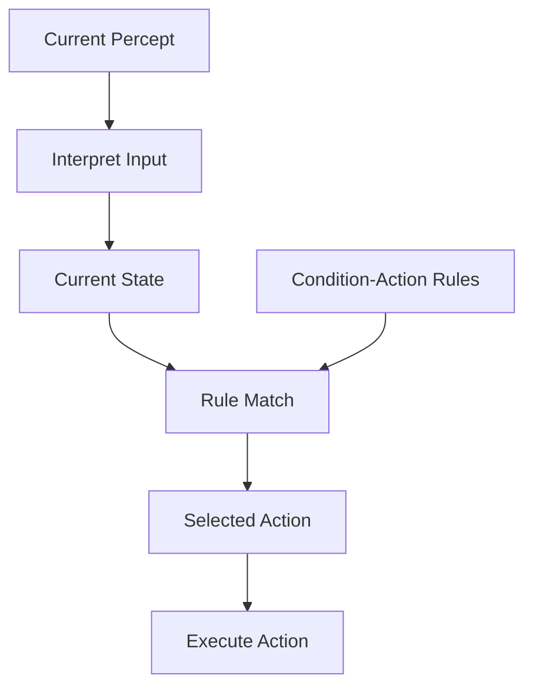
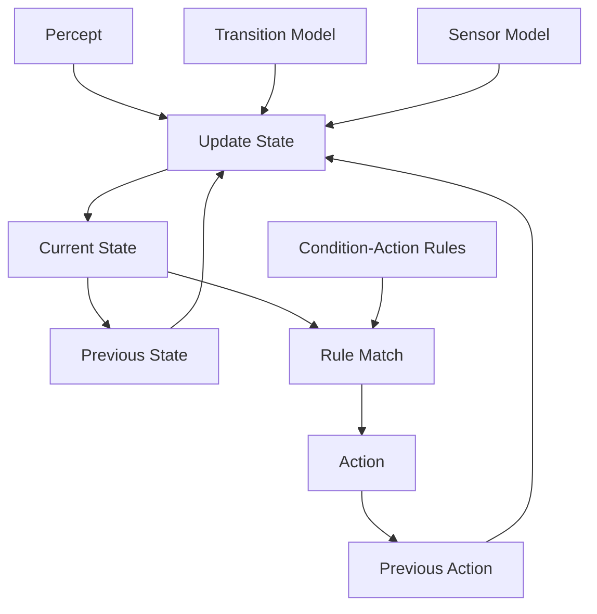
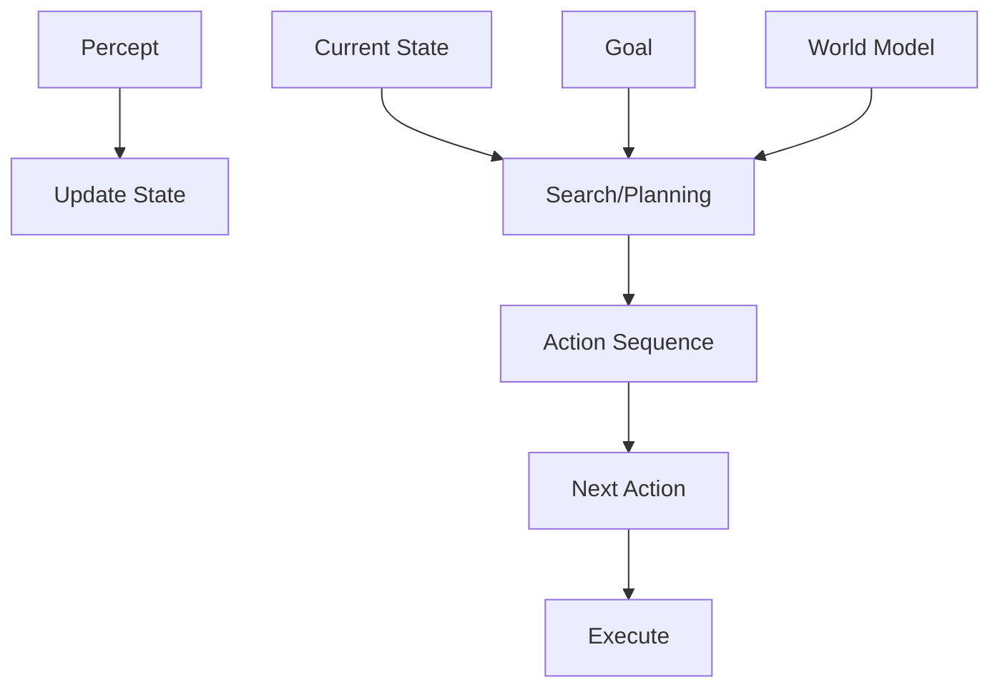
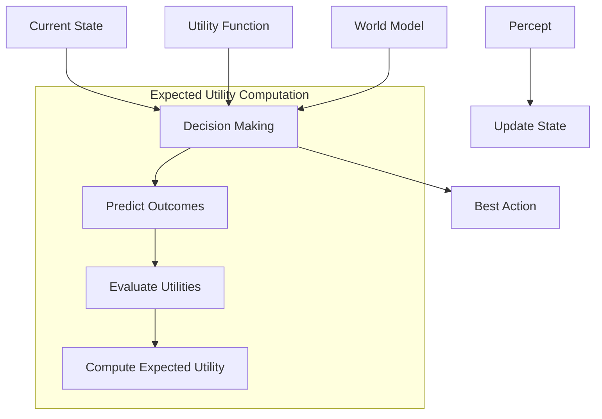
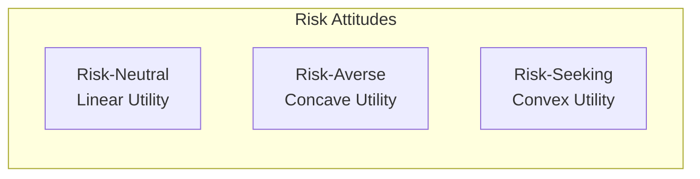
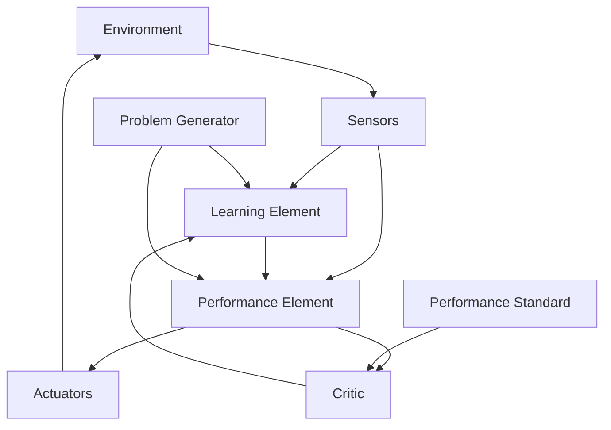
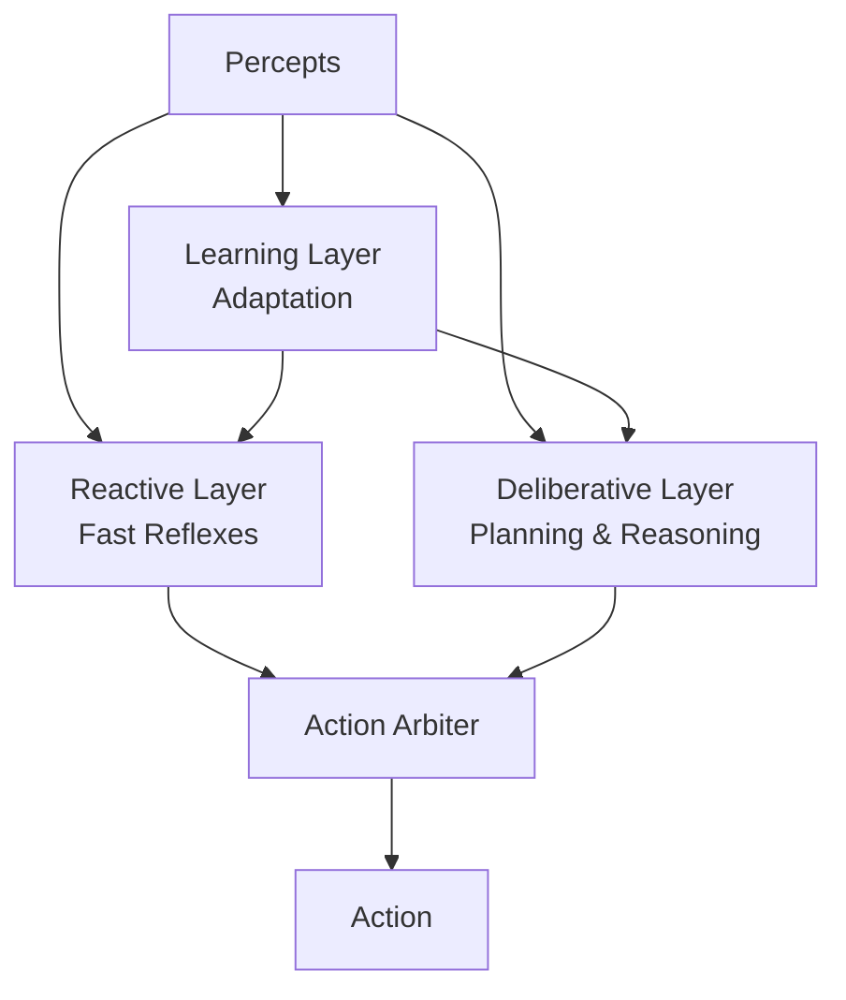

# Agent Architectures

## Introduction

An agent architecture is the computational machinery that implements the agent function—the mapping from percept sequences to actions. While the agent function is an abstract mathematical description of the agent's behavior, the architecture is the concrete realization: the data structures, algorithms, and control flow that enable the agent to perceive, reason, and act.

Different task environments demand different architectures. A simple reflex agent suffices for fully observable, deterministic, episodic environments, but a partially observable, stochastic, sequential environment requires sophisticated machinery for maintaining beliefs, planning ahead, and learning from experience. Understanding the spectrum of agent architectures—from simple to complex—provides a foundation for designing effective intelligent systems.

The progression from simple reflex agents through model-based, goal-based, and utility-based agents to learning agents represents increasing sophistication and capability. Each architecture builds on the previous, adding mechanisms to handle more challenging environments. Simple reflex agents react directly to percepts; model-based agents maintain internal state; goal-based agents plan to achieve objectives; utility-based agents optimize performance measures; learning agents adapt from experience.

This hierarchy isn't merely academic—it reflects practical engineering trade-offs. Simple architectures are fast, easy to implement, and work well when applicable. Complex architectures handle difficult environments but require more computation, memory, and design effort. Choosing the right architecture means understanding your environment's properties and selecting the simplest architecture that solves your problem.

The architecture also determines what the agent can learn and how. Some architectures have no learning capability; others learn incrementally or through batch processing. Some learn models of the environment; others learn policies directly. The architecture shapes the agent's capabilities, limitations, and potential for improvement.

## Simple Reflex Agents

Simple reflex agents represent the most basic agent architecture. They select actions based solely on the current percept, ignoring the percept history. The agent implements condition-action rules: "if this condition holds, then take this action."

### Architecture Components

The simple reflex agent has minimal components:

1. **Interpret-Input**: Converts raw percepts into an internal state description
2. **Rule-Match**: Matches current state against condition-action rules
3. **Action Selection**: Executes the action from the matching rule



### Pseudocode

```python
function SIMPLE-REFLEX-AGENT(percept) returns action
    persistent: rules  # A set of condition-action rules

    state ← INTERPRET-INPUT(percept)
    rule ← RULE-MATCH(state, rules)
    action ← rule.ACTION
    return action

function INTERPRET-INPUT(percept)
    # Extract relevant features from percept
    return state_description

function RULE-MATCH(state, rules)
    # Find first rule whose condition matches state
    for each rule in rules:
        if rule.CONDITION matches state:
            return rule
    return default_rule
```

### Example: Vacuum Cleaner Robot

A simple vacuum cleaner operating in a two-location environment:

**Percepts**: [location, status] where location ∈ {A, B} and status ∈ {Clean, Dirty}

**Actions**: {Suck, MoveRight, MoveLeft}

**Rules**:
```
IF location = A AND status = Dirty THEN Suck
IF location = B AND status = Dirty THEN Suck
IF location = A AND status = Clean THEN MoveRight
IF location = B AND status = Clean THEN MoveLeft
```

This simple rule set enables the vacuum to clean both locations by moving between them.

### Implementation Example

```python
class SimpleReflexVacuum:
    def __init__(self):
        self.rules = [
            (lambda state: state['location'] == 'A' and state['status'] == 'Dirty', 'Suck'),
            (lambda state: state['location'] == 'B' and state['status'] == 'Dirty', 'Suck'),
            (lambda state: state['location'] == 'A' and state['status'] == 'Clean', 'MoveRight'),
            (lambda state: state['location'] == 'B' and state['status'] == 'Clean', 'MoveLeft'),
        ]

    def interpret_input(self, percept):
        return {'location': percept[0], 'status': percept[1]}

    def rule_match(self, state):
        for condition, action in self.rules:
            if condition(state):
                return action
        return 'NoOp'

    def agent(self, percept):
        state = self.interpret_input(percept)
        action = self.rule_match(state)
        return action

# Usage
vacuum = SimpleReflexVacuum()
action = vacuum.agent(['A', 'Dirty'])  # Returns 'Suck'
action = vacuum.agent(['A', 'Clean'])  # Returns 'MoveRight'
```

### Advantages

1. **Simplicity**: Easy to implement and understand
2. **Speed**: Minimal computation—just pattern matching
3. **Memory Efficiency**: No need to store percept history
4. **Predictability**: Behavior is deterministic and verifiable

### Limitations

1. **Requires Full Observability**: Must perceive everything needed for decisions
2. **No Memory**: Can't remember past percepts or actions
3. **Infinite Loops**: Without randomization, can get stuck repeating actions
4. **No Adaptation**: Can't learn or improve from experience
5. **Limited to Episodic Environments**: Struggles with sequential decision-making

### When to Use

Simple reflex agents work well when:
- Environment is fully observable
- Decisions depend only on current percept
- Environment is episodic (no long-term consequences)
- Simple reactive behavior suffices

**Real-world examples**: Thermostats, simple robots in controlled environments, basic control systems

## Model-Based Reflex Agents

Model-based reflex agents overcome the full observability limitation by maintaining internal state. They track aspects of the environment that aren't currently observable, using a model of how the world works.

### Architecture Components

Model-based agents add two crucial components:

1. **Internal State**: Representation of unobserved aspects of the environment
2. **Transition Model**: Knowledge of how the world evolves independently and how actions affect it
3. **Sensor Model**: Knowledge of how world states are reflected in percepts



### Pseudocode

```python
function MODEL-BASED-REFLEX-AGENT(percept) returns action
    persistent: state       # Current world state estimate
                model       # Transition and sensor models
                rules       # Condition-action rules
                action      # Most recent action

    state ← UPDATE-STATE(state, action, percept, model)
    rule ← RULE-MATCH(state, rules)
    action ← rule.ACTION
    return action

function UPDATE-STATE(state, action, percept, model)
    # Predict next state based on action and transition model
    predicted_state ← PREDICT(state, action, model.transition)

    # Update based on percept and sensor model
    new_state ← INCORPORATE-PERCEPT(predicted_state, percept, model.sensor)

    return new_state
```

### State Representation

The internal state can represent:
- **Location**: "I am in room A"
- **Object States**: "Location B is clean"
- **World Properties**: "The door is locked"
- **Unobserved Information**: "Based on my last percept, there's likely an obstacle ahead"

### Example: Vacuum with Memory

Enhanced vacuum that remembers which locations it has cleaned:

```python
class ModelBasedVacuum:
    def __init__(self):
        self.state = {
            'current_location': None,
            'location_A_status': 'Unknown',
            'location_B_status': 'Unknown'
        }
        self.last_action = None

    def update_state(self, percept):
        location, status = percept

        # Update current location based on last action
        if self.last_action == 'MoveRight':
            self.state['current_location'] = 'B'
        elif self.last_action == 'MoveLeft':
            self.state['current_location'] = 'A'
        else:
            self.state['current_location'] = location

        # Update location status based on percept
        if self.state['current_location'] == 'A':
            self.state['location_A_status'] = status
            if self.last_action == 'Suck':
                self.state['location_A_status'] = 'Clean'
        elif self.state['current_location'] == 'B':
            self.state['location_B_status'] = status
            if self.last_action == 'Suck':
                self.state['location_B_status'] = 'Clean'

    def agent(self, percept):
        self.update_state(percept)

        # Decide action based on complete state
        location = self.state['current_location']
        status = self.state[f'location_{location}_status']

        if status == 'Dirty':
            action = 'Suck'
        elif location == 'A' and self.state['location_B_status'] != 'Clean':
            action = 'MoveRight'
        elif location == 'B' and self.state['location_A_status'] != 'Clean':
            action = 'MoveLeft'
        elif location == 'A':
            action = 'MoveRight'
        else:
            action = 'MoveLeft'

        self.last_action = action
        return action
```

### Transition Models

The transition model specifies how the world changes:

**Effect of Actions**:
$$P(s_{t+1} | s_t, a_t)$$

For deterministic environments:
- Action "MoveRight" in location A → location B
- Action "Suck" in dirty location → clean location

For stochastic environments:
- Action "MoveRight" → 90% move right, 5% stay, 5% move left

**Autonomous Changes**: The world may change independently of the agent's actions.

### Sensor Models

The sensor model relates world states to percepts:

$$P(e_t | s_t)$$

For perfect sensors: percept directly reveals state
For noisy sensors: percept provides uncertain information about state

### Advantages Over Simple Reflex

1. **Handles Partial Observability**: Maintains belief about unobserved aspects
2. **Memory**: Remembers past percepts and actions
3. **Better Decision Making**: Uses complete state estimate, not just current percept
4. **Robustness**: Can handle sensor noise and uncertainty

### Limitations

1. **Still Reactive**: Uses condition-action rules, doesn't plan ahead
2. **Model Accuracy**: Requires accurate world model
3. **Computational Cost**: State maintenance and update can be expensive
4. **No Goal Reasoning**: Doesn't explicitly consider objectives

### When to Use

Model-based reflex agents excel when:
- Environment is partially observable
- Agent needs to track hidden state
- Reactive behavior is sufficient (no need for planning)
- Accurate models of dynamics are available

**Real-world examples**: Robot navigation with limited sensors, tracking systems, partially observable control problems

## Goal-Based Agents

Goal-based agents explicitly represent goals—descriptions of desirable states—and use search or planning to find action sequences that achieve those goals. Rather than using condition-action rules, they reason about the future consequences of actions.

### Architecture Components

Goal-based agents add goal representation and planning:

1. **Goal Representation**: Explicit description of desired states
2. **Search/Planning Module**: Finds action sequences achieving goals
3. **World Model**: More detailed transition model for prediction



### Pseudocode

```python
function GOAL-BASED-AGENT(percept) returns action
    persistent: state       # Current world state
                model       # World transition model
                goal        # Goal description
                plan        # Sequence of actions

    state ← UPDATE-STATE(state, percept)

    if goal is not achieved in state:
        plan ← SEARCH(state, goal, model)

    if plan is empty:
        return NoOp

    action ← FIRST(plan)
    plan ← REST(plan)
    return action

function SEARCH(initial_state, goal, model):
    # Use search algorithm (BFS, A*, etc.) to find plan
    # Returns sequence of actions from initial_state to goal
```

### Goal Representation

Goals can be represented as:

**State-Based**: "Be in location B" → $s.location = B$

**Predicate-Based**: "All locations clean" → $\forall l \in Locations: Clean(l)$

**Set-Based**: Any state in goal set $G \subseteq S$

### Planning Process

Given:
- Initial state $s_0$
- Goal test $Goal(s)$ that returns true for goal states
- Transition model $T(s, a) = s'$
- Action set $A$

Find: Sequence of actions $[a_1, a_2, ..., a_n]$ such that:
$$Goal(T(...T(T(s_0, a_1), a_2)..., a_n)) = true$$

### Example: Navigation Robot

```python
class GoalBasedRobot:
    def __init__(self, world_map):
        self.state = {'location': (0, 0)}
        self.world_map = world_map
        self.goal = None
        self.plan = []

    def set_goal(self, goal_location):
        self.goal = goal_location
        self.plan = self.search(self.state['location'], self.goal)

    def search(self, start, goal):
        # Simple BFS search
        from collections import deque

        queue = deque([(start, [])])
        visited = {start}

        while queue:
            location, path = queue.popleft()

            if location == goal:
                return path

            for action, next_loc in self.get_successors(location):
                if next_loc not in visited:
                    visited.add(next_loc)
                    queue.append((next_loc, path + [action]))

        return []  # No path found

    def get_successors(self, location):
        # Returns (action, next_location) pairs
        x, y = location
        successors = []

        moves = {
            'North': (x, y+1),
            'South': (x, y-1),
            'East': (x+1, y),
            'West': (x-1, y)
        }

        for action, next_loc in moves.items():
            if self.is_valid(next_loc):
                successors.append((action, next_loc))

        return successors

    def is_valid(self, location):
        x, y = location
        return (0 <= x < self.world_map.width and
                0 <= y < self.world_map.height and
                not self.world_map.is_obstacle(x, y))

    def agent(self, percept):
        # Update state based on percept
        self.state['location'] = percept['location']

        # Check if goal achieved
        if self.state['location'] == self.goal:
            return 'NoOp'

        # If no plan or plan failed, replan
        if not self.plan:
            self.plan = self.search(self.state['location'], self.goal)

        if not self.plan:
            return 'NoOp'  # No path to goal

        # Execute next action in plan
        action = self.plan.pop(0)
        return action
```

### Search Algorithms

Goal-based agents use search algorithms:

**Uninformed Search**:
- Breadth-First Search (BFS): Optimal for unit costs
- Depth-First Search (DFS): Memory efficient
- Uniform-Cost Search (UCS): Optimal for varying costs

**Informed Search**:
- A* Search: Uses heuristics for efficiency
- Greedy Best-First: Fast but not optimal

The choice depends on environment properties and computational resources.

### Advantages

1. **Flexibility**: Change goal without reprogramming behavior
2. **Handles Novel Situations**: Can plan for unforeseen scenarios
3. **Reasoning About Future**: Considers long-term consequences
4. **Achieves Complex Objectives**: Can accomplish multi-step goals

### Limitations

1. **Computational Cost**: Planning can be expensive
2. **Requires Accurate Model**: Planning depends on model accuracy
3. **No Optimization**: Achieves goals but may not optimize performance
4. **Replanning Overhead**: Must replan when environment changes

### When to Use

Goal-based agents are appropriate when:
- Goals change dynamically
- Agent must accomplish complex objectives
- Environment is predictable enough for planning
- Flexibility is more important than speed

**Real-world examples**: GPS navigation, robot task planning, logistics planning, game AI

## Utility-Based Agents

Utility-based agents extend goal-based agents by introducing a utility function—a mapping from states to real numbers indicating desirability. Rather than binary goal achievement, utility captures degrees of happiness, enabling trade-offs and optimization.

### Architecture Components



### Pseudocode

```python
function UTILITY-BASED-AGENT(percept) returns action
    persistent: state           # Current world state
                model           # World transition model
                utility_fn      # Utility function U(s)

    state ← UPDATE-STATE(state, percept)

    actions ← GENERATE-ACTIONS(state)
    best_action ← argmax_{a ∈ actions} EXPECTED-UTILITY(a, state, model, utility_fn)

    return best_action

function EXPECTED-UTILITY(action, state, model, utility_fn):
    expected_utility ← 0

    for each possible_outcome in PREDICT-OUTCOMES(state, action, model):
        probability ← possible_outcome.probability
        resulting_state ← possible_outcome.state
        utility ← utility_fn(resulting_state)
        expected_utility += probability × utility

    return expected_utility
```

### Utility Functions

A utility function $U: S \to \mathbb{R}$ maps states to real numbers.

**Properties**:
- Higher utility = more desirable state
- Captures preferences over outcomes
- Allows comparison of alternatives
- Enables rational decision-making under uncertainty

### Expected Utility

In stochastic environments, actions have uncertain outcomes. The agent chooses actions maximizing expected utility:

$$EU(a|s) = \sum_{s'} P(s'|s,a) \cdot U(s')$$

where:
- $EU(a|s)$ = expected utility of action $a$ in state $s$
- $P(s'|s,a)$ = probability of reaching state $s'$ from $s$ via $a$
- $U(s')$ = utility of state $s'$

### Example: Autonomous Taxi

```python
class UtilityBasedTaxi:
    def __init__(self):
        self.state = {
            'location': (0, 0),
            'fuel': 100,
            'passenger': None,
            'time': 0
        }

    def utility(self, state):
        """Utility function combining multiple factors"""
        utility_value = 0

        # Revenue from delivered passengers
        if state.get('passenger_delivered'):
            utility_value += 100

        # Cost of time
        utility_value -= state['time'] * 0.5

        # Cost of fuel
        utility_value -= (100 - state['fuel']) * 0.3

        # Penalty for running out of fuel
        if state['fuel'] <= 0:
            utility_value -= 1000

        # Bonus for having passenger
        if state['passenger']:
            utility_value += 20

        return utility_value

    def expected_utility(self, action):
        """Compute expected utility of action"""
        outcomes = self.predict_outcomes(self.state, action)

        expected_util = 0
        for outcome in outcomes:
            probability = outcome['probability']
            resulting_state = outcome['state']
            utility_val = self.utility(resulting_state)
            expected_util += probability * utility_val

        return expected_util

    def predict_outcomes(self, state, action):
        """Predict possible outcomes with probabilities"""
        # Simplified outcome prediction
        outcomes = []

        if action == 'drive_to_passenger':
            # 90% success, 10% traffic delay
            success_state = state.copy()
            success_state['location'] = self.passenger_location
            success_state['fuel'] -= 10
            success_state['time'] += 5
            outcomes.append({'probability': 0.9, 'state': success_state})

            delay_state = state.copy()
            delay_state['location'] = self.passenger_location
            delay_state['fuel'] -= 15
            delay_state['time'] += 15
            outcomes.append({'probability': 0.1, 'state': delay_state})

        # Similar for other actions...

        return outcomes

    def agent(self, percept):
        self.state.update(percept)

        possible_actions = self.get_actions()

        # Choose action maximizing expected utility
        best_action = max(possible_actions,
                         key=lambda a: self.expected_utility(a))

        return best_action
```

### Multi-Objective Optimization

Utility functions can combine multiple objectives:

$$U(s) = w_1 f_1(s) + w_2 f_2(s) + ... + w_n f_n(s)$$

where:
- $f_i(s)$ are individual objective functions
- $w_i$ are weights reflecting relative importance

**Example**: Autonomous vehicle utility
$$U(s) = w_{safety} \cdot Safety(s) + w_{speed} \cdot Speed(s) + w_{comfort} \cdot Comfort(s) + w_{fuel} \cdot FuelEfficiency(s)$$

### Risk Attitudes

The shape of the utility function encodes risk attitudes:

**Risk-Neutral**: $U$ is linear in rewards → cares only about expected value

**Risk-Averse**: $U$ is concave → prefers certainty over uncertainty
$$U(E[R]) > E[U(R)]$$

**Risk-Seeking**: $U$ is convex → prefers uncertainty for potential high rewards
$$U(E[R]) < E[U(R)]$$



### Advantages

1. **Handles Trade-offs**: Balances conflicting objectives
2. **Principled Decision-Making**: Mathematical foundation (decision theory)
3. **Uncertainty Handling**: Natural treatment via expected utility
4. **Preference Representation**: Captures complex preferences

### Limitations

1. **Utility Specification**: Defining utility function is difficult
2. **Computational Cost**: Expected utility calculation can be expensive
3. **Model Accuracy**: Requires accurate probability models
4. **Preference Elicitation**: Getting true utilities from users is hard

### When to Use

Utility-based agents are ideal when:
- Multiple conflicting objectives exist
- Decisions involve significant uncertainty
- Optimization is important
- Can specify or learn utility function

**Real-world examples**: Automated trading, resource allocation, medical decision support, autonomous vehicles

## Learning Agents

Learning agents improve performance over time through experience. They can start with little knowledge and adapt to initially unknown or changing environments. A learning agent can use any of the previous architectures (reflex, model-based, goal-based, utility-based) as its performance element, but adds learning capabilities.

### Architecture Components



**Performance Element**: Selects actions (can be any previous agent type)

**Learning Element**: Makes improvements based on feedback, modifies performance element

**Critic**: Provides feedback on performance, evaluates how well agent is doing

**Problem Generator**: Suggests exploratory actions to learn new things

### Pseudocode

```python
function LEARNING-AGENT(percept) returns action
    persistent: performance_element     # Current agent (reflex, goal-based, etc.)
                learning_element        # Learning mechanism
                critic                  # Performance evaluator
                problem_generator      # Exploration suggester

    # Get action from performance element
    action ← performance_element.SELECT-ACTION(percept)

    # Evaluate performance
    feedback ← critic.EVALUATE(percept, action)

    # Learn from feedback
    learning_element.LEARN(feedback)

    # Occasionally explore
    if problem_generator.SHOULD-EXPLORE():
        action ← problem_generator.SUGGEST-ACTION()

    return action
```

### Learning Element

The learning element modifies the performance element to improve future performance. Different learning approaches:

**Supervised Learning**: Learn from labeled examples
- Input: (percept, correct_action) pairs
- Output: Improved action selection

**Reinforcement Learning**: Learn from rewards
- Input: (state, action, reward, next_state) tuples
- Output: Policy that maximizes cumulative reward

**Unsupervised Learning**: Learn patterns in data
- Input: Percepts
- Output: Useful representations or clusters

### Example: Q-Learning Agent

```python
import numpy as np
from collections import defaultdict

class QLearningAgent:
    def __init__(self, actions, alpha=0.1, gamma=0.9, epsilon=0.1):
        self.actions = actions
        self.alpha = alpha      # Learning rate
        self.gamma = gamma      # Discount factor
        self.epsilon = epsilon  # Exploration rate
        self.q_table = defaultdict(lambda: defaultdict(float))

    def get_q_value(self, state, action):
        return self.q_table[state][action]

    def get_best_action(self, state):
        """Select action with highest Q-value"""
        if state not in self.q_table:
            return np.random.choice(self.actions)

        q_values = {a: self.get_q_value(state, a) for a in self.actions}
        max_q = max(q_values.values())
        best_actions = [a for a, q in q_values.items() if q == max_q]
        return np.random.choice(best_actions)

    def select_action(self, state):
        """ε-greedy action selection (exploration vs exploitation)"""
        if np.random.random() < self.epsilon:
            # Explore: random action
            return np.random.choice(self.actions)
        else:
            # Exploit: best known action
            return self.get_best_action(state)

    def learn(self, state, action, reward, next_state):
        """Q-learning update"""
        # Current Q-value
        old_q = self.get_q_value(state, action)

        # Best next Q-value
        next_q = max([self.get_q_value(next_state, a) for a in self.actions])

        # Q-learning update rule
        new_q = old_q + self.alpha * (reward + self.gamma * next_q - old_q)

        self.q_table[state][action] = new_q

    def agent(self, percept, reward=0):
        """Full agent function"""
        state = self.interpret_percept(percept)

        # Learn from previous experience
        if hasattr(self, 'last_state'):
            self.learn(self.last_state, self.last_action, reward, state)

        # Select next action
        action = self.select_action(state)

        # Remember for next learning update
        self.last_state = state
        self.last_action = action

        return action

    def interpret_percept(self, percept):
        # Convert percept to state representation
        return tuple(percept) if isinstance(percept, list) else percept
```

### The Q-Learning Algorithm

Q-learning learns an action-value function $Q(s, a)$ representing the expected cumulative reward of taking action $a$ in state $s$:

$$Q(s, a) \leftarrow Q(s, a) + \alpha [r + \gamma \max_{a'} Q(s', a') - Q(s, a)]$$

where:
- $\alpha$ = learning rate (how much to update)
- $r$ = immediate reward
- $\gamma$ = discount factor (importance of future rewards)
- $s'$ = next state
- $\max_{a'} Q(s', a')$ = value of best action in next state

### Exploration vs. Exploitation

A key challenge in learning is balancing:

**Exploitation**: Use current knowledge to get rewards

**Exploration**: Try new things to gain knowledge

Strategies:

**ε-greedy**: With probability $\epsilon$, take random action; otherwise take best known action

**Softmax**: Choose actions probabilistically based on Q-values:
$$P(a|s) = \frac{e^{Q(s,a)/\tau}}{\sum_{a'} e^{Q(s,a')/\tau}}$$

**Upper Confidence Bound**: Choose action balancing value and uncertainty

### Critic Design

The critic evaluates performance based on a performance standard:

**Direct Feedback**: External reward signal (wins/losses, user feedback)

**Inferred Feedback**: Critic infers quality from percepts (achieved goals, state utilities)

**Example Critic**:
```python
class Critic:
    def __init__(self, performance_standard):
        self.standard = performance_standard

    def evaluate(self, state, action, next_state):
        # Compare outcome to standard
        achieved = self.measure_performance(next_state)
        expected = self.standard(next_state)
        feedback = achieved - expected
        return feedback
```

### Problem Generator

Suggests exploratory actions to discover new strategies:

```python
class ProblemGenerator:
    def __init__(self, exploration_rate=0.1):
        self.exploration_rate = exploration_rate
        self.exploration_count = defaultdict(int)

    def should_explore(self):
        return random.random() < self.exploration_rate

    def suggest_action(self, state, possible_actions):
        # Suggest least-tried action in this state
        action_counts = {a: self.exploration_count[(state, a)]
                        for a in possible_actions}
        least_tried = min(action_counts, key=action_counts.get)
        return least_tried
```

### Advantages

1. **Adaptation**: Handles initially unknown environments
2. **Improvement**: Performance increases over time
3. **Flexibility**: Learns from experience rather than hand-coded rules
4. **Robustness**: Adapts to environmental changes

### Limitations

1. **Initial Performance**: May perform poorly before learning
2. **Learning Time**: Can require many experiences
3. **Exploration Risk**: Exploration can be dangerous in some domains
4. **Credit Assignment**: Difficulty attributing outcomes to actions

### When to Use

Learning agents excel when:
- Environment is initially unknown
- Environment changes over time
- Hand-coding behavior is difficult
- Agent has time to learn
- Exploration is safe enough

**Real-world examples**: Game playing AI, recommendation systems, adaptive control, robot learning

## Comparison and Trade-offs

Different architectures suit different environments and requirements:

| Architecture | Complexity | Memory | Planning | Learning | Best For |
|--------------|-----------|--------|----------|----------|----------|
| Simple Reflex | Low | Minimal | No | No | Fully observable, episodic |
| Model-Based | Medium | Moderate | No | No | Partially observable, requires state |
| Goal-Based | High | Moderate | Yes | No | Complex goals, sequential |
| Utility-Based | High | Moderate | Yes | No | Trade-offs, optimization |
| Learning | Varies | High | Varies | Yes | Unknown/changing environments |

### Computational Trade-offs

**Speed**: Simple reflex > Model-based > Goal-based ≈ Utility-based

**Memory**: Simple reflex < Model-based < Learning

**Optimality**: Utility-based (best) > Goal-based > Model-based > Simple reflex

### Choosing an Architecture

**Decision Factors**:

1. **Environment Properties**: Observable? Deterministic? Sequential?
2. **Performance Requirements**: Speed? Optimality? Adaptation?
3. **Available Knowledge**: Do you have rules? Models? Utility functions?
4. **Computational Resources**: CPU? Memory? Real-time constraints?

**Decision Tree**:
```
Is environment fully observable?
├─ No → Need Model-Based (at minimum)
└─ Yes → Is simple reactive behavior sufficient?
    ├─ Yes → Simple Reflex
    └─ No → Need planning?
        ├─ Yes → Multiple objectives?
        │   ├─ Yes → Utility-Based
        │   └─ No → Goal-Based
        └─ No → Model-Based

Can environment change or is it initially unknown?
└─ Yes → Add Learning to any architecture
```

## Hybrid Architectures

Real systems often combine multiple architectures in layers:

### Layered Architecture

**Reactive Layer**: Simple reflex responses for urgent situations
**Deliberative Layer**: Planning for complex objectives
**Learning Layer**: Adaptation and improvement



### Example: Robot Control

**Reactive**: Obstacle avoidance (immediate safety)
**Deliberative**: Path planning (goal achievement)
**Learning**: Improve navigation over time

The reactive layer can override deliberative layer for safety, while learning adjusts both layers.

## Conclusion

Agent architectures represent the computational machinery implementing intelligent behavior. The spectrum from simple reflex agents through model-based, goal-based, and utility-based agents to learning agents reflects increasing sophistication and capability, with corresponding increases in computational requirements and complexity.

Simple reflex agents react directly to percepts using condition-action rules—fast and simple but limited to fully observable, episodic environments. Model-based agents maintain internal state to handle partial observability. Goal-based agents plan action sequences to achieve objectives. Utility-based agents optimize performance measures, handling trade-offs and uncertainty. Learning agents adapt from experience, improving over time.

Choosing the right architecture requires understanding environment properties, performance requirements, available knowledge, and computational constraints. Often, hybrid architectures combining reactive, deliberative, and learning components provide the best solution, leveraging the strengths of multiple approaches.

The architecture determines not just how the agent selects actions but also what it can learn, how it handles uncertainty, and how it scales to complex environments. Understanding these architectures provides the foundation for designing effective intelligent systems and for studying the AI techniques that implement them: search, planning, learning, reasoning under uncertainty, and more.
