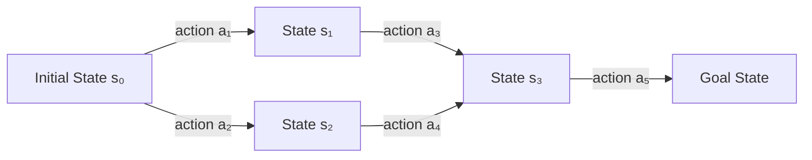
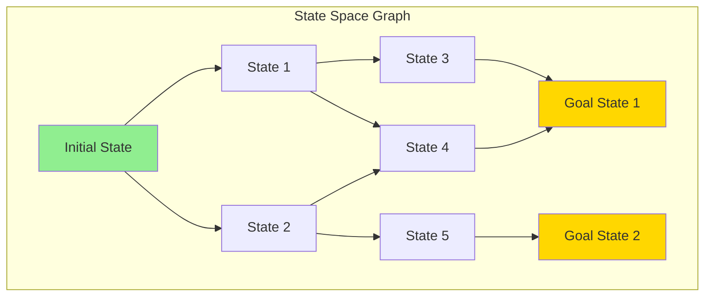

# Problem Solving as Search

## Introduction

Problem solving is central to artificial intelligence. Many AI tasks can be formulated as search problems: finding a path through a state space from an initial state to a goal state. This abstraction—viewing problem solving as search—provides a unified framework for tackling diverse challenges from puzzles to planning to game playing.

The power of the search formulation lies in its generality. Route planning, puzzle solving, theorem proving, robot navigation, and countless other problems share the same underlying structure: states, actions, transitions, and goals. Once we formulate a problem in these terms, we can apply general search algorithms to find solutions. The algorithm doesn't need to know whether it's solving a maze or planning a trip—it just explores the state space.

Understanding problem formulation—the process of mapping a real-world problem to a search problem—is crucial. A good formulation makes the problem tractable; a poor one might make it unsolvable in practice. We must choose what to represent as states, how to model actions and transitions, what constitutes a goal, and how to measure solution quality. These choices determine which search algorithms will work and how efficiently they'll find solutions.

This exploration examines the components of search problems, the relationship between problem formulation and solution methods, and the criteria for evaluating solutions. We'll see how abstract problem formulation enables powerful general-purpose search algorithms, and how the structure of the state space affects problem difficulty and solution techniques.

## Components of a Search Problem

A search problem consists of several key components that completely specify the problem:

### State Space

The **state space** is the set of all possible states the problem can be in. A state contains all the information necessary to describe the situation at a particular point.

**Formal Definition**:
$$S = \{s_1, s_2, ..., s_n\}$$

The state space can be:
- **Finite**: A fixed number of states (e.g., tic-tac-toe has at most $3^9 = 19,683$ states)
- **Infinite**: Infinitely many states (e.g., continuous robot positions)

**State Representation**:

States must capture all relevant information while being as concise as possible. Redundant information increases memory and computation without benefit.

**Example: 8-Puzzle**

The 8-puzzle has 8 numbered tiles and one empty space in a 3×3 grid. The goal is to reach a configuration from a scrambled start.

```
Start State:        Goal State:
┌───┬───┬───┐      ┌───┬───┬───┐
│ 7 │ 2 │ 4 │      │   │ 1 │ 2 │
├───┼───┼───┤      ├───┼───┼───┤
│ 5 │   │ 6 │      │ 3 │ 4 │ 5 │
├───┼───┼───┤      ├───┼───┼───┤
│ 8 │ 3 │ 1 │      │ 6 │ 7 │ 8 │
└───┴───┴───┘      └───┴───┴───┘
```

**State Representation**:
```python
state = [[7, 2, 4],
         [5, 0, 6],  # 0 represents empty space
         [8, 3, 1]]

# Or as a tuple for hashing:
state = (7, 2, 4, 5, 0, 6, 8, 3, 1)
```

The state space size for 8-puzzle is 9!/2 = 181,440 (not all permutations are reachable).

**Example: Route Planning**

**State**: Current city
```python
state = "Bucharest"
```

For more complex routing, state might include:
```python
state = {
    'location': (lat, lon),
    'fuel': 45.3,
    'time': '14:30'
}
```

### Initial State

The **initial state** $s_0 \in S$ is where the problem-solving process begins. This is the given starting configuration.

**Examples**:
- **8-puzzle**: The scrambled configuration
- **Route planning**: Your current location
- **Chess**: Standard starting position
- **Theorem proving**: Known axioms and premises

The initial state is part of the problem specification—what you're given.

### Actions and Transition Model

**Actions** define what the agent can do in each state. The set of actions available may depend on the current state.

**Action Function**:
$$ACTIONS(s) = \{a_1, a_2, ..., a_k\}$$

Returns the set of actions executable in state $s$.

**Transition Model** (or successor function):
$$RESULT(s, a) = s'$$

Describes the state $s'$ that results from executing action $a$ in state $s$.

**Together**, actions and transitions define the **state space graph**:
- Nodes = states
- Edges = actions
- Each edge $(s, s')$ exists if there's an action $a$ where $RESULT(s, a) = s'$



**Example: 8-Puzzle Actions**

```python
def actions(state):
    """Returns list of legal actions from state"""
    # Find position of empty tile (0)
    empty_pos = find_position(state, 0)
    row, col = empty_pos

    possible_actions = []

    # Can move tile from above down (move empty up)
    if row > 0:
        possible_actions.append('UP')

    # Can move tile from below up (move empty down)
    if row < 2:
        possible_actions.append('DOWN')

    # Can move tile from left (move empty left)
    if col > 0:
        possible_actions.append('LEFT')

    # Can move tile from right (move empty right)
    if col < 2:
        possible_actions.append('RIGHT')

    return possible_actions

def result(state, action):
    """Returns new state after applying action"""
    new_state = copy.deepcopy(state)
    empty_pos = find_position(state, 0)
    row, col = empty_pos

    # Determine new position of empty tile
    if action == 'UP':
        new_row, new_col = row - 1, col
    elif action == 'DOWN':
        new_row, new_col = row + 1, col
    elif action == 'LEFT':
        new_row, new_col = row, col - 1
    elif action == 'RIGHT':
        new_row, new_col = row, col + 1

    # Swap empty tile with adjacent tile
    new_state[row][col] = new_state[new_row][new_col]
    new_state[new_row][new_col] = 0

    return new_state
```

**Example: Route Planning Actions**

```python
def actions(state):
    """Returns cities reachable from current city"""
    city = state['current_city']
    return graph.get_neighbors(city)

def result(state, action):
    """Returns state after traveling to city (action)"""
    new_state = state.copy()
    new_state['current_city'] = action
    new_state['distance_traveled'] += graph.get_distance(state['current_city'], action)
    return new_state
```

### Goal Test

The **goal test** determines whether a state is a goal state.

**Function**:
$$GOAL(s) \to \{true, false\}$$

Returns true if $s$ is a goal state.

**Types of Goals**:

**1. Explicit State**: Goal is a specific state
```python
def goal_test(state):
    return state == goal_state
```

**2. Property-Based**: Goal is any state satisfying properties
```python
def goal_test(state):
    # Goal: all disks on rightmost peg (Tower of Hanoi)
    return all(disk in pegs[2] for disk in disks)
```

**3. Multiple Goals**: Any state in a goal set
```python
def goal_test(state):
    return state in goal_set
```

**4. Optimization**: Implicitly best state found
```python
# For optimization problems, goal test might be:
def goal_test(state, iterations):
    return iterations >= max_iterations
```

**Example: 8-Puzzle Goal Test**

```python
goal_state = (0, 1, 2, 3, 4, 5, 6, 7, 8)

def goal_test(state):
    return state == goal_state

# Or for any goal configuration:
def goal_test(state, goal):
    return state == goal
```

**Example: Route Planning Goal Test**

```python
def goal_test(state):
    return state['current_city'] == destination
```

### Path Cost

The **path cost** assigns a numeric cost to a path, typically the sum of step costs.

**Step Cost Function**:
$$c(s, a, s') = cost$$

Cost of executing action $a$ in state $s$ reaching state $s'$.

**Path Cost**:
$$cost(path) = \sum_{i=1}^{n} c(s_{i-1}, a_i, s_i)$$

For a path $[s_0, a_1, s_1, a_2, s_2, ..., a_n, s_n]$.

**Cost Functions**:

**Uniform Cost**: All actions cost the same (often 1)
$$c(s, a, s') = 1 \quad \forall s, a, s'$$

**Non-Uniform Cost**: Actions have different costs
$$c(s, a, s') = distance(s, s')$$

**Example: Route Planning Path Cost**

```python
def step_cost(state, action, next_state):
    """Cost of traveling from state to next_state"""
    city1 = state['current_city']
    city2 = next_state['current_city']
    return distances[city1][city2]

def path_cost(path):
    """Total cost of path"""
    total = 0
    for i in range(len(path) - 1):
        state = path[i]
        action = actions[i]
        next_state = path[i + 1]
        total += step_cost(state, action, next_state)
    return total
```

**Example: 8-Puzzle Path Cost**

Typically uniform cost (each move costs 1):
```python
def step_cost(state, action, next_state):
    return 1

# Path cost = number of moves
path_cost = len(actions)
```

### Solution

A **solution** is a sequence of actions that leads from the initial state to a goal state.

$$solution = [a_1, a_2, ..., a_n]$$

where:
$$s_0 \xrightarrow{a_1} s_1 \xrightarrow{a_2} s_2 \xrightarrow{...} s_n$$

and $GOAL(s_n) = true$.

An **optimal solution** has the lowest path cost among all solutions.

```mermaid
graph TB
    S0[Initial State] -->|a₁, cost=3| S1[State 1]
    S0 -->|a₂, cost=5| S2[State 2]
    S1 -->|a₃, cost=2| G[Goal State]
    S2 -->|a₄, cost=1| G

    S0 -.->|Solution 1: [a₁,a₃]<br/>cost = 5| G
    S0 -.->|Solution 2: [a₂,a₄]<br/>cost = 6| G

    style S0 fill:#90EE90
    style G fill:#FFD700
```

## Problem Formulation Process

Formulating a real-world problem as a search problem requires careful design decisions.

### Abstraction

**Abstraction** removes irrelevant details, simplifying the problem while preserving essential structure.

**Example: Route Planning**

**Real World**: Complex road network with traffic lights, road conditions, traffic patterns, weather, etc.

**Abstraction**: Graph where:
- Nodes = cities
- Edges = roads with distances
- State = current city
- Actions = travel to adjacent city

**What's abstracted away**:
- Road geometry (curves, hills)
- Traffic signals and patterns
- Weather conditions
- Intermediate points along roads

**Trade-off**: Simpler problem, faster solving, but less realistic solution.

### Granularity

**Granularity** determines the level of detail in states and actions.

**Coarse Granularity** (fewer, larger states):
- Simpler state space
- Faster search
- Less precise solutions

**Fine Granularity** (more, smaller states):
- Complex state space
- Slower search
- More precise solutions

**Example: Robot Navigation**

**Coarse**: States are rooms, actions are "move to adjacent room"

**Medium**: States are 1-meter grid cells, actions are "move to adjacent cell"

**Fine**: States are continuous (x, y) positions, actions are small movements

### State Representation Choice

What information to include in a state?

**Too Little**: State space doesn't capture necessary information
- Can't determine legal actions
- Can't recognize goal states
- Solutions may not be executable

**Too Much**: State space includes irrelevant information
- Unnecessarily large state space
- Slower search
- Wasted memory

**Example: Tower of Hanoi**

**Needed**: Position of each disk (which peg it's on)

**Not Needed**:
- Order disks were placed (irrelevant to current state)
- History of moves (only current configuration matters)
- Color of disks (if purely geometric problem)

**Good Representation**:
```python
state = {
    'peg1': [3, 2, 1],  # Disks on peg 1 (bottom to top)
    'peg2': [],
    'peg3': []
}
```

Or more concisely:
```python
# Each disk's location
state = (1, 1, 1)  # All three disks on peg 1
```

### Example: 8-Queens Problem

**Problem**: Place 8 queens on a chessboard such that no two queens attack each other.

**Formulation 1: Complete-State**

**States**: Any arrangement of 0-8 queens on board

**Initial State**: No queens

**Actions**: Add a queen to any empty square

**Goal**: 8 queens on board, none attacking

**State Space Size**: Extremely large! $\binom{64}{8} = 4,426,165,368$ possible placements

**Formulation 2: Incremental**

**States**: Arrangements with 0-8 queens, at most one per column

**Initial State**: No queens

**Actions**: Add queen to any square in leftmost empty column

**Goal**: 8 queens on board

**State Space Size**: Reduced! At most $8^8 = 16,777,216$ states, and much smaller in practice due to constraints

**Formulation 3: Complete-State Local Search**

**States**: Any arrangement of exactly 8 queens, one per column

**Initial State**: Random placement, one queen per column

**Actions**: Move a queen within its column

**Goal**: No queens attacking

**State Space Size**: $8^8$ states, but local search explores only small neighborhood

The formulation choice dramatically affects problem difficulty!

## The State Space Graph

The state space defines an implicit graph structure:



### Graph Properties

**Branching Factor** ($b$): Average number of successors per state

$$b = \frac{1}{|S|} \sum_{s \in S} |ACTIONS(s)|$$

Affects search complexity—higher branching means more alternatives to explore.

**Depth**: Length of shortest path from initial state to goal

Affects solution length and search time.

**Reachability**: Can every state be reached from the initial state?

If not, some states are unreachable and won't be explored.

### Tree vs. Graph Search

**Tree Search**: Treats state space as a tree (can revisit states)
- Simpler implementation
- Can get stuck in infinite loops
- May explore same state multiple times

**Graph Search**: Remembers visited states (no revisiting)
- More complex (requires memory for visited states)
- Avoids infinite loops
- More efficient (no repeated exploration)

```python
# Tree Search (simplified)
def tree_search(problem):
    frontier = [Node(problem.initial)]

    while frontier:
        node = frontier.pop(0)

        if problem.goal_test(node.state):
            return node.solution()

        frontier.extend(node.expand(problem))

    return None

# Graph Search (simplified)
def graph_search(problem):
    frontier = [Node(problem.initial)]
    explored = set()

    while frontier:
        node = frontier.pop(0)

        if problem.goal_test(node.state):
            return node.solution()

        explored.add(node.state)

        for child in node.expand(problem):
            if child.state not in explored and child not in frontier:
                frontier.append(child)

    return None
```

## Problem Types

Different problem types have different characteristics:

### Deterministic vs. Stochastic

**Deterministic**: $RESULT(s, a)$ returns a single state
- Each action has a predictable outcome
- Classical search problems

**Stochastic**: $RESULT(s, a)$ returns a probability distribution over states
$$P(s'|s,a)$$
- Actions have uncertain outcomes
- Requires expectimax or decision-theoretic planning

### Fully Observable vs. Partially Observable

**Fully Observable**: Agent perceives complete state
- Can use state-based search
- Examples: Puzzles, many games

**Partially Observable**: Agent has incomplete information
- Must reason about belief states (sets of possible states)
- Examples: Card games, robot localization

### Known vs. Unknown

**Known Environment**: Agent knows $ACTIONS(s)$ and $RESULT(s,a)$
- Can plan before acting
- Classical search

**Unknown Environment**: Agent doesn't know transition model
- Must explore and learn
- Online search, reinforcement learning

### Discrete vs. Continuous

**Discrete State Space**: Finite or countably infinite states
- Can enumerate states
- Classical search algorithms apply

**Continuous State Space**: Uncountably infinite states
- Must discretize or use continuous methods
- Optimization-based approaches

## Measuring Problem Difficulty

Several factors determine problem difficulty:

### State Space Size

Larger state spaces are generally harder:
- More states to explore
- More memory required
- Longer search times

$$|S| = \text{number of reachable states}$$

**Examples**:
- Tic-Tac-Toe: ~5,000 states
- 8-Puzzle: ~180,000 states
- Chess: ~$10^{40}$ states
- Go: ~$10^{170}$ states

### Branching Factor

Higher branching factor means more alternatives at each step:

**Impact on Search Complexity**:

For depth $d$ and branching factor $b$:
- **Nodes at depth d**: $b^d$
- **Total nodes to depth d**: $1 + b + b^2 + ... + b^d = O(b^d)$

**Examples**:
- Sliding Puzzle: $b \approx 2-4$
- Chess: $b \approx 35$
- Go: $b \approx 250$

### Solution Depth

How many steps to reach a goal:

**Shallow Solutions** (small $d$): Easier to find

**Deep Solutions** (large $d$): Exponentially more nodes to explore

**Search Complexity**: $O(b^d)$ for depth $d$

### Path Cost Distribution

**All Paths Equal Cost**: Simpler—first solution found is optimal

**Varying Path Costs**: Must search more carefully to ensure optimality

## Solution Quality

What makes a solution good?

### Optimality

A solution is **optimal** if no other solution has lower path cost.

$$\text{optimal} \iff \forall \text{ solutions } s: cost(solution) \leq cost(s)$$

**When Optimality Matters**:
- Cost is critical (e.g., fuel, time, money)
- Safety depends on shortest path
- Multiple solutions exist with different costs

**When Satisficing Suffices**:
- Any solution is good enough
- Optimal solution is too expensive to find
- Near-optimal solutions are acceptable

### Completeness

An algorithm is **complete** if it finds a solution whenever one exists.

**Importance**: Guarantees solution if problem is solvable

**Incompleteness Issues**:
- Algorithm might get stuck in infinite loops
- Might explore infinite branches without finding solution
- Might give up prematurely

### Computational Efficiency

**Time Complexity**: How many nodes expanded?

**Space Complexity**: How much memory required?

Both typically exponential in problem size, but vary by algorithm.

### Solution Robustness

**Robustness**: Does solution work despite uncertainties?

In stochastic or partially observable environments, solutions should handle:
- Action failures
- Incomplete information
- Environmental changes

## Example: Formulating Real-World Problems

### Route Planning (Romania)

**Problem**: Travel from Arad to Bucharest in Romania.

**States**: Cities in Romania

**Initial State**: Arad

**Actions**: Drive to connected city

**Transition Model**: $RESULT(In(city_1), Go(city_2)) = In(city_2)$

**Goal Test**: $state = Bucharest$

**Path Cost**: Sum of road distances

```python
class RoutePlanning:
    def __init__(self):
        self.initial_state = 'Arad'
        self.goal_state = 'Bucharest'

        # Road network (simplified)
        self.roads = {
            'Arad': [('Zerind', 75), ('Sibiu', 140), ('Timisoara', 118)],
            'Zerind': [('Arad', 75), ('Oradea', 71)],
            'Sibiu': [('Arad', 140), ('Oradea', 151), ('Fagaras', 99), ('Rimnicu', 80)],
            'Fagaras': [('Sibiu', 99), ('Bucharest', 211)],
            'Bucharest': [('Fagaras', 211), ('Pitesti', 101), ('Giurgiu', 90)],
            # ... more cities
        }

    def actions(self, state):
        return [city for city, distance in self.roads.get(state, [])]

    def result(self, state, action):
        return action  # Action is the destination city

    def goal_test(self, state):
        return state == self.goal_state

    def step_cost(self, state, action):
        for city, distance in self.roads[state]:
            if city == action:
                return distance
        return float('inf')
```

### Missionaries and Cannibals

**Problem**: Three missionaries and three cannibals must cross a river using a boat that holds at most two people. Cannibals must never outnumber missionaries on either bank.

**States**: (M_left, C_left, boat_position)
- M_left: missionaries on left bank (0-3)
- C_left: cannibals on left bank (0-3)
- boat_position: 'left' or 'right'

**Initial State**: (3, 3, 'left')

**Goal State**: (0, 0, 'right')

**Actions**: Move 1-2 people in boat

**Transition Model**: Update counts based on move

**Constraints**:
- Cannibals ≤ missionaries on each bank (or missionaries = 0)
- Boat capacity ≤ 2

```python
def is_valid(state):
    m_left, c_left, boat = state
    m_right = 3 - m_left
    c_right = 3 - c_left

    # Check constraints
    if m_left < 0 or c_left < 0 or m_right < 0 or c_right < 0:
        return False

    # Cannibals can't outnumber missionaries (unless no missionaries)
    if m_left > 0 and c_left > m_left:
        return False
    if m_right > 0 and c_right > m_right:
        return False

    return True

def actions(state):
    m_left, c_left, boat = state
    possible_actions = []

    # Possible boat loads: (missionaries, cannibals)
    boat_loads = [(1, 0), (2, 0), (0, 1), (0, 2), (1, 1)]

    for dm, dc in boat_loads:
        if boat == 'left':
            # Moving from left to right
            new_state = (m_left - dm, c_left - dc, 'right')
        else:
            # Moving from right to left
            new_state = (m_left + dm, c_left + dc, 'left')

        if is_valid(new_state):
            possible_actions.append((dm, dc))

    return possible_actions
```

## Conclusion

Problem solving as search provides a powerful general framework for AI. By formulating problems in terms of states, actions, transitions, goals, and costs, we can apply general search algorithms to find solutions. The formulation process—choosing state representations, defining actions, and specifying goals—is crucial and requires careful abstraction and design.

Key components of search problems include:
- **State space**: All possible configurations
- **Initial state**: Starting point
- **Actions and transitions**: What can be done and with what effect
- **Goal test**: Recognizing solutions
- **Path cost**: Measuring solution quality

The formulation dramatically affects problem difficulty. Good abstractions simplify the problem while preserving essential structure. Appropriate granularity balances precision and tractability. Careful state representation includes necessary information without bloat.

Understanding search problems provides the foundation for studying search algorithms—systematic methods for exploring state spaces to find solutions. Different algorithms suit different problem types and have different guarantees regarding completeness, optimality, and efficiency. The interplay between problem formulation and algorithm selection determines whether AI systems can solve problems effectively.
