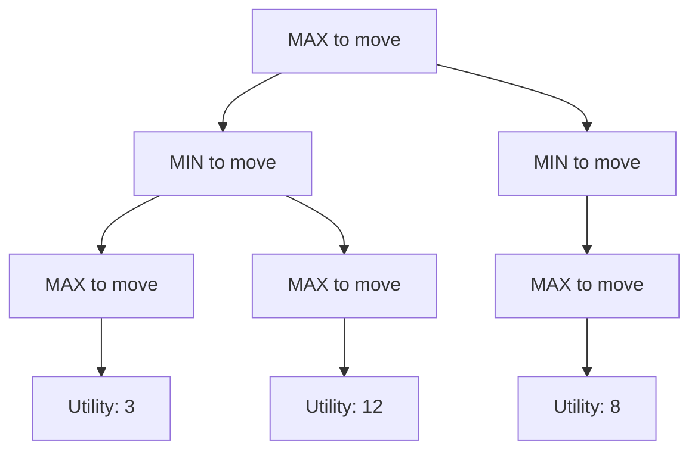

# Game Theory Introduction

## Introduction

Adversarial search handles environments with competing agents—games where one agent's gain is another's loss. Unlike single-agent search, we must model opponent behavior and find strategies that perform well against rational opponents.

## Two-Player Games

**Components**:
- Initial state $s_0$
- Players: MAX and MIN (alternating turns)
- Actions: $ACTIONS(s)$ returns legal moves
- Transition: $RESULT(s, a)$ returns new state
- Terminal test: $TERMINAL(s)$ checks if game over
- Utility: $UTILITY(s, p)$ gives payoff for player $p$

**Example: Tic-Tac-Toe**:
```python
class TicTacToe:
    def __init__(self):
        self.board = [' '] * 9  # 3x3 board
        self.player = 'X'
    
    def actions(self):
        return [i for i, cell in enumerate(self.board) if cell == ' ']
    
    def result(self, action):
        new_board = self.board.copy()
        new_board[action] = self.player
        return new_board
    
    def terminal(self):
        # Check rows, columns, diagonals
        lines = [
            [0,1,2], [3,4,5], [6,7,8],  # rows
            [0,3,6], [1,4,7], [2,5,8],  # cols
            [0,4,8], [2,4,6]  # diagonals
        ]
        for line in lines:
            if self.board[line[0]] == self.board[line[1]] == self.board[line[2]] != ' ':
                return True
        return ' ' not in self.board  # Draw
    
    def utility(self):
        # Returns 1 if X wins, -1 if O wins, 0 if draw
        # ... implementation
```

## Zero-Sum Games

**Definition**: $UTILITY(s, MAX) = -UTILITY(s, MIN)$

One player's gain equals the other's loss.

**Examples**: Chess, checkers, Go, poker (heads-up)

**Non-zero-sum**: Both players can benefit or both lose (e.g., prisoner's dilemma)

## Game Trees

**Structure**:
- **Nodes**: Game states
- **Edges**: Actions/moves
- **Levels**: Alternate between MAX and MIN



**Ply**: One move by one player (half-move in chess terminology)

**Search depth $d$**: Number of plies searched ahead

## Perfect vs Imperfect Information

**Perfect Information**: All players see complete state
- Chess, Go, tic-tac-toe
- Can use minimax

**Imperfect Information**: Some information hidden
- Poker (hidden cards)
- Bridge, Scrabble
- Requires belief states, expectiminimax

## Deterministic vs Stochastic

**Deterministic**: No chance elements
- Chess, Go, checkers
- Pure skill

**Stochastic**: Dice, card draws, etc.
- Backgammon, Monopoly
- Requires expectiminimax

## Nash Equilibrium

**Definition**: Strategy profile where no player can improve by unilaterally changing strategy.

For two-player zero-sum games with optimal play:
- Both players follow minimax strategy
- Forms Nash equilibrium
- Value of game is well-defined

## Conclusion

Adversarial search extends single-agent search to competitive environments. Key differences: must model opponent behavior, strategies rather than just actions, utility functions rather than just goals. Game trees represent possible play sequences, enabling algorithms like minimax to find optimal strategies.
