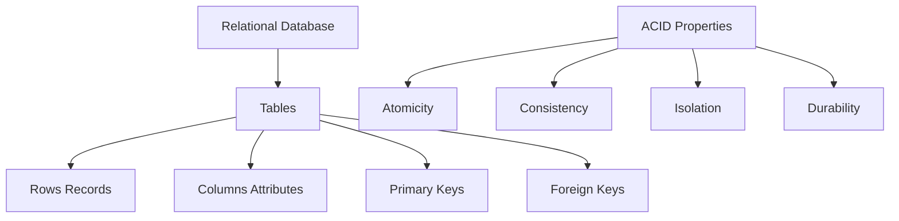
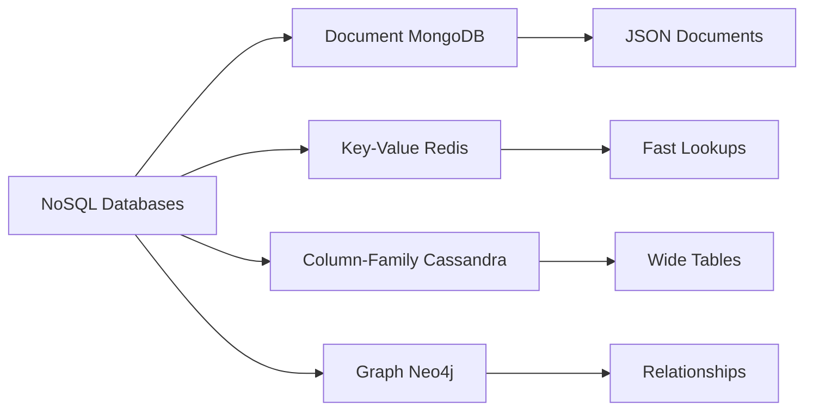

# Database Systems

## Introduction

Databases are the backbone of data storage and management in modern applications. For data scientists, understanding how to interact with databases is essential for accessing organizational data, performing large-scale analyses, and building data pipelines. This lesson covers both traditional relational databases (SQL) and modern NoSQL alternatives, focusing on practical data extraction and querying techniques.

The choice between database types depends on data structure, scalability requirements, query patterns, and consistency needs. Data scientists must be proficient in working with multiple database paradigms to handle diverse data sources effectively.

## Relational Databases (SQL)



### Connecting to SQL Databases

```python
import sqlite3
import pandas as pd
import numpy as np
from datetime import datetime, timedelta
import psycopg2  # PostgreSQL
import mysql.connector  # MySQL

class DatabaseConnector:
    """
    Unified interface for database connections
    """

    @staticmethod
    def connect_sqlite(db_path):
        """Connect to SQLite database"""
        try:
            conn = sqlite3.connect(db_path)
            print(f"Connected to SQLite database: {db_path}")
            return conn
        except sqlite3.Error as e:
            print(f"SQLite connection error: {e}")
            return None

    @staticmethod
    def connect_postgresql(host, database, user, password, port=5432):
        """Connect to PostgreSQL database"""
        try:
            conn = psycopg2.connect(
                host=host,
                database=database,
                user=user,
                password=password,
                port=port
            )
            print(f"Connected to PostgreSQL database: {database}")
            return conn
        except psycopg2.Error as e:
            print(f"PostgreSQL connection error: {e}")
            return None

    @staticmethod
    def connect_mysql(host, database, user, password, port=3306):
        """Connect to MySQL database"""
        try:
            conn = mysql.connector.connect(
                host=host,
                database=database,
                user=user,
                password=password,
                port=port
            )
            print(f"Connected to MySQL database: {database}")
            return conn
        except mysql.connector.Error as e:
            print(f"MySQL connection error: {e}")
            return None

# Create sample SQLite database for examples
def create_sample_database(db_path='sample_data.db'):
    """Create a sample database for demonstration"""
    conn = sqlite3.connect(db_path)
    cursor = conn.cursor()

    # Create tables
    cursor.execute('''
        CREATE TABLE IF NOT EXISTS customers (
            customer_id INTEGER PRIMARY KEY,
            name TEXT NOT NULL,
            email TEXT UNIQUE,
            city TEXT,
            country TEXT,
            registration_date DATE
        )
    ''')

    cursor.execute('''
        CREATE TABLE IF NOT EXISTS orders (
            order_id INTEGER PRIMARY KEY,
            customer_id INTEGER,
            order_date DATE,
            total_amount REAL,
            status TEXT,
            FOREIGN KEY (customer_id) REFERENCES customers (customer_id)
        )
    ''')

    cursor.execute('''
        CREATE TABLE IF NOT EXISTS products (
            product_id INTEGER PRIMARY KEY,
            product_name TEXT,
            category TEXT,
            price REAL,
            stock_quantity INTEGER
        )
    ''')

    cursor.execute('''
        CREATE TABLE IF NOT EXISTS order_items (
            order_item_id INTEGER PRIMARY KEY,
            order_id INTEGER,
            product_id INTEGER,
            quantity INTEGER,
            price_per_unit REAL,
            FOREIGN KEY (order_id) REFERENCES orders (order_id),
            FOREIGN KEY (product_id) REFERENCES products (product_id)
        )
    ''')

    # Insert sample data
    customers = [
        (1, 'Alice Johnson', 'alice@email.com', 'New York', 'USA', '2023-01-15'),
        (2, 'Bob Smith', 'bob@email.com', 'London', 'UK', '2023-02-20'),
        (3, 'Charlie Brown', 'charlie@email.com', 'Paris', 'France', '2023-03-10'),
        (4, 'Diana Prince', 'diana@email.com', 'Berlin', 'Germany', '2023-04-05'),
        (5, 'Eve Wilson', 'eve@email.com', 'Tokyo', 'Japan', '2023-05-12')
    ]

    cursor.executemany(
        'INSERT OR REPLACE INTO customers VALUES (?, ?, ?, ?, ?, ?)',
        customers
    )

    products = [
        (1, 'Laptop', 'Electronics', 999.99, 50),
        (2, 'Mouse', 'Electronics', 29.99, 200),
        (3, 'Keyboard', 'Electronics', 79.99, 150),
        (4, 'Monitor', 'Electronics', 299.99, 75),
        (5, 'Desk Chair', 'Furniture', 199.99, 30)
    ]

    cursor.executemany(
        'INSERT OR REPLACE INTO products VALUES (?, ?, ?, ?, ?)',
        products
    )

    orders = [
        (1, 1, '2024-01-20', 1299.98, 'completed'),
        (2, 2, '2024-01-21', 29.99, 'completed'),
        (3, 1, '2024-01-22', 79.99, 'completed'),
        (4, 3, '2024-01-23', 1499.97, 'pending'),
        (5, 4, '2024-01-24', 499.98, 'completed')
    ]

    cursor.executemany(
        'INSERT OR REPLACE INTO orders VALUES (?, ?, ?, ?, ?)',
        orders
    )

    order_items = [
        (1, 1, 1, 1, 999.99),
        (2, 1, 2, 10, 29.99),
        (3, 2, 2, 1, 29.99),
        (4, 3, 3, 1, 79.99),
        (5, 4, 1, 1, 999.99),
        (6, 4, 4, 1, 299.99),
        (7, 5, 5, 2, 199.99)
    ]

    cursor.executemany(
        'INSERT OR REPLACE INTO order_items VALUES (?, ?, ?, ?, ?)',
        order_items
    )

    conn.commit()
    conn.close()

    return db_path

# Create sample database
db_path = create_sample_database()
print(f"Sample database created: {db_path}")
```

### SQL Query Execution

```python
class SQLQueryExecutor:
    """Execute SQL queries and return results"""

    def __init__(self, connection):
        self.conn = connection

    def execute_query(self, query, params=None):
        """Execute a SQL query and return results as DataFrame"""
        try:
            if params:
                df = pd.read_sql_query(query, self.conn, params=params)
            else:
                df = pd.read_sql_query(query, self.conn)

            return df

        except Exception as e:
            print(f"Query execution error: {e}")
            return pd.DataFrame()

    def execute_update(self, query, params=None):
        """Execute INSERT, UPDATE, or DELETE query"""
        try:
            cursor = self.conn.cursor()

            if params:
                cursor.execute(query, params)
            else:
                cursor.execute(query)

            self.conn.commit()
            rows_affected = cursor.rowcount

            print(f"Query executed successfully. Rows affected: {rows_affected}")
            return rows_affected

        except Exception as e:
            self.conn.rollback()
            print(f"Update execution error: {e}")
            return 0

    def get_table_info(self, table_name):
        """Get information about table structure"""
        if isinstance(self.conn, sqlite3.Connection):
            query = f"PRAGMA table_info({table_name})"
        else:
            # For PostgreSQL/MySQL
            query = f"""
                SELECT column_name, data_type
                FROM information_schema.columns
                WHERE table_name = '{table_name}'
            """

        return self.execute_query(query)

# Example usage
conn = sqlite3.connect(db_path)
executor = SQLQueryExecutor(conn)

# Basic SELECT
print("All Customers:")
customers = executor.execute_query("SELECT * FROM customers")
print(customers)

print("\nTable Info:")
print(executor.get_table_info('customers'))
```

### Common SQL Patterns for Data Science

```python
class DataScienceQueries:
    """Common SQL patterns for data analysis"""

    def __init__(self, executor):
        self.executor = executor

    def get_aggregated_sales(self):
        """Aggregate sales data"""
        query = """
            SELECT
                c.country,
                COUNT(DISTINCT o.order_id) as total_orders,
                SUM(o.total_amount) as total_revenue,
                AVG(o.total_amount) as avg_order_value,
                MIN(o.total_amount) as min_order,
                MAX(o.total_amount) as max_order
            FROM customers c
            JOIN orders o ON c.customer_id = o.customer_id
            GROUP BY c.country
            ORDER BY total_revenue DESC
        """
        return self.executor.execute_query(query)

    def get_product_performance(self):
        """Analyze product performance"""
        query = """
            SELECT
                p.product_name,
                p.category,
                COUNT(oi.order_item_id) as times_ordered,
                SUM(oi.quantity) as total_quantity_sold,
                SUM(oi.quantity * oi.price_per_unit) as total_revenue,
                AVG(oi.price_per_unit) as avg_price
            FROM products p
            LEFT JOIN order_items oi ON p.product_id = oi.product_id
            GROUP BY p.product_id, p.product_name, p.category
            ORDER BY total_revenue DESC
        """
        return self.executor.execute_query(query)

    def get_customer_lifetime_value(self):
        """Calculate customer lifetime value"""
        query = """
            SELECT
                c.customer_id,
                c.name,
                c.registration_date,
                COUNT(o.order_id) as total_orders,
                SUM(o.total_amount) as lifetime_value,
                AVG(o.total_amount) as avg_order_value,
                MAX(o.order_date) as last_order_date,
                julianday('now') - julianday(MAX(o.order_date)) as days_since_last_order
            FROM customers c
            LEFT JOIN orders o ON c.customer_id = o.customer_id
            GROUP BY c.customer_id, c.name, c.registration_date
            ORDER BY lifetime_value DESC
        """
        return self.executor.execute_query(query)

    def get_time_series_sales(self):
        """Get sales over time"""
        query = """
            SELECT
                DATE(order_date) as date,
                COUNT(*) as num_orders,
                SUM(total_amount) as daily_revenue,
                AVG(total_amount) as avg_order_value
            FROM orders
            GROUP BY DATE(order_date)
            ORDER BY date
        """
        return self.executor.execute_query(query)

    def get_cohort_analysis(self):
        """Cohort analysis by registration month"""
        query = """
            SELECT
                strftime('%Y-%m', c.registration_date) as cohort_month,
                strftime('%Y-%m', o.order_date) as order_month,
                COUNT(DISTINCT c.customer_id) as customers,
                COUNT(o.order_id) as orders,
                SUM(o.total_amount) as revenue
            FROM customers c
            LEFT JOIN orders o ON c.customer_id = o.customer_id
            GROUP BY cohort_month, order_month
            ORDER BY cohort_month, order_month
        """
        return self.executor.execute_query(query)

# Usage
ds_queries = DataScienceQueries(executor)

print("Aggregated Sales by Country:")
print(ds_queries.get_aggregated_sales())

print("\nProduct Performance:")
print(ds_queries.get_product_performance())

print("\nCustomer Lifetime Value:")
print(ds_queries.get_customer_lifetime_value())
```

### Advanced SQL Techniques

```python
class AdvancedSQLQueries:
    """Advanced SQL patterns"""

    def __init__(self, executor):
        self.executor = executor

    def window_functions_example(self):
        """Use window functions for running totals and rankings"""
        query = """
            SELECT
                order_id,
                customer_id,
                order_date,
                total_amount,
                SUM(total_amount) OVER (
                    PARTITION BY customer_id
                    ORDER BY order_date
                    ROWS BETWEEN UNBOUNDED PRECEDING AND CURRENT ROW
                ) as running_total,
                ROW_NUMBER() OVER (
                    PARTITION BY customer_id
                    ORDER BY order_date
                ) as order_number,
                RANK() OVER (
                    ORDER BY total_amount DESC
                ) as value_rank
            FROM orders
            ORDER BY customer_id, order_date
        """
        return self.executor.execute_query(query)

    def common_table_expressions(self):
        """Use CTEs for complex queries"""
        query = """
            WITH customer_stats AS (
                SELECT
                    customer_id,
                    COUNT(*) as order_count,
                    SUM(total_amount) as total_spent
                FROM orders
                GROUP BY customer_id
            ),
            customer_segments AS (
                SELECT
                    customer_id,
                    order_count,
                    total_spent,
                    CASE
                        WHEN total_spent > 1000 THEN 'High Value'
                        WHEN total_spent > 500 THEN 'Medium Value'
                        ELSE 'Low Value'
                    END as segment
                FROM customer_stats
            )
            SELECT
                c.name,
                c.email,
                cs.order_count,
                cs.total_spent,
                cs.segment
            FROM customer_segments cs
            JOIN customers c ON cs.customer_id = c.customer_id
            ORDER BY cs.total_spent DESC
        """
        return self.executor.execute_query(query)

    def subquery_example(self):
        """Subquery for finding above-average customers"""
        query = """
            SELECT
                c.name,
                c.email,
                SUM(o.total_amount) as total_spent
            FROM customers c
            JOIN orders o ON c.customer_id = o.customer_id
            GROUP BY c.customer_id, c.name, c.email
            HAVING SUM(o.total_amount) > (
                SELECT AVG(customer_total)
                FROM (
                    SELECT SUM(total_amount) as customer_total
                    FROM orders
                    GROUP BY customer_id
                )
            )
            ORDER BY total_spent DESC
        """
        return self.executor.execute_query(query)

# Usage
adv_queries = AdvancedSQLQueries(executor)

print("Window Functions Example:")
print(adv_queries.window_functions_example())

print("\nCTE Example (Customer Segments):")
print(adv_queries.common_table_expressions())
```

## NoSQL Databases



### Document Databases (MongoDB)

```python
# MongoDB example (conceptual - requires pymongo)
"""
from pymongo import MongoClient

class MongoDBConnector:
    def __init__(self, connection_string, database_name):
        self.client = MongoClient(connection_string)
        self.db = self.client[database_name]

    def insert_document(self, collection_name, document):
        collection = self.db[collection_name]
        result = collection.insert_one(document)
        return result.inserted_id

    def find_documents(self, collection_name, query=None, projection=None):
        collection = self.db[collection_name]
        cursor = collection.find(query or {}, projection or {})
        return list(cursor)

    def aggregate(self, collection_name, pipeline):
        collection = self.db[collection_name]
        results = collection.aggregate(pipeline)
        return list(results)

# Example usage
mongo = MongoDBConnector('mongodb://localhost:27017/', 'analytics_db')

# Insert document
customer_doc = {
    'name': 'Alice Johnson',
    'email': 'alice@email.com',
    'orders': [
        {'order_id': 1, 'total': 999.99, 'items': ['laptop']},
        {'order_id': 2, 'total': 29.99, 'items': ['mouse']}
    ],
    'metadata': {
        'registration_date': '2023-01-15',
        'country': 'USA',
        'preferences': ['electronics', 'gadgets']
    }
}

# mongo.insert_document('customers', customer_doc)

# Find documents
# customers = mongo.find_documents(
#     'customers',
#     query={'metadata.country': 'USA'},
#     projection={'name': 1, 'email': 1}
# )

# Aggregation pipeline
pipeline = [
    {'$match': {'metadata.country': 'USA'}},
    {'$unwind': '$orders'},
    {'$group': {
        '_id': '$name',
        'total_spent': {'$sum': '$orders.total'},
        'order_count': {'$sum': 1}
    }},
    {'$sort': {'total_spent': -1}}
]

# results = mongo.aggregate('customers', pipeline)
"""

# Simulated MongoDB-style operations with Python
class DocumentStore:
    """Simulate document database operations"""

    def __init__(self):
        self.collections = {}

    def insert(self, collection, document):
        """Insert document into collection"""
        if collection not in self.collections:
            self.collections[collection] = []

        self.collections[collection].append(document.copy())
        return len(self.collections[collection]) - 1

    def find(self, collection, query=None):
        """Find documents matching query"""
        if collection not in self.collections:
            return []

        documents = self.collections[collection]

        if not query:
            return documents

        # Simple query matching
        results = []
        for doc in documents:
            if self._matches_query(doc, query):
                results.append(doc)

        return results

    def _matches_query(self, doc, query):
        """Check if document matches query"""
        for key, value in query.items():
            if '.' in key:
                # Nested field
                parts = key.split('.')
                current = doc
                for part in parts:
                    if isinstance(current, dict) and part in current:
                        current = current[part]
                    else:
                        return False
                if current != value:
                    return False
            else:
                if key not in doc or doc[key] != value:
                    return False
        return True

    def to_dataframe(self, collection):
        """Convert collection to DataFrame"""
        if collection not in self.collections:
            return pd.DataFrame()

        return pd.json_normalize(self.collections[collection])

# Example usage
doc_store = DocumentStore()

# Insert documents
doc_store.insert('customers', {
    'customer_id': 1,
    'name': 'Alice Johnson',
    'email': 'alice@email.com',
    'address': {
        'city': 'New York',
        'country': 'USA'
    },
    'orders': [
        {'order_id': 1, 'total': 999.99},
        {'order_id': 2, 'total': 29.99}
    ]
})

doc_store.insert('customers', {
    'customer_id': 2,
    'name': 'Bob Smith',
    'email': 'bob@email.com',
    'address': {
        'city': 'London',
        'country': 'UK'
    },
    'orders': [
        {'order_id': 3, 'total': 599.99}
    ]
})

# Query documents
usa_customers = doc_store.find('customers', {'address.country': 'USA'})
print("USA Customers:")
print(usa_customers)

# Convert to DataFrame
df = doc_store.to_dataframe('customers')
print("\nCustomers DataFrame:")
print(df)
```

## Database Performance Optimization

```python
class DatabaseOptimizer:
    """Tools for database performance optimization"""

    def __init__(self, executor):
        self.executor = executor

    def create_index(self, table, column):
        """Create index on column"""
        index_name = f"idx_{table}_{column}"
        query = f"CREATE INDEX IF NOT EXISTS {index_name} ON {table}({column})"

        try:
            self.executor.execute_update(query)
            print(f"Created index: {index_name}")
        except Exception as e:
            print(f"Error creating index: {e}")

    def analyze_query_plan(self, query):
        """Analyze query execution plan"""
        explain_query = f"EXPLAIN QUERY PLAN {query}"
        return self.executor.execute_query(explain_query)

    def get_table_statistics(self, table):
        """Get table statistics"""
        stats_query = f"""
            SELECT
                COUNT(*) as row_count,
                COUNT(DISTINCT *) as unique_rows
            FROM {table}
        """
        return self.executor.execute_query(stats_query)

    def batch_insert(self, table, data, batch_size=1000):
        """Insert data in batches for better performance"""
        df = pd.DataFrame(data)
        num_batches = len(df) // batch_size + 1

        for i in range(num_batches):
            start_idx = i * batch_size
            end_idx = min((i + 1) * batch_size, len(df))
            batch = df[start_idx:end_idx]

            # Use pandas to_sql for efficient insertion
            batch.to_sql(
                table,
                self.executor.conn,
                if_exists='append',
                index=False
            )

            print(f"Inserted batch {i+1}/{num_batches}")

# Example
optimizer = DatabaseOptimizer(executor)

# Create indexes
optimizer.create_index('customers', 'email')
optimizer.create_index('orders', 'customer_id')
optimizer.create_index('orders', 'order_date')

# Analyze query
query = "SELECT * FROM customers WHERE email = 'alice@email.com'"
plan = optimizer.analyze_query_plan(query)
print("Query Plan:")
print(plan)
```

## Data Extraction Patterns

```python
class DataExtractor:
    """Extract data from databases for analysis"""

    def __init__(self, executor):
        self.executor = executor

    def extract_table(self, table_name, chunk_size=None):
        """Extract entire table"""
        query = f"SELECT * FROM {table_name}"

        if chunk_size:
            # Extract in chunks for large tables
            return pd.read_sql_query(
                query,
                self.executor.conn,
                chunksize=chunk_size
            )
        else:
            return self.executor.execute_query(query)

    def extract_date_range(self, table, date_column, start_date, end_date):
        """Extract data within date range"""
        query = f"""
            SELECT *
            FROM {table}
            WHERE {date_column} BETWEEN ? AND ?
        """
        return self.executor.execute_query(query, (start_date, end_date))

    def extract_with_joins(self, base_table, joins_config):
        """
        Extract data with multiple joins
        joins_config: list of {'table': 'name', 'on': 'condition', 'type': 'LEFT/INNER'}
        """
        query = f"SELECT * FROM {base_table}"

        for join in joins_config:
            join_type = join.get('type', 'LEFT')
            query += f" {join_type} JOIN {join['table']} ON {join['on']}"

        return self.executor.execute_query(query)

    def extract_sample(self, table, sample_size=1000, random=True):
        """Extract sample of data"""
        if random:
            query = f"""
                SELECT * FROM {table}
                ORDER BY RANDOM()
                LIMIT ?
            """
            return self.executor.execute_query(query, (sample_size,))
        else:
            query = f"SELECT * FROM {table} LIMIT ?"
            return self.executor.execute_query(query, (sample_size,))

# Usage
extractor = DataExtractor(executor)

# Extract sample
sample = extractor.extract_sample('customers', sample_size=3)
print("Sample Data:")
print(sample)

# Extract with date range
orders_jan = extractor.extract_date_range(
    'orders',
    'order_date',
    '2024-01-01',
    '2024-01-31'
)
print("\nJanuary Orders:")
print(orders_jan)
```

## Connection Pooling and Management

```python
from contextlib import contextmanager

class DatabaseConnectionPool:
    """Manage database connections efficiently"""

    def __init__(self, db_config, pool_size=5):
        self.db_config = db_config
        self.pool_size = pool_size
        self.connections = []
        self.in_use = set()

    @contextmanager
    def get_connection(self):
        """Get connection from pool (context manager)"""
        conn = self._acquire_connection()
        try:
            yield conn
        finally:
            self._release_connection(conn)

    def _acquire_connection(self):
        """Acquire a connection from pool"""
        # Check for available connection
        for conn in self.connections:
            if conn not in self.in_use:
                self.in_use.add(conn)
                return conn

        # Create new connection if pool not full
        if len(self.connections) < self.pool_size:
            conn = sqlite3.connect(self.db_config['db_path'])
            self.connections.append(conn)
            self.in_use.add(conn)
            return conn

        # Wait for connection (simplified)
        raise Exception("Connection pool exhausted")

    def _release_connection(self, conn):
        """Release connection back to pool"""
        if conn in self.in_use:
            self.in_use.remove(conn)

    def close_all(self):
        """Close all connections"""
        for conn in self.connections:
            conn.close()
        self.connections = []
        self.in_use = set()

# Usage
pool = DatabaseConnectionPool({'db_path': db_path}, pool_size=3)

with pool.get_connection() as conn:
    executor = SQLQueryExecutor(conn)
    data = executor.execute_query("SELECT * FROM customers")
    print(data)

# Connection automatically released
```

## Summary

Database systems are fundamental to data science:

**SQL Databases:**
- Structured data with relationships
- ACID transactions
- Complex joins and aggregations
- Well-established and mature
- Strong consistency guarantees

**NoSQL Databases:**
- Flexible schemas
- Horizontal scalability
- Specialized for specific use cases
- Better for unstructured/semi-structured data
- Eventual consistency (often)

**Best Practices:**
- Use connection pooling for efficiency
- Create appropriate indexes
- Write efficient queries (avoid SELECT *)
- Batch operations when possible
- Handle errors and connections properly
- Use parameterized queries (prevent SQL injection)
- Monitor query performance
- Choose the right database for your use case

Understanding both SQL and NoSQL databases enables data scientists to work effectively with diverse data sources and choose the best tools for each analytical task.
