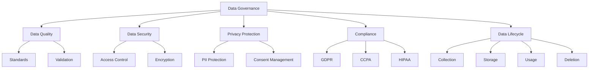

# Data Governance and Compliance

## Introduction

Data governance encompasses the policies, procedures, and standards that ensure proper data management throughout its lifecycle. As data becomes increasingly valuable and regulated, organizations must establish robust governance frameworks to maintain data quality, security, privacy, and compliance with legal requirements.

For data scientists, understanding data governance is essential for ethical data use, regulatory compliance, and maintaining stakeholder trust. This lesson covers governance frameworks, compliance requirements, and practical implementation strategies.



## Data Governance Framework

```python
import pandas as pd
import hashlib
import json
from datetime import datetime, timedelta
from enum import Enum

class DataClassification(Enum):
    """Data classification levels"""
    PUBLIC = "public"
    INTERNAL = "internal"
    CONFIDENTIAL = "confidential"
    RESTRICTED = "restricted"

class DataGovernanceFramework:
    """Framework for data governance implementation"""

    def __init__(self):
        self.data_catalog = {}
        self.policies = {}
        self.access_logs = []

    def register_dataset(self, dataset_info):
        """Register a dataset in the governance framework"""
        required_fields = [
            'dataset_id', 'name', 'owner', 'classification',
            'description', 'retention_period_days', 'contains_pii'
        ]

        for field in required_fields:
            if field not in dataset_info:
                raise ValueError(f"Missing required field: {field}")

        dataset_info['registered_date'] = datetime.now().isoformat()
        dataset_info['last_updated'] = datetime.now().isoformat()

        self.data_catalog[dataset_info['dataset_id']] = dataset_info

        print(f"Dataset registered: {dataset_info['name']}")
        return dataset_info['dataset_id']

    def define_policy(self, policy_name, policy_rules):
        """Define a data governance policy"""
        policy = {
            'name': policy_name,
            'rules': policy_rules,
            'created_date': datetime.now().isoformat(),
            'status': 'active'
        }

        self.policies[policy_name] = policy
        return policy

    def check_compliance(self, dataset_id, action, user):
        """Check if action complies with policies"""
        if dataset_id not in self.data_catalog:
            return False, "Dataset not found in catalog"

        dataset = self.data_catalog[dataset_id]
        classification = dataset['classification']

        # Check access policies
        if classification == DataClassification.RESTRICTED.value:
            if user not in dataset.get('authorized_users', []):
                return False, "User not authorized for restricted data"

        # Check retention policy
        registered_date = datetime.fromisoformat(dataset['registered_date'])
        age_days = (datetime.now() - registered_date).days
        retention_period = dataset['retention_period_days']

        if age_days > retention_period and action == 'access':
            return False, f"Data exceeds retention period ({retention_period} days)"

        # Log access
        self.log_access(dataset_id, action, user)

        return True, "Compliant"

    def log_access(self, dataset_id, action, user):
        """Log data access for audit trail"""
        log_entry = {
            'timestamp': datetime.now().isoformat(),
            'dataset_id': dataset_id,
            'action': action,
            'user': user
        }

        self.access_logs.append(log_entry)

    def get_access_logs(self, dataset_id=None, user=None, days=30):
        """Retrieve access logs"""
        cutoff_date = datetime.now() - timedelta(days=days)

        filtered_logs = []
        for log in self.access_logs:
            log_date = datetime.fromisoformat(log['timestamp'])

            if log_date < cutoff_date:
                continue

            if dataset_id and log['dataset_id'] != dataset_id:
                continue

            if user and log['user'] != user:
                continue

            filtered_logs.append(log)

        return pd.DataFrame(filtered_logs)

    def generate_governance_report(self):
        """Generate governance compliance report"""
        report = {
            'total_datasets': len(self.data_catalog),
            'datasets_by_classification': {},
            'datasets_with_pii': 0,
            'policies_count': len(self.policies),
            'total_access_events': len(self.access_logs),
            'datasets_exceeding_retention': []
        }

        # Analyze datasets
        for dataset_id, dataset in self.data_catalog.items():
            classification = dataset['classification']
            report['datasets_by_classification'][classification] = \
                report['datasets_by_classification'].get(classification, 0) + 1

            if dataset.get('contains_pii', False):
                report['datasets_with_pii'] += 1

            # Check retention
            registered_date = datetime.fromisoformat(dataset['registered_date'])
            age_days = (datetime.now() - registered_date).days
            retention_period = dataset['retention_period_days']

            if age_days > retention_period:
                report['datasets_exceeding_retention'].append({
                    'dataset_id': dataset_id,
                    'name': dataset['name'],
                    'age_days': age_days,
                    'retention_period': retention_period
                })

        return report

# Example usage
framework = DataGovernanceFramework()

# Register datasets
framework.register_dataset({
    'dataset_id': 'ds001',
    'name': 'Customer Transactions',
    'owner': 'Sales Department',
    'classification': DataClassification.CONFIDENTIAL.value,
    'description': 'Historical customer purchase data',
    'retention_period_days': 2555,  # 7 years
    'contains_pii': True,
    'authorized_users': ['analyst1', 'analyst2', 'manager1']
})

framework.register_dataset({
    'dataset_id': 'ds002',
    'name': 'Product Catalog',
    'owner': 'Product Team',
    'classification': DataClassification.PUBLIC.value,
    'description': 'Product information and pricing',
    'retention_period_days': 365,
    'contains_pii': False
})

# Define policies
framework.define_policy('PII Protection', {
    'encryption_required': True,
    'access_logging': True,
    'anonymization_for_analytics': True
})

framework.define_policy('Data Retention', {
    'max_retention_days': 2555,
    'deletion_process': 'automated',
    'deletion_verification': True
})

# Check compliance
compliance, message = framework.check_compliance('ds001', 'access', 'analyst1')
print(f"Compliance check: {compliance} - {message}")

# Generate report
report = framework.generate_governance_report()
print("\nGovernance Report:")
print(json.dumps(report, indent=2, default=str))
```

## Privacy Protection and PII Handling

```python
import re
from typing import List, Dict

class PIIHandler:
    """Handle Personally Identifiable Information"""

    # PII patterns
    EMAIL_PATTERN = r'[\w\.-]+@[\w\.-]+\.\w+'
    PHONE_PATTERN = r'\b\d{3}[-.]?\d{3}[-.]?\d{4}\b'
    SSN_PATTERN = r'\b\d{3}-\d{2}-\d{4}\b'
    CREDIT_CARD_PATTERN = r'\b\d{4}[-\s]?\d{4}[-\s]?\d{4}[-\s]?\d{4}\b'

    @staticmethod
    def detect_pii(data, columns=None):
        """Detect potential PII in dataset"""
        if isinstance(data, pd.DataFrame):
            df = data
        else:
            df = pd.DataFrame(data)

        pii_report = {}

        check_columns = columns if columns else df.columns

        for col in check_columns:
            if col not in df.columns:
                continue

            pii_info = {
                'column': col,
                'pii_types': [],
                'count': 0
            }

            # Convert to string for pattern matching
            col_data = df[col].astype(str)

            # Check for email
            if col_data.str.match(PIIHandler.EMAIL_PATTERN).any():
                pii_info['pii_types'].append('email')
                pii_info['count'] += col_data.str.match(PIIHandler.EMAIL_PATTERN).sum()

            # Check for phone
            if col_data.str.match(PIIHandler.PHONE_PATTERN).any():
                pii_info['pii_types'].append('phone')
                pii_info['count'] += col_data.str.match(PIIHandler.PHONE_PATTERN).sum()

            # Check for SSN
            if col_data.str.match(PIIHandler.SSN_PATTERN).any():
                pii_info['pii_types'].append('ssn')
                pii_info['count'] += col_data.str.match(PIIHandler.SSN_PATTERN).sum()

            # Check common PII column names
            pii_keywords = ['name', 'email', 'phone', 'address', 'ssn', 'dob', 'birth']
            if any(keyword in col.lower() for keyword in pii_keywords):
                if 'inferred_from_name' not in pii_info['pii_types']:
                    pii_info['pii_types'].append('inferred_from_name')

            if pii_info['pii_types']:
                pii_report[col] = pii_info

        return pii_report

    @staticmethod
    def anonymize_data(df, pii_columns, method='hash'):
        """Anonymize PII data"""
        df_anonymized = df.copy()

        for col in pii_columns:
            if col not in df.columns:
                continue

            if method == 'hash':
                # Hash values
                df_anonymized[col] = df[col].apply(
                    lambda x: hashlib.sha256(str(x).encode()).hexdigest()[:16]
                    if pd.notna(x) else x
                )

            elif method == 'mask':
                # Mask values
                df_anonymized[col] = df[col].apply(
                    lambda x: '***MASKED***' if pd.notna(x) else x
                )

            elif method == 'redact':
                # Remove values
                df_anonymized[col] = None

            elif method == 'generalize':
                # Generalize values (for numeric data)
                if pd.api.types.is_numeric_dtype(df[col]):
                    # Round to nearest 10
                    df_anonymized[col] = (df[col] // 10) * 10

        return df_anonymized

    @staticmethod
    def pseudonymize(df, id_column):
        """Create pseudonymous identifiers"""
        # Create mapping
        unique_ids = df[id_column].unique()
        id_mapping = {
            original: f"USER_{i:06d}"
            for i, original in enumerate(unique_ids, 1)
        }

        df_pseudo = df.copy()
        df_pseudo[id_column] = df[id_column].map(id_mapping)

        return df_pseudo, id_mapping

    @staticmethod
    def k_anonymity_check(df, quasi_identifiers, k=5):
        """Check if dataset satisfies k-anonymity"""
        # Group by quasi-identifiers
        groups = df.groupby(quasi_identifiers).size()

        # Check if all groups have at least k records
        satisfies_k_anonymity = (groups >= k).all()
        min_group_size = groups.min()

        return {
            'satisfies_k_anonymity': bool(satisfies_k_anonymity),
            'k_value': k,
            'min_group_size': int(min_group_size),
            'groups_below_k': int((groups < k).sum()),
            'total_groups': len(groups)
        }

# Example PII handling
sample_pii_data = pd.DataFrame({
    'customer_id': [1, 2, 3, 4, 5],
    'name': ['Alice Johnson', 'Bob Smith', 'Charlie Brown', 'Diana Prince', 'Eve Wilson'],
    'email': ['alice@email.com', 'bob@email.com', 'charlie@email.com', 'diana@email.com', 'eve@email.com'],
    'phone': ['555-123-4567', '555-234-5678', '555-345-6789', '555-456-7890', '555-567-8901'],
    'age': [25, 30, 35, 28, 42],
    'city': ['New York', 'Los Angeles', 'Chicago', 'Houston', 'Phoenix'],
    'purchase_amount': [999.99, 299.99, 599.99, 1299.99, 399.99]
})

pii_handler = PIIHandler()

# Detect PII
print("PII Detection:")
pii_report = pii_handler.detect_pii(sample_pii_data)
for col, info in pii_report.items():
    print(f"  {col}: {', '.join(info['pii_types'])}")

# Anonymize
print("\nOriginal Data:")
print(sample_pii_data)

anonymized = pii_handler.anonymize_data(
    sample_pii_data,
    ['name', 'email', 'phone'],
    method='hash'
)
print("\nAnonymized Data:")
print(anonymized[['customer_id', 'name', 'email', 'phone']])

# Pseudonymize
pseudonymized, mapping = pii_handler.pseudonymize(sample_pii_data, 'customer_id')
print("\nPseudonymized Data:")
print(pseudonymized[['customer_id', 'name', 'age']])

# K-anonymity check
k_anon = pii_handler.k_anonymity_check(
    sample_pii_data,
    quasi_identifiers=['city', 'age'],
    k=2
)
print("\nK-Anonymity Check:")
print(json.dumps(k_anon, indent=2))
```

## Regulatory Compliance

```python
class ComplianceChecker:
    """Check compliance with regulations"""

    @staticmethod
    def check_gdpr_compliance(dataset_info, processing_activities):
        """
        Check GDPR compliance
        General Data Protection Regulation (EU)
        """
        compliance_checks = {
            'lawful_basis': False,
            'consent_documented': False,
            'data_minimization': False,
            'purpose_limitation': False,
            'storage_limitation': False,
            'right_to_erasure': False,
            'data_portability': False,
            'security_measures': False
        }

        issues = []

        # Check lawful basis
        if 'lawful_basis' in processing_activities:
            compliance_checks['lawful_basis'] = True
        else:
            issues.append("No lawful basis documented for processing")

        # Check consent
        if processing_activities.get('consent_mechanism'):
            compliance_checks['consent_documented'] = True
        else:
            issues.append("Consent mechanism not documented")

        # Check data minimization
        if dataset_info.get('data_minimization_applied'):
            compliance_checks['data_minimization'] = True
        else:
            issues.append("Data minimization not confirmed")

        # Check purpose limitation
        if dataset_info.get('processing_purpose'):
            compliance_checks['purpose_limitation'] = True
        else:
            issues.append("Processing purpose not specified")

        # Check storage limitation
        if dataset_info.get('retention_period_days'):
            compliance_checks['storage_limitation'] = True
        else:
            issues.append("Retention period not defined")

        # Check right to erasure
        if processing_activities.get('deletion_process'):
            compliance_checks['right_to_erasure'] = True
        else:
            issues.append("Deletion process not implemented")

        # Check data portability
        if processing_activities.get('export_capability'):
            compliance_checks['data_portability'] = True
        else:
            issues.append("Data export capability not confirmed")

        # Check security measures
        if dataset_info.get('encryption_enabled'):
            compliance_checks['security_measures'] = True
        else:
            issues.append("Encryption not enabled")

        compliance_score = sum(compliance_checks.values()) / len(compliance_checks) * 100

        return {
            'regulation': 'GDPR',
            'compliance_score': compliance_score,
            'checks': compliance_checks,
            'issues': issues,
            'compliant': compliance_score == 100
        }

    @staticmethod
    def check_ccpa_compliance(dataset_info, processing_activities):
        """
        Check CCPA compliance
        California Consumer Privacy Act
        """
        compliance_checks = {
            'notice_at_collection': False,
            'opt_out_mechanism': False,
            'deletion_capability': False,
            'data_disclosure': False,
            'non_discrimination': False
        }

        issues = []

        # Check notice at collection
        if processing_activities.get('privacy_notice_provided'):
            compliance_checks['notice_at_collection'] = True
        else:
            issues.append("Privacy notice not provided at collection")

        # Check opt-out mechanism
        if processing_activities.get('opt_out_available'):
            compliance_checks['opt_out_mechanism'] = True
        else:
            issues.append("Opt-out mechanism not available")

        # Check deletion capability
        if processing_activities.get('deletion_process'):
            compliance_checks['deletion_capability'] = True
        else:
            issues.append("Deletion capability not implemented")

        # Check data disclosure
        if dataset_info.get('data_sharing_disclosed'):
            compliance_checks['data_disclosure'] = True
        else:
            issues.append("Data sharing not disclosed")

        # Check non-discrimination
        if processing_activities.get('non_discrimination_policy'):
            compliance_checks['non_discrimination'] = True
        else:
            issues.append("Non-discrimination policy not confirmed")

        compliance_score = sum(compliance_checks.values()) / len(compliance_checks) * 100

        return {
            'regulation': 'CCPA',
            'compliance_score': compliance_score,
            'checks': compliance_checks,
            'issues': issues,
            'compliant': compliance_score == 100
        }

    @staticmethod
    def check_hipaa_compliance(dataset_info):
        """
        Check HIPAA compliance (for healthcare data)
        Health Insurance Portability and Accountability Act
        """
        compliance_checks = {
            'contains_phi': False,
            'encryption_at_rest': False,
            'encryption_in_transit': False,
            'access_controls': False,
            'audit_logging': False,
            'breach_notification_plan': False
        }

        issues = []

        # Determine if contains PHI
        if dataset_info.get('contains_phi'):
            compliance_checks['contains_phi'] = True

            # Check encryption at rest
            if dataset_info.get('encryption_at_rest'):
                compliance_checks['encryption_at_rest'] = True
            else:
                issues.append("PHI not encrypted at rest")

            # Check encryption in transit
            if dataset_info.get('encryption_in_transit'):
                compliance_checks['encryption_in_transit'] = True
            else:
                issues.append("PHI not encrypted in transit")

            # Check access controls
            if dataset_info.get('role_based_access'):
                compliance_checks['access_controls'] = True
            else:
                issues.append("Role-based access controls not implemented")

            # Check audit logging
            if dataset_info.get('audit_logging_enabled'):
                compliance_checks['audit_logging'] = True
            else:
                issues.append("Audit logging not enabled")

            # Check breach notification plan
            if dataset_info.get('breach_notification_plan'):
                compliance_checks['breach_notification_plan'] = True
            else:
                issues.append("Breach notification plan not in place")

        compliance_score = sum(compliance_checks.values()) / len(compliance_checks) * 100

        return {
            'regulation': 'HIPAA',
            'compliance_score': compliance_score,
            'checks': compliance_checks,
            'issues': issues,
            'compliant': compliance_score == 100
        }

# Example compliance checking
checker = ComplianceChecker()

dataset_info = {
    'dataset_id': 'ds001',
    'name': 'Customer Data',
    'contains_pii': True,
    'retention_period_days': 2555,
    'encryption_enabled': True,
    'data_minimization_applied': True,
    'processing_purpose': 'Customer analytics and service improvement'
}

processing_activities = {
    'lawful_basis': 'Legitimate interest',
    'consent_mechanism': 'Opt-in checkbox with clear explanation',
    'deletion_process': 'Automated deletion after retention period',
    'export_capability': True,
    'privacy_notice_provided': True,
    'opt_out_available': True,
    'data_sharing_disclosed': True,
    'non_discrimination_policy': True
}

# GDPR compliance
gdpr_result = checker.check_gdpr_compliance(dataset_info, processing_activities)
print("GDPR Compliance Check:")
print(f"  Score: {gdpr_result['compliance_score']:.0f}%")
print(f"  Compliant: {gdpr_result['compliant']}")
if gdpr_result['issues']:
    print("  Issues:")
    for issue in gdpr_result['issues']:
        print(f"    - {issue}")

# CCPA compliance
ccpa_result = checker.check_ccpa_compliance(dataset_info, processing_activities)
print("\nCCPA Compliance Check:")
print(f"  Score: {ccpa_result['compliance_score']:.0f}%")
print(f"  Compliant: {ccpa_result['compliant']}")
if ccpa_result['issues']:
    print("  Issues:")
    for issue in ccpa_result['issues']:
        print(f"    - {issue}")
```

## Data Lifecycle Management

```python
class DataLifecycleManager:
    """Manage data through its lifecycle"""

    def __init__(self):
        self.datasets = {}

    def track_dataset_lifecycle(self, dataset_id, stage, metadata=None):
        """Track dataset through lifecycle stages"""
        if dataset_id not in self.datasets:
            self.datasets[dataset_id] = {
                'created': datetime.now().isoformat(),
                'lifecycle_events': []
            }

        event = {
            'stage': stage,
            'timestamp': datetime.now().isoformat(),
            'metadata': metadata or {}
        }

        self.datasets[dataset_id]['lifecycle_events'].append(event)
        self.datasets[dataset_id]['current_stage'] = stage

    def should_archive(self, dataset_id, inactive_days=90):
        """Determine if dataset should be archived"""
        if dataset_id not in self.datasets:
            return False

        events = self.datasets[dataset_id]['lifecycle_events']

        # Find last access
        access_events = [e for e in events if e['stage'] == 'accessed']

        if not access_events:
            # No access recorded, check creation date
            created = datetime.fromisoformat(self.datasets[dataset_id]['created'])
            days_old = (datetime.now() - created).days
            return days_old > inactive_days

        last_access = datetime.fromisoformat(access_events[-1]['timestamp'])
        days_inactive = (datetime.now() - last_access).days

        return days_inactive > inactive_days

    def should_delete(self, dataset_id, retention_days):
        """Determine if dataset should be deleted"""
        if dataset_id not in self.datasets:
            return False

        created = datetime.fromisoformat(self.datasets[dataset_id]['created'])
        age_days = (datetime.now() - created).days

        return age_days > retention_days

    def generate_lifecycle_report(self):
        """Generate lifecycle management report"""
        report = {
            'total_datasets': len(self.datasets),
            'by_stage': {},
            'datasets_for_archival': [],
            'datasets_for_deletion': []
        }

        for dataset_id, info in self.datasets.items():
            current_stage = info.get('current_stage', 'unknown')
            report['by_stage'][current_stage] = \
                report['by_stage'].get(current_stage, 0) + 1

            if self.should_archive(dataset_id):
                report['datasets_for_archival'].append(dataset_id)

            if self.should_delete(dataset_id, retention_days=2555):
                report['datasets_for_deletion'].append(dataset_id)

        return report

# Example lifecycle management
lifecycle_mgr = DataLifecycleManager()

# Track dataset lifecycle
lifecycle_mgr.track_dataset_lifecycle('ds001', 'created', {'size_mb': 100})
lifecycle_mgr.track_dataset_lifecycle('ds001', 'validated')
lifecycle_mgr.track_dataset_lifecycle('ds001', 'accessed', {'user': 'analyst1'})
lifecycle_mgr.track_dataset_lifecycle('ds001', 'transformed')
lifecycle_mgr.track_dataset_lifecycle('ds001', 'accessed', {'user': 'analyst2'})

# Check lifecycle status
report = lifecycle_mgr.generate_lifecycle_report()
print("\nData Lifecycle Report:")
print(json.dumps(report, indent=2))
```

## Best Practices Summary

```python
class GovernanceBestPractices:
    """Data governance best practices guide"""

    @staticmethod
    def get_best_practices():
        return {
            'data_catalog': [
                'Maintain comprehensive metadata for all datasets',
                'Document data lineage and transformations',
                'Classify data by sensitivity level',
                'Assign clear ownership and stewardship',
                'Regular catalog updates and reviews'
            ],
            'access_control': [
                'Implement role-based access control (RBAC)',
                'Apply principle of least privilege',
                'Regular access reviews and audits',
                'Multi-factor authentication for sensitive data',
                'Automated access provisioning/de-provisioning'
            ],
            'data_quality': [
                'Define quality metrics and thresholds',
                'Automated quality checks in pipelines',
                'Regular data profiling and monitoring',
                'Clear escalation procedures for quality issues',
                'Quality scorecards and dashboards'
            ],
            'privacy_protection': [
                'Minimize collection of personal data',
                'Implement privacy by design',
                'Regular PII discovery and classification',
                'Strong anonymization/pseudonymization',
                'Clear consent management processes'
            ],
            'compliance': [
                'Understand applicable regulations',
                'Regular compliance assessments',
                'Document all processing activities',
                'Maintain audit trails',
                'Privacy impact assessments for new projects'
            ],
            'lifecycle_management': [
                'Define retention policies',
                'Automated archival processes',
                'Secure deletion procedures',
                'Regular cleanup of obsolete data',
                'Backup and recovery procedures'
            ],
            'documentation': [
                'Comprehensive data dictionaries',
                'Processing activity records',
                'Privacy policies and notices',
                'Incident response procedures',
                'Regular policy reviews and updates'
            ]
        }

    @staticmethod
    def print_best_practices():
        practices = GovernanceBestPractices.get_best_practices()

        print("\nDATA GOVERNANCE BEST PRACTICES\n" + "="*60)
        for category, items in practices.items():
            print(f"\n{category.upper().replace('_', ' ')}:")
            for item in items:
                print(f"  ✓ {item}")

# Print best practices
GovernanceBestPractices.print_best_practices()
```

## Summary

Data governance is essential for responsible data management:

**Key Components:**
- Data catalog and metadata management
- Access control and security
- Privacy protection and PII handling
- Regulatory compliance (GDPR, CCPA, HIPAA, etc.)
- Data quality management
- Lifecycle management
- Documentation and policies

**Critical Regulations:**
- **GDPR**: EU data protection, consent, right to erasure
- **CCPA**: California consumer privacy rights
- **HIPAA**: Healthcare data protection
- **SOX**: Financial data integrity
- **Industry-specific** regulations

**Implementation Steps:**
1. Assess current state
2. Define governance framework
3. Classify and catalog data
4. Implement policies and controls
5. Monitor and audit
6. Train stakeholders
7. Continuously improve

**Data Scientist Responsibilities:**
- Understand regulations affecting your work
- Handle PII appropriately
- Document data sources and transformations
- Respect access controls
- Report governance issues
- Advocate for data quality

Strong data governance builds trust, ensures compliance, reduces risk, and enables better decision-making. It's not just a legal requirement but a business imperative.
