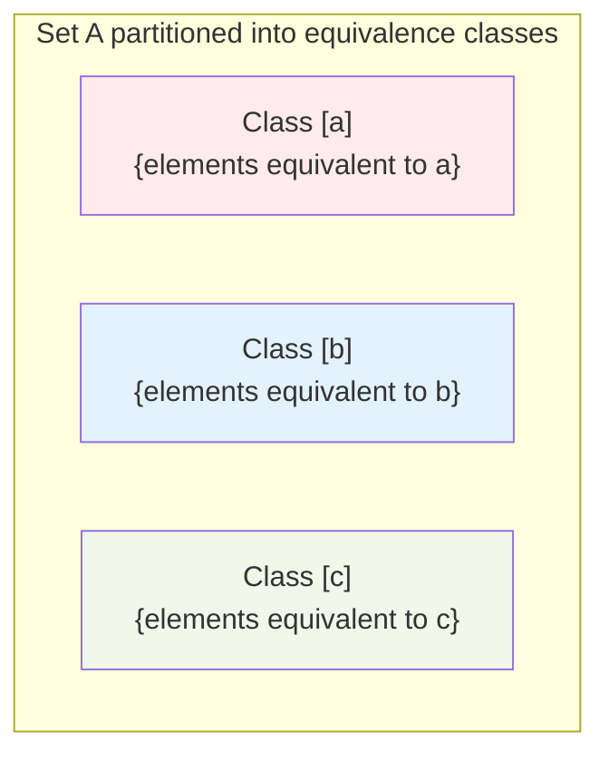
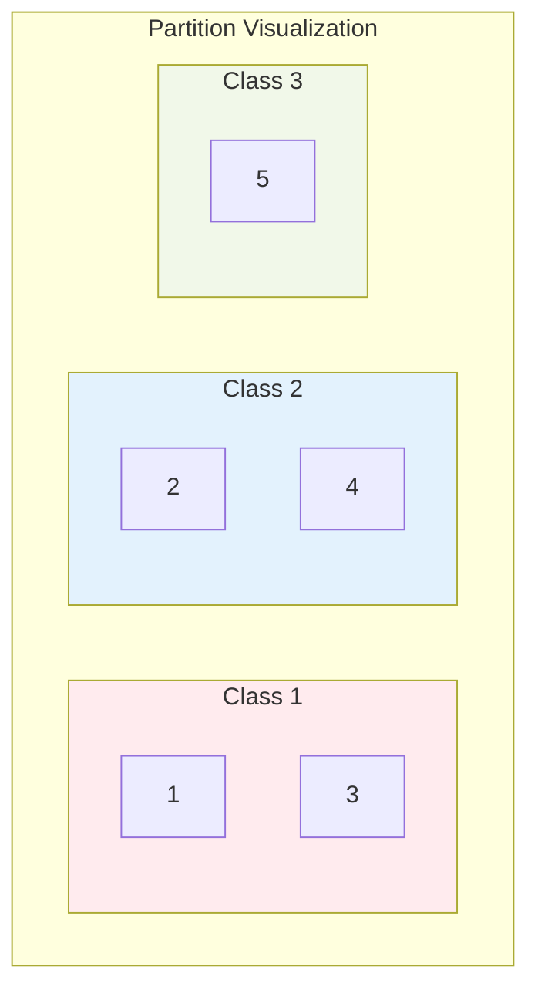

# Equivalence Relations

## Definition

An **equivalence relation** on a set $A$ is a relation that is:
- **Reflexive**: $aRa$ for all $a \in A$
- **Symmetric**: $aRb$ implies $bRa$
- **Transitive**: $aRb$ and $bRc$ implies $aRc$

Equivalence relations capture the notion of "sameness" or "equality in some respect."

Common notation: $a \sim b$ (instead of $aRb$) for equivalence relations.

## Examples

### Example 1: Equality

The relation $=$ on any set is the simplest equivalence relation.
- Reflexive: $a = a$ $\checkmark$
- Symmetric: $a = b$ implies $b = a$ $\checkmark$
- Transitive: $a = b$ and $b = c$ implies $a = c$ $\checkmark$

### Example 2: Congruence Modulo n

For integers $a$ and $b$, define $a \equiv b \pmod{n}$ if $n \mid (a - b)$.

For $n = 3$:
- $7 \equiv 1 \pmod{3}$ because $3 \mid (7 - 1) = 6$
- $10 \equiv 4 \pmod{3}$ because $3 \mid (10 - 4) = 6$
- $5 \not\equiv 9 \pmod{3}$ because $3 \nmid (5 - 9) = -4$

**Verification:**
- Reflexive: $a - a = 0$, and $n \mid 0$ $\checkmark$
- Symmetric: $n \mid (a - b)$ implies $n \mid (b - a)$ $\checkmark$
- Transitive: If $n \mid (a - b)$ and $n \mid (b - c)$, then $n \mid (a - c)$ $\checkmark$

### Example 3: Same Remainder

On ℤ, define aRb if a mod 5 = b mod 5 (same remainder when divided by 5).

Classes: {...,-5,0,5,10,...}, {...,-4,1,6,11,...}, {...,-3,2,7,12,...}, {...,-2,3,8,13,...}, {...,-1,4,9,14,...}

### Example 4: Same Absolute Value

On ℝ, define aRb if |a| = |b|.

- 3 ~ -3 (both have absolute value 3)
- 0 ~ 0

This is an equivalence relation.

### Example 5: Parallel Lines

On the set of lines in a plane, define L₁ ~ L₂ if L₁ is parallel to L₂ (including L₁ = L₂).

This is an equivalence relation.

## Equivalence Classes

Given an equivalence relation $\sim$ on $A$, the **equivalence class** of element $a$ is:

$$[a] = \{x \in A : x \sim a\}$$

All elements equivalent to $a$.

### Example

For $\equiv \pmod{3}$ on $\mathbb{Z}$:
- $[0] = \{\ldots, -6, -3, 0, 3, 6, 9, \ldots\}$
- $[1] = \{\ldots, -5, -2, 1, 4, 7, 10, \ldots\}$
- $[2] = \{\ldots, -4, -1, 2, 5, 8, 11, \ldots\}$

Note: $[0] = [3] = [6] = [-3] = \ldots$ (same class)

### Properties of Equivalence Classes

1. **Every element is in some class:** $a \in [a]$ (by reflexivity)

2. **Classes are either identical or disjoint:**
   - If $[a] \cap [b] \neq \emptyset$, then $[a] = [b]$
   - Two distinct elements either share a class or have non-overlapping classes

3. **Elements in the same class are equivalent:**
   - $x \in [a]$ if and only if $x \sim a$

## Partitions

A **partition** of set $A$ is a collection of non-empty subsets $\{A_1, A_2, \ldots\}$ such that:
1. Every element of $A$ is in exactly one $A_i$
2. The $A_i$ are pairwise disjoint: $A_i \cap A_j = \emptyset$ for $i \neq j$
3. Together they cover $A$: $\bigcup A_i = A$

### Fundamental Theorem

**Theorem:** There is a one-to-one correspondence between:
- Equivalence relations on $A$
- Partitions of $A$

**Equivalence $\to$ Partition:** The equivalence classes form a partition.

**Partition $\to$ Equivalence:** Define $a \sim b$ if $a$ and $b$ are in the same partition block.

### Example

Partition of $\{1, 2, 3, 4, 5\}$ into $\{\{1, 3\}, \{2, 4\}, \{5\}\}$

Corresponding equivalence relation:
$$R = \{(1,1), (1,3), (3,1), (3,3), (2,2), (2,4), (4,2), (4,4), (5,5)\}$$

## Quotient Set

The **quotient set** $A/\!\sim$ is the set of all equivalence classes:

$$A/\!\sim \;= \{[a] : a \in A\}$$

### Example

$\mathbb{Z}/\!\equiv_3$ (integers mod 3) $= \{[0], [1], [2]\}$

Only three distinct classes, though infinitely many integers.

### Cardinality

If $A$ is finite with equivalence relation $\sim$:
- $|A/\!\sim| =$ number of equivalence classes
- $|A| = \sum |[a]|$ over representatives

## Congruence Modulo n in Detail

For any positive integer $n$, congruence modulo $n$ ($\equiv_n$) on $\mathbb{Z}$:
- Creates exactly $n$ equivalence classes: $[0], [1], \ldots, [n-1]$
- $[k] = \{k + mn : m \in \mathbb{Z}\}$
- $\mathbb{Z}/\!\equiv_n = \{[0], [1], \ldots, [n-1]\}$

This is fundamental to modular arithmetic and cryptography.

## Finding Equivalence Classes

### Method 1: Start with an Element

1. Pick an element a
2. Find all elements equivalent to a
3. That's [a]
4. Pick an uncategorized element, repeat

### Method 2: Transitivity Chains

1. Build the transitive closure of the "immediately related" pairs
2. Group elements that end up related

### Example

$A = \{1, 2, 3, 4, 5\}$, $R$ defined by: $(1,2), (2,1), (3,4), (4,3), (5,5)$, plus reflexive pairs

Classes:
- $[1] = [2] = \{1, 2\}$
- $[3] = [4] = \{3, 4\}$
- $[5] = \{5\}$

Partition: $\{\{1, 2\}, \{3, 4\}, \{5\}\}$

## Applications

### 1. Modular Arithmetic
Integers partitioned by remainder when divided by n.

### 2. Rational Numbers
$\mathbb{Q}$ is constructed as equivalence classes of pairs $(a, b)$ where $(a, b) \sim (c, d)$ if $ad = bc$.
- $\frac{1}{2} \sim \frac{2}{4} \sim \frac{3}{6} \sim \ldots$

### 3. String Equivalence
In formal languages, strings equivalent under certain rules.

### 4. Graph Isomorphism
Graphs equivalent if one can be relabeled to match the other.

## Summary

**Equivalence relation:** Reflexive + Symmetric + Transitive

**Equivalence class $[a]$:** All elements equivalent to $a$

**Key properties:**
- Classes partition the set
- $a \sim b$ if and only if $[a] = [b]$
- $|A/\!\sim|$ counts distinct classes

**Fundamental theorem:** Equivalence relations $\leftrightarrow$ Partitions

Equivalence relations formalize "sameness in some aspect" and are essential for constructing mathematical objects like $\mathbb{Q}$ from $\mathbb{Z}$.
