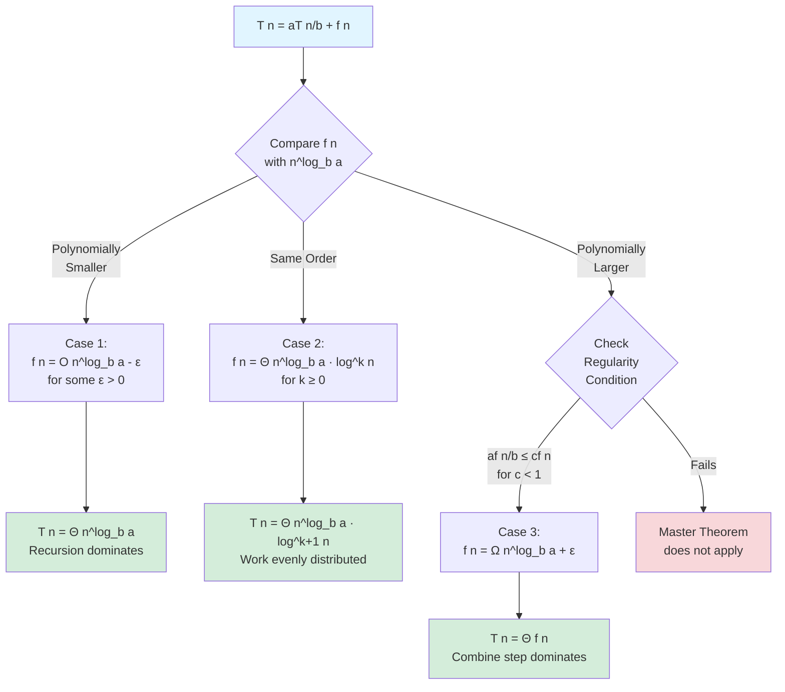
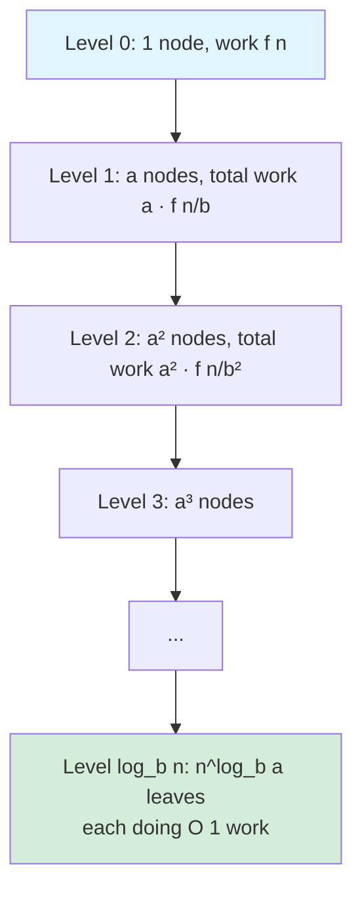

# The Master Theorem

The Master Theorem provides quick solutions to divide-and-conquer recurrences without solving them from scratch. It's essential for algorithm analysis.

## Standard Form

The Master Theorem applies to recurrences of the form:

$$T(n) = aT(n/b) + f(n)$$

Where:
- **$a \geq 1$**: Number of subproblems
- **$b > 1$**: Factor by which input size shrinks
- **$f(n)$**: Cost of dividing and combining (work outside recursive calls)

The critical comparison value is:
$$n^{\log_b a}$$

This represents the number of leaves in the recursion tree.

## The Three Cases

Compare $f(n)$ with $n^{\log_b a}$:

### Case 1: f(n) is Polynomially Smaller

If $f(n) = O(n^{\log_b a - \varepsilon})$ for some $\varepsilon > 0$:

$$T(n) = \Theta(n^{\log_b a})$$

The recursion dominates. Work is concentrated in leaves.

### Case 2: f(n) Matches

If $f(n) = \Theta(n^{\log_b a} \cdot \log^k n)$ for $k \geq 0$:

$$T(n) = \Theta(n^{\log_b a} \cdot \log^{k+1} n)$$

Work is evenly distributed across all levels.

### Case 3: f(n) is Polynomially Larger

If $f(n) = \Omega(n^{\log_b a + \varepsilon})$ for some $\varepsilon > 0$, and $af(n/b) \leq cf(n)$ for $c < 1$:

$$T(n) = \Theta(f(n))$$

The combine step dominates. Work is concentrated at root.

## Key Value: $n^{\log_b a}$

This represents the number of leaves in the recursion tree.

- **$a$** subproblems per level
- **$\log_b n$** levels (since size $n \to n/b \to n/b^2 \to \cdots \to 1$)
- Total leaves: $a^{\log_b n} = n^{\log_b a}$

## Examples

### Binary Search: $T(n) = T(n/2) + O(1)$

- $a = 1, b = 2, f(n) = O(1)$
- $n^{\log_2 1} = n^0 = 1$
- $f(n) = \Theta(1)$ matches $n^{\log_b a}$ with $k = 0$

**Case 2**: $T(n) = \Theta(\log n)$

### Merge Sort: $T(n) = 2T(n/2) + O(n)$

- $a = 2, b = 2, f(n) = O(n)$
- $n^{\log_2 2} = n^1 = n$
- $f(n) = \Theta(n)$ matches with $k = 0$

**Case 2**: $T(n) = \Theta(n \log n)$

### Matrix Multiplication (Naive): T(n) = 8T(n/2) + O(n²)

- a = 8, b = 2, f(n) = O(n²)
- n^(log_2(8)) = n³
- f(n) = O(n²) = O(n^(3-1)), polynomially smaller

**Case 1**: T(n) = Θ(n³)

### Strassen's Algorithm: T(n) = 7T(n/2) + O(n²)

- a = 7, b = 2, f(n) = O(n²)
- n^(log_2(7)) ≈ n^2.807
- f(n) = O(n²), polynomially smaller

**Case 1**: T(n) = Θ(n^(log_2(7))) ≈ Θ(n^2.807)

### Karatsuba Multiplication: T(n) = 3T(n/2) + O(n)

- a = 3, b = 2, f(n) = O(n)
- n^(log_2(3)) ≈ n^1.585
- f(n) = O(n), polynomially smaller

**Case 1**: T(n) = Θ(n^(log_2(3))) ≈ Θ(n^1.585)

### Case 3 Example: T(n) = 2T(n/2) + n²

- a = 2, b = 2, f(n) = n²
- n^(log_2(2)) = n
- f(n) = n² = Ω(n^(1+1)), polynomially larger
- Regularity: 2(n/2)² = n²/2 ≤ (1/2)n² ✓

**Case 3**: T(n) = Θ(n²)

## The Regularity Condition

Case 3 requires af(n/b) ≤ cf(n) for some c < 1.

This ensures f(n) doesn't decrease too rapidly as n grows.

For polynomials f(n) = nᵏ with k > log_b(a), regularity holds:
a(n/b)ᵏ = (a/bᵏ)nᵏ = (a/bᵏ)f(n), and a/bᵏ < 1 when k > log_b(a).

## When Master Theorem Doesn't Apply

**Gap between cases**: f(n) = n log n with a = 2, b = 2

n^(log_2(2)) = n. Here f(n) = n log n is larger than n but not polynomially larger (n log n ≠ Ω(n^(1+ε)) for any ε > 0).

Falls between Case 2 and Case 3 → Master Theorem doesn't apply directly.

**Non-polynomial comparison**: f(n) = n/log n doesn't fit the polynomial framework.

**Unequal subproblems**: T(n) = T(n/3) + T(2n/3) + n doesn't have the aT(n/b) form.

## Extended Master Theorem

For f(n) = Θ(n^(log_b(a)) · log^k(n)):

| k | T(n) |
|---|------|
| k > -1 | Θ(n^(log_b(a)) · log^(k+1)(n)) |
| k = -1 | Θ(n^(log_b(a)) · log log n) |
| k < -1 | Θ(n^(log_b(a))) |

This handles more cases in the "gap" around Case 2.

## Quick Reference

| Algorithm | Recurrence | Master Case | Complexity |
|-----------|------------|-------------|------------|
| Binary search | T(n) = T(n/2) + 1 | Case 2 | Θ(log n) |
| Linear scan | T(n) = T(n/2) + n | Case 3 | Θ(n) |
| Merge sort | T(n) = 2T(n/2) + n | Case 2 | Θ(n log n) |
| Tree traversal | T(n) = 2T(n/2) + 1 | Case 1 | Θ(n) |
| Strassen | T(n) = 7T(n/2) + n² | Case 1 | Θ(n^2.807) |

## Problem-Solving Strategy

1. Identify a, b, and f(n)
2. Compute n^(log_b(a))
3. Compare f(n) with n^(log_b(a)):
   - Polynomially smaller? → Case 1
   - Same up to log factors? → Case 2
   - Polynomially larger? → Check regularity, then Case 3
4. Apply the appropriate formula

## Connection to Recursion Trees

The Master Theorem follows from analyzing recursion trees:
- Tree has log_b(n) levels
- Level i has aⁱ nodes, each doing f(n/bⁱ) work
- Sum over all levels determines which term dominates
