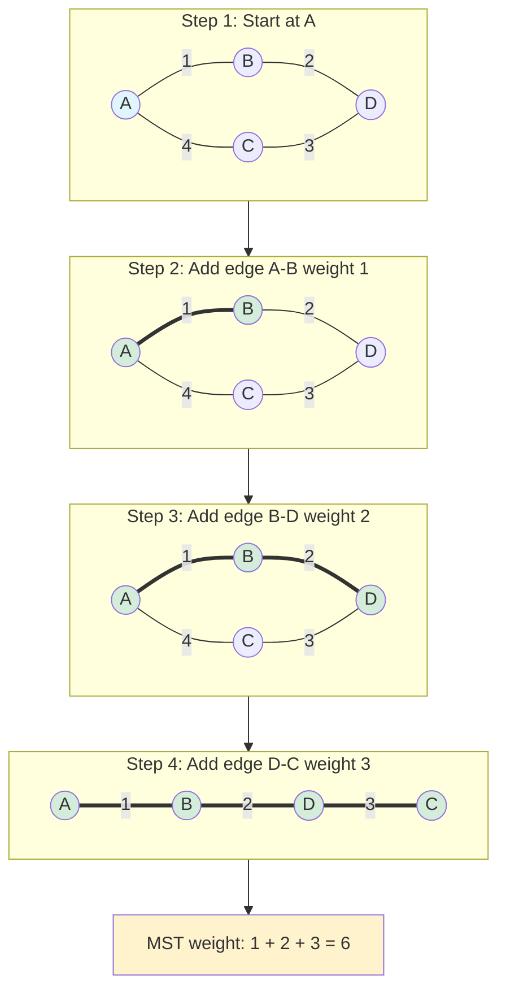
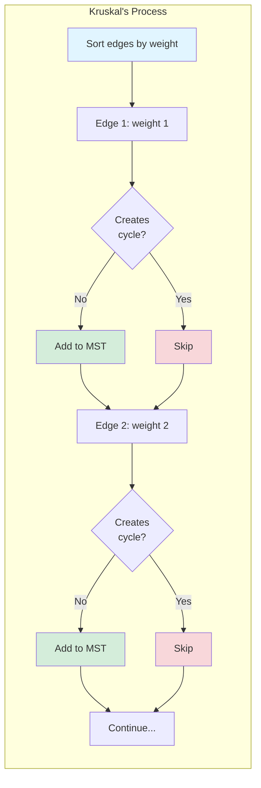

# Minimum Spanning Trees

A minimum spanning tree (MST) connects all vertices in a weighted graph with minimum total edge weight. MST algorithms are fundamental to network design and optimization.

## Definition and Properties

### Spanning Tree

A **spanning tree** of graph G is a subgraph that:
- Contains all vertices of G
- Is a tree (connected, acyclic)
- Has exactly n-1 edges for n vertices

### Minimum Spanning Tree

The **MST** is a spanning tree with minimum total edge weight.

**Key Properties:**
- MST may not be unique (ties in weights)
- All MSTs have the same total weight
- Adding any edge creates exactly one cycle
- Removing any edge disconnects the tree

## Cut Property

**Theorem:** For any cut (partition of vertices into two sets), the minimum weight edge crossing the cut is in some MST.

**Proof:** Assume edge e is minimum crossing cut but not in MST T. Add e to T, creating a cycle. This cycle must cross the cut elsewhere (by some edge f). Since w(e) ≤ w(f), replacing f with e gives a tree with weight ≤ T's weight. So e is in some MST.

## Prim's Algorithm

Build MST by growing from one vertex, always adding the minimum weight edge that connects to a new vertex.

### Visual Example



### Algorithm Implementation

```python
def prim(graph, start):
    """
    Prim's MST algorithm.
    graph: adjacency list with (neighbor, weight) pairs
    Returns: list of edges in MST
    """
    import heapq

    n = len(graph)
    visited = set([start])
    mst_edges = []

    # Priority queue: (weight, from_vertex, to_vertex)
    edges = []
    for neighbor, weight in graph[start]:
        heapq.heappush(edges, (weight, start, neighbor))

    while len(visited) < n and edges:
        weight, u, v = heapq.heappop(edges)

        if v in visited:
            continue

        visited.add(v)
        mst_edges.append((u, v, weight))

        for neighbor, w in graph[v]:
            if neighbor not in visited:
                heapq.heappush(edges, (w, v, neighbor))

    return mst_edges
```

**Complexity:** $O((V + E) \log V)$ with binary heap

**Correctness:** Each added edge is minimum crossing the cut between visited and unvisited vertices.

**Space complexity:** $O(V)$ for visited set and priority queue

## Kruskal's Algorithm

Build MST by considering edges in order of increasing weight, adding those that don't create cycles.

### Visual Process



**Union-Find** data structure efficiently detects cycles in $O(\alpha(n))$ amortized time.

### Algorithm Implementation

```python
def kruskal(n, edges):
    """
    Kruskal's MST algorithm.
    n: number of vertices
    edges: list of (u, v, weight)
    Returns: list of edges in MST
    """
    # Sort edges by weight
    edges = sorted(edges, key=lambda x: x[2])

    # Union-Find for cycle detection
    parent = list(range(n))
    rank = [0] * n

    def find(x):
        if parent[x] != x:
            parent[x] = find(parent[x])  # Path compression
        return parent[x]

    def union(x, y):
        px, py = find(x), find(y)
        if px == py:
            return False  # Already connected
        if rank[px] < rank[py]:
            px, py = py, px
        parent[py] = px
        if rank[px] == rank[py]:
            rank[px] += 1
        return True

    mst_edges = []
    for u, v, weight in edges:
        if union(u, v):
            mst_edges.append((u, v, weight))
            if len(mst_edges) == n - 1:
                break

    return mst_edges
```

**Complexity:** $O(E \log E)$ for sorting, which dominates the Union-Find operations

**Correctness:** By cut property, minimum edge crossing any cut is safe to add.

**Space complexity:** $O(V)$ for Union-Find structure

## Comparison of Algorithms

| Aspect | Prim's | Kruskal's |
|--------|--------|-----------|
| Strategy | Grow from vertex | Add edges globally |
| Best for | Dense graphs | Sparse graphs |
| Data structure | Priority queue | Union-Find |
| Complexity | O((V+E) log V) | O(E log E) |
| Parallelization | Harder | Easier |

## Boruvka's Algorithm

A parallel-friendly MST algorithm:

1. Each vertex is its own component
2. Each component adds its minimum outgoing edge
3. Merge components connected by added edges
4. Repeat until one component remains

**Complexity:** O(E log V) with O(log V) rounds

**Advantage:** Each round can be parallelized.

## Applications

### Network Design

**Problem:** Connect n cities with minimum total cable length.

**Solution:** Cities are vertices, possible connections are edges with length as weight. Find MST.

### Clustering

**Single-Linkage Clustering:**
1. Build MST
2. Remove k-1 heaviest edges
3. Get k clusters (connected components)

This minimizes the maximum inter-cluster distance.

### Approximation Algorithms

**Traveling Salesman (metric case):**
1. Find MST
2. Double edges to form Eulerian graph
3. Find Eulerian tour
4. Shortcut repeated vertices

This gives a 2-approximation to optimal TSP tour.

## Second-Best MST

**Problem:** Find the spanning tree with second-minimum total weight.

**Solution:**
1. Find MST T
2. For each non-MST edge (u,v):
   - Adding (u,v) creates a cycle
   - Remove the maximum edge on path u to v in T
   - Compute new total weight
3. Return tree with minimum new weight

**Complexity:** O(V² + E log E) with preprocessing

## Steiner Tree Problem

**Problem:** Find minimum weight tree connecting a subset of vertices (terminals).

- May include non-terminal (Steiner) vertices
- NP-hard in general
- MST on terminals gives 2-approximation

## Dynamic MST

When edges are added/deleted:

**Link-Cut Trees:** Support operations in O(log n) time:
- Add/remove edge
- Query path weight
- Find minimum edge on path

## Parallel MST Algorithms

For large graphs:

- **Boruvka:** O(log V) rounds, O(E) work per round
- **Filter-Kruskal:** Partition edges, process in parallel
- **Randomized:** O(E) expected work, O(log V) depth

## Weighted vs Unweighted

**Unweighted MST:**
- All spanning trees are minimum (have n-1 edges)
- BFS/DFS gives a spanning tree

**Unique MST Condition:**
- If all edge weights are distinct, MST is unique
- Proof: Kruskal's choices are deterministic with distinct weights

## Practice Problems

1. **Prove:** In a graph with distinct edge weights, the MST is unique.

2. **Find:** MST of the complete graph K_4 with edges of weight 1,2,3,4,5,6.

3. **Analyze:** Running time of Prim's with adjacency matrix (no heap).

4. **Design:** Algorithm to determine if graph has unique MST.

## Summary

Minimum spanning trees:
- Connect all vertices with minimum total weight
- Cut property guarantees correctness of greedy algorithms
- Prim's: grow from vertex, O((V+E) log V)
- Kruskal's: add edges by weight, O(E log E)
- Applications in network design, clustering, approximation algorithms
