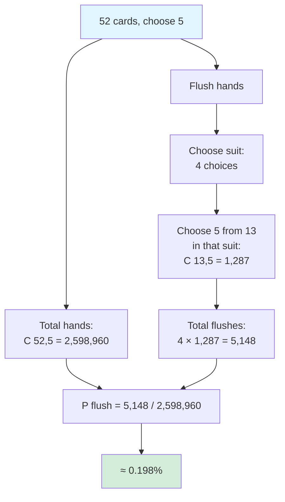
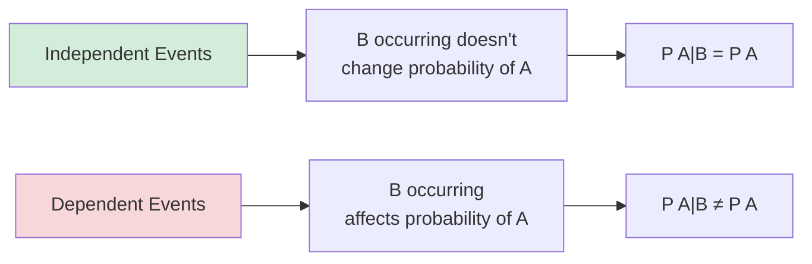

# Probability Foundations

Probability provides a mathematical framework for reasoning about uncertainty. This foundation connects discrete mathematics to statistics and randomized algorithms.

## Sample Spaces and Events

**Sample space** S: Set of all possible outcomes of an experiment.

**Event**: A subset of the sample space.

### Examples

**Coin flip**: S = {H, T}

**Two dice**: S = {(1,1), (1,2), ..., (6,6)}, |S| = 36

**Card draw**: S = 52 cards

### Event Operations

- **Complement**: Ā = S - A (not A)
- **Union**: A ∪ B (A or B or both)
- **Intersection**: A ∩ B (both A and B)
- **Difference**: A - B = A ∩ B̄

## Probability Axioms

A probability function P assigns to each event A a number P(A) satisfying:

1. **Non-negativity**: P(A) ≥ 0
2. **Normalization**: P(S) = 1
3. **Additivity**: If A ∩ B = ∅, then P(A ∪ B) = P(A) + P(B)

### Consequences

- P(∅) = 0
- P(Ā) = 1 - P(A)
- P(A ∪ B) = P(A) + P(B) - P(A ∩ B)
- If A ⊆ B, then P(A) ≤ P(B)

## Equally Likely Outcomes

When all outcomes are equally likely:

$$P(A) = \frac{|A|}{|S|}$$

This connects probability to combinatorics.

### Example: Poker Hands

What's the probability of being dealt a flush (5 cards same suit)?

- Total hands: $\binom{52}{5} = 2,598,960$
- Flush hands: $4 \times \binom{13}{5} = 4 \times 1287 = 5,148$

$$P(\text{flush}) = \frac{5,148}{2,598,960} \approx 0.00198$$

**Calculation breakdown:**


## Conditional Probability

**$P(A|B)$**: Probability of $A$ given that $B$ occurred.

$$P(A|B) = \frac{P(A \cap B)}{P(B)} \quad \text{when } P(B) > 0$$

### Example: Card Drawing

Draw 2 cards. $P(\text{second is ace} | \text{first is ace})$?

$$P(A_2|A_1) = \frac{P(\text{both aces})}{P(\text{first ace})} = \frac{\frac{4}{52} \times \frac{3}{51}}{\frac{4}{52}} = \frac{3}{51} \approx 0.059$$

### Chain Rule

$$P(A_1 \cap A_2 \cap \cdots \cap A_n) = P(A_1) \cdot P(A_2|A_1) \cdot P(A_3|A_1 \cap A_2) \cdots$$

## Independence

Events $A$ and $B$ are **independent** if:

$$P(A \cap B) = P(A) \cdot P(B)$$

Equivalently: $P(A|B) = P(A)$ and $P(B|A) = P(B)$.

**Visual intuition:**


### Mutual Independence

Events $A_1, \ldots, A_n$ are mutually independent if for every subset:

$$P\left(\bigcap_{i \in S} A_i\right) = \prod_{i \in S} P(A_i)$$

**Warning**: Pairwise independence $\not\Rightarrow$ mutual independence.

## Bayes' Theorem

$$P(A|B) = \frac{P(B|A) \cdot P(A)}{P(B)}$$

### Extended Form

If $B_1, \ldots, B_n$ partition $S$:

$$P(B_i|A) = \frac{P(A|B_i) \cdot P(B_i)}{\sum_{j=1}^{n} P(A|B_j) \cdot P(B_j)}$$

### Example: Medical Testing

Disease prevalence: 1% (P(D) = 0.01)
Test sensitivity: 99% (P(+|D) = 0.99)
Test specificity: 95% (P(-|D̄) = 0.95)

If test is positive, P(have disease)?

P(D|+) = P(+|D) × P(D) / [P(+|D) × P(D) + P(+|D̄) × P(D̄)]
       = (0.99 × 0.01) / (0.99 × 0.01 + 0.05 × 0.99)
       = 0.0099 / (0.0099 + 0.0495)
       ≈ 0.167

Despite 99% sensitivity, only 16.7% chance of disease given positive test (due to low prevalence).

## Law of Total Probability

If B₁, ..., Bₙ partition S:

```
P(A) = Σᵢ P(A|Bᵢ) × P(Bᵢ)
```

## Random Variables

A **random variable** X is a function from S to real numbers.

**Discrete**: Takes countable values (integers, etc.)

**Continuous**: Takes values in an interval

### Probability Mass Function (PMF)

For discrete X:
```
pₓ(x) = P(X = x)
```

Requirements:
- pₓ(x) ≥ 0
- Σₓ pₓ(x) = 1

## Expected Value

**Definition**:
```
E[X] = Σₓ x × P(X = x)
```

### Properties

1. **Linearity**: E[aX + b] = aE[X] + b
2. **Sum**: E[X + Y] = E[X] + E[Y] (always!)
3. **Product**: E[XY] = E[X] × E[Y] (if independent)

### Indicator Variables

For event A, define Iₐ = 1 if A occurs, 0 otherwise.

E[Iₐ] = P(A)

**Powerful technique**: Break complex counts into indicators.

### Example: Expected Hat Matches

n people randomly pick from n hats. Expected number getting own hat?

X = Σᵢ Iᵢ where Iᵢ = 1 if person i gets own hat.

E[X] = Σᵢ E[Iᵢ] = Σᵢ P(person i gets own hat) = n × (1/n) = 1

## Variance

```
Var(X) = E[(X - E[X])²] = E[X²] - (E[X])²
```

**Standard deviation**: σ = √Var(X)

### Properties

- Var(aX + b) = a²Var(X)
- Var(X + Y) = Var(X) + Var(Y) if X,Y independent

## Common Distributions

| Distribution | PMF | E[X] | Var(X) |
|--------------|-----|------|--------|
| Bernoulli(p) | p, 1-p | p | p(1-p) |
| Binomial(n,p) | C(n,k)pᵏ(1-p)ⁿ⁻ᵏ | np | np(1-p) |
| Geometric(p) | p(1-p)ᵏ⁻¹ | 1/p | (1-p)/p² |
| Poisson(λ) | e⁻λλᵏ/k! | λ | λ |

## Applications to Algorithm Analysis

**Randomized algorithms**: Analyze expected running time using linearity of expectation.

**Hash tables**: Expected collisions via birthday paradox analysis.

**Randomized quicksort**: Expected O(n log n) comparisons using indicator variables.
