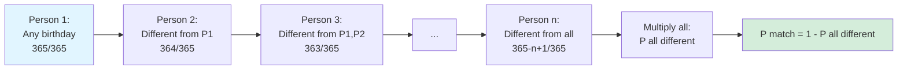

# Conditional Probability

Conditional probability quantifies how the probability of an event changes when we have additional information. This concept is fundamental to probabilistic reasoning and Bayesian inference.

## Definition

### Conditional Probability

The **conditional probability** of A given B is:

$$P(A|B) = \frac{P(A \cap B)}{P(B)}$$

provided P(B) > 0.

**Interpretation:** The fraction of outcomes in B that are also in A.

### Example

Roll a fair die. Let A = {even} and B = {> 3}.

- A = {2, 4, 6}, P(A) = 1/2
- B = {4, 5, 6}, P(B) = 1/2
- A ∩ B = {4, 6}, P(A ∩ B) = 1/3

P(A|B) = (1/3)/(1/2) = 2/3

Given the die shows > 3, the probability of even increases from 1/2 to 2/3.

## The Multiplication Rule

Rearranging the definition:

$$P(A \cap B) = P(A|B) \cdot P(B) = P(B|A) \cdot P(A)$$

### Chain Rule

For multiple events:
$$P(A \cap B \cap C) = P(A) \cdot P(B|A) \cdot P(C|A \cap B)$$

General form:
$$P(A_1 \cap \cdots \cap A_n) = P(A_1) \cdot P(A_2|A_1) \cdot P(A_3|A_1 \cap A_2) \cdots$$

## Bayes' Theorem

### Statement

$$P(A|B) = \frac{P(B|A) \cdot P(A)}{P(B)}$$

**Components:**
- P(A): **Prior** probability of A
- P(A|B): **Posterior** probability of A given B
- P(B|A): **Likelihood** of B given A
- P(B): **Evidence** (normalizing constant)

### Extended Form

Using law of total probability:
$$P(A|B) = \frac{P(B|A) \cdot P(A)}{P(B|A) \cdot P(A) + P(B|A^c) \cdot P(A^c)}$$

### Medical Testing Example

**Scenario:**
- Disease prevalence: $P(D) = 0.01$
- Test sensitivity: $P(+|D) = 0.99$ (true positive rate)
- Test specificity: $P(-|D^c) = 0.95$ (true negative rate)

**Probability tree:**
```mermaid
graph LR
    Start[Population] -->|P D = 0.01| D[Has Disease]
    Start -->|P D^c = 0.99| ND[No Disease]

    D -->|P +|D = 0.99| TP[Test +<br/>P = 0.01 × 0.99<br/>= 0.0099]
    D -->|P -|D = 0.01| FN[Test -<br/>P = 0.01 × 0.01<br/>= 0.0001]

    ND -->|P +|D^c = 0.05| FP[Test +<br/>P = 0.99 × 0.05<br/>= 0.0495]
    ND -->|P -|D^c = 0.95| TN[Test -<br/>P = 0.99 × 0.95<br/>= 0.9405]

    style Start fill:#e1f5ff
    style TP fill:#d4edda
    style FP fill:#f8d7da
    style TN fill:#d4edda
    style FN fill:#f8d7da
```

**Question:** If test is positive, what's $P(D|+)$?

$$P(D|+) = \frac{P(+|D) \cdot P(D)}{P(+|D) \cdot P(D) + P(+|D^c) \cdot P(D^c)}$$

$$= \frac{0.99 \times 0.01}{0.99 \times 0.01 + 0.05 \times 0.99} = \frac{0.0099}{0.0099 + 0.0495} \approx 0.167$$

Even with positive test, probability of disease is only about 17%!

## Law of Total Probability

### Statement

If B₁, B₂, ..., Bₙ partition the sample space:
$$P(A) = \sum_{i=1}^{n} P(A|B_i) \cdot P(B_i)$$

### Example: Two Urns

Urn 1: 3 red, 2 blue balls
Urn 2: 1 red, 4 blue balls

Choose an urn uniformly at random, then draw a ball.

**Probability tree:**
```mermaid
graph LR
    Start[Choose Urn] -->|P Urn1 = 1/2| U1[Urn 1]
    Start -->|P Urn2 = 1/2| U2[Urn 2]

    U1 -->|P R|U1 = 3/5| R1[Red<br/>P = 1/2 × 3/5 = 3/10]
    U1 -->|P B|U1 = 2/5| B1[Blue<br/>P = 1/2 × 2/5 = 2/10]

    U2 -->|P R|U2 = 1/5| R2[Red<br/>P = 1/2 × 1/5 = 1/10]
    U2 -->|P B|U2 = 4/5| B2[Blue<br/>P = 1/2 × 4/5 = 4/10]

    style Start fill:#e1f5ff
    style R1 fill:#ffcccc
    style R2 fill:#ffcccc
    style B1 fill:#cce5ff
    style B2 fill:#cce5ff
```

$$P(\text{Red}) = P(\text{Red}|\text{Urn1}) \cdot P(\text{Urn1}) + P(\text{Red}|\text{Urn2}) \cdot P(\text{Urn2})$$

$$= \frac{3}{5} \cdot \frac{1}{2} + \frac{1}{5} \cdot \frac{1}{2} = \frac{3}{10} + \frac{1}{10} = \frac{2}{5}$$

## Independence

### Definition

Events A and B are **independent** if:
$$P(A \cap B) = P(A) \cdot P(B)$$

Equivalently: P(A|B) = P(A) (B provides no information about A).

### Testing Independence

Check if P(A ∩ B) = P(A) · P(B).

**Warning:** Independence is NOT the same as mutual exclusivity!
- Mutually exclusive: P(A ∩ B) = 0
- Independent: P(A ∩ B) = P(A)·P(B)

### Mutual Independence

Events A₁, ..., Aₙ are **mutually independent** if for every subset S:
$$P\left(\bigcap_{i \in S} A_i\right) = \prod_{i \in S} P(A_i)$$

**Note:** Pairwise independence doesn't imply mutual independence.

## Conditional Independence

### Definition

A and B are **conditionally independent** given C if:
$$P(A \cap B | C) = P(A|C) \cdot P(B|C)$$

### Importance

Conditional independence is central to:
- Bayesian networks
- Naive Bayes classifiers
- Hidden Markov models

## The Birthday Problem

**Problem:** In a room of $n$ people, what's the probability that at least two share a birthday?

**Approach:** Compute complement (all different birthdays).

$$P(\text{all different}) = \frac{365}{365} \cdot \frac{364}{365} \cdot \frac{363}{365} \cdots \frac{365-n+1}{365}$$

$$= \prod_{k=0}^{n-1} \left(1 - \frac{k}{365}\right)$$

**Sequential calculation:**


**Results:**
- $n = 23$: $P(\text{match}) \approx 0.507$ (just over 50%!)
- $n = 50$: $P(\text{match}) \approx 0.970$

## Simpson's Paradox

### Phenomenon

A trend in aggregated data can reverse in each subgroup.

### Example

**Treatment success rates:**

| | Drug A | Drug B |
|---|--------|--------|
| Men | 80/100 (80%) | 180/200 (90%) |
| Women | 90/200 (45%) | 10/100 (10%) |
| **Total** | 170/300 (57%) | 190/300 (63%) |

Drug B looks better overall, but Drug A is better for both men and women!

**Explanation:** Confounding variable (gender distribution) affects interpretation.

## Applications

### Spam Filtering (Naive Bayes)

P(spam|words) ∝ P(words|spam) · P(spam)

Assume words conditionally independent given spam/not-spam:
$$P(\text{spam}|w_1, \ldots, w_n) \propto P(\text{spam}) \prod_{i=1}^{n} P(w_i|\text{spam})$$

### Diagnostic Reasoning

Medical diagnosis chains conditional probabilities:
$$P(\text{disease}|\text{symptoms}) = \frac{P(\text{symptoms}|\text{disease}) \cdot P(\text{disease})}{P(\text{symptoms})}$$

## Practice Problems

1. **Dice:** Two fair dice are rolled. Given sum is 8, what's P(at least one 6)?

2. **Cards:** Draw 2 cards without replacement. Given first is red, what's P(second is red)?

3. **Bayes:** 1% of population has condition X. Test has 90% sensitivity and 95% specificity. Find P(X|negative test).

4. **Independence:** Events A, B, C have P(A)=0.5, P(B)=0.4, P(C)=0.3. If mutually independent, find P(exactly one occurs).

## Summary

Conditional probability:
- P(A|B) = P(A∩B)/P(B) quantifies updated belief
- Multiplication rule: P(A∩B) = P(A|B)·P(B)
- Bayes' theorem: inverts conditional probabilities
- Law of total probability: marginalizes over partition
- Independence: events don't affect each other's probabilities
- Watch for counterintuitive results (medical tests, Simpson's paradox)
