# Bayes' Theorem

## Introduction

Bayes' theorem is one of the most powerful and widely used results in probability and statistics. It provides a systematic way to update our beliefs in light of new evidence, allowing us to reverse conditional probabilities. Named after Reverend Thomas Bayes (1701-1761), this theorem is fundamental to statistical inference, machine learning, medical diagnosis, spam filtering, and countless other applications.

## Bayes' Theorem

### Simple Form

For events $A$ and $B$ with $P(B) > 0$ and $P(A) > 0$:

$$P(A|B) = \frac{P(B|A) \cdot P(A)}{P(B)}$$

### Derivation

Starting from the multiplication rule:
$$P(A \cap B) = P(A) \cdot P(B|A) = P(B) \cdot P(A|B)$$

Solving for $P(A|B)$:
$$P(A|B) = \frac{P(A) \cdot P(B|A)}{P(B)}$$

## Terminology

- **$P(A)$**: **Prior probability** - our initial belief about $A$ before observing $B$
- **$P(A|B)$**: **Posterior probability** - our updated belief about $A$ after observing $B$
- **$P(B|A)$**: **Likelihood** - the probability of observing $B$ given that $A$ is true
- **$P(B)$**: **Marginal probability** or **evidence** - the total probability of observing $B$

## Extended Form with Law of Total Probability

If $A_1, A_2, \ldots, A_n$ form a partition of the sample space, then:

$$P(A_i|B) = \frac{P(B|A_i) \cdot P(A_i)}{\sum_{j=1}^{n} P(B|A_j) \cdot P(A_j)}$$

The denominator uses the law of total probability to compute $P(B)$.

## Simple Examples

### Example 1: Medical Testing

**Problem**: A disease affects 1% of the population. A test for the disease has:
- Sensitivity (true positive rate): $P(\text{positive}|\text{disease}) = 0.95$
- Specificity (true negative rate): $P(\text{negative}|\text{no disease}) = 0.90$

If a person tests positive, what is the probability they actually have the disease?

**Solution**:
Let $D$ = has disease, $T$ = tests positive.

Given:
- $P(D) = 0.01$ (prior)
- $P(T|D) = 0.95$ (likelihood)
- $P(T^c|D^c) = 0.90$, so $P(T|D^c) = 0.10$

Using Bayes' theorem:
$$P(D|T) = \frac{P(T|D) \cdot P(D)}{P(T)}$$

First, find $P(T)$ using the law of total probability:
$$P(T) = P(T|D) \cdot P(D) + P(T|D^c) \cdot P(D^c)$$
$$= 0.95 \times 0.01 + 0.10 \times 0.99 = 0.0095 + 0.099 = 0.1085$$

Now apply Bayes' theorem:
$$P(D|T) = \frac{0.95 \times 0.01}{0.1085} = \frac{0.0095}{0.1085} \approx 0.0876$$

**Interpretation**: Even with a positive test, there's only about 8.76% chance of having the disease! This counterintuitive result occurs because the disease is rare (low prior) and the test has a significant false positive rate.

### Example 2: Spam Filtering

**Problem**:
- 60% of emails are spam
- Word "FREE" appears in 80% of spam emails
- Word "FREE" appears in 10% of legitimate emails

If an email contains "FREE", what is the probability it's spam?

**Solution**:
Let $S$ = spam, $F$ = contains "FREE".

Given:
- $P(S) = 0.60$, $P(S^c) = 0.40$
- $P(F|S) = 0.80$
- $P(F|S^c) = 0.10$

$$P(S|F) = \frac{P(F|S) \cdot P(S)}{P(F|S) \cdot P(S) + P(F|S^c) \cdot P(S^c)}$$
$$= \frac{0.80 \times 0.60}{0.80 \times 0.60 + 0.10 \times 0.40} = \frac{0.48}{0.48 + 0.04} = \frac{0.48}{0.52} \approx 0.923$$

There's approximately 92.3% chance the email is spam.

## Extended Example: Multiple Hypotheses

### Example 3: Manufacturing Plants

**Problem**: A company has three plants producing the same product:
- Plant A: 40% of production, 2% defective rate
- Plant B: 35% of production, 3% defective rate
- Plant C: 25% of production, 5% defective rate

A randomly selected item is found to be defective. What is the probability it came from each plant?

**Solution**:
Let $D$ = defective, $A, B, C$ = from respective plants.

Given priors:
- $P(A) = 0.40$, $P(B) = 0.35$, $P(C) = 0.25$

Likelihoods:
- $P(D|A) = 0.02$, $P(D|B) = 0.03$, $P(D|C) = 0.05$

First, find $P(D)$:
$$P(D) = P(D|A) \cdot P(A) + P(D|B) \cdot P(B) + P(D|C) \cdot P(C)$$
$$= 0.02 \times 0.40 + 0.03 \times 0.35 + 0.05 \times 0.25$$
$$= 0.008 + 0.0105 + 0.0125 = 0.031$$

Now apply Bayes' theorem for each plant:

$$P(A|D) = \frac{P(D|A) \cdot P(A)}{P(D)} = \frac{0.02 \times 0.40}{0.031} = \frac{0.008}{0.031} \approx 0.258$$

$$P(B|D) = \frac{P(D|B) \cdot P(B)}{P(D)} = \frac{0.03 \times 0.35}{0.031} = \frac{0.0105}{0.031} \approx 0.339$$

$$P(C|D) = \frac{P(D|C) \cdot P(C)}{P(D)} = \frac{0.05 \times 0.25}{0.031} = \frac{0.0125}{0.031} \approx 0.403$$

**Interpretation**: Despite Plant A producing the most items (40%), the defective item is most likely from Plant C (40.3% posterior probability) because Plant C has the highest defect rate.

## Bayesian Updating

Bayes' theorem allows us to update probabilities as we receive new information. The posterior from one observation becomes the prior for the next.

```mermaid
graph LR
    subgraph Initial["Initial State"]
        Prior["Prior Belief<br/>P&#40;A&#41;"]
    end

    subgraph Evidence["New Evidence"]
        B["Observe B<br/>Event occurs"]
        Likelihood["Likelihood<br/>P&#40;B|A&#41;"]
    end

    subgraph Update["Bayesian Update"]
        Bayes["Apply Bayes' Theorem<br/>P&#40;A|B&#41; = P&#40;B|A&#41;·P&#40;A&#41;/P&#40;B&#41;"]
    end

    subgraph Result["Updated State"]
        Posterior["Posterior Belief<br/>P&#40;A|B&#41;"]
    end

    Prior --> Bayes
    Likelihood --> Bayes
    B --> Bayes
    Bayes --> Posterior
    Posterior -.Next round.-> Prior

    style Prior fill:#e1f5ff
    style Likelihood fill:#fff3e0
    style Bayes fill:#f3e5f5
    style Posterior fill:#e8f5e9
```

### Example 4: Sequential Testing

**Problem**: Using the disease test from Example 1:
- Initial prior: $P(D) = 0.01$
- After first positive test: $P(D|T_1) \approx 0.0876$

If the person is tested again (independently) and tests positive again, what is the updated probability?

**Solution**:
The posterior from the first test becomes the new prior:
- New prior: $P(D) = 0.0876$
- Likelihood: $P(T_2|D) = 0.95$, $P(T_2|D^c) = 0.10$

$$P(D|T_2) = \frac{P(T_2|D) \cdot P(D)}{P(T_2|D) \cdot P(D) + P(T_2|D^c) \cdot P(D^c)}$$
$$= \frac{0.95 \times 0.0876}{0.95 \times 0.0876 + 0.10 \times 0.9124}$$
$$= \frac{0.08322}{0.08322 + 0.09124} = \frac{0.08322}{0.17446} \approx 0.477$$

After two positive tests, the probability of disease is about 47.7%.

## The Odds Form of Bayes' Theorem

Define the **odds** of event $A$ as:
$$\text{Odds}(A) = \frac{P(A)}{P(A^c)} = \frac{P(A)}{1-P(A)}$$

Bayes' theorem can be written in odds form:
$$\frac{P(A|B)}{P(A^c|B)} = \frac{P(B|A)}{P(B|A^c)} \cdot \frac{P(A)}{P(A^c)}$$

Or more concisely:
$$\text{Posterior Odds} = \text{Likelihood Ratio} \times \text{Prior Odds}$$

This form is useful when multiple pieces of evidence are combined.

## Base Rate Fallacy

A common error is ignoring the prior probability (base rate) and focusing only on the likelihood. Example 1 demonstrates this: even with a positive test (high likelihood), the low base rate of the disease keeps the posterior probability relatively low.

### Example 5: Rare Events

**Problem**: A lie detector is 90% accurate (correctly identifies truth/lies 90% of the time). In a population where only 1% actually lie about a particular question, someone fails the test. What's the probability they're lying?

**Solution**:
Let $L$ = lying, $F$ = fails test.

- $P(L) = 0.01$
- $P(F|L) = 0.90$ (correct detection)
- $P(F|L^c) = 0.10$ (false positive)

$$P(L|F) = \frac{0.90 \times 0.01}{0.90 \times 0.01 + 0.10 \times 0.99} = \frac{0.009}{0.009 + 0.099} = \frac{0.009}{0.108} \approx 0.083$$

Only about 8.3% probability they're lying! The base rate is crucial.

## Applications of Bayes' Theorem

### 1. Medical Diagnosis

Doctors use Bayes' theorem (often implicitly) to interpret test results, combining disease prevalence with test characteristics.

### 2. Machine Learning

Naive Bayes classifiers use Bayes' theorem for classification tasks, assuming features are conditionally independent given the class.

### 3. Spam Filtering

Email spam filters compute $P(\text{spam}|\text{words in email})$ using Bayes' theorem.

### 4. Legal Reasoning

Courts may use Bayesian reasoning to evaluate evidence, though this is controversial.

### 5. Scientific Inference

Bayesian statistics uses Bayes' theorem to update beliefs about parameters given observed data.

## Worked Problem: Card Selection

**Problem**: Three boxes each contain two cards:
- Box 1: Two gold cards
- Box 2: Two silver cards
- Box 3: One gold, one silver

A box is selected at random, and a card is randomly drawn from it. The card is gold.

(a) What is the probability the box is Box 1?
(b) What is the probability the other card in the box is also gold?

**Solution**:

(a) Let $G$ = gold card drawn, $B_i$ = Box $i$ selected.

Priors: $P(B_1) = P(B_2) = P(B_3) = \frac{1}{3}$

Likelihoods:
- $P(G|B_1) = 1$ (both cards are gold)
- $P(G|B_2) = 0$ (no gold cards)
- $P(G|B_3) = \frac{1}{2}$ (one gold, one silver)

Evidence:
$$P(G) = 1 \cdot \frac{1}{3} + 0 \cdot \frac{1}{3} + \frac{1}{2} \cdot \frac{1}{3} = \frac{1}{3} + \frac{1}{6} = \frac{1}{2}$$

Posterior for Box 1:
$$P(B_1|G) = \frac{P(G|B_1) \cdot P(B_1)}{P(G)} = \frac{1 \times \frac{1}{3}}{\frac{1}{2}} = \frac{2}{3}$$

(b) The other card is gold if we selected Box 1:
$$P(\text{other card gold}|G) = P(B_1|G) = \frac{2}{3}$$

**Common mistake**: Thinking the answer is $\frac{1}{2}$ because we saw one gold card. The Bayesian analysis shows it's $\frac{2}{3}$ because seeing gold makes Box 1 more likely than Box 3.

## Worked Problem: Quality Inspection

**Problem**: A quality inspector has 90% accuracy in identifying defective items. From a batch where the defect rate is 5%:

(a) If an item is identified as defective, what's the probability it actually is?
(b) If an item is identified as good, what's the probability it actually is good?

**Solution**:

(a) Let $D$ = defective, $I_D$ = identified as defective.

Given:
- $P(D) = 0.05$
- $P(I_D|D) = 0.90$ (correctly identifies defective)
- $P(I_D|D^c) = 0.10$ (false positive)

$$P(D|I_D) = \frac{0.90 \times 0.05}{0.90 \times 0.05 + 0.10 \times 0.95} = \frac{0.045}{0.045 + 0.095} = \frac{0.045}{0.14} \approx 0.321$$

About 32.1% chance it's actually defective.

(b) Let $I_G$ = identified as good.

- $P(I_G|D^c) = 0.90$ (correctly identifies good)
- $P(I_G|D) = 0.10$ (false negative)

$$P(D^c|I_G) = \frac{0.90 \times 0.95}{0.90 \times 0.95 + 0.10 \times 0.05} = \frac{0.855}{0.855 + 0.005} = \frac{0.855}{0.86} \approx 0.994$$

About 99.4% chance it's actually good.

## Summary

Bayes' theorem is fundamental for:
- **Inverting conditional probabilities**: Computing $P(A|B)$ from $P(B|A)$
- **Updating beliefs**: Combining prior knowledge with new evidence
- **Accounting for base rates**: Avoiding the base rate fallacy

The key formula:
$$P(A|B) = \frac{P(B|A) \cdot P(A)}{P(B)}$$

Understanding Bayes' theorem is essential for statistical inference, machine learning, and rational decision-making under uncertainty.
