# ANOVA: Analysis of Variance

Analysis of Variance (ANOVA) is a powerful statistical technique for comparing means across three or more groups simultaneously. While t-tests work well for comparing two groups, extending t-tests to multiple groups creates problems with inflated Type I error rates. ANOVA solves this by testing all group means in a single hypothesis test, partitioning the total variability in the data into components that reveal whether group differences are statistically significant.

## Why ANOVA Instead of Multiple T-Tests?

**The multiple comparisons problem:**

Suppose we want to compare mean test scores across four teaching methods. We could perform six pairwise t-tests:
- Method 1 vs. Method 2
- Method 1 vs. Method 3
- Method 1 vs. Method 4
- Method 2 vs. Method 3
- Method 2 vs. Method 4
- Method 3 vs. Method 4

**Problem:** If each test has $\alpha = 0.05$, the probability of at least one false positive is:

$$P(\text{at least one Type I error}) = 1 - (0.95)^6 = 0.265$$

That's a 26.5% chance of incorrectly finding a significant difference!

**Solution:** ANOVA tests all groups simultaneously at a single significance level, maintaining the overall Type I error rate at $\alpha$.

## The Logic of ANOVA

ANOVA compares two sources of variability:

1. **Between-group variability:** How much do group means differ from each other?
2. **Within-group variability:** How much do individual observations vary within each group?

**Key insight:** If group means are truly different, between-group variability should be large relative to within-group variability.

**The F-statistic measures this ratio:**
$$F = \frac{\text{Between-group variability}}{\text{Within-group variability}} = \frac{\text{Variance between groups}}{\text{Variance within groups}}$$

Large F-values suggest group means differ significantly.

### Variance Decomposition

ANOVA partitions the total variance in the data into distinct components:

```mermaid
graph TD
    Total["<b>Total Variance</b><br/>SST = Σᵢ Σⱼ &#40;xᵢⱼ - x̄&#41;²<br/>df = n - 1"] --> Split{Decompose}

    Split --> Between["<b>Between-Group Variance</b><br/>SSB = Σᵢ nᵢ&#40;x̄ᵢ - x̄&#41;²<br/>df = k - 1<br/><br/>Variability of group means<br/>around grand mean"]

    Split --> Within["<b>Within-Group Variance</b><br/>SSW = Σᵢ Σⱼ &#40;xᵢⱼ - x̄ᵢ&#41;²<br/>df = n - k<br/><br/>Variability of observations<br/>within each group"]

    Between --> MSB["<b>Mean Square Between</b><br/>MSB = SSB / &#40;k-1&#41;"]
    Within --> MSW["<b>Mean Square Within</b><br/>MSW = SSW / &#40;n-k&#41;"]

    MSB --> F["<b>F-Statistic</b><br/>F = MSB / MSW"]
    MSW --> F

    F --> Decision{F > F_critical?}
    Decision -->|Yes| Reject["Reject H₀<br/>Group means differ"]
    Decision -->|No| Fail["Fail to reject H₀<br/>No significant difference"]

    style Total fill:#e3f2fd
    style Between fill:#fff3e0
    style Within fill:#f3e5f5
    style F fill:#e1f5ff
    style Reject fill:#ffebee
    style Fail fill:#e8f5e9
```

**Key relationship:** $\text{SST} = \text{SSB} + \text{SSW}$

This decomposition allows us to quantify how much of the total variability is explained by group membership versus random variation within groups.

## One-Way ANOVA

The most common form of ANOVA compares means across groups defined by a single factor (independent variable).

### Hypotheses

- $H_0: \mu_1 = \mu_2 = \mu_3 = ... = \mu_k$ (all population means are equal)
- $H_a$: At least one population mean is different from the others

**Note:** $H_a$ does NOT specify which means differ or how many differ—only that they're not all equal.

### Notation

- $k$ = number of groups
- $n_i$ = sample size for group $i$
- $n = \sum n_i$ = total sample size
- $\bar{x}_i$ = sample mean for group $i$
- $\bar{x}$ = overall sample mean (grand mean)
- $s_i^2$ = sample variance for group $i$

### Assumptions

1. **Independence:** Observations within and between groups are independent
2. **Normality:** Data in each group are approximately normally distributed
3. **Equal variances (homogeneity of variance):** $\sigma_1^2 = \sigma_2^2 = ... = \sigma_k^2$

**Robustness:** ANOVA is fairly robust to violations when:
- Sample sizes are roughly equal across groups
- Sample sizes are large (n > 30 per group)

**Checking assumptions:**
- Normality: Histograms, Q-Q plots, or Shapiro-Wilk test
- Equal variances: Levene's test or examine ratio of largest to smallest variance (should be < 3)

## The ANOVA Table and Calculations

ANOVA partitions total variability into components:

### Sum of Squares

**Total Sum of Squares (SST):**
$$SST = \sum_{i=1}^{k} \sum_{j=1}^{n_i} (x_{ij} - \bar{x})^2$$

Measures total variability in all data.

**Sum of Squares Between groups (SSB):**
$$SSB = \sum_{i=1}^{k} n_i(\bar{x}_i - \bar{x})^2$$

Measures variability of group means around the grand mean.

**Sum of Squares Within groups (SSW):**
$$SSW = \sum_{i=1}^{k} \sum_{j=1}^{n_i} (x_{ij} - \bar{x}_i)^2 = \sum_{i=1}^{k} (n_i - 1)s_i^2$$

Measures variability within each group.

**Key relationship:**
$$SST = SSB + SSW$$

### Degrees of Freedom

- **Between groups:** $df_B = k - 1$
- **Within groups:** $df_W = n - k$
- **Total:** $df_T = n - 1$

### Mean Squares

Mean squares are sums of squares divided by degrees of freedom:

**Mean Square Between (MSB):**
$$MSB = \frac{SSB}{k-1}$$

**Mean Square Within (MSW):**
$$MSW = \frac{SSW}{n-k}$$

### The F-Statistic

$$F = \frac{MSB}{MSW}$$

Under $H_0$, this follows an F-distribution with $df_1 = k-1$ and $df_2 = n-k$ degrees of freedom.

**Interpretation:**
- $F \approx 1$: Between-group and within-group variability are similar (consistent with $H_0$)
- $F \gg 1$: Between-group variability is much larger (evidence against $H_0$)

### The ANOVA Table Format

| Source | SS | df | MS | F | p-value |
|--------|----|----|----|----|---------|
| Between Groups | SSB | $k-1$ | MSB | $F = \frac{MSB}{MSW}$ | $P(F_{k-1, n-k} \geq F_{obs})$ |
| Within Groups | SSW | $n-k$ | MSW | | |
| Total | SST | $n-1$ | | | |

## Worked Example: Teaching Methods

**Problem:** An instructor tests four teaching methods. Student scores:

**Method 1:** 78, 82, 75, 80, 85 ($n_1 = 5$)
**Method 2:** 88, 90, 85, 92, 90 ($n_2 = 5$)
**Method 3:** 70, 75, 68, 72, 70 ($n_3 = 5$)
**Method 4:** 82, 85, 80, 84, 79 ($n_4 = 5$)

Test at $\alpha = 0.05$ whether mean scores differ across methods.

**Step 1: Calculate group means**
- $\bar{x}_1 = \frac{78 + 82 + 75 + 80 + 85}{5} = 80.0$
- $\bar{x}_2 = \frac{88 + 90 + 85 + 92 + 90}{5} = 89.0$
- $\bar{x}_3 = \frac{70 + 75 + 68 + 72 + 70}{5} = 71.0$
- $\bar{x}_4 = \frac{82 + 85 + 80 + 84 + 79}{5} = 82.0$

**Grand mean:**
$$\bar{x} = \frac{80 + 89 + 71 + 82}{4} = 80.5$$

**Step 2: Calculate Sum of Squares Between**

$$SSB = 5(80-80.5)^2 + 5(89-80.5)^2 + 5(71-80.5)^2 + 5(82-80.5)^2$$

$$= 5(0.25) + 5(72.25) + 5(90.25) + 5(2.25)$$

$$= 1.25 + 361.25 + 451.25 + 11.25 = 825$$

**Step 3: Calculate Sum of Squares Within**

For Method 1: $s_1^2 = 14.5$, so $(n_1-1)s_1^2 = 4(14.5) = 58$

For Method 2: $s_2^2 = 7.5$, so $(n_2-1)s_2^2 = 4(7.5) = 30$

For Method 3: $s_3^2 = 7.5$, so $(n_3-1)s_3^2 = 4(7.5) = 30$

For Method 4: $s_4^2 = 6.5$, so $(n_4-1)s_4^2 = 4(6.5) = 26$

$$SSW = 58 + 30 + 30 + 26 = 144$$

**Step 4: Calculate Mean Squares**

$$MSB = \frac{SSB}{k-1} = \frac{825}{4-1} = \frac{825}{3} = 275$$

$$MSW = \frac{SSW}{n-k} = \frac{144}{20-4} = \frac{144}{16} = 9$$

**Step 5: Calculate F-statistic**

$$F = \frac{MSB}{MSW} = \frac{275}{9} = 30.56$$

with $df_1 = 3$ and $df_2 = 16$

**Step 6: ANOVA Table**

| Source | SS | df | MS | F | p-value |
|--------|----|----|----|----|---------|
| Between Groups | 825 | 3 | 275 | 30.56 | < 0.001 |
| Within Groups | 144 | 16 | 9 | | |
| Total | 969 | 19 | | | |

**Step 7: Decision**

**Critical value:** $F_{0.05, 3, 16} = 3.24$

Since $30.56 > 3.24$, we strongly reject $H_0$.

**P-value:** $p < 0.001$ (extremely small)

**Step 8: Conclusion**

At the 5% significance level, there is very strong evidence that mean scores differ across the four teaching methods. The large F-statistic indicates substantial differences among group means.

**Note:** ANOVA tells us that means differ but not which specific pairs differ. Post-hoc tests are needed to identify specific differences.

## Post-Hoc Tests (Multiple Comparisons)

When ANOVA rejects $H_0$, we know at least one mean differs, but not which ones. **Post-hoc tests** compare specific pairs while controlling Type I error rate.

### Common Post-Hoc Tests

**Tukey's HSD (Honestly Significant Difference):**
- Compares all pairwise differences
- Controls family-wise error rate
- Most commonly used

**Difference significant if:**
$$|\bar{x}_i - \bar{x}_j| > HSD = q_{\alpha, k, n-k} \sqrt{\frac{MSW}{2}\left(\frac{1}{n_i} + \frac{1}{n_j}\right)}$$

where $q_{\alpha, k, n-k}$ is the studentized range statistic.

**Bonferroni Correction:**
- Test each comparison at level $\alpha/m$ where $m$ = number of comparisons
- Very conservative
- Simple to implement

**Scheffé's Test:**
- Most conservative
- Can compare any contrast (not just pairwise)
- Useful for complex comparisons

### Example: Post-Hoc for Teaching Methods

From our example: MSW = 9, $n_i = 5$ for all groups, $k = 4$, $n-k = 16$

For Tukey's HSD at $\alpha = 0.05$: $q_{0.05, 4, 16} = 4.05$

$$HSD = 4.05\sqrt{\frac{9}{2}\left(\frac{1}{5} + \frac{1}{5}\right)} = 4.05\sqrt{\frac{9}{2}(0.4)} = 4.05\sqrt{1.8} = 5.43$$

**Pairwise differences:**
- $|\bar{x}_2 - \bar{x}_1| = |89 - 80| = 9.0 > 5.43$ ✓ Significant
- $|\bar{x}_2 - \bar{x}_3| = |89 - 71| = 18.0 > 5.43$ ✓ Significant
- $|\bar{x}_2 - \bar{x}_4| = |89 - 82| = 7.0 > 5.43$ ✓ Significant
- $|\bar{x}_1 - \bar{x}_3| = |80 - 71| = 9.0 > 5.43$ ✓ Significant
- $|\bar{x}_1 - \bar{x}_4| = |80 - 82| = 2.0 < 5.43$ ✗ Not significant
- $|\bar{x}_4 - \bar{x}_3| = |82 - 71| = 11.0 > 5.43$ ✓ Significant

**Conclusion:** Method 2 produces significantly higher scores than all other methods. Method 3 produces significantly lower scores than all other methods. Methods 1 and 4 don't differ significantly from each other.

## Effect Size in ANOVA

The p-value tells us whether differences are statistically significant, but not how large they are. Effect size measures practical significance.

### Eta-Squared ($\eta^2$)

Proportion of total variability explained by group membership:

$$\eta^2 = \frac{SSB}{SST}$$

**Interpretation (Cohen's guidelines):**
- Small: $\eta^2 = 0.01$ (1% of variance explained)
- Medium: $\eta^2 = 0.06$ (6% of variance explained)
- Large: $\eta^2 = 0.14$ (14% or more of variance explained)

**Example:** Teaching methods
$$\eta^2 = \frac{825}{969} = 0.851$$

An enormous effect! Teaching method explains 85% of the variance in scores.

### Omega-Squared ($\omega^2$)

Less biased estimate than $\eta^2$ (corrects for sample size):

$$\omega^2 = \frac{SSB - (k-1)MSW}{SST + MSW}$$

Generally preferred for population effect size estimation.

## Checking ANOVA Assumptions

### 1. Independence

**Ensured by study design:**
- Random sampling
- Random assignment to groups
- No repeated measures on same subjects

**Violation consequences:** Invalidates test; no simple fix

### 2. Normality

**Check with:**
- Histograms for each group
- Q-Q plots
- Shapiro-Wilk test

**Robustness:** ANOVA is robust to moderate violations when:
- Sample sizes are large ($n_i > 30$)
- Sample sizes are equal across groups

**Solutions if violated:**
- Transformation (log, square root)
- Nonparametric alternative (Kruskal-Wallis test)

### 3. Equal Variances

**Check with:**
- Levene's test
- Examine ratio: $\frac{s_{max}^2}{s_{min}^2} < 3$ is okay

**Robustness:** ANOVA is robust when sample sizes are equal

**Solutions if violated:**
- Welch's ANOVA (doesn't assume equal variances)
- Transformation

## Common Mistakes and Best Practices

### Mistake 1: Using Multiple T-Tests Instead of ANOVA

**Wrong:** Comparing 5 groups with 10 pairwise t-tests.

**Right:** Use one-way ANOVA, then post-hoc tests if significant.

### Mistake 2: Not Checking Assumptions

**Problem:** Running ANOVA on heavily skewed data with small, unequal samples.

**Solution:** Always check normality and equal variance assumptions first.

### Mistake 3: Stopping After ANOVA

**Problem:** ANOVA shows $p < 0.001$, concluding "all groups differ."

**Solution:** ANOVA only says "at least one differs." Use post-hoc tests to identify which pairs differ.

### Mistake 4: Ignoring Effect Size

**Wrong:** "We found significant differences ($p = 0.02$)."

**Better:** "We found significant differences ($p = 0.02$) with a medium effect size ($\eta^2 = 0.08$), indicating teaching method explains 8% of score variance."

### Best Practices

1. **Check assumptions before running ANOVA**
   - Plot data for each group
   - Test equal variances
   - Verify independence through study design

2. **Report complete ANOVA table**
   - Include SS, df, MS, F, and p-value
   - Provides transparency and allows readers to verify calculations

3. **Report effect size alongside p-value**
   - $\eta^2$ or $\omega^2$ for overall effect
   - Cohen's d for pairwise comparisons in post-hoc tests

4. **Use appropriate post-hoc tests**
   - Tukey's HSD for all pairwise comparisons
   - Bonferroni for specific planned comparisons
   - Report which pairs differ

5. **Visualize results**
   - Box plots showing all groups
   - Error bar plots with confidence intervals
   - Helps readers understand practical differences

## Extensions of ANOVA

### Two-Way ANOVA

Examines effects of two factors simultaneously:
- Main effect of Factor A
- Main effect of Factor B
- Interaction effect (does effect of A depend on level of B?)

**Example:** Test scores by teaching method (Factor A) and class size (Factor B)

### Repeated Measures ANOVA

For comparing means when the same subjects are measured multiple times:
- Pre-test, mid-test, post-test scores
- Removes between-subject variability
- More powerful than independent groups ANOVA

### ANCOVA (Analysis of Covariance)

Combines ANOVA with regression:
- Compares groups while controlling for a continuous covariate
- **Example:** Compare teaching methods while controlling for prior knowledge

## Summary

- ANOVA compares means across three or more groups simultaneously
- Avoids multiple comparison problem of repeated t-tests
- F-statistic = (Between-group variance) / (Within-group variance)
- Large F-values indicate group means differ significantly
- Hypotheses: $H_0$: all means equal vs. $H_a$: at least one differs
- Assumptions: independence, normality, equal variances
- Rejecting $H_0$ requires post-hoc tests to identify specific differences
- Report effect sizes ($\eta^2$ or $\omega^2$) alongside p-values
- Common post-hoc tests: Tukey's HSD, Bonferroni, Scheffé
- Extensions: two-way ANOVA, repeated measures, ANCOVA
