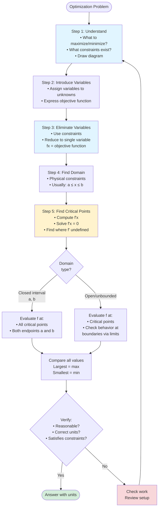

# Introduction to Optimization

Optimization is one of the most practical applications of calculus. Given constraints, how do we find the best solution—the maximum profit, minimum cost, shortest path, or largest volume? Calculus provides systematic methods to solve these problems.

## What is Optimization?

An **optimization problem** asks us to find the maximum or minimum value of some quantity (the **objective function**) subject to certain **constraints**.

**Examples:**
- Maximize the area of a rectangle with fixed perimeter
- Minimize the material needed to build a can of fixed volume
- Find the dimensions that maximize the volume of a box made from a flat sheet
- Minimize the distance traveled between points

## The Optimization Process

**Step 1: Understand the problem**
- What quantity do we want to maximize or minimize? (objective)
- What constraints or relationships exist?
- Draw a diagram if possible

**Step 2: Introduce variables**
- Assign variables to unknown quantities
- Express the objective function in terms of these variables

**Step 3: Use constraints to reduce to one variable**
- Use constraint equations to eliminate variables
- The objective becomes a function of a single variable

**Step 4: Find the domain**
- What values of the variable are physically meaningful?
- This is usually a closed interval

**Step 5: Find critical points and evaluate**
- Differentiate and find where $f' = 0$ or undefined
- Evaluate at critical points and endpoints
- Identify the maximum or minimum

**Step 6: Verify and interpret**
- Does the answer make sense?
- Answer the original question with units

## Example: Rectangle with Fixed Perimeter

**Problem:** A farmer has 200 meters of fencing. What dimensions maximize the area of a rectangular field?

**Step 1:** Maximize area; constraint is perimeter = 200.

**Step 2:** Let $x$ = length, $y$ = width.
- Objective: $A = xy$
- Constraint: $2x + 2y = 200$

**Step 3:** From constraint: $y = 100 - x$
Substitute: $A(x) = x(100 - x) = 100x - x^2$

**Step 4:** Domain: $x > 0$ and $y > 0$, so $0 < x < 100$
For absolute extrema, use $[0, 100]$ (with $A = 0$ at endpoints).

**Step 5:** $A'(x) = 100 - 2x = 0$ gives $x = 50$

Evaluate:
- $A(0) = 0$
- $A(50) = 50 \times 50 = 2500$
- $A(100) = 0$

Maximum area is 2500 m² at $x = 50$.

**Step 6:** When $x = 50$, $y = 50$. The optimal rectangle is a **square** with side 50 m.

## Key Insight: The Square

For many "maximum area with fixed perimeter" problems, the answer is a square. This is a general principle: among all rectangles with a given perimeter, the square has the largest area.

## Types of Objective Functions

**Geometric quantities:**
- Area: $A = \ell \times w$, $A = \pi r^2$
- Volume: $V = \ell wh$, $V = \pi r^2 h$
- Surface area: $S = 2\ell w + 2\ell h + 2wh$
- Perimeter/circumference

**Cost functions:**
- $C = (\text{cost per unit}) \times (\text{quantity})$

**Distance:**
- $D = \sqrt{(x_2-x_1)^2 + (y_2-y_1)^2}$

## Types of Constraints

**Perimeter/boundary constraints:** Fixed amount of material

**Volume/area constraints:** Fixed capacity

**Functional constraints:** Points must lie on a curve

**Budget constraints:** Fixed total cost

## Open vs. Closed Domains

**Closed interval $[a, b]$:** Check critical points AND endpoints

**Open interval $(a, b)$:**
- No endpoints to check
- If only one critical point and it's a local extremum, it must be the absolute extremum
- Or analyze behavior as $x \to a^+$ and $x \to b^-$

**Unbounded domain:**
- Analyze limits as $x \to \pm\infty$
- Single critical point argument often applies

## Verifying Maximum vs. Minimum

**First derivative test:** Check sign change of $f'$

**Second derivative test:** $f''(c) < 0$ → max, $f''(c) > 0$ → min

**Physical reasoning:** Does the answer make sense? Often the nature of the problem makes it clear whether you want max or min.

## Common Mistakes

1. **Not identifying the correct objective function**
2. **Forgetting constraints or domain restrictions**
3. **Not checking endpoints (on closed intervals)**
4. **Confusing maximum and minimum**
5. **Arithmetic errors in algebraic manipulation**
6. **Not answering what was asked** (e.g., asked for dimensions but only found x)

## Summary

- Optimization finds the best value of an objective function
- Process: identify objective, use constraints to reduce to one variable, find domain, apply calculus
- Check critical points and (if applicable) endpoints
- Verify your answer makes physical sense
- The square often appears as optimal for area/perimeter problems
