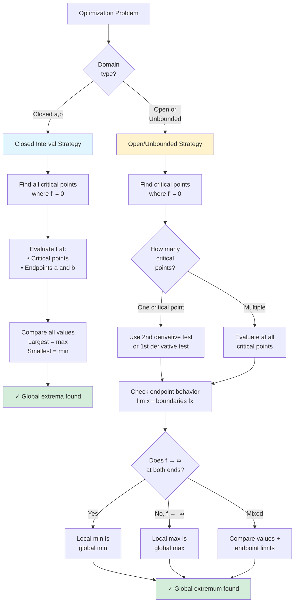

# Optimization Strategies and Special Cases

Some optimization problems require special techniques beyond the standard approach. This section covers strategies for handling unusual domains, implicit constraints, and verification methods.

## When the Domain is Unbounded

For problems on $(0, \infty)$ or $(-\infty, \infty)$:

**Strategy 1: Single Critical Point Analysis**

If there's only one critical point and it's a local extremum, it must be the global extremum (for that type).

**Strategy 2: Endpoint Behavior**

Check limits as $x \to 0^+$, $x \to \infty$, etc. If the function approaches infinity in both directions and has a local minimum in between, that minimum is global.

**Example:** Minimize $f(x) = x + \frac{4}{x}$ for $x > 0$.

$f'(x) = 1 - \frac{4}{x^2} = 0$
$x^2 = 4$
$x = 2$ (positive only)

Check: $f''(x) = \frac{8}{x^3} > 0$ for $x > 0$ → concave up everywhere

Behavior: $f(x) \to \infty$ as $x \to 0^+$ and as $x \to \infty$

**Conclusion:** $x = 2$ gives the global minimum: $f(2) = 4$.

## Second Derivative Verification

For a critical point $c$ where $f'(c) = 0$:

- If $f''(c) > 0$: local minimum
- If $f''(c) < 0$: local maximum

When the domain is closed, compare values at critical points and endpoints.

When the domain is open/unbounded, the second derivative test plus endpoint analysis determines global extrema.

## Physical Reasoning

Sometimes the nature of the problem guarantees a unique optimum:

- A fencing problem must have a maximum area (0 at extremes)
- A can with fixed volume must have a minimum surface area (infinite surface at extremes)
- Cost functions often have natural lower bounds

Use this reasoning to verify your calculus is correct.

## Implicit Constraints

Some constraints aren't stated explicitly but come from the problem setup.

**Example:** Dimensions must be positive.
If $x$ represents a length, then $x > 0$.

**Example:** Derived constraints.
If $y = 10 - 2x$ and $y > 0$, then $x < 5$.

Always identify the full domain by considering all constraints.

## Lagrange Multipliers (Preview)

For problems with constraints that can't be easily solved for one variable, there's a more advanced technique: Lagrange multipliers.

**Setup:** Optimize $f(x, y)$ subject to constraint $g(x, y) = c$.

**Method:** At the optimum, $\nabla f = \lambda \nabla g$ for some scalar $\lambda$.

This is covered in multivariable calculus but is good to know exists.

## Checking Your Answer

**Reasonableness check:**
- Are dimensions positive?
- Does the answer have correct units?
- Is the magnitude sensible?

**Boundary check:**
- What happens at the domain endpoints?
- Does the optimum beat these boundary values?

**Alternative point check:**
- Pick a nearby point and verify the function value is worse.

## Common Problem Types Summary

| Problem Type | Key Formula | Usual Result |
|--------------|-------------|--------------|
| Rectangle, fixed perimeter | $P = 2\ell + 2w$ | Square |
| Rectangle against wall | $P = 2w + \ell$ | Width = half length |
| Box from sheet | $V = x(L-2x)(W-2x)$ | Specific ratio |
| Cylinder, fixed volume | $V = \pi r^2 h$ | Height = diameter |
| Distance to curve | $D^2 = (x-a)^2 + (f(x)-b)^2$ | Minimize $D^2$ |

## Optimization with Absolute Value

If the objective involves $|f(x)|$, consider:

1. Break into cases where $f(x) \geq 0$ and $f(x) < 0$
2. Find critical points in each region
3. Check boundary points between regions
4. Compare all candidates

## Multiple Critical Points

When there are several critical points:

1. Evaluate the objective at each
2. Evaluate at domain endpoints (if applicable)
3. Compare all values
4. The largest/smallest is the global maximum/minimum

## Infinite Optimal Value

Sometimes no optimum exists:

**Example:** Maximize $f(x) = x$ on $(0, \infty)$.

The supremum is $\infty$; no maximum is attained.

**Example:** Minimize $f(x) = e^{-x}$ on $(0, \infty)$.

The infimum is 0 (as $x \to \infty$), but no minimum is attained.

The Extreme Value Theorem guarantees extrema only on closed, bounded intervals with continuous functions.

## Worked Example: Full Analysis

**Problem:** A 12×12 sheet has squares cut from corners to form a box. Maximize volume.

**Setup:** $V(x) = x(12-2x)^2$ where $x$ is the side of each square.

**Domain:** $0 < x < 6$

**Optimize:**
$V = x(144 - 48x + 4x^2) = 4x^3 - 48x^2 + 144x$
$V' = 12x^2 - 96x + 144 = 12(x^2 - 8x + 12) = 12(x-2)(x-6)$

Critical points: $x = 2$ and $x = 6$

**Evaluate:**
- $V(0) = 0$ (boundary)
- $V(2) = 2(64) = 128$
- $V(6) = 0$ (boundary)

**Verify:** $V''(x) = 24x - 96$
$V''(2) = -48 < 0$ → local maximum ✓

**Answer:** Maximum volume is 128 cubic units when $x = 2$.

## Summary

- Unbounded domains: analyze endpoint behavior and use single-critical-point argument
- Second derivative test confirms max vs. min
- Physical reasoning provides sanity checks
- Always verify domain constraints (positivity, feasibility)
- Check reasonableness of final answer
- Multiple critical points: compare all values
- Infinite domains may have no attained maximum/minimum
