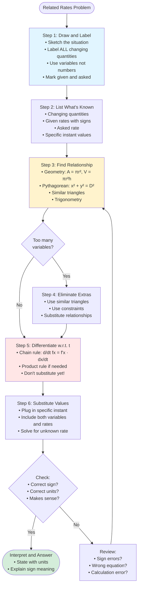

# Setting Up Related Rates Problems

The most challenging part of related rates is translating a word problem into mathematical equations. This section focuses on systematic problem setup.

## The Setup Framework



### Step 1: Draw and Label

- Sketch the situation
- Label **all** quantities that might change with time
- Use variables (not numbers) for changing quantities
- Mark what's given and what's asked

### Step 2: List What's Known

Write down:
- Which quantities are changing
- Their rates (given or asked)
- Any fixed values or relationships
- The specific instant being analyzed

### Step 3: Find the Connecting Equation

Ask: What geometric, physical, or algebraic relationship connects the variables?

Sources of relationships:
- Geometry formulas (area, volume, Pythagorean theorem)
- Similar triangles
- Trigonometric relationships
- Physics formulas
- Given conditions in the problem

### Step 4: Express in Terms of Needed Variables

Before differentiating, the equation should contain:
- The variable whose rate is given
- The variable whose rate is asked
- Possibly constants or intermediate variables

Sometimes you need to eliminate extra variables using additional relationships.

## Example: The Classic Ladder Problem

**Problem:** A 10-foot ladder leans against a wall. The bottom slides away at 2 ft/s. How fast is the top sliding down when the bottom is 6 feet from the wall?

**Step 1: Draw and Label**
```
    |
    |\
    | \  10 ft (constant)
  y |  \
    |   \
    |____\
       x
```

**Step 2: List Known Information**
- Ladder length: 10 ft (constant)
- $\frac{dx}{dt} = 2$ ft/s (bottom moving away)
- At the moment: $x = 6$ ft
- Asked: $\frac{dy}{dt} = ?$

**Step 3: Find the Relationship**

The Pythagorean theorem connects $x$ and $y$:
$$x^2 + y^2 = 10^2 = 100$$

**Step 4: Check Variables**

The equation has $x$ (rate given) and $y$ (rate asked). We can proceed.

**Differentiate:**
$$2x\frac{dx}{dt} + 2y\frac{dy}{dt} = 0$$

**Find $y$ at this moment:**
From $x^2 + y^2 = 100$ with $x = 6$:
$36 + y^2 = 100$, so $y = 8$

**Substitute and solve:**
$$2(6)(2) + 2(8)\frac{dy}{dt} = 0$$
$$24 + 16\frac{dy}{dt} = 0$$
$$\frac{dy}{dt} = -\frac{24}{16} = -1.5 \text{ ft/s}$$

**Interpret:** The negative sign means $y$ is decreasing (top sliding down), which makes sense.

## Using Similar Triangles

**Problem:** Water flows into a conical tank at 3 m³/min. The tank has height 10 m and top radius 4 m. How fast is the water level rising when the water is 5 m deep?

**Draw and identify:**
- Cone with point down
- Water level at height $h$, with surface radius $r$
- $\frac{dV}{dt} = 3$ m³/min

**The relationship for cone volume:** $V = \frac{1}{3}\pi r^2 h$

**Problem:** This has two variables ($r$ and $h$) besides volume.

**Use similar triangles:**
The water cone is similar to the tank cone:
$$\frac{r}{h} = \frac{4}{10} = \frac{2}{5}$$

So $r = \frac{2h}{5}$

**Substitute to get one variable:**
$$V = \frac{1}{3}\pi \left(\frac{2h}{5}\right)^2 h = \frac{1}{3}\pi \cdot \frac{4h^2}{25} \cdot h = \frac{4\pi h^3}{75}$$

**Differentiate:**
$$\frac{dV}{dt} = \frac{4\pi \cdot 3h^2}{75} \cdot \frac{dh}{dt} = \frac{4\pi h^2}{25}\frac{dh}{dt}$$

**Substitute ($h = 5$, $\frac{dV}{dt} = 3$):**
$$3 = \frac{4\pi(25)}{25}\frac{dh}{dt} = 4\pi\frac{dh}{dt}$$
$$\frac{dh}{dt} = \frac{3}{4\pi} \approx 0.239 \text{ m/min}$$

## Eliminating Variables

When you have more variables than you need:

1. **Similar triangles** — relate radius to height in cones/triangles
2. **Constraint equations** — use given fixed relationships
3. **Substitution** — express one variable in terms of another

**Goal:** Get down to an equation relating only the variables whose rates are known/asked.

## Identifying the Right Moment

Many problems give conditions at a specific instant:
- "When the radius is 5 cm..."
- "At the moment the ladder is 6 feet from the wall..."
- "When the cars are 50 miles apart..."

These values are substituted **after** differentiating, not before.

**Common mistake:** Substituting numbers before differentiating
- Wrong: $V = \frac{4}{3}\pi(5)^3 = \frac{500\pi}{3}$, then $\frac{dV}{dt} = 0$
- Right: $\frac{dV}{dt} = 4\pi r^2 \frac{dr}{dt}$, then substitute $r = 5$

## Checking Your Setup

Before differentiating, verify:

1. **Units are consistent** — all lengths in same unit, etc.
2. **Variables are clearly defined** — you know what each represents
3. **The equation is complete** — it actually relates the needed quantities
4. **Constants are identified** — don't differentiate fixed values as variables

## Common Setup Patterns

| Problem Type | Key Relationship |
|--------------|------------------|
| Ladder against wall | $x^2 + y^2 = L^2$ |
| Conical tank | Similar triangles + $V = \frac{1}{3}\pi r^2 h$ |
| Expanding/contracting shapes | Area or volume formulas |
| Moving objects | Distance or Pythagorean theorem |
| Shadow problems | Similar triangles |
| Angle problems | Trigonometric relationships |

## Summary

- Draw a clear diagram with labeled variables
- List all rates (given and asked)
- Find an equation connecting the relevant variables
- Eliminate extra variables using constraints (similar triangles, etc.)
- Differentiate with respect to $t$, then substitute specific values
- Interpret the sign of your answer
