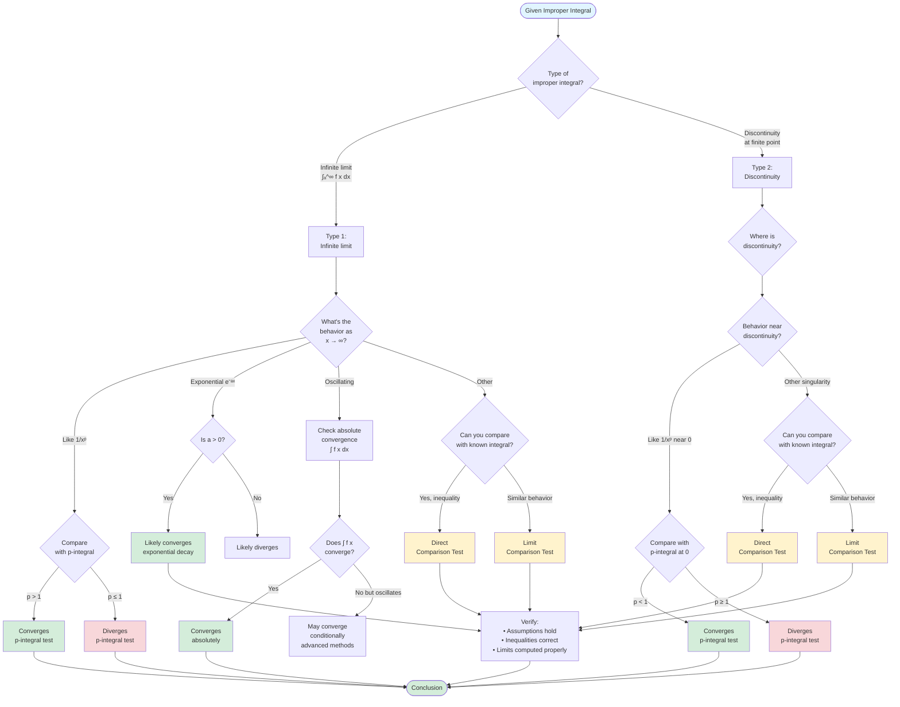

# Convergence Criteria for Improper Integrals

Beyond comparison tests, several powerful criteria help determine convergence of improper integrals. These criteria include p-integrals as universal benchmarks, absolute convergence techniques, and specialized tests. Understanding these tools enables sophisticated analysis of convergence without explicit evaluation.

## The p-Integral: Universal Benchmark

The **p-integral** serves as the fundamental reference for convergence analysis. Memorizing these results is essential for quickly analyzing more complex integrals.

### Type 1: Integrals to Infinity

$$\int_1^\infty \frac{1}{x^p}\,dx = \begin{cases} \frac{1}{p-1} & \text{if } p > 1 \\ \text{diverges} & \text{if } p \leq 1 \end{cases}$$

**Key threshold:** $p = 1$ separates convergence from divergence.

**Derivation:**

For $p \neq 1$:
$$\int_1^\infty x^{-p}\,dx = \lim_{t \to \infty} \left[\frac{x^{-p+1}}{-p+1}\right]_1^t = \lim_{t \to \infty} \frac{1}{1-p}(t^{1-p} - 1)$$

If $p > 1$, then $1 - p < 0$, so $t^{1-p} \to 0$, giving $\frac{1}{p-1}$.

If $p < 1$, then $1 - p > 0$, so $t^{1-p} \to \infty$, diverging.

For $p = 1$:
$$\int_1^\infty \frac{1}{x}\,dx = \lim_{t \to \infty} \ln t = \infty$$

**Intuition:** At infinity, we need sufficiently rapid decay. $\frac{1}{x}$ is the "borderline" case—anything slower diverges, anything faster converges.

### Type 2: Integrals Near Zero

$$\int_0^1 \frac{1}{x^p}\,dx = \begin{cases} \frac{1}{1-p} & \text{if } p < 1 \\ \text{diverges} & \text{if } p \geq 1 \end{cases}$$

**Key threshold:** Again $p = 1$, but the inequality is **reversed**.

**Derivation:**

For $p \neq 1$:
$$\int_0^1 x^{-p}\,dx = \lim_{t \to 0^+} \left[\frac{x^{1-p}}{1-p}\right]_t^1 = \lim_{t \to 0^+} \frac{1}{1-p}(1 - t^{1-p})$$

If $p < 1$, then $1 - p > 0$, so $t^{1-p} \to 0$, giving $\frac{1}{1-p}$.

If $p > 1$, then $1 - p < 0$, so $t^{1-p} = \frac{1}{t^{p-1}} \to \infty$, diverging.

**Memory aid:**
- **At infinity:** Need $p > 1$ (strong decay)
- **At zero:** Need $p < 1$ (mild singularity)

The conditions are opposite because the "dangerous" direction is different: infinity vs. a finite point.

## Absolute Convergence

Just as with infinite series, we can distinguish between absolute and conditional convergence for improper integrals.

**Definition:** An integral $\int_a^\infty f(x)\,dx$ **converges absolutely** if $\int_a^\infty |f(x)|\,dx$ converges.

**Theorem:** If $\int_a^\infty |f(x)|\,dx$ converges, then $\int_a^\infty f(x)\,dx$ converges.

**Proof idea:** Since $-|f(x)| \leq f(x) \leq |f(x)|$, we can write:
$$0 \leq f(x) + |f(x)| \leq 2|f(x)|$$

If $\int |f|$ converges, then $\int (f + |f|)$ converges by comparison. Therefore:
$$\int f = \int (f + |f|) - \int |f|$$
converges as the difference of two convergent integrals.

**Example 1: Absolute convergence of oscillating integral**

Determine whether $\int_1^\infty \frac{\sin x}{x^2}\,dx$ converges.

**Solution:**

Since $|\sin x| \leq 1$:
$$\left|\frac{\sin x}{x^2}\right| \leq \frac{1}{x^2}$$

We know $\int_1^\infty \frac{1}{x^2}\,dx$ converges. Therefore:
$$\int_1^\infty \left|\frac{\sin x}{x^2}\right|\,dx \leq \int_1^\infty \frac{1}{x^2}\,dx < \infty$$

The integral converges absolutely, hence it converges.

**Example 2: Convergence but not absolute convergence**

Consider $\int_1^\infty \frac{\sin x}{x}\,dx$.

This integral actually converges (advanced techniques show it equals a specific value involving the sine integral function), but:
$$\int_1^\infty \left|\frac{\sin x}{x}\right|\,dx = \infty$$

So it converges **conditionally** but not absolutely. This is more subtle and requires integration by parts or Fourier analysis to prove.

## Extended p-Integrals

We can generalize p-integrals to include logarithmic factors.

**Theorem:** For $p > 0$ and $q \in \mathbb{R}$:

$$\int_2^\infty \frac{1}{x^p (\ln x)^q}\,dx = \begin{cases} \text{converges} & \text{if } p > 1 \text{ or } (p = 1 \text{ and } q > 1) \\ \text{diverges} & \text{if } p < 1 \text{ or } (p = 1 \text{ and } q \leq 1) \end{cases}$$

**Example 3: Logarithmic factor**

Determine whether $\int_2^\infty \frac{1}{x \ln x}\,dx$ converges.

**Solution:**

Here $p = 1$ and $q = 1$. By the extended p-integral test, this diverges.

We can verify:
$$\int_2^\infty \frac{1}{x \ln x}\,dx = \lim_{t \to \infty} \int_2^t \frac{1}{x \ln x}\,dx$$

Substitute $u = \ln x$, $du = \frac{1}{x}dx$:
$$= \lim_{t \to \infty} \int_{\ln 2}^{\ln t} \frac{1}{u}\,du = \lim_{t \to \infty} [\ln u]_{\ln 2}^{\ln t} = \lim_{t \to \infty} (\ln \ln t - \ln \ln 2) = \infty$$

**Example 4: Convergent with logarithm**

Determine whether $\int_2^\infty \frac{1}{x (\ln x)^2}\,dx$ converges.

**Solution:**

Here $p = 1$ and $q = 2 > 1$. By the extended test, this converges.

Verification:
$$\int_2^\infty \frac{1}{x (\ln x)^2}\,dx = \lim_{t \to \infty} \int_{\ln 2}^{\ln t} \frac{1}{u^2}\,du = \lim_{t \to \infty} \left[-\frac{1}{u}\right]_{\ln 2}^{\ln t}$$

$$= \lim_{t \to \infty} \left(-\frac{1}{\ln t} + \frac{1}{\ln 2}\right) = \frac{1}{\ln 2}$$

## Exponential Domination

Exponential functions dominate polynomial and logarithmic functions for large arguments.

**Theorem:** For any $a > 0$ and any $p > 0$:

$$\lim_{x \to \infty} \frac{x^p}{e^{ax}} = 0$$

This means $e^{-ax}$ decays faster than any polynomial, so:

$$\int_1^\infty x^p e^{-ax}\,dx \text{ converges for all } p > -1, a > 0$$

**Example 5: Polynomial times exponential**

Determine whether $\int_0^\infty x^{100} e^{-x}\,dx$ converges.

**Solution:**

Despite the large polynomial power, the exponential decay dominates. The integral converges.

In fact, this equals $100!$ by properties of the gamma function.

**Example 6: Exponential vs. rational**

Determine whether $\int_1^\infty \frac{e^{-\sqrt{x}}}{x}\,dx$ converges.

**Solution:**

As $x \to \infty$, $e^{-\sqrt{x}}$ decays much faster than any power of $x$. The integral converges.

More rigorously, for $x > 4$, $\sqrt{x} > 2$, so $e^{-\sqrt{x}} < e^{-2}$. Then:
$$\int_4^\infty \frac{e^{-\sqrt{x}}}{x}\,dx < e^{-2} \int_4^\infty \frac{1}{x}\,dx$$

Wait, this diverges! Let me reconsider.

Actually, use comparison more carefully. For large $x$, $e^{-\sqrt{x}} < \frac{1}{x^2}$, so:
$$\frac{e^{-\sqrt{x}}}{x} < \frac{1}{x^3}$$

Since $\int_1^\infty \frac{1}{x^3}\,dx$ converges, the original integral converges.

## Cauchy Condensation Test

The **Cauchy Condensation Test** is useful for certain monotone decreasing functions.

**Theorem:** Let $f(x) > 0$ be decreasing on $[1, \infty)$. Then:
$$\int_1^\infty f(x)\,dx \text{ and } \sum_{n=1}^\infty 2^n f(2^n)$$
either both converge or both diverge.

**Example 7: Using condensation**

Determine whether $\int_2^\infty \frac{1}{x(\ln x)(\ln \ln x)}\,dx$ converges.

**Solution:**

Let $f(x) = \frac{1}{x(\ln x)(\ln \ln x)}$. Apply condensation:

$$\sum_{n=1}^\infty 2^n f(2^n) = \sum_{n=1}^\infty 2^n \cdot \frac{1}{2^n \ln(2^n) \ln(\ln 2^n)} = \sum_{n=1}^\infty \frac{1}{n \ln 2 \cdot \ln(n \ln 2)}$$

For large $n$, this behaves like $\sum \frac{1}{n \ln n}$, which diverges by the integral test (or comparison with harmonic series).

Therefore, the original integral diverges.

## Comparison with Series

There's a deep connection between improper integrals and infinite series.

**Integral Test for Series:** If $f(x)$ is positive, decreasing, and continuous on $[1, \infty)$, then:
$$\sum_{n=1}^\infty f(n) \text{ and } \int_1^\infty f(x)\,dx$$
either both converge or both diverge.

**Example 8: p-series connection**

The convergence of $\sum_{n=1}^\infty \frac{1}{n^p}$ is equivalent to the convergence of $\int_1^\infty \frac{1}{x^p}\,dx$.

Both converge iff $p > 1$.

## Improper Integral Convergence Strategy

Use this flowchart to systematically determine convergence of improper integrals:

## Practical Guidelines

**Step 1: Identify the type**
- Type 1 (infinite limit) or Type 2 (discontinuity)?
- Where are the problematic points?

**Step 2: Check p-integral behavior**
- What power of $x$ dominates?
- Is it stronger or weaker than the borderline $p = 1$?

**Step 3: Apply appropriate test**
- Direct comparison if you can find an easy inequality
- Limit comparison for asymptotic equivalence
- Absolute convergence for oscillating integrands
- Special criteria for logarithmic or exponential functions

**Step 4: Verify assumptions**
- Non-negativity for comparison tests
- Correct direction of inequality
- Limits computed correctly

## Summary Table

| Integral Type | Convergence Condition |
|--------------|----------------------|
| $\int_1^\infty \frac{1}{x^p}\,dx$ | $p > 1$ |
| $\int_0^1 \frac{1}{x^p}\,dx$ | $p < 1$ |
| $\int_2^\infty \frac{1}{x (\ln x)^q}\,dx$ | $q > 1$ |
| $\int_1^\infty x^p e^{-ax}\,dx$ ($a > 0$) | Always (for $p > -1$) |
| $\int_1^\infty \frac{1}{x^p (\ln x)^q}\,dx$ | $p > 1$ or ($p = 1$ and $q > 1$) |

## Common Mistakes

**Mistake 1: Confusing Type 1 and Type 2 criteria**

The p-integral thresholds are opposite! $p > 1$ for infinity, $p < 1$ for finite singularities.

**Mistake 2: Ignoring absolute value**

For oscillating functions, check $\int |f|$ first for absolute convergence.

**Mistake 3: Misapplying exponential domination**

$e^{-ax}$ with $a > 0$ decays exponentially. But $e^{ax}$ with $a > 0$ grows exponentially and causes divergence.

**Mistake 4: Forgetting logarithmic factors**

$\int_2^\infty \frac{1}{x}\,dx$ diverges, but so does $\int_2^\infty \frac{1}{x \ln x}\,dx$. The single logarithm isn't enough!

## Summary

- **p-integrals** are the fundamental benchmarks: know the thresholds ($p > 1$ at infinity, $p < 1$ at zero)
- **Absolute convergence** implies convergence
- **Exponential functions** dominate polynomials and logarithms
- **Logarithmic factors** modify convergence only at specific powers
- Use **comparison tests** for most practical problems
- **Condensation test** helps with logarithmic functions
- The **integral test** connects series and integrals

These criteria transform convergence analysis from case-by-case computation into systematic pattern recognition, enabling rapid assessment of improper integrals throughout mathematics and applications.
