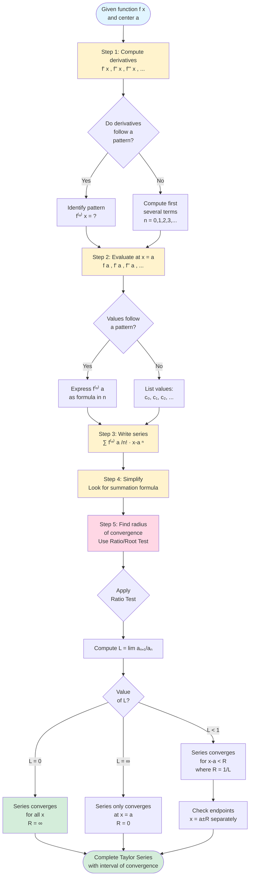

# Taylor Series and Maclaurin Series

Taylor series provide a systematic way to represent any infinitely differentiable function as a power series. They are among the most important tools in calculus, enabling us to approximate complex functions with polynomials, solve differential equations, and understand function behavior near any point.

## The Taylor Polynomial

Before discussing infinite series, let's understand Taylor polynomials, which are finite approximations.

**Definition:** The **$n$th-degree Taylor polynomial** of $f$ centered at $x = a$ is:

$$T_n(x) = f(a) + f'(a)(x - a) + \frac{f''(a)}{2!}(x - a)^2 + \frac{f'''(a)}{3!}(x - a)^3 + \cdots + \frac{f^{(n)}(a)}{n!}(x - a)^n$$

Or in summation notation:
$$T_n(x) = \sum_{k=0}^{n} \frac{f^{(k)}(a)}{k!}(x - a)^k$$

**Key Insight:** The Taylor polynomial $T_n(x)$ is the unique polynomial of degree at most $n$ that matches $f$ and its first $n$ derivatives at $x = a$:
$$T_n(a) = f(a), \quad T_n'(a) = f'(a), \quad T_n''(a) = f''(a), \quad \ldots, \quad T_n^{(n)}(a) = f^{(n)}(a)$$

## The Taylor Series

The **Taylor series** is the limit as $n \to \infty$ of the Taylor polynomials.

**Definition:** If $f$ has derivatives of all orders at $x = a$, the **Taylor series** of $f$ centered at $a$ is:

$$f(x) = \sum_{n=0}^{\infty} \frac{f^{(n)}(a)}{n!}(x - a)^n$$

**Important Note:** The equals sign here is aspirational. The series might not converge, or it might converge to something other than $f(x)$. We need to verify convergence separately (discussed in the Taylor Remainder topic).

## Maclaurin Series

When the center is $a = 0$, the Taylor series is called a **Maclaurin series**.

**Definition:** The **Maclaurin series** of $f$ is:

$$f(x) = \sum_{n=0}^{\infty} \frac{f^{(n)}(0)}{n!}x^n = f(0) + f'(0)x + \frac{f''(0)}{2!}x^2 + \frac{f'''(0)}{3!}x^3 + \cdots$$

Most common functions have simpler Maclaurin series than Taylor series centered elsewhere, so we often work with $a = 0$.

## Computing Taylor Series

To find the Taylor series of $f$ centered at $a$:

1. Compute derivatives: $f'(x)$, $f''(x)$, $f'''(x)$, $\ldots$
2. Evaluate at $x = a$: $f(a)$, $f'(a)$, $f''(a)$, $\ldots$
3. Write the series: $\sum_{n=0}^{\infty} \frac{f^{(n)}(a)}{n!}(x - a)^n$
4. Simplify and look for a pattern
5. Find the interval of convergence

### Taylor Series Computation Flowchart

**Key Steps Explained:**

1. **Differentiation:** Find $f'(x), f''(x), f'''(x), \ldots$ until a pattern emerges
2. **Evaluation:** Substitute $x = a$ into each derivative
3. **Series Construction:** Build $\sum_{n=0}^{\infty} \frac{f^{(n)}(a)}{n!}(x-a)^n$
4. **Pattern Recognition:** Express in closed form if possible
5. **Convergence:** Use Ratio Test to find where the series converges

### Example 1: Maclaurin Series for $e^x$

**Step 1:** Compute derivatives:
- $f(x) = e^x$
- $f'(x) = e^x$
- $f''(x) = e^x$
- $f'''(x) = e^x$
- Pattern: $f^{(n)}(x) = e^x$ for all $n$

**Step 2:** Evaluate at $x = 0$:
- $f^{(n)}(0) = e^0 = 1$ for all $n$

**Step 3:** Write the series:
$$e^x = \sum_{n=0}^{\infty} \frac{1}{n!}x^n = 1 + x + \frac{x^2}{2!} + \frac{x^3}{3!} + \frac{x^4}{4!} + \cdots$$

**Step 4:** Find interval of convergence using ratio test:
$$\lim_{n \to \infty} \left|\frac{x^{n+1}/(n+1)!}{x^n/n!}\right| = \lim_{n \to \infty} \frac{|x|}{n+1} = 0 < 1$$

This converges for all $x$, so $R = \infty$.

### Example 2: Maclaurin Series for $\sin x$

**Step 1:** Compute derivatives:
- $f(x) = \sin x$
- $f'(x) = \cos x$
- $f''(x) = -\sin x$
- $f'''(x) = -\cos x$
- $f^{(4)}(x) = \sin x$
- Pattern repeats with period 4

**Step 2:** Evaluate at $x = 0$:
- $f(0) = \sin(0) = 0$
- $f'(0) = \cos(0) = 1$
- $f''(0) = -\sin(0) = 0$
- $f'''(0) = -\cos(0) = -1$
- $f^{(4)}(0) = \sin(0) = 0$
- Pattern: $0, 1, 0, -1, 0, 1, 0, -1, \ldots$

**Step 3:** Write the series (only odd powers survive):
$$\sin x = x - \frac{x^3}{3!} + \frac{x^5}{5!} - \frac{x^7}{7!} + \cdots = \sum_{n=0}^{\infty} \frac{(-1)^n x^{2n+1}}{(2n+1)!}$$

Converges for all $x$ (can verify with ratio test).

### Example 3: Maclaurin Series for $\cos x$

Following similar steps:
- Derivatives: $\cos x, -\sin x, -\cos x, \sin x, \cos x, \ldots$
- At $x = 0$: $1, 0, -1, 0, 1, 0, -1, 0, \ldots$
- Only even powers survive:

$$\cos x = 1 - \frac{x^2}{2!} + \frac{x^4}{4!} - \frac{x^6}{6!} + \cdots = \sum_{n=0}^{\infty} \frac{(-1)^n x^{2n}}{(2n)!}$$

Converges for all $x$.

### Example 4: Maclaurin Series for $\frac{1}{1-x}$

**Step 1:** Compute derivatives:
- $f(x) = (1-x)^{-1}$
- $f'(x) = (1-x)^{-2}$
- $f''(x) = 2(1-x)^{-3}$
- $f'''(x) = 6(1-x)^{-4} = 3!(1-x)^{-4}$
- Pattern: $f^{(n)}(x) = n!(1-x)^{-(n+1)}$

**Step 2:** Evaluate at $x = 0$:
- $f^{(n)}(0) = n!$

**Step 3:** Write the series:
$$\frac{1}{1-x} = \sum_{n=0}^{\infty} \frac{n!}{n!}x^n = \sum_{n=0}^{\infty} x^n = 1 + x + x^2 + x^3 + \cdots$$

This is the geometric series, converging for $|x| < 1$.

### Example 5: Taylor Series for $\ln x$ centered at $a = 1$

**Step 1:** Compute derivatives:
- $f(x) = \ln x$
- $f'(x) = x^{-1}$
- $f''(x) = -x^{-2}$
- $f'''(x) = 2x^{-3}$
- $f^{(4)}(x) = -6x^{-4}$
- Pattern: $f^{(n)}(x) = \frac{(-1)^{n+1}(n-1)!}{x^n}$ for $n \geq 1$

**Step 2:** Evaluate at $x = 1$:
- $f(1) = \ln(1) = 0$
- $f^{(n)}(1) = (-1)^{n+1}(n-1)!$ for $n \geq 1$

**Step 3:** Write the series:
$$\ln x = \sum_{n=1}^{\infty} \frac{(-1)^{n+1}(n-1)!}{n!}(x - 1)^n = \sum_{n=1}^{\infty} \frac{(-1)^{n+1}}{n}(x - 1)^n$$

$$\ln x = (x-1) - \frac{(x-1)^2}{2} + \frac{(x-1)^3}{3} - \frac{(x-1)^4}{4} + \cdots$$

Converges for $0 < x \leq 2$ (interval $(0, 2]$ centered at 1 with $R = 1$).

### Example 6: Maclaurin Series for $(1+x)^p$ (Binomial Series)

For any real number $p$:
- $f(x) = (1+x)^p$
- $f'(x) = p(1+x)^{p-1}$
- $f''(x) = p(p-1)(1+x)^{p-2}$
- $f^{(n)}(0) = p(p-1)(p-2)\cdots(p-n+1)$

This gives the **binomial series**:
$$(1+x)^p = 1 + px + \frac{p(p-1)}{2!}x^2 + \frac{p(p-1)(p-2)}{3!}x^3 + \cdots$$

Or using binomial coefficients:
$$(1+x)^p = \sum_{n=0}^{\infty} \binom{p}{n} x^n$$

where $\binom{p}{n} = \frac{p(p-1)(p-2)\cdots(p-n+1)}{n!}$.

For $|x| < 1$, this converges. When $p$ is a non-negative integer, the series terminates (becomes a polynomial), giving the binomial theorem.

## Taylor Series Centered at $a \neq 0$

Sometimes it's useful to center the series at a point other than 0.

### Example 7: Taylor series for $\sin x$ at $a = \pi/2$

- $f(x) = \sin x$
- $f(\pi/2) = 1$
- $f'(x) = \cos x$, $f'(\pi/2) = 0$
- $f''(x) = -\sin x$, $f''(\pi/2) = -1$
- $f'''(x) = -\cos x$, $f'''(\pi/2) = 0$
- $f^{(4)}(x) = \sin x$, $f^{(4)}(\pi/2) = 1$

Pattern: $1, 0, -1, 0, 1, 0, -1, 0, \ldots$

$$\sin x = 1 - \frac{(x - \pi/2)^2}{2!} + \frac{(x - \pi/2)^4}{4!} - \frac{(x - \pi/2)^6}{6!} + \cdots$$

This looks like the cosine series! Indeed, using the identity $\sin x = \cos(x - \pi/2)$, we could have written this immediately.

## Uniqueness of Power Series

**Theorem:** If $f(x) = \sum_{n=0}^{\infty} c_n (x - a)^n$ for all $x$ in some interval around $a$, then:
$$c_n = \frac{f^{(n)}(a)}{n!}$$

This means the power series representation is unique. If a function equals a power series, that series must be its Taylor series.

**Consequence:** We can find power series by any method (substitution, differentiation, integration, etc.), and the result will automatically be the Taylor series.

## When Does a Taylor Series Equal the Function?

Not every Taylor series converges to its generating function. We need Taylor's Remainder Theorem to verify convergence.

**Example of Pathology:** Consider:
$$f(x) = \begin{cases} e^{-1/x^2} & x \neq 0 \\ 0 & x = 0 \end{cases}$$

This function is infinitely differentiable everywhere, and $f^{(n)}(0) = 0$ for all $n$. Its Maclaurin series is:
$$\sum_{n=0}^{\infty} \frac{f^{(n)}(0)}{n!}x^n = 0 + 0 + 0 + \cdots = 0$$

But $f(x) \neq 0$ for $x \neq 0$! The series converges but not to $f$.

Fortunately, for "nice" functions (analytic functions like $e^x$, $\sin x$, $\cos x$, polynomials, rational functions without poles), the Taylor series does converge to the function within its radius of convergence.

## Summary

- **Taylor polynomial** $T_n(x)$ is a degree-$n$ approximation matching $f$ and its first $n$ derivatives at $a$
- **Taylor series** is $\sum_{n=0}^{\infty} \frac{f^{(n)}(a)}{n!}(x - a)^n$
- **Maclaurin series** is a Taylor series with $a = 0$
- To compute: find derivatives, evaluate at $a$, write the series, find the pattern
- **Uniqueness:** power series representation equals the Taylor series
- The series may not converge to $f$; must verify using remainder theorem
- Common functions have well-known series that should be memorized
- Taylor series centered at different points give different (but related) series
