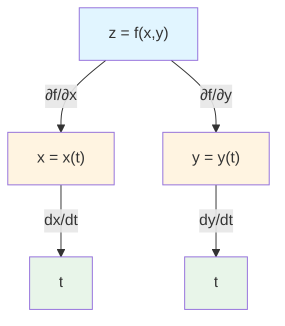
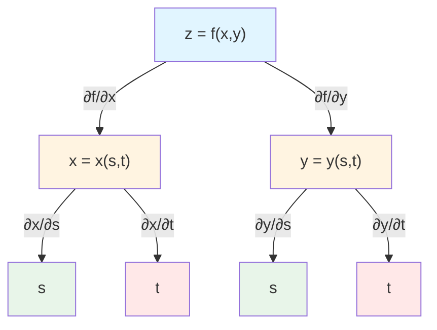
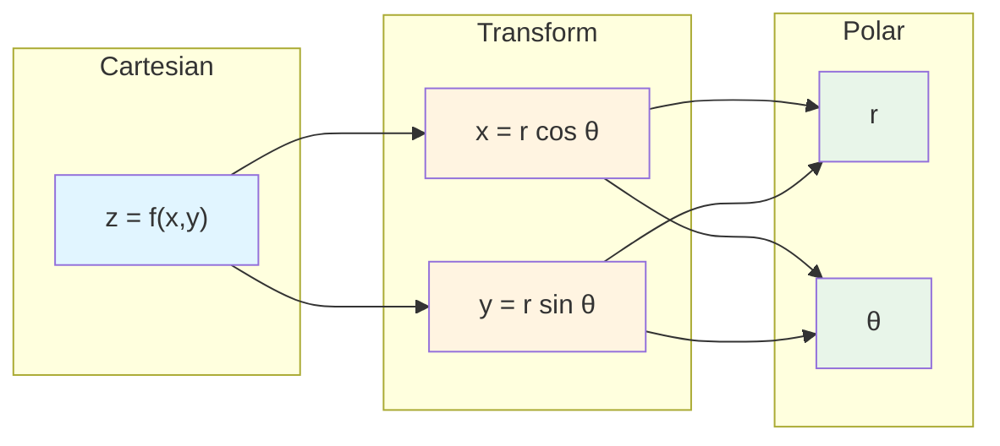

# Chain Rule for Multivariable Functions

## Introduction

The chain rule for multivariable functions generalizes the single-variable chain rule to situations where the independent variables themselves depend on other variables. This powerful technique enables us to compute derivatives when functions are composed, to change variables in differential equations, and to relate rates of change in different coordinate systems. The multivariable chain rule appears in various forms depending on the structure of the composition, and understanding these forms is essential for applications in physics, engineering, and differential geometry.

## Chain Rule: One Independent Variable

### Case 1: Parametric Curve

Suppose $z = f(x, y)$ where $x = x(t)$ and $y = y(t)$ are functions of a single parameter $t$. Then $z$ is ultimately a function of $t$, and:

$$\frac{dz}{dt} = \frac{\partial f}{\partial x}\frac{dx}{dt} + \frac{\partial f}{\partial y}\frac{dy}{dt}$$

### Tree Diagram

A useful visualization is a dependency tree diagram showing how variables relate:

For each path from $z$ to $t$, multiply the derivatives along the path and sum all contributions:

$$\frac{dz}{dt} = \frac{\partial f}{\partial x} \cdot \frac{dx}{dt} + \frac{\partial f}{\partial y} \cdot \frac{dy}{dt}$$

### Example 1

Let $z = x^2 + y^2$ where $x = \cos t$ and $y = \sin t$. Find $\frac{dz}{dt}$.

**Method 1: Direct substitution**

$$z = \cos^2 t + \sin^2 t = 1$$

$$\frac{dz}{dt} = 0$$

**Method 2: Chain rule**

$$\frac{\partial z}{\partial x} = 2x, \quad \frac{\partial z}{\partial y} = 2y$$

$$\frac{dx}{dt} = -\sin t, \quad \frac{dy}{dt} = \cos t$$

$$\frac{dz}{dt} = 2x(-\sin t) + 2y(\cos t) = 2\cos t(-\sin t) + 2\sin t(\cos t) = 0$$

Both methods agree.

### Example 2

Let $z = e^{xy}$ where $x = t^2$ and $y = t^3$. Find $\frac{dz}{dt}$ at $t = 1$.

$$\frac{\partial z}{\partial x} = ye^{xy}, \quad \frac{\partial z}{\partial y} = xe^{xy}$$

$$\frac{dx}{dt} = 2t, \quad \frac{dy}{dt} = 3t^2$$

$$\frac{dz}{dt} = ye^{xy} \cdot 2t + xe^{xy} \cdot 3t^2 = e^{xy}(2ty + 3t^2x)$$

At $t = 1$: $x = 1, y = 1$

$$\frac{dz}{dt}\bigg|_{t=1} = e^{1}(2 \cdot 1 \cdot 1 + 3 \cdot 1 \cdot 1) = 5e$$

## Chain Rule: Two Independent Variables

### Case 2: Intermediate Variables

Suppose $z = f(x, y)$ where $x = x(s, t)$ and $y = y(s, t)$ are functions of two independent variables $s$ and $t$. Then:

$$\frac{\partial z}{\partial s} = \frac{\partial f}{\partial x}\frac{\partial x}{\partial s} + \frac{\partial f}{\partial y}\frac{\partial y}{\partial s}$$

$$\frac{\partial z}{\partial t} = \frac{\partial f}{\partial x}\frac{\partial x}{\partial t} + \frac{\partial f}{\partial y}\frac{\partial y}{\partial t}$$

### Tree Diagram

The dependency structure is more complex with two independent variables:

### Example 3

Let $z = x^2y$ where $x = s + t$ and $y = st$. Find $\frac{\partial z}{\partial s}$ and $\frac{\partial z}{\partial t}$.

$$\frac{\partial z}{\partial x} = 2xy, \quad \frac{\partial z}{\partial y} = x^2$$

$$\frac{\partial x}{\partial s} = 1, \quad \frac{\partial y}{\partial s} = t$$

$$\frac{\partial z}{\partial s} = 2xy \cdot 1 + x^2 \cdot t = 2xy + x^2t$$

Substituting $x = s + t, y = st$:

$$\frac{\partial z}{\partial s} = 2(s+t)(st) + (s+t)^2 t = 2st(s+t) + t(s+t)^2$$

Similarly:

$$\frac{\partial x}{\partial t} = 1, \quad \frac{\partial y}{\partial t} = s$$

$$\frac{\partial z}{\partial t} = 2xy \cdot 1 + x^2 \cdot s = 2xy + x^2s$$

$$= 2(s+t)(st) + (s+t)^2 s = 2st(s+t) + s(s+t)^2$$

## General Chain Rule

### General Statement

If $w = f(x_1, x_2, \ldots, x_n)$ and each $x_i = x_i(t_1, t_2, \ldots, t_m)$, then:

$$\frac{\partial w}{\partial t_j} = \sum_{i=1}^{n} \frac{\partial f}{\partial x_i}\frac{\partial x_i}{\partial t_j}$$

for $j = 1, 2, \ldots, m$.

### Matrix Form

The chain rule can be expressed using the **Jacobian matrix**:

$$\frac{\partial w}{\partial t_j} = \nabla f \cdot \frac{\partial \mathbf{x}}{\partial t_j}$$

where $\nabla f = \langle f_{x_1}, \ldots, f_{x_n} \rangle$ is the gradient.

## Implicit Differentiation

### Single Equation

If $F(x, y) = 0$ defines $y$ implicitly as a function of $x$, then:

$$\frac{dy}{dx} = -\frac{\partial F/\partial x}{\partial F/\partial y}$$

provided $\frac{\partial F}{\partial y} \neq 0$.

### Derivation

Treat $y$ as a function of $x$ and differentiate $F(x, y) = 0$ with respect to $x$:

$$\frac{\partial F}{\partial x} + \frac{\partial F}{\partial y}\frac{dy}{dx} = 0$$

Solving for $\frac{dy}{dx}$:

$$\frac{dy}{dx} = -\frac{F_x}{F_y}$$

### Example 4

For $x^2 + y^2 = 25$, find $\frac{dy}{dx}$.

Let $F(x, y) = x^2 + y^2 - 25$.

$$F_x = 2x, \quad F_y = 2y$$

$$\frac{dy}{dx} = -\frac{2x}{2y} = -\frac{x}{y}$$

(This agrees with the result from implicitly differentiating directly.)

### Two Independent Variables

If $F(x, y, z) = 0$ defines $z$ as a function of $x$ and $y$, then:

$$\frac{\partial z}{\partial x} = -\frac{\partial F/\partial x}{\partial F/\partial z}, \quad \frac{\partial z}{\partial y} = -\frac{\partial F/\partial y}{\partial F/\partial z}$$

provided $\frac{\partial F}{\partial z} \neq 0$.

### Example 5

For $x^2 + y^2 + z^2 = 1$ (sphere), find $\frac{\partial z}{\partial x}$ and $\frac{\partial z}{\partial y}$.

Let $F(x, y, z) = x^2 + y^2 + z^2 - 1$.

$$F_x = 2x, \quad F_y = 2y, \quad F_z = 2z$$

$$\frac{\partial z}{\partial x} = -\frac{2x}{2z} = -\frac{x}{z}$$

$$\frac{\partial z}{\partial y} = -\frac{2y}{2z} = -\frac{y}{z}$$

(valid when $z \neq 0$)

## Change of Variables

### Polar Coordinates

For the coordinate transformation $x = r\cos\theta$ and $y = r\sin\theta$, we can use the chain rule to express derivatives in polar coordinates:

Using the chain rule:

$$\frac{\partial z}{\partial r} = \frac{\partial z}{\partial x}\frac{\partial x}{\partial r} + \frac{\partial z}{\partial y}\frac{\partial y}{\partial r} = \frac{\partial z}{\partial x}\cos\theta + \frac{\partial z}{\partial y}\sin\theta$$

$$\frac{\partial z}{\partial \theta} = \frac{\partial z}{\partial x}\frac{\partial x}{\partial \theta} + \frac{\partial z}{\partial y}\frac{\partial y}{\partial \theta} = \frac{\partial z}{\partial x}(-r\sin\theta) + \frac{\partial z}{\partial y}(r\cos\theta)$$

### Example 6: Laplacian in Polar Coordinates

The Laplacian in Cartesian coordinates is:

$$\nabla^2 f = \frac{\partial^2 f}{\partial x^2} + \frac{\partial^2 f}{\partial y^2}$$

Using the chain rule, one can derive (with considerable algebra) the polar form:

$$\nabla^2 f = \frac{\partial^2 f}{\partial r^2} + \frac{1}{r}\frac{\partial f}{\partial r} + \frac{1}{r^2}\frac{\partial^2 f}{\partial \theta^2}$$

This transformation is crucial for solving Laplace's equation in circular domains.

## Directional Derivatives Preview

The chain rule connects to directional derivatives. If we move along a curve $\mathbf{r}(t) = \langle x(t), y(t) \rangle$, the rate of change of $f$ along the curve is:

$$\frac{df}{dt} = \nabla f \cdot \mathbf{r}'(t)$$

This is a special case of the chain rule and leads to the concept of the directional derivative.

## Applications

### Related Rates in Multiple Variables

When several quantities vary with time and are related through a multivariable function, the chain rule determines how rates are connected.

### Example 7: Gas Law

The ideal gas law is $PV = nRT$. If $V$ and $T$ are functions of time:

$$P = \frac{nRT}{V}$$

$$\frac{dP}{dt} = \frac{\partial P}{\partial V}\frac{dV}{dt} + \frac{\partial P}{\partial T}\frac{dT}{dt}$$

$$= -\frac{nRT}{V^2}\frac{dV}{dt} + \frac{nR}{V}\frac{dT}{dt}$$

### Coordinate Transformations

In physics, transforming between coordinate systems (Cartesian to spherical, for example) requires extensive use of the chain rule.

### Thermodynamics

Thermodynamic identities are derived using the chain rule and implicit differentiation. For instance, expressing $\frac{\partial P}{\partial T}$ in terms of other quantities.

## Caution with Notation

### Ambiguity

Be careful with notation. The symbol $\frac{\partial z}{\partial x}$ can have different meanings depending on what is held constant.

For example, if $z = f(x, y)$ and $y = g(x)$, then:

- $\frac{\partial z}{\partial x}$ (holding $y$ constant) is $f_x$
- $\frac{dz}{dx}$ (with $y$ varying as $g(x)$) is $f_x + f_y g'(x)$

Context determines the correct interpretation.

## Higher-Order Chain Rules

The chain rule extends to higher derivatives, though expressions become complex. For instance:

$$\frac{d^2z}{dt^2} = \frac{\partial^2 f}{\partial x^2}\left(\frac{dx}{dt}\right)^2 + 2\frac{\partial^2 f}{\partial x \partial y}\frac{dx}{dt}\frac{dy}{dt} + \frac{\partial^2 f}{\partial y^2}\left(\frac{dy}{dt}\right)^2 + \frac{\partial f}{\partial x}\frac{d^2x}{dt^2} + \frac{\partial f}{\partial y}\frac{d^2y}{dt^2}$$

## Proof of Chain Rule (One Variable Case)

### Sketch

Given $z = f(x, y)$, $x = x(t)$, $y = y(t)$:

$$\frac{dz}{dt} = \lim_{\Delta t \to 0} \frac{\Delta z}{\Delta t}$$

Using the linear approximation (total differential):

$$\Delta z \approx \frac{\partial f}{\partial x}\Delta x + \frac{\partial f}{\partial y}\Delta y$$

Dividing by $\Delta t$:

$$\frac{\Delta z}{\Delta t} \approx \frac{\partial f}{\partial x}\frac{\Delta x}{\Delta t} + \frac{\partial f}{\partial y}\frac{\Delta y}{\Delta t}$$

Taking the limit as $\Delta t \to 0$:

$$\frac{dz}{dt} = \frac{\partial f}{\partial x}\frac{dx}{dt} + \frac{\partial f}{\partial y}\frac{dy}{dt}$$

## Summary

The chain rule for multivariable functions generalizes the single-variable chain rule to compositions involving multiple variables. For $z = f(x, y)$ with $x = x(t), y = y(t)$, we have $\frac{dz}{dt} = f_x \frac{dx}{dt} + f_y \frac{dy}{dt}$. When $x$ and $y$ depend on multiple variables, we obtain partial derivatives for each independent variable by summing contributions along all paths in the dependency tree. The chain rule enables implicit differentiation, coordinate transformations, and analysis of related rates in multivariable contexts. Understanding the chain rule is essential for working with composed functions and changing variables in partial differential equations.
