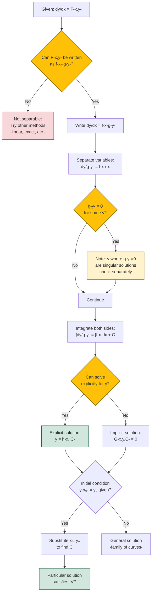

# Separable Differential Equations

## Definition and Form

A first-order differential equation is **separable** if it can be written in the form:

$$\frac{dy}{dx} = f(x)g(y)$$

or equivalently, after separation:

$$\frac{1}{g(y)}dy = f(x)dx$$

The key characteristic is that the right-hand side can be expressed as a product of a function of $x$ alone and a function of $y$ alone. This special structure allows us to "separate" the variables, placing all terms involving $y$ on one side and all terms involving $x$ on the other.

## Solution Method

The solution procedure for separable equations involves four main steps:

1. **Separate variables**: Rewrite the equation so that all $y$ terms are on one side and all $x$ terms are on the other
2. **Integrate both sides**: Apply integration to both sides of the equation
3. **Solve for y**: If possible, solve explicitly for $y$ in terms of $x$
4. **Add the constant of integration**: Include an arbitrary constant $C$

**Standard form**:
$$\frac{dy}{dx} = f(x)g(y)$$

**After separation**:
$$\frac{dy}{g(y)} = f(x)dx$$

**After integration**:
$$\int \frac{dy}{g(y)} = \int f(x)dx + C$$

### Solution Flowchart

## Basic Examples

### Example 1: Simple Exponential Growth

Solve $\frac{dy}{dx} = ky$ where $k$ is a constant.

**Solution**:
$$\frac{dy}{dx} = ky$$
$$\frac{dy}{y} = k\,dx$$

Integrating both sides:
$$\int \frac{dy}{y} = \int k\,dx$$
$$\ln|y| = kx + C_1$$

Exponentiating both sides:
$$|y| = e^{kx + C_1} = e^{C_1}e^{kx}$$

Let $C = \pm e^{C_1}$, then:
$$y = Ce^{kx}$$

This is the general solution. Note that $y = 0$ is also a solution (a **singular solution** lost during division by $y$).

### Example 2: Polynomial Separation

Solve $\frac{dy}{dx} = \frac{x^2}{y}$.

**Solution**:
$$y\,dy = x^2\,dx$$

Integrating:
$$\int y\,dy = \int x^2\,dx$$
$$\frac{y^2}{2} = \frac{x^3}{3} + C$$

Solving for $y$:
$$y^2 = \frac{2x^3}{3} + 2C$$
$$y = \pm\sqrt{\frac{2x^3}{3} + K}$$

where $K = 2C$ is an arbitrary constant.

### Example 3: Trigonometric Functions

Solve $\frac{dy}{dx} = \frac{\cos x}{\sin y}$.

**Solution**:
$$\sin y\,dy = \cos x\,dx$$

Integrating:
$$\int \sin y\,dy = \int \cos x\,dx$$
$$-\cos y = \sin x + C$$

The solution can be left in implicit form:
$$\cos y + \sin x = -C$$

or written as:
$$y = \arccos(-\sin x - C)$$

## Initial Value Problems

When an initial condition is given, we can determine the specific value of the constant $C$.

### Example 4: IVP with Exponential

Solve $\frac{dy}{dx} = xy^2$ with $y(0) = 1$.

**Solution**:
First, separate variables (assuming $y \neq 0$):
$$\frac{dy}{y^2} = x\,dx$$

Integrate:
$$\int y^{-2}dy = \int x\,dx$$
$$-\frac{1}{y} = \frac{x^2}{2} + C$$

Apply the initial condition $y(0) = 1$:
$$-\frac{1}{1} = \frac{0^2}{2} + C \implies C = -1$$

Therefore:
$$-\frac{1}{y} = \frac{x^2}{2} - 1$$
$$\frac{1}{y} = 1 - \frac{x^2}{2} = \frac{2-x^2}{2}$$
$$y = \frac{2}{2-x^2}$$

This solution is valid for $|x| < \sqrt{2}$.

## Applications

### Population Dynamics: Logistic Growth

The logistic equation models population growth with carrying capacity:

$$\frac{dP}{dt} = rP\left(1 - \frac{P}{K}\right)$$

where $P$ is population, $r$ is the growth rate, and $K$ is the carrying capacity.

This is separable:
$$\frac{dP}{P(1 - P/K)} = r\,dt$$

Using partial fractions:
$$\frac{1}{P(1 - P/K)} = \frac{1}{P} + \frac{1/K}{1 - P/K}$$

Integrating:
$$\ln|P| - \ln|K - P| = rt + C$$
$$\ln\left|\frac{P}{K-P}\right| = rt + C$$

After solving for $P$:
$$P(t) = \frac{K}{1 + Ae^{-rt}}$$

where $A$ is determined by the initial condition.

### Newton's Law of Cooling

An object's temperature $T$ changes according to:

$$\frac{dT}{dt} = -k(T - T_{\text{env}})$$

where $T_{\text{env}}$ is the ambient temperature.

Separating:
$$\frac{dT}{T - T_{\text{env}}} = -k\,dt$$

Integrating:
$$\ln|T - T_{\text{env}}| = -kt + C$$
$$T - T_{\text{env}} = Ae^{-kt}$$
$$T(t) = T_{\text{env}} + Ae^{-kt}$$

The constant $A = T(0) - T_{\text{env}}$ represents the initial temperature difference.

### Mixing Problems

A tank contains a solution with concentration $c(t)$. If solution flows in and out, the concentration changes according to:

$$\frac{dc}{dt} = \frac{\text{rate in} - \text{rate out}}{\text{volume}}$$

Many mixing problems lead to separable equations.

**Example**: A 100-liter tank initially contains pure water. Brine with 0.5 kg/L salt flows in at 5 L/min, and the well-mixed solution flows out at 5 L/min. Find the salt concentration $c(t)$.

The rate of salt entering is $0.5 \times 5 = 2.5$ kg/min.
The rate of salt leaving is $c(t) \times 5 = 5c$ kg/min.
The volume remains constant at 100 L.

$$100\frac{dc}{dt} = 2.5 - 5c$$
$$\frac{dc}{dt} = \frac{2.5 - 5c}{100} = \frac{0.5 - c}{20}$$

Separating:
$$\frac{dc}{0.5 - c} = \frac{dt}{20}$$

Integrating:
$$-\ln|0.5 - c| = \frac{t}{20} + C$$

With $c(0) = 0$:
$$-\ln(0.5) = C$$

Therefore:
$$\ln|0.5 - c| = -\frac{t}{20} + \ln(0.5)$$
$$0.5 - c = 0.5e^{-t/20}$$
$$c(t) = 0.5(1 - e^{-t/20})$$

As $t \to \infty$, $c(t) \to 0.5$ kg/L, the input concentration.

## Singular Solutions

When separating variables, we often divide by an expression involving $y$. This can cause us to lose solutions where that expression equals zero. These are called **singular solutions**.

**Example**: For $\frac{dy}{dx} = y^2$, we divide by $y^2$:

$$\frac{dy}{y^2} = dx$$
$$-\frac{1}{y} = x + C$$
$$y = -\frac{1}{x + C}$$

However, $y = 0$ is also a solution (substitute to verify), but it's not included in the general solution. Always check for such solutions.

## Implicit Solutions

Not all separable equations can be solved explicitly for $y$. In such cases, we leave the solution in **implicit form**.

**Example**: Solve $\frac{dy}{dx} = \frac{x + xy^2}{1 + x^2}$.

Factor: $\frac{dy}{dx} = \frac{x(1 + y^2)}{1 + x^2}$

Separate:
$$\frac{dy}{1 + y^2} = \frac{x\,dx}{1 + x^2}$$

Integrate:
$$\arctan y = \frac{1}{2}\ln(1 + x^2) + C$$

This implicit solution relates $x$ and $y$, though solving explicitly for $y$ would require:
$$y = \tan\left(\frac{1}{2}\ln(1 + x^2) + C\right)$$

## Testing for Separability

To determine if an equation is separable, try to write it as $dy/dx = f(x)g(y)$.

**Separable**: $\frac{dy}{dx} = x^2y$ (yes: $f(x) = x^2$, $g(y) = y$)

**Separable**: $\frac{dy}{dx} = \frac{x+1}{y-2}$ (yes: $f(x) = x+1$, $g(y) = \frac{1}{y-2}$)

**Not separable**: $\frac{dy}{dx} = x + y$ (cannot factor into separate functions)

**Not separable**: $\frac{dy}{dx} = \frac{x+y}{x-y}$ (cannot separate the variables)

## Conclusion

Separable equations represent one of the most fundamental and widely applicable classes of differential equations. The separation of variables technique provides an explicit integration method that works whenever the equation can be expressed as a product of independent functions. While not all first-order equations are separable, this method should always be the first technique attempted when confronting a new first-order ODE. Understanding separable equations also builds intuition for more advanced methods applied to non-separable equations.
