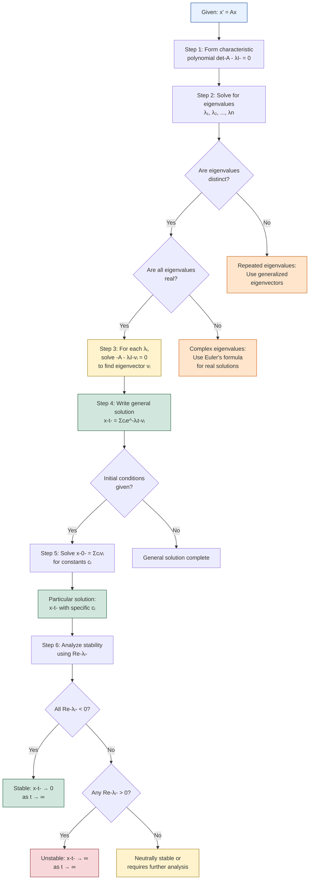

# Eigenvalue Method for Systems

## The Eigenvalue Approach

For the homogeneous linear system $\mathbf{x}' = A\mathbf{x}$, the **eigenvalue method** finds solutions by seeking exponential vector solutions:

$$\mathbf{x}(t) = e^{\lambda t}\mathbf{v}$$

where $\lambda$ is a scalar (eigenvalue) and $\mathbf{v}$ is a constant vector (eigenvector).

## Deriving the Eigenvalue Equation

Substitute $\mathbf{x} = e^{\lambda t}\mathbf{v}$ into $\mathbf{x}' = A\mathbf{x}$:

$$\frac{d}{dt}(e^{\lambda t}\mathbf{v}) = A(e^{\lambda t}\mathbf{v})$$
$$\lambda e^{\lambda t}\mathbf{v} = e^{\lambda t}A\mathbf{v}$$

Divide by $e^{\lambda t}$ (never zero):
$$\lambda\mathbf{v} = A\mathbf{v}$$

This is the **eigenvalue equation**:
$$A\mathbf{v} = \lambda\mathbf{v}$$

## Finding Eigenvalues

Rearrange:
$$(A - \lambda I)\mathbf{v} = \mathbf{0}$$

For a nontrivial solution $\mathbf{v} \neq \mathbf{0}$, the matrix $A - \lambda I$ must be singular:

$$\det(A - \lambda I) = 0$$

This **characteristic equation** is a polynomial of degree $n$ (for an $n \times n$ matrix), yielding $n$ eigenvalues (counting multiplicity).

## Finding Eigenvectors

For each eigenvalue $\lambda_i$, solve:
$$(A - \lambda_i I)\mathbf{v}_i = \mathbf{0}$$

to find the corresponding eigenvector(s) $\mathbf{v}_i$.

## Case 1: Distinct Real Eigenvalues

If $A$ has $n$ distinct real eigenvalues $\lambda_1, \lambda_2, \ldots, \lambda_n$ with corresponding eigenvectors $\mathbf{v}_1, \mathbf{v}_2, \ldots, \mathbf{v}_n$, then:

**General solution**:
$$\mathbf{x}(t) = c_1e^{\lambda_1 t}\mathbf{v}_1 + c_2e^{\lambda_2 t}\mathbf{v}_2 + \cdots + c_ne^{\lambda_n t}\mathbf{v}_n$$

The eigenvectors are automatically linearly independent (distinct eigenvalues guarantee this).

### Example 1: 2×2 System

Solve:
$$\mathbf{x}' = \begin{pmatrix} 3 & -2 \\ 2 & -2 \end{pmatrix}\mathbf{x}$$

**Find eigenvalues**:
$$\det(A - \lambda I) = \begin{vmatrix} 3-\lambda & -2 \\ 2 & -2-\lambda \end{vmatrix} = (3-\lambda)(-2-\lambda) + 4$$
$$= -6 - 3\lambda + 2\lambda + \lambda^2 + 4 = \lambda^2 - \lambda - 2 = (\lambda - 2)(\lambda + 1)$$

Eigenvalues: $\lambda_1 = 2$, $\lambda_2 = -1$

**Find eigenvector for $\lambda_1 = 2$**:
$$(A - 2I)\mathbf{v}_1 = \begin{pmatrix} 1 & -2 \\ 2 & -4 \end{pmatrix}\begin{pmatrix} v_1 \\ v_2 \end{pmatrix} = \mathbf{0}$$

From first row: $v_1 - 2v_2 = 0 \Rightarrow v_1 = 2v_2$

Choose $v_2 = 1$: $\mathbf{v}_1 = \begin{pmatrix} 2 \\ 1 \end{pmatrix}$

**Find eigenvector for $\lambda_2 = -1$**:
$$(A + I)\mathbf{v}_2 = \begin{pmatrix} 4 & -2 \\ 2 & -1 \end{pmatrix}\begin{pmatrix} v_1 \\ v_2 \end{pmatrix} = \mathbf{0}$$

From second row: $2v_1 - v_2 = 0 \Rightarrow v_2 = 2v_1$

Choose $v_1 = 1$: $\mathbf{v}_2 = \begin{pmatrix} 1 \\ 2 \end{pmatrix}$

**General solution**:
$$\mathbf{x}(t) = c_1e^{2t}\begin{pmatrix} 2 \\ 1 \end{pmatrix} + c_2e^{-t}\begin{pmatrix} 1 \\ 2 \end{pmatrix}$$

Component form:
$$x_1(t) = 2c_1e^{2t} + c_2e^{-t}$$
$$x_2(t) = c_1e^{2t} + 2c_2e^{-t}$$

### Example 2: 3×3 System

Solve:
$$\mathbf{x}' = \begin{pmatrix} 0 & 1 & 0 \\ 0 & 0 & 1 \\ 2 & -5 & 4 \end{pmatrix}\mathbf{x}$$

**Characteristic equation**:
$$\det(A - \lambda I) = -\lambda^3 + 4\lambda^2 - 5\lambda + 2 = 0$$

Factor (try $\lambda = 1$): $-1 + 4 - 5 + 2 = 0$ ✓

$$-(\lambda - 1)(\lambda^2 - 3\lambda + 2) = -(\lambda - 1)(\lambda - 1)(\lambda - 2) = -(\lambda - 1)^2(\lambda - 2)$$

Eigenvalues: $\lambda_1 = 1$ (multiplicity 2), $\lambda_2 = 2$

This is NOT the distinct eigenvalue case (we have a repeated eigenvalue). We'll handle repeated eigenvalues in a later section.

For illustration, assume we had $\lambda_1 = 1$, $\lambda_2 = 2$, $\lambda_3 = 3$ (distinct). The process would be:
1. Find $\mathbf{v}_1, \mathbf{v}_2, \mathbf{v}_3$ by solving $(A - \lambda_i I)\mathbf{v}_i = \mathbf{0}$
2. Write $\mathbf{x}(t) = c_1e^{t}\mathbf{v}_1 + c_2e^{2t}\mathbf{v}_2 + c_3e^{3t}\mathbf{v}_3$

## Properties of Eigenvalues and Eigenvectors

### Linear Independence

**Theorem**: Eigenvectors corresponding to **distinct** eigenvalues are linearly independent.

This guarantees that $n$ distinct eigenvalues produce a fundamental set of $n$ solutions.

### Geometric Interpretation

Each term $c_ie^{\lambda_i t}\mathbf{v}_i$ represents motion along the eigenvector direction $\mathbf{v}_i$ with exponential growth/decay rate $\lambda_i$:
- $\lambda_i > 0$: Exponential growth along $\mathbf{v}_i$
- $\lambda_i < 0$: Exponential decay along $\mathbf{v}_i$
- $\lambda_i = 0$: Constant along $\mathbf{v}_i$

### Diagonalization

If $A$ has $n$ linearly independent eigenvectors, it can be written as:
$$A = PDP^{-1}$$

where $P = [\mathbf{v}_1 | \mathbf{v}_2 | \cdots | \mathbf{v}_n]$ and $D = \text{diag}(\lambda_1, \lambda_2, \ldots, \lambda_n)$.

This **diagonalization** simplifies many computations.

## Behavior of Solutions

### Stability Determination

The long-term behavior depends on the eigenvalues:

**All $\text{Re}(\lambda_i) < 0$**: All solutions $\to \mathbf{0}$ as $t \to \infty$ (**stable** equilibrium at origin)

**Any $\text{Re}(\lambda_i) > 0$**: Solutions grow unbounded (**unstable**)

**All $\text{Re}(\lambda_i) \leq 0$, some $= 0$**: **Neutrally stable** or **marginally stable**

### Example 3: Stability Analysis

For Example 1, eigenvalues are $\lambda_1 = 2 > 0$ and $\lambda_2 = -1 < 0$.

Since $\lambda_1 > 0$, the origin is **unstable**. Solutions with $c_1 \neq 0$ grow exponentially.

## Initial Value Problems

### Example 4: Solving an IVP

Solve $\mathbf{x}' = \begin{pmatrix} 3 & -2 \\ 2 & -2 \end{pmatrix}\mathbf{x}$ with $\mathbf{x}(0) = \begin{pmatrix} 3 \\ 1 \end{pmatrix}$.

From Example 1:
$$\mathbf{x}(t) = c_1e^{2t}\begin{pmatrix} 2 \\ 1 \end{pmatrix} + c_2e^{-t}\begin{pmatrix} 1 \\ 2 \end{pmatrix}$$

At $t = 0$:
$$\begin{pmatrix} 3 \\ 1 \end{pmatrix} = c_1\begin{pmatrix} 2 \\ 1 \end{pmatrix} + c_2\begin{pmatrix} 1 \\ 2 \end{pmatrix}$$

System:
$$2c_1 + c_2 = 3$$
$$c_1 + 2c_2 = 1$$

From second equation: $c_1 = 1 - 2c_2$

Substitute into first: $2(1 - 2c_2) + c_2 = 3 \Rightarrow 2 - 4c_2 + c_2 = 3 \Rightarrow -3c_2 = 1 \Rightarrow c_2 = -\frac{1}{3}$

Then $c_1 = 1 - 2(-\frac{1}{3}) = 1 + \frac{2}{3} = \frac{5}{3}$

**Solution**:
$$\mathbf{x}(t) = \frac{5}{3}e^{2t}\begin{pmatrix} 2 \\ 1 \end{pmatrix} - \frac{1}{3}e^{-t}\begin{pmatrix} 1 \\ 2 \end{pmatrix}$$

Component form:
$$x_1(t) = \frac{10}{3}e^{2t} - \frac{1}{3}e^{-t}$$
$$x_2(t) = \frac{5}{3}e^{2t} - \frac{2}{3}e^{-t}$$

## Computational Steps Summary

For $\mathbf{x}' = A\mathbf{x}$ with distinct real eigenvalues:

1. **Find eigenvalues**: Solve $\det(A - \lambda I) = 0$

2. **Find eigenvectors**: For each $\lambda_i$, solve $(A - \lambda_i I)\mathbf{v}_i = \mathbf{0}$

3. **Write general solution**: $\mathbf{x}(t) = \sum_{i=1}^n c_ie^{\lambda_i t}\mathbf{v}_i$

4. **Apply initial conditions** (if given): Solve $\mathbf{x}(0) = \sum c_i\mathbf{v}_i$ for $c_i$

### Eigenvalue Method Algorithm

The following flowchart provides a systematic procedure for solving linear systems:

## Advantages of Eigenvalue Method

1. **Systematic**: Clear algorithmic procedure
2. **Insightful**: Eigenvalues determine stability and behavior
3. **Efficient**: Especially for sparse or structured matrices
4. **Generalizable**: Extends to complex and repeated eigenvalues

## Limitations

1. **Requires distinct eigenvalues** (modifications needed for repeated eigenvalues)
2. **Real eigenvalues only** (complex eigenvalues need special handling)
3. **Computationally intensive** for large matrices
4. **Numerical issues** for nearly repeated eigenvalues

## Conclusion

The eigenvalue method transforms the system $\mathbf{x}' = A\mathbf{x}$ into an algebraic eigenvalue problem. For distinct real eigenvalues, the method provides explicit exponential solutions along eigenvector directions. The eigenvalues control growth/decay rates and determine stability, while eigenvectors define the geometric structure of solutions in phase space. This powerful technique forms the foundation for understanding linear dynamical systems and extends to more complex cases through generalizations.
