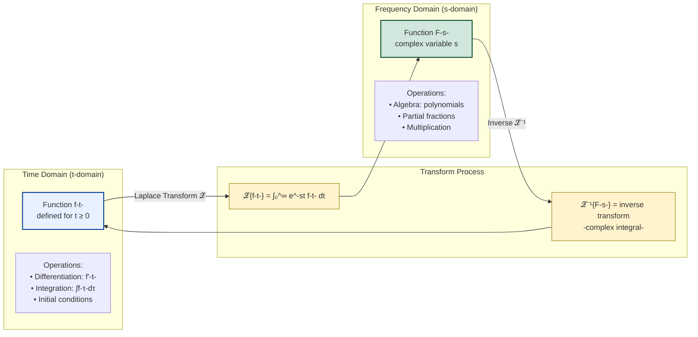
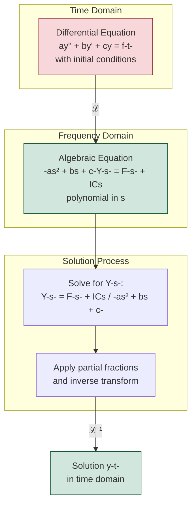

# Laplace Transform Definition

## Introduction to the Laplace Transform

The Laplace transform is a powerful integral transform technique that converts functions of a real variable $t$ (often representing time) into functions of a complex variable $s$. This transformation is particularly useful for solving linear differential equations with constant coefficients, especially initial value problems.

Named after Pierre-Simon Laplace, this transform provides an algebraic method for solving differential equations that would otherwise require cumbersome techniques. By transforming differential equations into algebraic equations, we can solve problems more efficiently and handle discontinuous forcing functions with ease.

## Formal Definition

For a function $f(t)$ defined for $t \geq 0$, the Laplace transform is defined as:

$$\mathcal{L}\{f(t)\} = F(s) = \int_0^{\infty} e^{-st} f(t) \, dt$$

where $s$ is a complex parameter. The transform exists if the improper integral converges for some values of $s$.

The domain of $t$ is typically $[0, \infty)$ since we're often dealing with physical processes that begin at $t = 0$. The parameter $s$ is generally complex, but for many practical purposes, we can treat it as a real number.

## Conditions for Existence

Not all functions have Laplace transforms. For the transform to exist, $f(t)$ must satisfy certain conditions:

### Piecewise Continuity

A function $f(t)$ is piecewise continuous on an interval $[a, b]$ if it is continuous everywhere except possibly at a finite number of points, and at each point of discontinuity, both one-sided limits exist and are finite.

### Exponential Order

A function $f(t)$ is said to be of exponential order $\alpha$ if there exist constants $M > 0$, $\alpha$, and $T > 0$ such that:

$$|f(t)| \leq Me^{\alpha t} \text{ for all } t > T$$

This condition ensures that $f(t)$ doesn't grow too rapidly as $t \to \infty$.

### Existence Theorem

If $f(t)$ is piecewise continuous on $[0, \infty)$ and of exponential order $\alpha$, then $\mathcal{L}\{f(t)\}$ exists for $s > \alpha$.

## Basic Transforms from Definition

Let's derive some fundamental Laplace transforms directly from the definition.

### Constant Function

For $f(t) = 1$:

$$\mathcal{L}\{1\} = \int_0^{\infty} e^{-st} \, dt = \left[-\frac{1}{s}e^{-st}\right]_0^{\infty} = \frac{1}{s}, \quad s > 0$$

### Exponential Function

For $f(t) = e^{at}$:

$$\mathcal{L}\{e^{at}\} = \int_0^{\infty} e^{-st} e^{at} \, dt = \int_0^{\infty} e^{-(s-a)t} \, dt = \frac{1}{s-a}, \quad s > a$$

### Power Function

For $f(t) = t^n$ where $n$ is a non-negative integer:

$$\mathcal{L}\{t^n\} = \int_0^{\infty} e^{-st} t^n \, dt$$

Using integration by parts repeatedly or recognizing this as related to the gamma function:

$$\mathcal{L}\{t^n\} = \frac{n!}{s^{n+1}}, \quad s > 0$$

For $n = 1$: $\mathcal{L}\{t\} = \frac{1}{s^2}$

For $n = 2$: $\mathcal{L}\{t^2\} = \frac{2}{s^3}$

### Sine and Cosine Functions

For $f(t) = \sin(at)$:

$$\mathcal{L}\{\sin(at)\} = \int_0^{\infty} e^{-st} \sin(at) \, dt$$

Using integration by parts twice or Euler's formula:

$$\mathcal{L}\{\sin(at)\} = \frac{a}{s^2 + a^2}, \quad s > 0$$

Similarly, for $f(t) = \cos(at)$:

$$\mathcal{L}\{\cos(at)\} = \frac{s}{s^2 + a^2}, \quad s > 0$$

### Hyperbolic Functions

For $f(t) = \sinh(at)$:

$$\mathcal{L}\{\sinh(at)\} = \mathcal{L}\left\{\frac{e^{at} - e^{-at}}{2}\right\} = \frac{1}{2}\left(\frac{1}{s-a} - \frac{1}{s+a}\right) = \frac{a}{s^2 - a^2}, \quad s > |a|$$

For $f(t) = \cosh(at)$:

$$\mathcal{L}\{\cosh(at)\} = \frac{s}{s^2 - a^2}, \quad s > |a|$$

## Properties of the Transform Domain

The region of convergence (ROC) is crucial in Laplace transform theory. For each transform $F(s)$, there is a region in the complex $s$-plane where the integral converges. For functions of exponential order $\alpha$, the ROC is typically $\text{Re}(s) > \alpha$.

### Laplace Transform Domain Mapping

The Laplace transform maps functions between two domains:

### Transform Benefits

The key advantage is that **differential equations in the time domain become algebraic equations in the frequency domain**:

## One-to-One Correspondence

An important property of the Laplace transform is that if $\mathcal{L}\{f(t)\} = \mathcal{L}\{g(t)\}$ for all $s$ in some region, and both $f$ and $g$ are continuous, then $f(t) = g(t)$ for all $t \geq 0$. This uniqueness property is essential when finding inverse transforms.

## Summary Table of Basic Transforms

| $f(t)$ | $F(s) = \mathcal{L}\{f(t)\}$ | Conditions |
|--------|------------------------------|------------|
| $1$ | $\frac{1}{s}$ | $s > 0$ |
| $t^n$ | $\frac{n!}{s^{n+1}}$ | $s > 0$ |
| $e^{at}$ | $\frac{1}{s-a}$ | $s > a$ |
| $\sin(at)$ | $\frac{a}{s^2+a^2}$ | $s > 0$ |
| $\cos(at)$ | $\frac{s}{s^2+a^2}$ | $s > 0$ |
| $\sinh(at)$ | $\frac{a}{s^2-a^2}$ | $s > |a|$ |
| $\cosh(at)$ | $\frac{s}{s^2-a^2}$ | $s > |a|$ |

## Conclusion

The Laplace transform provides a systematic method for transforming functions from the time domain to the frequency domain. Understanding the basic definition and fundamental transforms is essential for solving differential equations and analyzing linear systems. The transforms derived here form the foundation upon which more complex transforms and properties are built.
