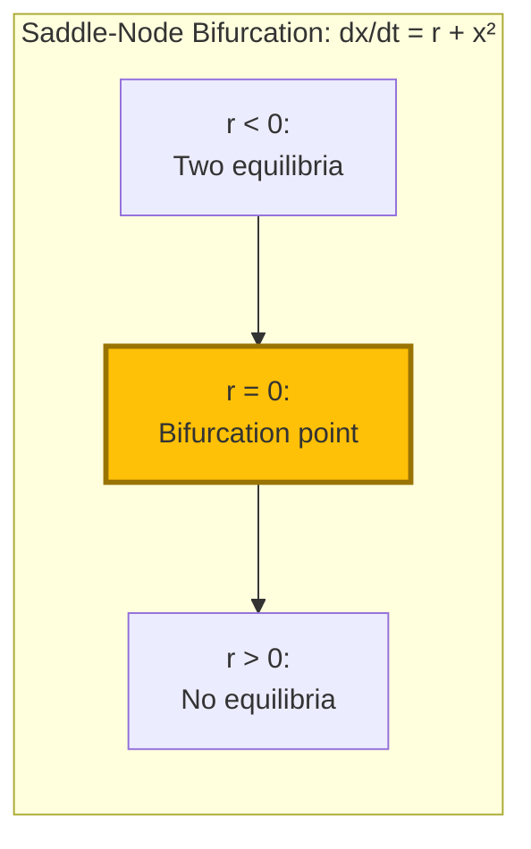
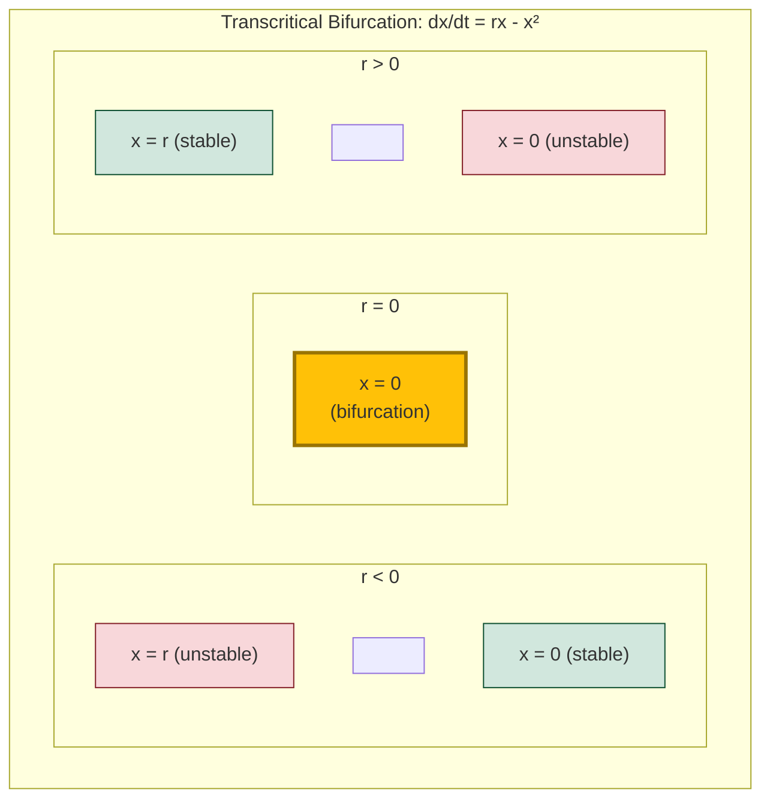
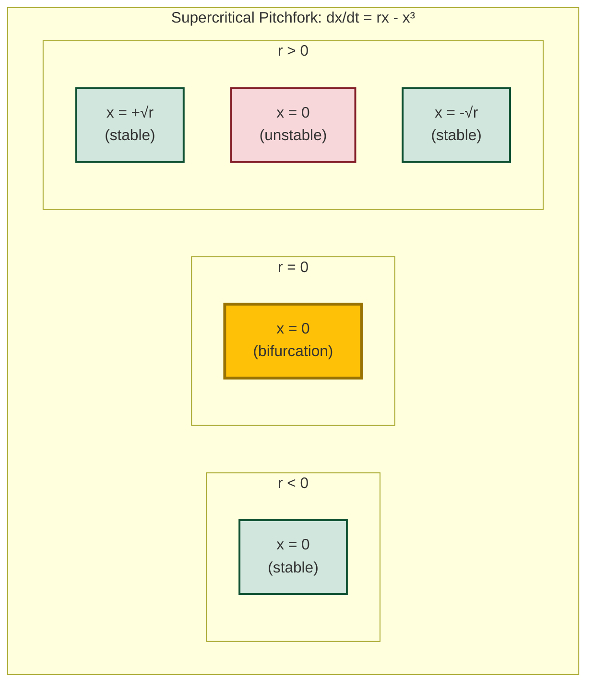
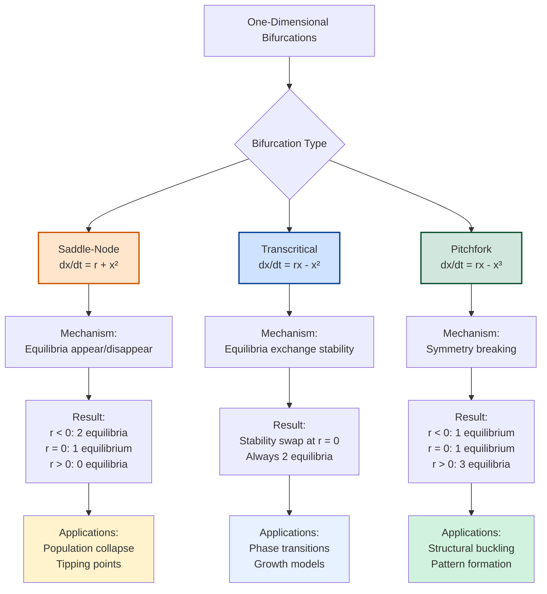

# Bifurcations

## Introduction

Bifurcation theory studies how the qualitative behavior of dynamical systems changes as parameters vary. At **bifurcation points**, the number, type, or stability of equilibria changes dramatically. Understanding bifurcations is crucial in modeling phase transitions, catastrophic events, regime shifts in ecosystems, and threshold phenomena in engineering and social systems.

## What is a Bifurcation?

A **bifurcation** is a qualitative change in the dynamics of a system when a parameter passes through a critical value. At the bifurcation point:

- Equilibria may be created or destroyed
- Stability may change
- Periodic orbits may emerge
- Chaotic behavior may appear

## Bifurcation Diagrams

A **bifurcation diagram** plots equilibrium values (and their stability) as a function of the parameter.

- Solid lines: stable equilibria
- Dashed lines: unstable equilibria
- Bifurcation point: where lines meet, cross, or change stability

## One-Dimensional Bifurcations

### Saddle-Node (Fold) Bifurcation

The most basic bifurcation where equilibria are created or destroyed.

#### Normal Form

$$\frac{dx}{dt} = r + x^2$$

where $r$ is the bifurcation parameter.

#### Analysis

Equilibria: $r + x^2 = 0 \implies x^* = \pm\sqrt{-r}$

- $r > 0$: No equilibria (no real solutions)
- $r = 0$: One equilibrium $x^* = 0$ (bifurcation point)
- $r < 0$: Two equilibria $x^* = \pm\sqrt{-r}$

**Stability** (check $f'(x) = 2x$):
- $x^* = \sqrt{-r}$: $f'(x^*) = 2\sqrt{-r} > 0$ → unstable
- $x^* = -\sqrt{-r}$: $f'(x^*) = -2\sqrt{-r} < 0$ → stable

#### Bifurcation Diagram

Visual representation showing equilibrium values versus parameter:



Classical bifurcation diagram (x vs r):

```
x
│   /  (unstable)
│  /
│ /_____ (stable)
└──────── r
  0
```

As $r$ increases through 0, the two equilibria collide and annihilate.

#### Example: Harvesting Model

$$\frac{dP}{dt} = P(1-P) - h$$

where $h$ is harvest rate. This is saddle-node form with $r = -h$.

- $h < 1/4$: Two equilibria (sustainable harvesting)
- $h = 1/4$: One equilibrium (critical harvesting)
- $h > 1/4$: No equilibria (population collapses)

### Transcritical Bifurcation

Equilibria exchange stability as the parameter varies.

#### Normal Form

$$\frac{dx}{dt} = rx - x^2$$

#### Analysis

Equilibria: $x(r - x) = 0 \implies x^* = 0$ or $x^* = r$

**Stability** ($f'(x) = r - 2x$):
- At $x = 0$: $f'(0) = r$
  - $r < 0$: stable
  - $r > 0$: unstable
- At $x = r$: $f'(r) = -r$
  - $r < 0$: unstable
  - $r > 0$: stable

#### Bifurcation Diagram

Visual representation of stability exchange:



Classical bifurcation diagram (x vs r):

```
x
│     /  (stable)
│    /
│   /___
│__/     (stable)
└──────── r
  0
```

At $r = 0$, two equilibria exchange stability. The zero equilibrium is always present but changes from stable to unstable.

#### Example: Logistic Growth

$$\frac{dP}{dt} = rP\left(1 - \frac{P}{K}\right)$$

Rewrite as: $\frac{dP}{dt} = rP - \frac{r}{K}P^2$

- $P = 0$ always an equilibrium
- For $r > 0$: $P = K$ is stable (carrying capacity)
- For $r < 0$: $P = 0$ is stable (extinction)

At $r = 0$, transcritical bifurcation occurs.

### Pitchfork Bifurcation

One equilibrium splits into three.

#### Supercritical Pitchfork

**Normal form**:

$$\frac{dx}{dt} = rx - x^3$$

**Equilibria**: $x(r - x^2) = 0 \implies x^* = 0$ or $x^* = \pm\sqrt{r}$ (for $r > 0$)

**Stability** ($f'(x) = r - 3x^2$):
- At $x = 0$: $f'(0) = r$
  - $r < 0$: stable
  - $r > 0$: unstable
- At $x = \pm\sqrt{r}$ (when $r > 0$): $f'(\pm\sqrt{r}) = r - 3r = -2r < 0$ → stable

#### Bifurcation Diagram

Visual representation of pitchfork structure:



Classical bifurcation diagram (x vs r):

```
x
│  /     (stable)
│ /
│/___    (stable at x=0 for r<0)
│\       (unstable at x=0 for r>0)
│ \
│  \     (stable)
└──────── r
  0
```

At $r = 0$, the stable equilibrium at $x = 0$ becomes unstable and two new stable equilibria emerge.

#### Subcritical Pitchfork

**Normal form**:

$$\frac{dx}{dt} = rx + x^3$$

Unstable branches emerge before the bifurcation. Can lead to hysteresis and catastrophic transitions.

#### Example: Buckling Beam

A beam under compression $r$ buckles when $r > 0$. The unbuckled state ($x = 0$) is stable for $r < 0$, but for $r > 0$, the beam buckles to $x = \pm\sqrt{r}$ (left or right).

## Two-Dimensional Bifurcations

### Hopf Bifurcation

A pair of complex conjugate eigenvalues crosses the imaginary axis, creating or destroying a limit cycle (periodic orbit).

#### Supercritical Hopf

Stable equilibrium becomes unstable and a stable limit cycle emerges.

**Example**: At $r < 0$, a spiral sink (stable). At $r = 0$, bifurcation. At $r > 0$, unstable spiral surrounded by stable limit cycle (periodic oscillation).

**Normal form** (polar coordinates):

$$\frac{dr}{dt} = r(r^2 - \rho)$$

$$\frac{d\theta}{dt} = \omega$$

where $\rho$ is the bifurcation parameter.

For $\rho > 0$: stable limit cycle at radius $r = \sqrt{\rho}$.

#### Subcritical Hopf

Stable equilibrium surrounded by unstable limit cycle. At bifurcation, equilibrium becomes unstable and limit cycle disappears (possible jump to distant attractor).

#### Example: Predator-Prey with Hopf

Modified Lotka-Volterra:

$$\frac{dx}{dt} = x(a - by) - dx$$

$$\frac{dy}{dt} = y(-c + fx)$$

where $d$ is a damping parameter. As $d$ decreases through a critical value, the stable equilibrium undergoes Hopf bifurcation, creating sustained population oscillations.

### Example: Van der Pol Oscillator

$$\frac{d^2x}{dt^2} - \mu(1-x^2)\frac{dx}{dt} + x = 0$$

- $\mu < 0$: Damped oscillations to equilibrium
- $\mu = 0$: Bifurcation
- $\mu > 0$: Stable limit cycle (self-sustained oscillation)

This models electronic circuits, heart rhythms, and other oscillatory systems.

## Global Bifurcations

### Saddle-Node of Periodic Orbits

Two periodic orbits (one stable, one unstable) collide and annihilate, similar to saddle-node for equilibria.

### Homoclinic Bifurcation

A limit cycle grows and collides with a saddle point, forming a homoclinic orbit (trajectory that connects saddle to itself). The period of the cycle approaches infinity at bifurcation.

### Heteroclinic Bifurcation

Trajectory connects two different saddle points.

## Hysteresis and Catastrophes

### Hysteresis

When subcritical bifurcations occur, the system exhibits **hysteresis**: the state depends on history, not just current parameter value.

**Example**: Lake eutrophication
- Clean lake remains clean as nutrient input increases
- At critical point, suddenly switches to algae-dominated turbid state
- Reducing nutrients back doesn't immediately restore clean state (hysteresis loop)

### Catastrophe Theory

Studies sudden jumps in systems near bifurcations. Fold catastrophe corresponds to saddle-node bifurcation.

## Bifurcations in Applications

### Climate Science

**Tipping points**: Ice-albedo feedback, ocean circulation, rainforest dieback. Once crossed, system may transition to new stable state.

### Ecology

**Regime shifts**: Coral reef to algae-dominated, clear lake to turbid, grassland to desert.

### Engineering

**Flutter in aircraft**: Hopf bifurcation in aeroelastic systems.

**Structural buckling**: Pitchfork bifurcation in beams and columns.

### Economics

**Market crashes**: Sudden transitions when confidence parameter crosses threshold.

### Neuroscience

**Firing patterns**: Neurons exhibit bifurcations between quiescent and spiking states.

## Codimension

**Codimension** is the number of parameters that must be varied to observe a bifurcation.

- Codimension-1: Generic, require varying one parameter (saddle-node, transcritical, pitchfork, Hopf)
- Codimension-2: Require varying two parameters simultaneously (Bogdanov-Takens, cusp)

Higher codimension bifurcations are rarer but organize the parameter space structure.

## Detecting Bifurcations

### Analytical Methods

1. Find equilibria as functions of parameter
2. Compute Jacobian eigenvalues
3. Identify parameter values where:
   - Eigenvalues cross zero (real axis)
   - Eigenvalues cross imaginary axis (Hopf)
   - Equilibria appear/disappear (saddle-node)

### Numerical Methods

- **Continuation**: Numerically trace equilibria as parameter varies
- **Software**: AUTO, MATCONT, PyDSTool

### Warning Signs

Systems approaching bifurcation often show:
- **Critical slowing down**: Longer recovery from perturbations
- **Increased variance**: Larger fluctuations
- **Increased autocorrelation**: Memory of past states

These are early warning signals in climate, ecosystems, and financial systems.

## Summary of Main Bifurcations

| Bifurcation | Codimension | What Happens | Example |
|-------------|-------------|--------------|---------|
| Saddle-node | 1 | Equilibria created/destroyed | Harvesting threshold |
| Transcritical | 1 | Equilibria exchange stability | Logistic growth |
| Pitchfork | 1 | One equilibrium splits into three | Buckling beam |
| Hopf | 1 | Limit cycle emerges from equilibrium | Oscillatory chemical reaction |

### Bifurcation Type Comparison



## Practical Importance

Understanding bifurcations allows us to:

1. **Predict critical transitions** before they occur
2. **Design robust systems** that avoid dangerous bifurcations
3. **Control transitions** by manipulating parameters
4. **Interpret sudden changes** in observed data
5. **Identify tipping points** in climate, ecosystems, markets

## Conclusion

Bifurcation theory reveals how small parameter changes can cause dramatic qualitative shifts in system behavior. From population collapses to the onset of oscillations, from structural failure to climate tipping points, bifurcations are fundamental to understanding sudden transitions in nature and engineered systems.

The theory provides:
- **Classification** of qualitative changes
- **Predictive power** for threshold phenomena
- **Design principles** for avoiding catastrophes
- **Mathematical framework** for understanding complexity

Bifurcation analysis is an essential tool in modern applied mathematics, connecting local linearization techniques to global system behavior.
