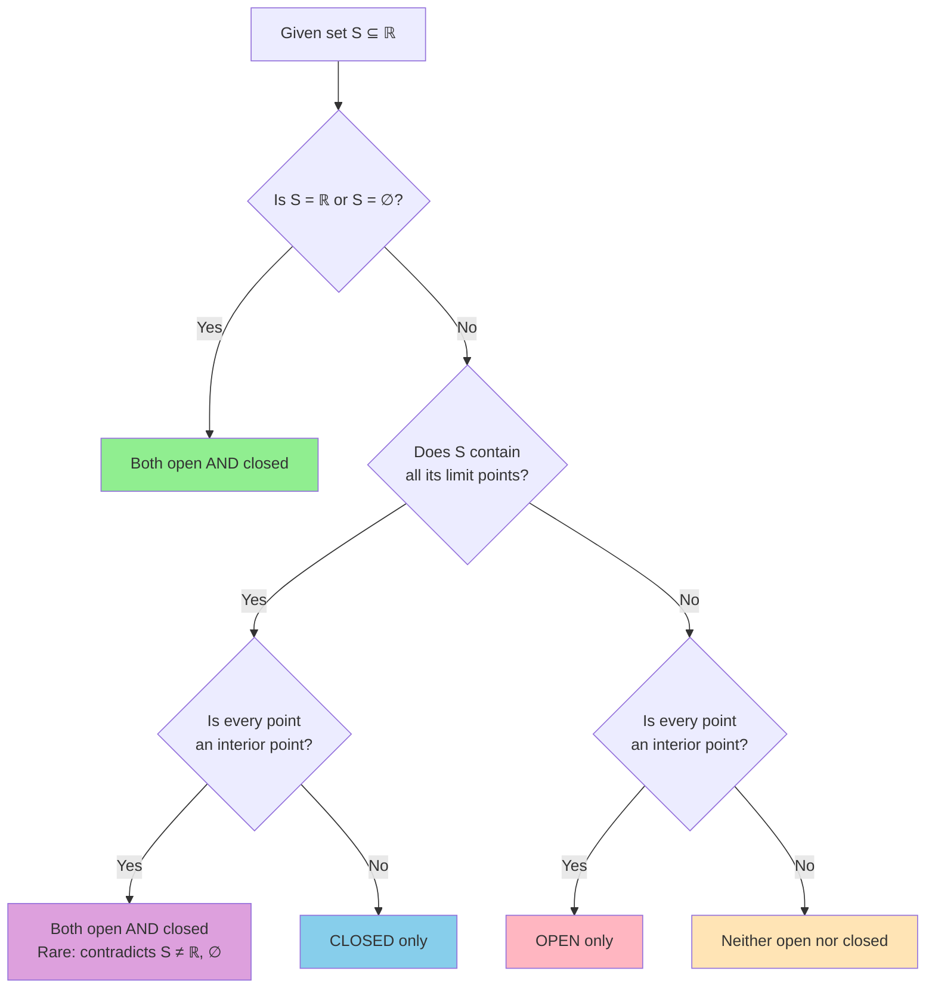
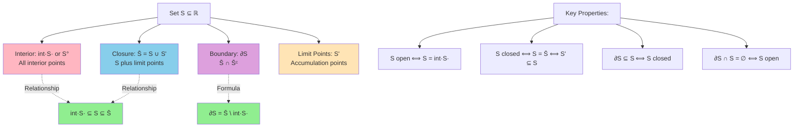

# Open and Closed Sets

## Neighborhoods and Interior Points

**Definition:** Let $x \in \mathbb{R}$ and $\epsilon > 0$. The **$\epsilon$-neighborhood** of $x$ is:
$$
N_\epsilon(x) = \{y \in \mathbb{R} : |y - x| < \epsilon\} = (x - \epsilon, x + \epsilon)
$$

**Definition:** Let $S \subseteq \mathbb{R}$. A point $x \in S$ is an **interior point** of $S$ if there exists $\epsilon > 0$ such that $N_\epsilon(x) \subseteq S$.

The set of all interior points of $S$ is called the **interior** of $S$, denoted $\text{int}(S)$ or $S^\circ$.

**Example:** For $S = [0, 1]$:
- Every point in $(0, 1)$ is an interior point
- The points 0 and 1 are not interior points
- Thus, $\text{int}(S) = (0, 1)$

**Example:** For $S = \mathbb{Q}$:
- No point is an interior point (every neighborhood of a rational contains irrationals)
- Thus, $\text{int}(\mathbb{Q}) = \emptyset$

## Open Sets

**Definition:** A set $U \subseteq \mathbb{R}$ is **open** if every point of $U$ is an interior point. Equivalently, $U$ is open if for every $x \in U$, there exists $\epsilon > 0$ such that $(x - \epsilon, x + \epsilon) \subseteq U$.

**Theorem 7.1:** A set $U$ is open if and only if $U = \text{int}(U)$.

### Examples of Open Sets

1. Any open interval $(a, b)$ is open
2. $\mathbb{R}$ is open
3. $\emptyset$ is open (vacuously true)
4. The union $(0, 1) \cup (2, 3)$ is open
5. $\mathbb{Q}$ is not open
6. $[0, 1]$ is not open (endpoints are not interior points)

**Theorem 7.2 (Properties of Open Sets):**

1. $\mathbb{R}$ and $\emptyset$ are open
2. The union of any collection of open sets is open
3. The intersection of finitely many open sets is open

**Proof of (2):** Let $\{U_\alpha\}_{\alpha \in I}$ be a collection of open sets, and let $U = \bigcup_{\alpha \in I} U_\alpha$.

If $x \in U$, then $x \in U_\alpha$ for some $\alpha$. Since $U_\alpha$ is open, there exists $\epsilon > 0$ with $(x - \epsilon, x + \epsilon) \subseteq U_\alpha \subseteq U$. Thus, $x$ is an interior point of $U$.

**Proof of (3):** Let $U_1, \ldots, U_n$ be open sets, and let $U = \bigcap_{i=1}^{n} U_i$.

If $x \in U$, then $x \in U_i$ for all $i$. For each $i$, there exists $\epsilon_i > 0$ with $(x - \epsilon_i, x + \epsilon_i) \subseteq U_i$.

Let $\epsilon = \min\{\epsilon_1, \ldots, \epsilon_n\} > 0$. Then:
$$
(x - \epsilon, x + \epsilon) \subseteq U_i \text{ for all } i
$$

Thus, $(x - \epsilon, x + \epsilon) \subseteq U$.

**Counterexample for infinite intersections:** Consider $U_n = (-\frac{1}{n}, \frac{1}{n})$ for $n \in \mathbb{N}$. Each $U_n$ is open, but:
$$
\bigcap_{n=1}^{\infty} U_n = \{0\}
$$
which is not open.

## Closed Sets

**Definition:** A set $F \subseteq \mathbb{R}$ is **closed** if its complement $F^c = \mathbb{R} \setminus F$ is open.

### Examples of Closed Sets

1. Any closed interval $[a, b]$ is closed
2. $\mathbb{R}$ is closed
3. $\emptyset$ is closed
4. $\mathbb{N}$ is closed
5. $\{0\}$ is closed
6. $(0, 1)$ is not closed

**Remark:** Some sets are neither open nor closed (like $[0, 1)$), while $\mathbb{R}$ and $\emptyset$ are both open and closed.

## Set Classification Decision Tree

The following diagram helps determine whether a set is open, closed, both, or neither:

**Examples classified:**
- **Both**: $\mathbb{R}$, $\emptyset$
- **Closed only**: $[a,b]$, $\{0\}$, $\mathbb{N}$, $\mathbb{Z}$
- **Open only**: $(a,b)$, $(a,\infty)$, $(0,1) \cup (2,3)$
- **Neither**: $[0,1)$, $\mathbb{Q}$, $(0,1] \cup \{2\}$

**Theorem 7.3 (Properties of Closed Sets):**

1. $\mathbb{R}$ and $\emptyset$ are closed
2. The intersection of any collection of closed sets is closed
3. The union of finitely many closed sets is closed

**Proof:** These follow from Theorem 7.2 by taking complements and using De Morgan's laws:
$$
\left(\bigcup_\alpha U_\alpha\right)^c = \bigcap_\alpha U_\alpha^c, \quad \left(\bigcap_\alpha U_\alpha\right)^c = \bigcup_\alpha U_\alpha^c
$$

## Limit Points and Closure

**Definition:** Let $S \subseteq \mathbb{R}$. A point $x \in \mathbb{R}$ is a **limit point** (or **accumulation point**) of $S$ if every neighborhood of $x$ contains a point of $S$ distinct from $x$.

Equivalently, $x$ is a limit point of $S$ if for every $\epsilon > 0$:
$$
(N_\epsilon(x) \setminus \{x\}) \cap S \neq \emptyset
$$

The set of all limit points of $S$ is denoted $S'$ or $\text{acc}(S)$.

**Example:** For $S = (0, 1)$:
- Every point in $[0, 1]$ is a limit point
- Thus, $S' = [0, 1]$

**Example:** For $S = \{1, \frac{1}{2}, \frac{1}{3}, \frac{1}{4}, \ldots\}$:
- The only limit point is 0
- Thus, $S' = \{0\}$

**Example:** For $S = \mathbb{Z}$:
- No point is a limit point (can find neighborhoods containing no other integers)
- Thus, $S' = \emptyset$

**Definition:** A point $x \in S$ that is not a limit point of $S$ is called an **isolated point** of $S$.

**Theorem 7.4:** $x$ is a limit point of $S$ if and only if every neighborhood of $x$ contains infinitely many points of $S$.

**Proof:** $(\Rightarrow)$ If some $N_\epsilon(x)$ contained only finitely many points of $S$, say $\{x_1, \ldots, x_n\}$ (excluding $x$ if $x \in S$), let:
$$
\delta = \min\{|x - x_i| : i = 1, \ldots, n\} > 0
$$

Then $N_\delta(x) \cap (S \setminus \{x\}) = \emptyset$, contradicting that $x$ is a limit point.

$(\Leftarrow)$ Clear from the definition.

### Closure

**Definition:** The **closure** of a set $S$, denoted $\overline{S}$ or $\text{cl}(S)$, is:
$$
\overline{S} = S \cup S'
$$

**Theorem 7.5:** $\overline{S}$ is the smallest closed set containing $S$. That is:
1. $S \subseteq \overline{S}$
2. $\overline{S}$ is closed
3. If $F$ is closed and $S \subseteq F$, then $\overline{S} \subseteq F$

**Proof:**
(1) Clear from definition.

(2) We show $(\overline{S})^c$ is open. Let $x \in (\overline{S})^c$. Then $x \notin S$ and $x \notin S'$.

Since $x \notin S'$, there exists $\epsilon > 0$ such that $N_\epsilon(x) \cap S \subseteq \{x\}$. Since $x \notin S$, we have $N_\epsilon(x) \cap S = \emptyset$.

We claim $N_\epsilon(x) \subseteq (\overline{S})^c$. For any $y \in N_\epsilon(x)$:
- $y \notin S$ (since $N_\epsilon(x) \cap S = \emptyset$)
- $y \notin S'$ (since $N_\epsilon(x)$ is a neighborhood of $y$ disjoint from $S$)

Thus, $N_\epsilon(x) \subseteq (\overline{S})^c$, showing $(\overline{S})^c$ is open.

(3) Let $F$ be closed with $S \subseteq F$. If $x \in S'$, then every neighborhood of $x$ intersects $S$, hence intersects $F$. Since $F$ is closed, $F^c$ is open. If $x \notin F$, then there exists $\epsilon > 0$ with $N_\epsilon(x) \subseteq F^c$, contradicting that $x \in S'$. Thus, $S' \subseteq F$, giving $\overline{S} = S \cup S' \subseteq F$.

**Theorem 7.6:** A set $F$ is closed if and only if $F = \overline{F}$ if and only if $F' \subseteq F$.

**Proof:**
$F$ closed $\Rightarrow$ $F = \overline{F}$: If $F$ is closed and $S = F$ in Theorem 7.5(3), then $\overline{F} \subseteq F$. Combined with $F \subseteq \overline{F}$, we have $F = \overline{F}$.

$F = \overline{F}$ $\Rightarrow$ $F$ closed: From Theorem 7.5(2).

$F = \overline{F}$ $\Leftrightarrow$ $F' \subseteq F$: Since $\overline{F} = F \cup F'$, we have $F = \overline{F}$ if and only if $F \cup F' = F$ if and only if $F' \subseteq F$.

### Sequential Characterization

**Theorem 7.7:** $x \in \overline{S}$ if and only if there exists a sequence $(x_n)$ in $S$ with $x_n \to x$.

**Proof:**
$(\Rightarrow)$ If $x \in S$, take $x_n = x$ for all $n$. If $x \in S' \setminus S$, then for each $n$, choose $x_n \in N_{1/n}(x) \cap S$ with $x_n \neq x$. Then $|x_n - x| < 1/n \to 0$.

$(\Leftarrow)$ If $(x_n)$ in $S$ converges to $x$, then either $x \in S$ or every neighborhood of $x$ contains infinitely many $x_n$, hence points of $S$, making $x \in S'$.

## Boundary

**Definition:** The **boundary** of a set $S$, denoted $\partial S$, is:
$$
\partial S = \overline{S} \cap \overline{S^c}
$$

Equivalently, $x \in \partial S$ if every neighborhood of $x$ intersects both $S$ and $S^c$.

### Set Operations and Relationships

**Theorem 7.8:** $\partial S = \overline{S} \setminus \text{int}(S)$.

**Example:** For $S = (0, 1]$:
- $\overline{S} = [0, 1]$
- $\text{int}(S) = (0, 1)$
- $\partial S = \{0, 1\}$

**Theorem 7.9:** A set $S$ is closed if and only if $\partial S \subseteq S$.

A set $S$ is open if and only if $\partial S \cap S = \emptyset$.

## Dense Sets

**Definition:** A set $S \subseteq \mathbb{R}$ is **dense** in $\mathbb{R}$ if $\overline{S} = \mathbb{R}$.

Equivalently, every nonempty open set intersects $S$.

**Example:** $\mathbb{Q}$ is dense in $\mathbb{R}$ (proven using the Archimedean property).

**Example:** The irrationals $\mathbb{R} \setminus \mathbb{Q}$ are dense in $\mathbb{R}$.

**Example:** $\mathbb{Z}$ is not dense in $\mathbb{R}$ (e.g., $(0, 1)$ contains no integers).

## Perfect Sets

**Definition:** A set $P$ is **perfect** if $P = P'$ (i.e., $P$ is closed and every point is a limit point).

**Example:** $\mathbb{R}$ is perfect.

**Example:** Any closed interval $[a, b]$ is perfect.

**Example:** The Cantor set is perfect, nonempty, and contains no intervals.

## Compact Sets (Preview)

**Definition:** A set $K \subseteq \mathbb{R}$ is **compact** if every open cover has a finite subcover.

**Heine-Borel Theorem:** A set $K \subseteq \mathbb{R}$ is compact if and only if it is closed and bounded.

This will be developed fully in later sections.

## Exercises

1. Prove that $\text{int}(S)$ is the largest open set contained in $S$.

2. Show that $\text{int}(S \cap T) = \text{int}(S) \cap \text{int}(T)$ but $\text{int}(S \cup T)$ may not equal $\text{int}(S) \cup \text{int}(T)$.

3. Prove that $\overline{S \cup T} = \overline{S} \cup \overline{T}$.

4. Find a set $S$ such that $S$, $S'$, and $S \setminus S'$ are all nonempty.

5. Prove that if $S$ is open, then $\partial S = \overline{S} \setminus S$.

6. Show that a finite set has no limit points.

## Conclusion

Open and closed sets form the foundation of topology on $\mathbb{R}$. These concepts generalize to metric spaces and abstract topological spaces, making them central to modern analysis and geometry. Understanding the interplay between open sets, closed sets, interior, closure, and boundary is essential for studying continuity, convergence, and compactness.
