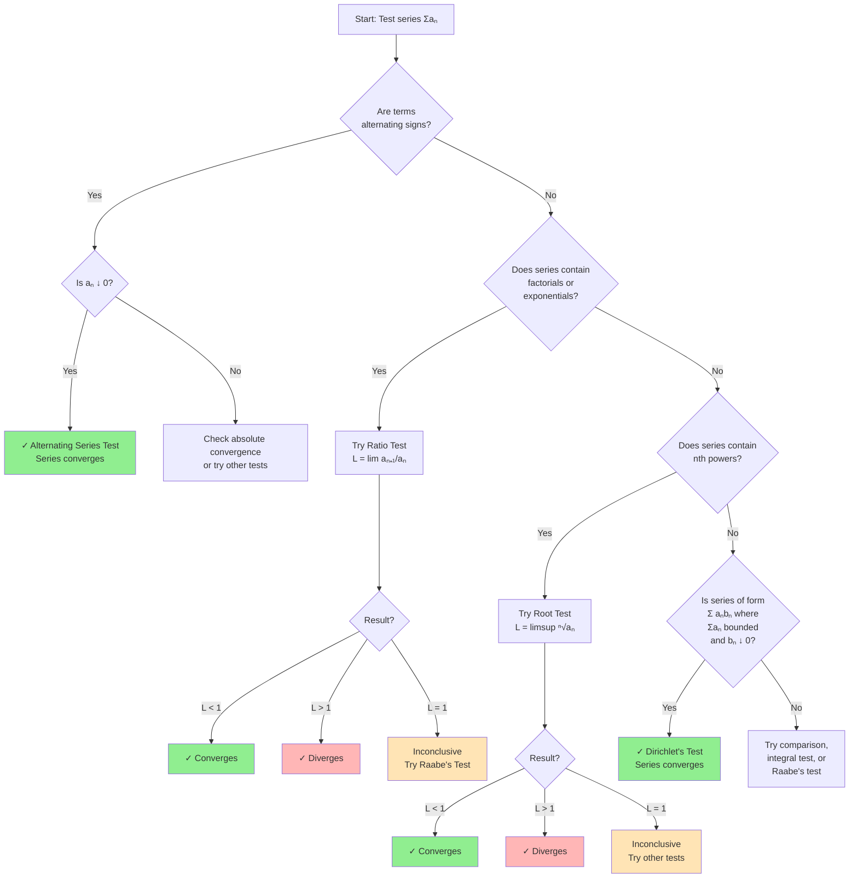

# Convergence Tests for Series

## The Ratio Test

**Theorem 2.1 (Ratio Test):** Let $\sum a_n$ be a series with $a_n > 0$. Define:
$$
L = \lim_{n \to \infty} \frac{a_{n+1}}{a_n}
$$

1. If $L < 1$, the series converges
2. If $L > 1$ (or $L = \infty$), the series diverges
3. If $L = 1$, the test is inconclusive

**Proof:** Suppose $L < 1$. Choose $r$ with $L < r < 1$. Since $\frac{a_{n+1}}{a_n} \to L$, there exists $N$ such that for $n \geq N$:
$$
\frac{a_{n+1}}{a_n} < r
$$

Thus:
$$
a_{N+k} < r^k a_N
$$

Since $\sum r^k$ converges (geometric series with $r < 1$), by comparison, $\sum_{k=N}^{\infty} a_k$ converges.

If $L > 1$, then $\frac{a_{n+1}}{a_n} > 1$ eventually, so $(a_n)$ is eventually increasing and $a_n \not\to 0$. The series diverges.

**Example 1:** Test $\sum \frac{2^n}{n!}$ for convergence.

**Solution:**
$$
\frac{a_{n+1}}{a_n} = \frac{2^{n+1}/(n+1)!}{2^n/n!} = \frac{2}{n+1} \to 0 < 1
$$

The series converges.

**Example 2:** Test $\sum \frac{n^n}{n!}$.

**Solution:**
$$
\frac{a_{n+1}}{a_n} = \frac{(n+1)^{n+1}/(n+1)!}{n^n/n!} = \frac{(n+1)^{n+1}}{(n+1) n^n} = \frac{(n+1)^n}{n^n} = \left(1 + \frac{1}{n}\right)^n \to e > 1
$$

The series diverges.

**Example 3 (Inconclusive case):** For both $\sum \frac{1}{n}$ and $\sum \frac{1}{n^2}$:
$$
\frac{a_{n+1}}{a_n} = \frac{n}{n+1} \to 1
$$

Yet $\sum \frac{1}{n}$ diverges while $\sum \frac{1}{n^2}$ converges. The ratio test is inconclusive.

## The Root Test

**Theorem 2.2 (Root Test / Cauchy's Test):** Let $\sum a_n$ be a series with $a_n \geq 0$. Define:
$$
L = \limsup_{n \to \infty} \sqrt[n]{a_n}
$$

1. If $L < 1$, the series converges
2. If $L > 1$, the series diverges
3. If $L = 1$, the test is inconclusive

**Proof:** If $L < 1$, choose $r$ with $L < r < 1$. Then $\sqrt[n]{a_n} < r$ for large $n$, so $a_n < r^n$. Since $\sum r^n$ converges, by comparison, $\sum a_n$ converges.

If $L > 1$, then $\sqrt[n]{a_n} > 1$ for infinitely many $n$, so $a_n > 1$ infinitely often, and $a_n \not\to 0$. The series diverges.

**Example 4:** Test $\sum \left(\frac{n}{n+1}\right)^{n^2}$.

**Solution:**
$$
\sqrt[n]{a_n} = \left(\frac{n}{n+1}\right)^n = \left(1 - \frac{1}{n+1}\right)^n
$$

We have $\left(1 - \frac{1}{n+1}\right)^n \sim e^{-n/(n+1)} \to e^{-1} < 1$.

More rigorously, $\ln\sqrt[n]{a_n} = n \ln(1 - \frac{1}{n+1}) \sim -\frac{n}{n+1} \to -1$, so $\sqrt[n]{a_n} \to e^{-1} < 1$.

The series converges.

**Example 5:** Test $\sum \left(\frac{2n+1}{3n+2}\right)^n$.

**Solution:**
$$
\sqrt[n]{a_n} = \frac{2n+1}{3n+2} \to \frac{2}{3} < 1
$$

The series converges.

## Comparison of Ratio and Root Tests

**Theorem 2.3:** The root test is stronger than the ratio test: if the ratio test gives a conclusive answer, so does the root test.

**Proof sketch:** We have:
$$
\liminf \frac{a_{n+1}}{a_n} \leq \liminf \sqrt[n]{a_n} \leq \limsup \sqrt[n]{a_n} \leq \limsup \frac{a_{n+1}}{a_n}
$$

(This inequality is non-trivial to prove, but can be shown using properties of $\limsup$ and $\liminf$.)

Thus, if $\lim \frac{a_{n+1}}{a_n} = L$, then $\limsup \sqrt[n]{a_n} = L$.

**Example 6:** Consider $\sum a_n$ where $a_n = \begin{cases} 2^{-n} & \text{if } n \text{ even} \\ 3^{-n} & \text{if } n \text{ odd} \end{cases}$.

The ratio test is inconclusive (the limit of $\frac{a_{n+1}}{a_n}$ doesn't exist), but:
$$
\limsup \sqrt[n]{a_n} = \max\left\{\frac{1}{2}, \frac{1}{3}\right\} = \frac{1}{2} < 1
$$

The root test shows convergence.

## Alternating Series Test

**Definition:** An **alternating series** has the form $\sum (-1)^n a_n$ or $\sum (-1)^{n+1} a_n$ where $a_n > 0$.

**Theorem 2.4 (Leibniz's Alternating Series Test):** If:
1. $a_n \geq a_{n+1}$ for all $n$ (monotone decreasing)
2. $\lim_{n \to \infty} a_n = 0$

Then $\sum (-1)^n a_n$ converges.

**Proof:** Consider the partial sums. For even $n = 2m$:
$$
s_{2m} = (a_1 - a_2) + (a_3 - a_4) + \cdots + (a_{2m-1} - a_{2m}) \geq 0
$$

Since each parenthesis is non-negative (by monotonicity), $(s_{2m})$ is increasing.

Also:
$$
s_{2m} = a_1 - (a_2 - a_3) - (a_4 - a_5) - \cdots - (a_{2m-2} - a_{2m-1}) - a_{2m} \leq a_1
$$

So $(s_{2m})$ is bounded above. By MCT, $s_{2m} \to L$ for some $L \in [0, a_1]$.

For odd indices: $s_{2m+1} = s_{2m} + a_{2m+1} \to L + 0 = L$.

Thus, $s_n \to L$.

**Example 7:** The alternating harmonic series $\sum_{n=1}^{\infty} \frac{(-1)^{n+1}}{n} = 1 - \frac{1}{2} + \frac{1}{3} - \frac{1}{4} + \cdots$ converges.

**Proof:** $a_n = \frac{1}{n}$ is decreasing and $a_n \to 0$. By the alternating series test, the series converges. (The sum is $\ln 2$.)

**Remainder Estimate:** If $\sum (-1)^n a_n = S$ and $s_n$ is the $n$-th partial sum, then:
$$
|S - s_n| \leq a_{n+1}
$$

**Proof:** For $n = 2m$ (even):
$$
S - s_{2m} = a_{2m+1} - a_{2m+2} + a_{2m+3} - \cdots = a_{2m+1} - (a_{2m+2} - a_{2m+3}) - \cdots \in [0, a_{2m+1}]
$$

**Example 8:** To approximate $\sum_{n=1}^{\infty} \frac{(-1)^{n+1}}{n}$ to within $0.01$, how many terms are needed?

We need $a_{n+1} = \frac{1}{n+1} < 0.01$, so $n+1 > 100$, giving $n \geq 100$. We need 100 terms.

## Dirichlet's Test

**Theorem 2.5 (Dirichlet's Test):** Suppose:
1. The partial sums $\sum_{k=1}^{n} a_k$ are bounded
2. $(b_n)$ is monotone decreasing to 0

Then $\sum a_n b_n$ converges.

**Proof:** Uses summation by parts (Abel's summation formula).

**Example 9:** $\sum \frac{\sin n}{n}$ converges.

**Proof:** Let $a_n = \sin n$ and $b_n = \frac{1}{n}$. The partial sums of $\sin n$ are bounded (they're bounded by $\frac{1}{|\sin(1/2)|}$ using the formula for sums of sines). Since $\frac{1}{n} \downarrow 0$, Dirichlet's test applies.

## Abel's Test

**Theorem 2.6 (Abel's Test):** Suppose:
1. $\sum a_n$ converges
2. $(b_n)$ is monotone and bounded

Then $\sum a_n b_n$ converges.

**Proof:** Similar to Dirichlet, using summation by parts.

## Raabe's Test

For series where the ratio test is inconclusive ($L = 1$), Raabe's test may help.

**Theorem 2.7 (Raabe's Test):** Suppose $a_n > 0$ and:
$$
\lim_{n \to \infty} n\left(\frac{a_n}{a_{n+1}} - 1\right) = L
$$

1. If $L > 1$, the series converges
2. If $L < 1$, the series diverges
3. If $L = 1$, the test is inconclusive

**Example 10:** Test $\sum \frac{(2n)!}{(n!)^2 4^n}$ (the central binomial coefficients scaled).

The ratio test gives $L = 1$ (inconclusive). Computing Raabe's criterion:
$$
\frac{a_n}{a_{n+1}} = \frac{(2n)!/(n!)^2 4^n}{(2(n+1))!/((n+1)!)^2 4^{n+1}} = \frac{4(n+1)^2}{(2n+1)(2n+2)} = \frac{4(n+1)^2}{2(2n+1)(n+1)} = \frac{2(n+1)}{2n+1}
$$
$$
= \frac{2n+2}{2n+1} = 1 + \frac{1}{2n+1}
$$

Thus:
$$
n\left(\frac{a_n}{a_{n+1}} - 1\right) = n \cdot \frac{1}{2n+1} \to \frac{1}{2} < 1
$$

The series diverges.

## Kummer's Test

A generalization of Raabe's and other tests.

**Theorem 2.8 (Kummer's Test):** Let $(c_n)$ be a positive sequence. Define:
$$
L = \lim_{n \to \infty} \left(c_n \frac{a_n}{a_{n+1}} - c_{n+1}\right)
$$

1. If $L > 0$, then $\sum a_n$ converges
2. If $L < 0$ and $\sum \frac{1}{c_n}$ diverges, then $\sum a_n$ diverges

Choosing $c_n = n$ gives Raabe's test. Choosing $c_n = 1$ gives the ratio test.

## Convergence Test Selection Flowchart

When faced with testing a series $\sum a_n$ for convergence, use this decision tree to select the most appropriate test:

## Summary Table

| Test | Condition | Convergence | Divergence |
|------|-----------|-------------|------------|
| Ratio | $L = \lim \frac{a_{n+1}}{a_n}$ | $L < 1$ | $L > 1$ |
| Root | $L = \limsup \sqrt[n]{a_n}$ | $L < 1$ | $L > 1$ |
| Alternating | $a_n \downarrow 0$ | Always | N/A |
| Raabe | $L = \lim n(\frac{a_n}{a_{n+1}} - 1)$ | $L > 1$ | $L < 1$ |

## Exercises

1. Test convergence: $\sum \frac{n!}{n^n}$

2. Test convergence: $\sum \frac{n^2 2^n}{n!}$

3. Show that $\sum \frac{(-1)^n}{\sqrt{n}}$ converges.

4. For which $p$ does $\sum \frac{(-1)^n}{n^p}$ converge?

5. Use Raabe's test on $\sum \frac{1 \cdot 3 \cdot 5 \cdots (2n-1)}{2 \cdot 4 \cdot 6 \cdots (2n)}$.

## Conclusion

The ratio and root tests are powerful tools for geometric-type series. The alternating series test handles sign-changing series with monotone decreasing terms. Dirichlet's and Abel's tests address more subtle situations. When one test is inconclusive, another may succeed. Mastering the appropriate test for each series type is key to analyzing convergence.
