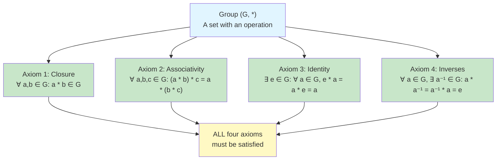

# Group Axioms

## Formal Definition of a Group

**Definition**: A **group** is an ordered pair $(G, \ast)$ where $G$ is a set and $\ast$ is a binary operation on $G$ satisfying the following four axioms:

### Axiom 1: Closure
For all $a, b \in G$, we have $a \ast b \in G$.

### Axiom 2: Associativity
For all $a, b, c \in G$,
$$(a \ast b) \ast c = a \ast (b \ast c)$$

### Axiom 3: Identity Element
There exists an element $e \in G$ such that for all $a \in G$,
$$e \ast a = a \ast e = a$$

### Axiom 4: Inverse Elements
For each element $a \in G$, there exists an element $a^{-1} \in G$ such that
$$a \ast a^{-1} = a^{-1} \ast a = e$$

When the operation is clear from context, we often write simply $G$ instead of $(G, \ast)$.

## Detailed Analysis of Each Axiom

### Closure: The Foundation

Closure ensures that combining any two elements of the group using the operation produces another element in the group. This is essential for the group to be self-contained.

**Example**: The integers $\mathbb{Z}$ are closed under addition because the sum of any two integers is an integer.

**Non-Example**: The integers are NOT closed under division. We have $2, 3 \in \mathbb{Z}$, but $2 \div 3 = \frac{2}{3} \notin \mathbb{Z}$.

**Verification Strategy**: To verify closure, you must show that for arbitrary elements $a, b \in G$, the element $a \ast b$ is indeed in $G$.

### Associativity: Order of Operations

Associativity means that when combining three elements, it doesn't matter how we group them. This allows us to write $a \ast b \ast c$ without ambiguity.

**Example**: Addition of integers is associative:
$$(2 + 3) + 5 = 5 + 5 = 10$$
$$2 + (3 + 5) = 2 + 8 = 10$$

**Non-Example**: Subtraction is NOT associative:
$$(8 - 3) - 2 = 5 - 2 = 3$$
$$8 - (3 - 2) = 8 - 1 = 7$$

**Important Consequence**: Because of associativity, we can write products of multiple elements without parentheses:
$$a_1 \ast a_2 \ast a_3 \ast \cdots \ast a_n$$
is unambiguous regardless of how we group the operations.

### Identity Element: The "Do Nothing" Element

The identity element $e$ is the unique element that leaves all other elements unchanged when combined with them.

**Theorem**: If a group has an identity element, it is unique.

**Proof**: Suppose $e$ and $e'$ are both identity elements. Then:
- Since $e$ is an identity: $e \ast e' = e'$
- Since $e'$ is an identity: $e \ast e' = e$
- Therefore: $e = e \ast e' = e'$

Thus the identity is unique. $\square$

**Examples of Identity Elements**:
- In $(\mathbb{Z}, +)$, the identity is $0$
- In $(\mathbb{R}^*, \cdot)$, the identity is $1$
- In $(GL_n(\mathbb{R}), \cdot)$ (invertible $n \times n$ matrices), the identity is $I_n$
- In $(S_n, \circ)$ (permutations of $n$ elements), the identity is the identity permutation

**Notation**: We typically denote the identity element as:
- $e$ in abstract groups
- $0$ in additive groups
- $1$ or $I$ in multiplicative groups

### Inverse Elements: Undoing Operations

For every element in a group, there must be another element that "undoes" it, returning to the identity.

**Theorem**: Each element in a group has a unique inverse.

**Proof**: Let $a \in G$ and suppose $b$ and $c$ are both inverses of $a$. Then:
$$b = b \ast e = b \ast (a \ast c) = (b \ast a) \ast c = e \ast c = c$$

Therefore, the inverse of $a$ is unique. $\square$

**Notation for Inverses**:
- In multiplicative notation: $a^{-1}$
- In additive notation: $-a$
- For powers: $(a^n)^{-1} = a^{-n}$

## Verifying the Group Axioms: Examples

### Example 1: Integers Modulo $n$ Under Addition

Consider $\mathbb{Z}_n = \{0, 1, 2, \ldots, n-1\}$ with addition modulo $n$.

**Closure**: If $a, b \in \mathbb{Z}_n$, then $a + b \pmod{n}$ is in $\{0, 1, \ldots, n-1\}$ by definition of modular arithmetic. ✓

**Associativity**: For $a, b, c \in \mathbb{Z}_n$:
$$(a + b) + c \equiv a + (b + c) \pmod{n}$$
since regular integer addition is associative. ✓

**Identity**: The element $0$ satisfies $0 + a \equiv a + 0 \equiv a \pmod{n}$ for all $a \in \mathbb{Z}_n$. ✓

**Inverses**: For each $a \in \mathbb{Z}_n$, the element $n - a$ (or $-a \bmod n$) is the inverse:
$$a + (n - a) \equiv n \equiv 0 \pmod{n}$$
✓

Therefore, $(\mathbb{Z}_n, +)$ is a group.

### Example 2: General Linear Group

The **general linear group** $GL_n(\mathbb{R})$ consists of all invertible $n \times n$ matrices with real entries, under matrix multiplication.

**Closure**: The product of two invertible matrices is invertible. If $A$ and $B$ are invertible, then:
$$(AB)(B^{-1}A^{-1}) = A(BB^{-1})A^{-1} = AIA^{-1} = AA^{-1} = I$$
So $AB$ is invertible with inverse $B^{-1}A^{-1}$. ✓

**Associativity**: Matrix multiplication is associative:
$$(AB)C = A(BC)$$
✓

**Identity**: The identity matrix $I_n$ satisfies $AI = IA = A$ for all $A \in GL_n(\mathbb{R})$. ✓

**Inverses**: By definition of $GL_n(\mathbb{R})$, each matrix $A$ has an inverse $A^{-1}$ satisfying $AA^{-1} = A^{-1}A = I$. ✓

Therefore, $(GL_n(\mathbb{R}), \cdot)$ is a group.

### Example 3: Symmetries of an Equilateral Triangle

Let $D_3$ be the set of all symmetries (rotations and reflections) of an equilateral triangle.

The elements are:
- $r_0$: rotation by 0° (identity)
- $r_1$: rotation by 120° counterclockwise
- $r_2$: rotation by 240° counterclockwise
- $f_1, f_2, f_3$: reflections across three axes

**Closure**: Composing any two symmetries yields another symmetry. ✓

**Associativity**: Function composition is always associative. ✓

**Identity**: $r_0$ is the identity transformation. ✓

**Inverses**: Each symmetry has an inverse:
- $r_1^{-1} = r_2$ and $r_2^{-1} = r_1$
- Each reflection is its own inverse: $f_i^{-1} = f_i$

✓

Therefore, $(D_3, \circ)$ is a group.

## Non-Examples: When Axioms Fail

### Non-Example 1: Natural Numbers Under Addition

Consider $(\mathbb{N}, +)$ where $\mathbb{N} = \{0, 1, 2, 3, \ldots\}$.

- **Closure**: ✓
- **Associativity**: ✓
- **Identity**: 0 is the identity ✓
- **Inverses**: The element $5$ has no inverse in $\mathbb{N}$ because there is no natural number $x$ such that $5 + x = 0$. ✗

Therefore, $(\mathbb{N}, +)$ is NOT a group.

### Non-Example 2: Integers Under Multiplication

Consider $(\mathbb{Z}, \cdot)$.

- **Closure**: ✓
- **Associativity**: ✓
- **Identity**: 1 is the identity ✓
- **Inverses**: The element $2$ has no inverse in $\mathbb{Z}$ because there is no integer $x$ such that $2x = 1$. ✗

Therefore, $(\mathbb{Z}, \cdot)$ is NOT a group.

## Abelian Groups

**Definition**: A group $(G, \ast)$ is **abelian** (or **commutative**) if for all $a, b \in G$:
$$a \ast b = b \ast a$$

**Examples of Abelian Groups**:
- $(\mathbb{Z}, +)$
- $(\mathbb{R}, +)$
- $(\mathbb{Z}_n, +)$
- $(\mathbb{R}^*, \cdot)$ where $\mathbb{R}^* = \mathbb{R} \setminus \{0\}$

**Examples of Non-Abelian Groups**:
- $GL_n(\mathbb{R})$ for $n \geq 2$ (matrix multiplication is not commutative)
- $D_n$ for $n \geq 3$ (symmetry groups of regular $n$-gons)
- $S_n$ for $n \geq 3$ (permutation groups)

**Note**: Commutativity is NOT required for a group, but when it holds, the group has special properties that we will explore later.

## Summary

The four group axioms—closure, associativity, identity, and inverses—form the foundation of abstract algebra. These simple requirements lead to a rich theory with applications throughout mathematics and science. Understanding how to verify these axioms for specific sets and operations is essential for working with groups effectively.
