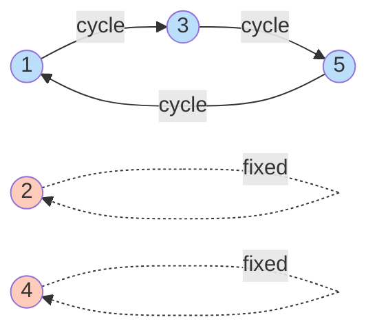
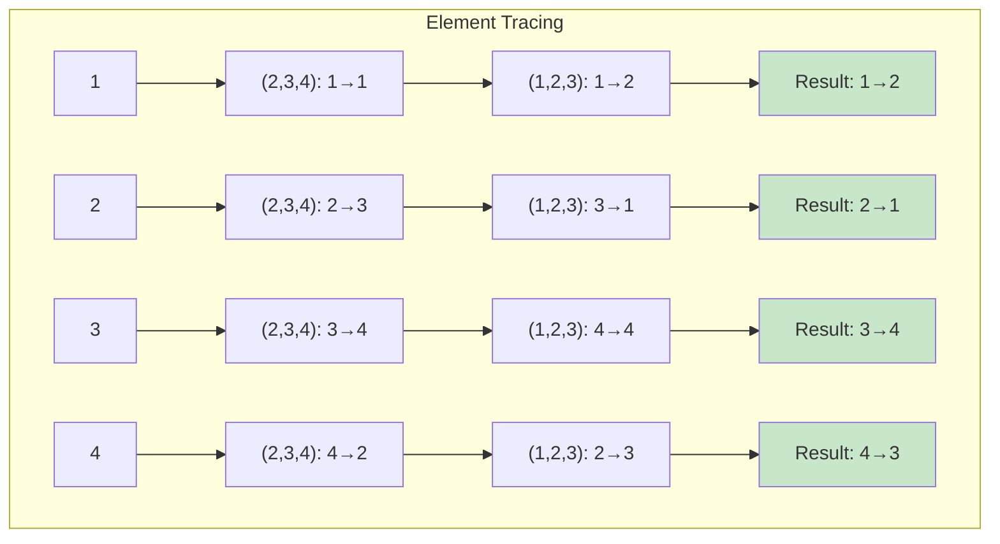

# Cycle Notation

## Motivation

Two-row notation for permutations is cumbersome. Cycle notation provides a compact, intuitive way to write permutations by tracking how elements move in cycles.

## Cycles

**Definition**: A **cycle** of length $k$ (or **$k$-cycle**) is a permutation $\sigma$ that cyclically permutes $k$ elements and fixes all others.

**Notation**: $(a_1\,a_2\,\ldots\,a_k)$ denotes the cycle where:
- $a_1 \to a_2 \to a_3 \to \cdots \to a_k \to a_1$
- All other elements are fixed

### Example 1

The cycle $(1\,3\,5)$ means:
- $1 \to 3$
- $3 \to 5$
- $5 \to 1$
- $2 \to 2$ (fixed)
- $4 \to 4$ (fixed)

In two-row notation (in $S_5$):
$$(1\,3\,5) = \begin{pmatrix} 1 & 2 & 3 & 4 & 5 \\ 3 & 2 & 5 & 4 & 1 \end{pmatrix}$$

## Special Cycles

**Transposition**: A 2-cycle $(a\,b)$ that swaps two elements.

**Example**: $(2\,7)$ swaps 2 and 7, fixes everything else.

**3-cycle**: $(a\,b\,c)$ with $a \to b \to c \to a$.

**Fixed point**: If $k$ doesn't appear in the cycle notation, then $\sigma(k) = k$.

## Writing Permutations in Cycle Notation

Every permutation can be written as a product of **disjoint cycles**.

**Procedure**:
1. Start with element 1, follow where it maps
2. Continue until returning to 1 (completing a cycle)
3. Move to the next element not yet in a cycle
4. Repeat until all elements are accounted for

### Example 2

$$\sigma = \begin{pmatrix} 1 & 2 & 3 & 4 & 5 & 6 & 7 \\ 3 & 4 & 5 & 2 & 1 & 7 & 6 \end{pmatrix}$$

- Start with 1: $1 \to 3 \to 5 \to 1$. Cycle: $(1\,3\,5)$
- Next unused element 2: $2 \to 4 \to 2$. Cycle: $(2\,4)$
- Next unused element 6: $6 \to 7 \to 6$. Cycle: $(6\,7)$

Result: $\sigma = (1\,3\,5)(2\,4)(6\,7)$

### Example 3

$$\tau = \begin{pmatrix} 1 & 2 & 3 & 4 & 5 \\ 2 & 1 & 4 & 5 & 3 \end{pmatrix}$$

- $1 \to 2 \to 1$: $(1\,2)$
- $3 \to 4 \to 5 \to 3$: $(3\,4\,5)$

Result: $\tau = (1\,2)(3\,4\,5)$

## Disjoint Cycles

**Definition**: Cycles are **disjoint** if they have no elements in common.

**Example**: $(1\,3\,5)$ and $(2\,4)$ are disjoint. But $(1\,3)$ and $(3\,5)$ are NOT disjoint (share element 3).

**Theorem**: Disjoint cycles commute.

**Proof**: If cycles $\sigma$ and $\tau$ are disjoint, then for any $x$:
- If $\sigma$ moves $x$, then $\tau$ fixes $x$, so $(\sigma \tau)(x) = \sigma(x) = (\tau \sigma)(x)$
- If $\tau$ moves $x$, then $\sigma$ fixes $x$, so $(\sigma \tau)(x) = \tau(x) = (\tau \sigma)(x)$
- If both fix $x$, then $(\sigma \tau)(x) = x = (\tau \sigma)(x)$

Therefore, $\sigma \tau = \tau \sigma$. $\square$

### Example 4

$(1\,2)(3\,4\,5) = (3\,4\,5)(1\,2)$ since the cycles are disjoint.

But $(1\,2)(2\,3) \neq (2\,3)(1\,2)$ since they're NOT disjoint:
- $(1\,2)(2\,3) = (1\,2\,3)$
- $(2\,3)(1\,2) = (1\,3\,2)$

## Multiplying Cycles

For non-disjoint cycles, apply right-to-left.

### Example 5

Compute $(1\,2\,3)(2\,3\,4)$ by applying right-to-left:

Tracing each element:
- $1 \xrightarrow{(2\,3\,4)} 1 \xrightarrow{(1\,2\,3)} 2$
- $2 \xrightarrow{(2\,3\,4)} 3 \xrightarrow{(1\,2\,3)} 1$
- $3 \xrightarrow{(2\,3\,4)} 4 \xrightarrow{(1\,2\,3)} 4$
- $4 \xrightarrow{(2\,3\,4)} 2 \xrightarrow{(1\,2\,3)} 3$

**Result**: $(1\,2\,3)(2\,3\,4) = (1\,2)(3\,4)$

Alternatively in two-row form:
$$(2\,3\,4) = \begin{pmatrix} 1 & 2 & 3 & 4 \\ 1 & 3 & 4 & 2 \end{pmatrix}$$
$$(1\,2\,3) = \begin{pmatrix} 1 & 2 & 3 & 4 \\ 2 & 3 & 1 & 4 \end{pmatrix}$$

Composing gives $(1\,2)(3\,4)$.

## Cycle Decomposition

**Theorem**: Every permutation can be written uniquely (up to order) as a product of disjoint cycles.

**Proof**: Follow the algorithm above. Disjoint cycles partition the elements, so the decomposition is unique. $\square$

### Example 6

$$\sigma = \begin{pmatrix} 1 & 2 & 3 & 4 & 5 & 6 & 7 & 8 \\ 4 & 1 & 6 & 2 & 5 & 8 & 7 & 3 \end{pmatrix}$$

Trace cycles:
- $1 \to 4 \to 2 \to 1$: $(1\,4\,2)$
- $3 \to 6 \to 8 \to 3$: $(3\,6\,8)$
- $5 \to 5$: (fixed point, omit)
- $7 \to 7$: (fixed point, omit)

Result: $\sigma = (1\,4\,2)(3\,6\,8)$

## Order of a Cycle

**Theorem**: The order of a $k$-cycle is $k$.

**Proof**: $(a_1\,\ldots\,a_k)^k = \text{id}$ (cycling $k$ times returns to start), and no smaller power equals identity. $\square$

**Example**: $|(1\,2\,3\,4\,5)| = 5$.

## Order of a Product of Disjoint Cycles

**Theorem**: If $\sigma = \sigma_1 \sigma_2 \cdots \sigma_m$ where $\sigma_i$ are disjoint cycles of lengths $k_1, k_2, \ldots, k_m$, then:
$$|\sigma| = \text{lcm}(k_1, k_2, \ldots, k_m)$$

**Proof**: Since disjoint cycles commute and act on separate elements, $\sigma^n = \sigma_1^n \sigma_2^n \cdots \sigma_m^n = \text{id}$ iff each $\sigma_i^n = \text{id}$, which happens iff $k_i | n$ for all $i$. The smallest such $n$ is $\text{lcm}(k_1, \ldots, k_m)$. $\square$

### Example 7

$\sigma = (1\,2\,3)(4\,5)(6\,7\,8\,9)$

Cycle lengths: 3, 2, 4

Order: $|\sigma| = \text{lcm}(3, 2, 4) = 12$

## Inverse of a Cycle

**Theorem**: The inverse of cycle $(a_1\,a_2\,\ldots\,a_k)$ is $(a_k\,a_{k-1}\,\ldots\,a_1)$ (reverse the cycle).

**Proof**: Reversing the cycle undoes the mapping. $\square$

### Example 8

$(1\,2\,3\,4)^{-1} = (4\,3\,2\,1) = (1\,4\,3\,2)$ (equivalent cycles)

For disjoint cycle product:
$$(1\,2\,3)(4\,5\,6)^{-1} = (3\,2\,1)(6\,5\,4) = (1\,3\,2)(4\,6\,5)$$

## Cycle Types

**Definition**: The **cycle type** of a permutation is the list of cycle lengths in its disjoint cycle decomposition.

**Example**:
- $(1\,2\,3)(4\,5)$ has cycle type $[3, 2]$
- $(1\,2)(3\,4)(5\,6)$ has cycle type $[2, 2, 2]$
- $(1\,2\,3\,4\,5)$ has cycle type $[5]$

**Notation**: Often written as partition: $3 + 2 = 5$ or multiset.

Two permutations are conjugate iff they have the same cycle type (proven later).

## Standard Form

**Convention**: Write cycles in increasing order of first elements, with first element smallest in each cycle.

**Example**: $(2\,5\,3)(1\,4)$ in standard form is $(1\,4)(2\,5\,3)$ or $(1\,4)(2\,3\,5)$.

## Converting Between Notations

**Two-row to cycle**: Trace through where elements map.

**Cycle to two-row**: Expand each cycle.

**One-line to cycle**: Interpret as $i \to \sigma(i)$ and trace cycles.

### Example 9

Convert one-line $[3, 1, 5, 2, 4]$ to cycle notation:
- $1 \to 3 \to 5 \to 4 \to 2 \to 1$

Result: $(1\,3\,5\,4\,2)$

## Applications

Cycle notation is essential for:
- Computing with permutations efficiently
- Determining order of permutations
- Understanding conjugacy classes
- Analyzing symmetries in combinatorics

## Summary

Key facts about cycle notation:
- Every permutation uniquely decomposes into disjoint cycles
- Disjoint cycles commute
- Order equals lcm of cycle lengths
- Inverse: reverse each cycle
- Cycle type determines conjugacy class

Cycle notation is the standard, efficient way to work with permutations in practice.
