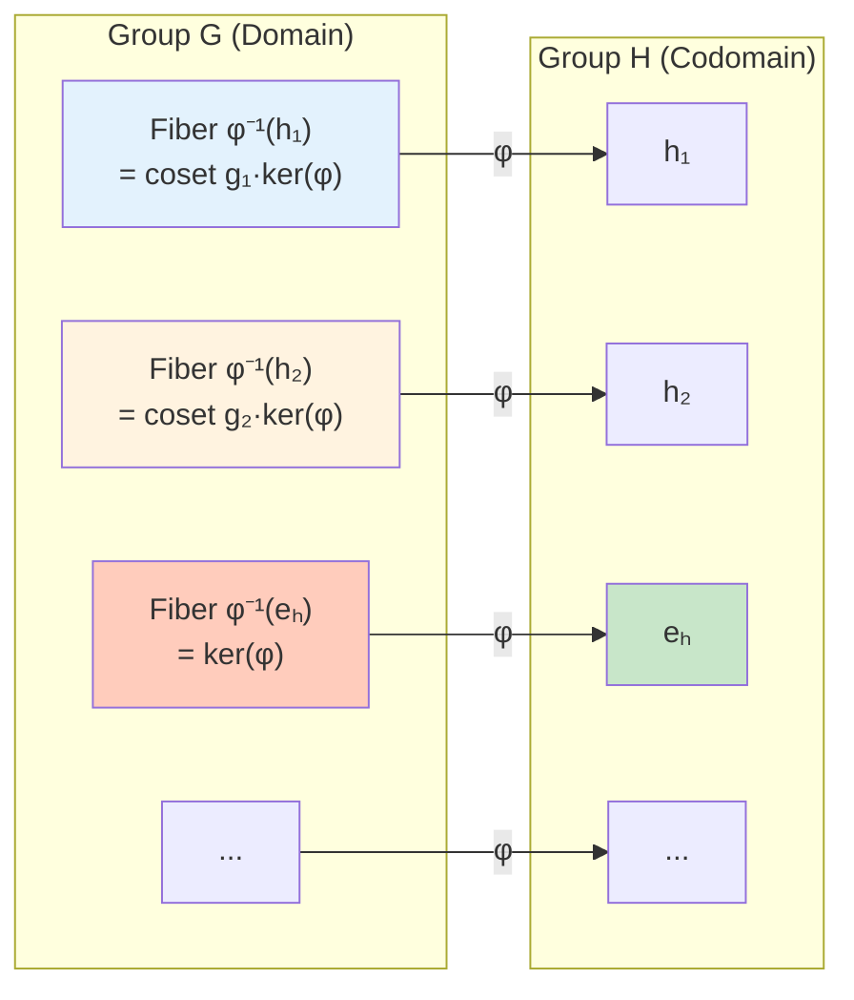

# Kernels and Images

## Introduction

Associated with every group homomorphism $\phi: G \to H$ are two fundamental subgroups: the **kernel** in the domain and the **image** in the codomain. These subgroups encode critical information about the structure of the homomorphism and provide the foundation for the Isomorphism Theorems.

## The Kernel

**Definition**: The **kernel** of a homomorphism $\phi: G \to H$ is the set of elements in $G$ that map to the identity in $H$:

$$\ker(\phi) = \{g \in G : \phi(g) = e_H\} = \phi^{-1}(\{e_H\})$$

The kernel consists of all elements that are "collapsed" to the identity by $\phi$.

### Kernel is a Normal Subgroup

**Theorem 1**: For any homomorphism $\phi: G \to H$, the kernel $\ker(\phi)$ is a normal subgroup of $G$.

**Proof**: We verify the conditions systematically.

**Subgroup**:
- Non-empty: $e_G \in \ker(\phi)$ since $\phi(e_G) = e_H$
- Closure: If $a, b \in \ker(\phi)$, then $\phi(ab) = \phi(a)\phi(b) = e_H \cdot e_H = e_H$, so $ab \in \ker(\phi)$
- Inverses: If $a \in \ker(\phi)$, then $\phi(a^{-1}) = \phi(a)^{-1} = e_H^{-1} = e_H$, so $a^{-1} \in \ker(\phi)$

**Normality**: For any $k \in \ker(\phi)$ and $g \in G$:
$$\phi(gkg^{-1}) = \phi(g)\phi(k)\phi(g^{-1}) = \phi(g) \cdot e_H \cdot \phi(g)^{-1} = \phi(g)\phi(g)^{-1} = e_H$$

Therefore $gkg^{-1} \in \ker(\phi)$ for all $g \in G$, proving that $\ker(\phi) \triangleleft G$. $\square$

**Remark**: This theorem shows that kernels of homomorphisms are exactly the normal subgroups that arise naturally from structure-preserving maps.

### Fundamental Examples of Kernels

**Example 1: Determinant**

For $\det: GL_n(\mathbb{R}) \to \mathbb{R}^*$:
$$\ker(\det) = \{A \in GL_n(\mathbb{R}) : \det(A) = 1\} = SL_n(\mathbb{R})$$

The **special linear group** $SL_n(\mathbb{R})$ consists of all $n \times n$ matrices with determinant 1. For instance:
$$\begin{pmatrix} 2 & 0 \\ 0 & 1/2 \end{pmatrix} \in SL_2(\mathbb{R}) \quad \text{since } \det = 2 \cdot \frac{1}{2} = 1$$

**Example 2: Sign Homomorphism**

For $\text{sgn}: S_n \to \{-1, +1\}$:
$$\ker(\text{sgn}) = A_n = \{\sigma \in S_n : \sigma \text{ is even}\}$$

The **alternating group** $A_n$ consists of all even permutations. For instance, in $S_3$:
$$A_3 = \{e, (1\,2\,3), (1\,3\,2)\}$$
with $|A_3| = 3 = |S_3|/2$.

**Example 3: Modular Reduction**

For $\phi: \mathbb{Z} \to \mathbb{Z}_n$ defined by $\phi(k) = k \bmod n$:
$$\ker(\phi) = \{k \in \mathbb{Z} : k \equiv 0 \pmod{n}\} = n\mathbb{Z}$$

The kernel consists of all multiples of $n$. For example, if $n = 5$:
$$\ker(\phi) = \{\ldots, -10, -5, 0, 5, 10, \ldots\}$$

**Example 4: Evaluation Homomorphism**

Consider the evaluation map $\phi: \mathbb{R}[x] \to \mathbb{R}$ defined by $\phi(p(x)) = p(a)$ for fixed $a \in \mathbb{R}$:
$$\ker(\phi) = \{p(x) \in \mathbb{R}[x] : p(a) = 0\} = \langle x - a \rangle$$

The kernel consists of all polynomials having $a$ as a root, which is the ideal generated by $(x - a)$.

**Example 5: Trivial Homomorphism**

The trivial homomorphism $\phi: G \to H$ defined by $\phi(g) = e_H$ for all $g$ has:
$$\ker(\phi) = G$$

Conversely, the identity map $\text{id}: G \to G$ has:
$$\ker(\text{id}) = \{e_G\}$$

## The Image

**Definition**: The **image** of a homomorphism $\phi: G \to H$ is the set of all elements in $H$ that are actually hit by $\phi$:

$$\text{Im}(\phi) = \phi(G) = \{\phi(g) : g \in G\} \subseteq H$$

Also called the **range** of $\phi$.

### Image is a Subgroup

**Theorem 2**: For any homomorphism $\phi: G \to H$, the image $\text{Im}(\phi)$ is a subgroup of $H$.

**Proof**: Apply the subgroup test.
- Non-empty: $e_H = \phi(e_G) \in \text{Im}(\phi)$
- Closure: If $h_1, h_2 \in \text{Im}(\phi)$, then $h_1 = \phi(g_1)$ and $h_2 = \phi(g_2)$ for some $g_1, g_2 \in G$. Thus:
  $$h_1 h_2 = \phi(g_1)\phi(g_2) = \phi(g_1 g_2) \in \text{Im}(\phi)$$
- Inverses: If $h = \phi(g) \in \text{Im}(\phi)$, then:
  $$h^{-1} = \phi(g)^{-1} = \phi(g^{-1}) \in \text{Im}(\phi)$$
Therefore $\text{Im}(\phi) \leq H$. $\square$

**Important Note**: The image need not be normal in $H$. It is normal in $H$ if and only if $\phi$ is surjective or the image is normal as a subgroup.

### Fundamental Examples of Images

**Example 6: Sign Homomorphism**

For $\text{sgn}: S_n \to \{-1, +1\}$:
$$\text{Im}(\text{sgn}) = \{-1, +1\}$$

The map is surjective because $(1\,2)$ (any transposition) maps to $-1$, and $e$ maps to $+1$.

**Example 7: Projection Map**

For $\pi_1: G_1 \times G_2 \to G_1$ defined by $\pi_1((g_1, g_2)) = g_1$:
$$\text{Im}(\pi_1) = G_1$$

This projection is surjective.

**Example 8: Inclusion of Subgroup**

For $\iota: H \to G$ (inclusion of subgroup $H \leq G$):
$$\text{Im}(\iota) = H$$

The image equals the domain.

**Example 9: Exponential Map**

For $\exp: \mathbb{R} \to \mathbb{C}^*$ defined by $\exp(x) = e^{ix}$:
$$\text{Im}(\exp) = \{z \in \mathbb{C} : |z| = 1\} = S^1$$

The image is the unit circle in the complex plane.

## Relationship to Surjectivity and Injectivity

**Theorem 3 (Characterizations)**: Let $\phi: G \to H$ be a homomorphism.
1. $\phi$ is injective $\Leftrightarrow$ $\ker(\phi) = \{e_G\}$
2. $\phi$ is surjective $\Leftrightarrow$ $\text{Im}(\phi) = H$
3. $\phi$ is an isomorphism $\Leftrightarrow$ $\ker(\phi) = \{e_G\}$ and $\text{Im}(\phi) = H$

The first statement was proved in the previous section. The second and third are immediate from definitions.

## Fibers and Cosets

One of the most important insights is that the kernel organizes the domain into fibers, which correspond exactly to cosets.

**Definition**: The **fiber** over $h \in H$ is:
$$\phi^{-1}(h) = \{g \in G : \phi(g) = h\}$$

**Theorem 4 (Fiber-Coset Correspondence)**: Let $\phi: G \to H$ be a homomorphism with kernel $N = \ker(\phi)$. Then two elements $a, b \in G$ map to the same element in $H$ if and only if they belong to the same left coset of $N$:

$$\phi(a) = \phi(b) \Leftrightarrow aN = bN$$

**Proof**:
$$\begin{align}
\phi(a) = \phi(b) &\Leftrightarrow \phi(a)\phi(b)^{-1} = e_H \\
&\Leftrightarrow \phi(ab^{-1}) = e_H \\
&\Leftrightarrow ab^{-1} \in \ker(\phi) = N \\
&\Leftrightarrow ab^{-1} \in N \\
&\Leftrightarrow aN = bN
\end{align}$$

The last equivalence follows from the coset characterization. $\square$

**Corollary**: The fibers of $\phi$ partition $G$ into the cosets of $\ker(\phi)$.

**Example 10**: Consider $\phi: \mathbb{Z} \to \mathbb{Z}_3$ with $\phi(k) = k \bmod 3$. The kernel is $3\mathbb{Z}$.

The fibers are:
- $\phi^{-1}(0) = 3\mathbb{Z} = \{\ldots, -6, -3, 0, 3, 6, \ldots\}$
- $\phi^{-1}(1) = 1 + 3\mathbb{Z} = \{\ldots, -5, -2, 1, 4, 7, \ldots\}$
- $\phi^{-1}(2) = 2 + 3\mathbb{Z} = \{\ldots, -4, -1, 2, 5, 8, \ldots\}$

These are precisely the cosets of $3\mathbb{Z}$ in $\mathbb{Z}$.

## Size Relationships

For finite groups, the kernel and image determine the structure completely.

**Theorem 5**: If $G$ is finite and $\phi: G \to H$ is a homomorphism, then:
$$|G| = |\ker(\phi)| \cdot |\text{Im}(\phi)|$$

**Proof**: By Theorem 4, the fibers of $\phi$ are the cosets of $\ker(\phi)$. Each fiber has size $|\ker(\phi)|$, and there are exactly $|\text{Im}(\phi)|$ distinct fibers (one for each element in the image). Therefore:
$$|G| = (\text{number of fibers}) \times (\text{size of each fiber}) = |\text{Im}(\phi)| \cdot |\ker(\phi)|$$
$\square$

**Example 11**: For $\text{sgn}: S_4 \to \{-1, +1\}$:
- $|S_4| = 24$
- $|\text{Im}(\text{sgn})| = 2$
- Therefore $|\ker(\text{sgn})| = |A_4| = 24/2 = 12$

## Computing Kernels and Images

**Example 12**: Consider $\phi: \mathbb{Z}_{12} \to \mathbb{Z}_4$ defined by $\phi(x) = x \bmod 4$.

**Verify homomorphism**: $\phi(a + b) = (a + b) \bmod 4 = ((a \bmod 4) + (b \bmod 4)) \bmod 4 = \phi(a) + \phi(b)$. ✓

**Kernel**: Which elements map to 0?
$$\ker(\phi) = \{x \in \mathbb{Z}_{12} : x \equiv 0 \pmod{4}\} = \{0, 4, 8\}$$

This is the cyclic subgroup $\langle 4 \rangle$ of order 3.

**Image**: What elements are actually hit?
- $\phi(0) = 0$, $\phi(1) = 1$, $\phi(2) = 2$, $\phi(3) = 3$
- $\phi(4) = 0$, $\phi(5) = 1$, etc.

Therefore $\text{Im}(\phi) = \{0, 1, 2, 3\} = \mathbb{Z}_4$.

**Verification**: $|\mathbb{Z}_{12}| = 12 = |\ker(\phi)| \cdot |\text{Im}(\phi)| = 3 \cdot 4$. ✓

**Example 13**: Consider $\phi: D_4 \to \mathbb{Z}_2$ where $D_4$ is the dihedral group of order 8 (symmetries of a square), defined by $\phi(r^i s^j) = j \bmod 2$ (where $r$ is rotation, $s$ is reflection).

**Kernel**: Elements with $j = 0$ (pure rotations):
$$\ker(\phi) = \{e, r, r^2, r^3\}$$

This is the cyclic subgroup of rotations, isomorphic to $\mathbb{Z}_4$.

**Image**: Can achieve both $0$ and $1$:
$$\text{Im}(\phi) = \{0, 1\} = \mathbb{Z}_2$$

**Verification**: $|D_4| = 8 = 4 \cdot 2 = |\ker(\phi)| \cdot |\text{Im}(\phi)|$. ✓

## Preview: Connection to Quotient Groups

The fiber-coset correspondence reveals a deep connection:

**First Isomorphism Theorem (Preview)**: For any homomorphism $\phi: G \to H$:
$$G/\ker(\phi) \cong \text{Im}(\phi)$$

This says that the quotient of $G$ by the kernel is isomorphic to the image. In other words, "quotienting out" the kernel eliminates exactly the redundancy in $\phi$.

For Example 12: $\mathbb{Z}_{12}/\langle 4 \rangle \cong \mathbb{Z}_4$.

For Example 11: $S_4/A_4 \cong \mathbb{Z}_2$.

## Preimages of Subgroups

**Theorem 6**: Let $\phi: G \to H$ be a homomorphism.
1. If $K \leq H$, then $\phi^{-1}(K) \leq G$
2. If $K \triangleleft H$, then $\phi^{-1}(K) \triangleleft G$
3. $\ker(\phi) \subseteq \phi^{-1}(K)$ for any subgroup $K \leq H$

**Proof of (1)**: Let $K \leq H$ and set $L = \phi^{-1}(K) = \{g \in G : \phi(g) \in K\}$.
- Non-empty: $e_G \in L$ since $\phi(e_G) = e_H \in K$
- Closure: If $a, b \in L$, then $\phi(a), \phi(b) \in K$, so $\phi(ab) = \phi(a)\phi(b) \in K$, thus $ab \in L$
- Inverses: If $a \in L$, then $\phi(a) \in K$, so $\phi(a^{-1}) = \phi(a)^{-1} \in K$, thus $a^{-1} \in L$

Therefore $L = \phi^{-1}(K) \leq G$. $\square$

## Summary

The kernel and image are fundamental invariants of any homomorphism:

**Kernel**:
- $\ker(\phi) = \{g \in G : \phi(g) = e_H\}$
- Always a normal subgroup: $\ker(\phi) \triangleleft G$
- Measures "how far from injective": $\phi$ injective $\Leftrightarrow$ $\ker(\phi) = \{e_G\}$
- Organizes domain into fibers (cosets)

**Image**:
- $\text{Im}(\phi) = \{\phi(g) : g \in G\}$
- Always a subgroup: $\text{Im}(\phi) \leq H$
- Measures "how far from surjective": $\phi$ surjective $\Leftrightarrow$ $\text{Im}(\phi) = H$
- May or may not be normal in $H$

**Key Relationships**:
- Fiber-coset correspondence: $\phi(a) = \phi(b) \Leftrightarrow a\ker(\phi) = b\ker(\phi)$
- Size formula: $|G| = |\ker(\phi)| \cdot |\text{Im}(\phi)|$ (finite groups)
- Foundation for First Isomorphism Theorem

The interplay between kernels, images, and cosets provides the foundation for understanding quotient groups and the fundamental isomorphism theorems.
