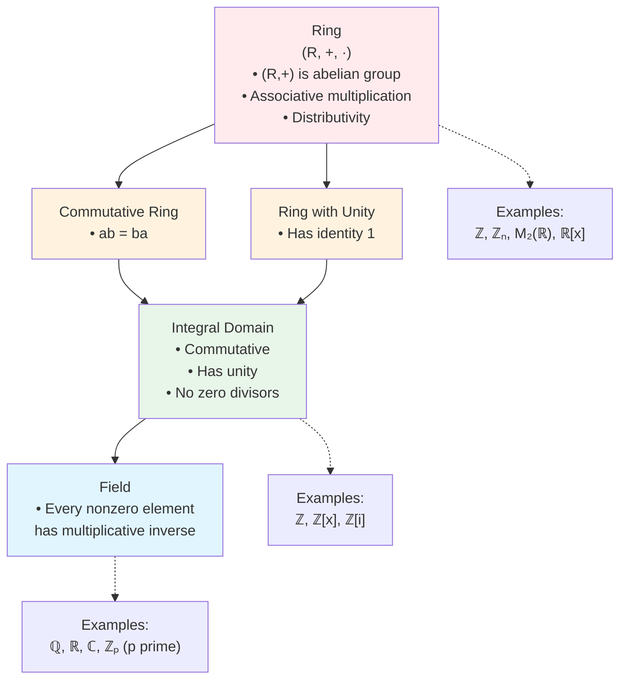

# Fields

## Definition

**Definition**: A **field** is a commutative ring with unity in which every non-zero element is a unit.

Equivalently: commutative ring where $(F \setminus \{0\}, \cdot)$ is a group.

## Ring/Field Classification Hierarchy

Understanding how rings, integral domains, and fields relate:

## Examples

- $\mathbb{Q}, \mathbb{R}, \mathbb{C}$ (familiar number fields)
- $\mathbb{Z}_p$ for prime $p$
- $\mathbb{Q}(\sqrt{2}) = \{a + b\sqrt{2} : a, b \in \mathbb{Q}\}$
- Finite fields $\mathbb{F}_{p^n}$ (Galois fields)

## Non-Examples

- $\mathbb{Z}$ (integral domain but not field: $2$ has no multiplicative inverse)
- $\mathbb{Z}_6$ (not integral domain: $2 \cdot 3 = 0$, so $2$ has no inverse)
- $\mathbb{R}[x]$ (integral domain but not field: polynomial $x$ has no inverse)

## Properties

**Theorem**: Every field is an integral domain.

**Proof**: If $ab = 0$ and $a \neq 0$, multiply by $a^{-1}$: $b = a^{-1}(ab) = a^{-1} \cdot 0 = 0$. $\square$

**Theorem**: Finite integral domains are fields.

**Characteristic**: $\text{char}(F) = 0$ or prime.

## $\mathbb{Z}_p$ for Prime $p$

**Theorem**: $\mathbb{Z}_p$ is a field iff $p$ is prime.

Every non-zero element has inverse when $p$ prime.

## Field Extensions

$\mathbb{Q} \subseteq \mathbb{R} \subseteq \mathbb{C}$ (tower of fields).

Basis of Galois theory.

## Summary

- Field: commutative ring, all non-zero elements invertible
- Examples: $\mathbb{Q}, \mathbb{R}, \mathbb{C}, \mathbb{Z}_p$ (prime)
- Every field is integral domain
- Finite integral domains are fields
- Foundation for advanced algebra

Fields are the most structured rings, where division is always possible (except by zero).
