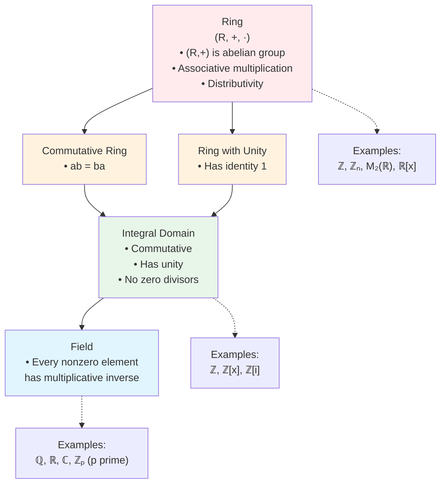

# Fields

## Introduction

Fields represent the pinnacle of ring structures, possessing the richest algebraic properties. In a field, we can perform all four basic arithmetic operations—addition, subtraction, multiplication, and division (except by zero)—just as we do with rational or real numbers. This makes fields the natural setting for solving equations and developing much of algebra.

The concept of a field unifies our understanding of number systems like $\mathbb{Q}$, $\mathbb{R}$, and $\mathbb{C}$, while also encompassing finite structures like $\mathbb{Z}_p$ (for prime $p$). Fields form the foundation for Galois theory, algebraic geometry, and modern cryptography.

## Definition

**Definition**: A **field** is a commutative ring with unity in which every non-zero element is a unit (has a multiplicative inverse).

Equivalently: $F$ is a field if:
1. $(F, +, \cdot)$ is a commutative ring with unity $1 \neq 0$
2. $(F \setminus \{0\}, \cdot)$ forms a group under multiplication

**Unpacking the definition**: A field must satisfy:
- **Commutativity**: $ab = ba$ for all $a, b \in F$
- **Unity exists**: There is an element $1 \in F$ with $1 \neq 0$ such that $1 \cdot a = a$ for all $a$
- **Every non-zero element invertible**: For all $a \neq 0$ in $F$, there exists $a^{-1} \in F$ such that $a \cdot a^{-1} = 1$

**Intuition**: In a field, we can always divide by non-zero elements. This makes equation solving much more straightforward than in general rings.

## Ring/Field Classification Hierarchy

Understanding how rings, integral domains, and fields relate:

**Key observation**: Fields sit at the top of the hierarchy. Every field is automatically an integral domain (and hence a commutative ring with unity), but the converse is false.

## Examples

### Example 1: $\mathbb{Q}$ (Rationals)

The rational numbers form a field under usual addition and multiplication.

Every non-zero rational $\frac{a}{b}$ has inverse $\frac{b}{a}$, so division is always possible.

### Example 2: $\mathbb{R}$ (Real Numbers)

The real numbers form a field. Beyond being a field, $\mathbb{R}$ has additional structure (completeness, order) making it fundamental for analysis.

### Example 3: $\mathbb{C}$ (Complex Numbers)

The complex numbers form a field. Every non-zero complex number $z = a + bi$ has inverse:
$$z^{-1} = \frac{1}{z} = \frac{\bar{z}}{|z|^2} = \frac{a - bi}{a^2 + b^2}$$

Remarkably, $\mathbb{C}$ is algebraically closed: every polynomial with complex coefficients has a root in $\mathbb{C}$ (Fundamental Theorem of Algebra).

### Example 4: $\mathbb{Z}_p$ for Prime $p$

When $p$ is prime, $\mathbb{Z}_p$ forms a field of order $p$.

For $p = 5$: The inverse of 2 is 3 since $2 \cdot 3 = 6 \equiv 1 \pmod 5$.

Why prime? When $p$ is prime, $\gcd(a, p) = 1$ for all $0 < a < p$, guaranteeing that each non-zero element has an inverse by Bézout's identity.

### Example 5: $\mathbb{Q}(\sqrt{2})$

The set $\mathbb{Q}(\sqrt{2}) = \{a + b\sqrt{2} : a, b \in \mathbb{Q}\}$ forms a field.

To find the inverse of $a + b\sqrt{2}$ (with $a, b$ not both zero):
$$(a + b\sqrt{2})^{-1} = \frac{1}{a + b\sqrt{2}} = \frac{a - b\sqrt{2}}{(a + b\sqrt{2})(a - b\sqrt{2})} = \frac{a - b\sqrt{2}}{a^2 - 2b^2}$$

Since $a^2 - 2b^2 \neq 0$ when $a + b\sqrt{2} \neq 0$ (as $\sqrt{2}$ is irrational), this is well-defined.

### Example 6: Finite Fields $\mathbb{F}_{p^n}$ (Galois Fields)

For any prime power $p^n$, there exists a unique (up to isomorphism) field with $p^n$ elements, denoted $\mathbb{F}_{p^n}$ or $GF(p^n)$.

Example: $\mathbb{F}_4$ has 4 elements and can be constructed as $\mathbb{Z}_2[x]/\langle x^2 + x + 1 \rangle$.

These finite fields are crucial in coding theory, cryptography, and algebraic geometry.

## Non-Examples

### Non-Example 1: $\mathbb{Z}$ (Integers)

The integers form an integral domain but NOT a field. The element 2 has no multiplicative inverse in $\mathbb{Z}$ (since $\frac{1}{2} \notin \mathbb{Z}$).

Only $\pm 1$ are units in $\mathbb{Z}$.

### Non-Example 2: $\mathbb{Z}_6$

$\mathbb{Z}_6$ is not a field because:
1. It has zero divisors: $2 \cdot 3 = 0$
2. Not even an integral domain, so cannot be a field
3. The element 2 has no multiplicative inverse (if it did, we could divide $2 \cdot 3 = 0$ by 2 to get $3 = 0$, a contradiction)

### Non-Example 3: $\mathbb{R}[x]$ (Polynomial Ring)

Polynomials over $\mathbb{R}$ form an integral domain but not a field. The polynomial $x$ has no multiplicative inverse in $\mathbb{R}[x]$ (there is no polynomial $p(x)$ such that $x \cdot p(x) = 1$).

### Non-Example 4: $M_2(\mathbb{R})$ (Matrix Ring)

Matrices fail on multiple counts:
- Not commutative (so not even an integral domain)
- Contain zero divisors
- Not all non-zero matrices are invertible (only those with non-zero determinant)

## Properties

### Theorem 1: Every Field is an Integral Domain

**Theorem**: Every field is an integral domain.

**Proof**: Let $F$ be a field. We need to verify:
1. **Commutative**: By definition of field
2. **Has unity**: By definition of field
3. **No zero divisors**: Suppose $ab = 0$ with $a \neq 0$. Since $F$ is a field, $a$ has inverse $a^{-1}$. Multiply both sides by $a^{-1}$:
   $$b = 1 \cdot b = (a^{-1}a)b = a^{-1}(ab) = a^{-1} \cdot 0 = 0$$
   Thus if $ab = 0$ and $a \neq 0$, then $b = 0$. $\square$

**Significance**: This theorem places fields within the hierarchy. Every field has all the nice properties of integral domains (cancellation, etc.) plus the additional property that every non-zero element is invertible.

### Theorem 2: Finite Integral Domains are Fields

**Theorem**: Every finite integral domain is a field.

**Proof**: (From previous section, repeated for completeness)

Let $D$ be a finite integral domain with elements $\{d_1, d_2, \ldots, d_n\}$. Take any $a \neq 0$ in $D$.

Consider the products: $ad_1, ad_2, \ldots, ad_n$.

**Claim**: These are all distinct.

If $ad_i = ad_j$, then by cancellation (valid in integral domains), $d_i = d_j$.

Since we have $n$ distinct products in a set of size $n$, we must have $\{ad_1, ad_2, \ldots, ad_n\} = \{d_1, d_2, \ldots, d_n\}$.

In particular, the identity $1$ appears in the list, so $ad_k = 1$ for some $k$. Thus $a$ has inverse $d_k$.

Since $a$ was arbitrary, every non-zero element has an inverse, making $D$ a field. $\square$

**Corollary**: $\mathbb{Z}_p$ is a field if and only if $p$ is prime.

(Since $\mathbb{Z}_p$ is an integral domain iff $p$ is prime, and finite integral domains are fields.)

### Theorem 3: Characteristic of a Field

**Theorem**: If $F$ is a field, then $\text{char}(F) = 0$ or $\text{char}(F)$ is prime.

**Proof**: Since every field is an integral domain, this follows from the corresponding theorem for integral domains. $\square$

**Examples**:
- $\text{char}(\mathbb{Q}) = \text{char}(\mathbb{R}) = \text{char}(\mathbb{C}) = 0$
- $\text{char}(\mathbb{Z}_p) = p$ for prime $p$
- $\text{char}(\mathbb{F}_{p^n}) = p$

### Theorem 4: Subfields

**Definition**: A subset $K \subseteq F$ is a **subfield** if $K$ is itself a field under the inherited operations.

**Subfield Test**: $K \subseteq F$ is a subfield if:
1. $K$ contains $0$ and $1$
2. $K$ is closed under subtraction and multiplication
3. If $a \in K$ and $a \neq 0$, then $a^{-1} \in K$ (closed under taking inverses)

**Examples**:
- $\mathbb{Q} \subseteq \mathbb{R} \subseteq \mathbb{C}$ (tower of subfields)
- $\mathbb{Q}(\sqrt{2}) \subseteq \mathbb{R}$ is a subfield
- $\mathbb{Z}_2 \subseteq \mathbb{F}_4$ (subfield of order 2 in field of order 4)

## Field Extensions

**Definition**: If $K \subseteq F$ is a subfield, we say $F$ is a **field extension** of $K$, written $F/K$ or $F:K$.

Examples:
- $\mathbb{R}/\mathbb{Q}$ (reals over rationals)
- $\mathbb{C}/\mathbb{R}$ (complex over reals)
- $\mathbb{Q}(\sqrt{2})/\mathbb{Q}$ (adjoining $\sqrt{2}$ to rationals)

Field extensions form the basis of **Galois theory**, which studies the relationship between field extensions and group theory, with applications to proving impossibility results (like the insolvability of the quintic).

**Degree of extension**: $[F:K]$ denotes the dimension of $F$ as a vector space over $K$.

Examples:
- $[\mathbb{C}:\mathbb{R}] = 2$ (basis: $\{1, i\}$)
- $[\mathbb{Q}(\sqrt{2}):\mathbb{Q}] = 2$ (basis: $\{1, \sqrt{2}\}$)
- $[\mathbb{R}:\mathbb{Q}] = \infty$ (uncountable dimension)

## Constructing New Fields

### Quotient Construction

If $F$ is a field and $p(x) \in F[x]$ is irreducible, then $F[x]/\langle p(x) \rangle$ is a field.

Example: $\mathbb{R}[x]/\langle x^2 + 1 \rangle \cong \mathbb{C}$.

We identify $x$ with $i$, and the relation $x^2 + 1 = 0$ becomes $i^2 + 1 = 0$, giving $i^2 = -1$.

### Field of Fractions

Every integral domain $D$ can be embedded in a field $\text{Frac}(D)$ called its **field of fractions** (analogous to constructing $\mathbb{Q}$ from $\mathbb{Z}$).

Examples:
- $\text{Frac}(\mathbb{Z}) = \mathbb{Q}$
- $\text{Frac}(\mathbb{R}[x]) = \mathbb{R}(x)$ (rational functions)
- $\text{Frac}(\mathbb{Z}[i]) = \mathbb{Q}(i)$ (Gaussian rationals)

## Applications

### Cryptography

Finite fields $\mathbb{F}_{p^n}$ are fundamental in:
- Elliptic curve cryptography (ECC)
- Advanced Encryption Standard (AES)
- Error-correcting codes

### Algebraic Geometry

Fields provide coordinates for geometric spaces. Studying varieties over different fields reveals deep geometric structure.

### Galois Theory

Understanding which polynomials are solvable by radicals reduces to studying field extensions and their automorphism groups.

## Summary

- **Field**: commutative ring where all non-zero elements are invertible
- **Examples**: $\mathbb{Q}, \mathbb{R}, \mathbb{C}, \mathbb{Z}_p$ (prime $p$)
- **Every field is an integral domain** (no zero divisors)
- **Finite integral domains are fields** (powerful result)
- **Characteristic is 0 or prime**
- **Field extensions** form basis for Galois theory
- **Applications** in cryptography, coding theory, and geometry

Fields are the most structured rings, where division is always possible (except by zero), making them the ideal setting for algebraic manipulation.

## Key Takeaways

1. Fields have the richest structure among rings—we can add, subtract, multiply, and divide (except by zero)
2. Every field is automatically an integral domain
3. $\mathbb{Z}_p$ is a field if and only if $p$ is prime
4. Finite integral domains must be fields (no exceptions)
5. Field characteristic is always 0 or prime
6. Field extensions connect algebra to geometry and number theory
7. Fields provide the foundation for Galois theory and modern cryptography
8. The concept unifies familiar number systems under a common algebraic framework
