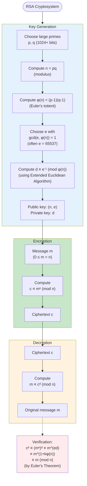

# RSA Algorithm

## Overview

RSA (Rivest-Shamir-Adleman, 1977) is a public-key cryptosystem enabling:
- Encryption/decryption without shared secret key
- Digital signatures
- Key exchange

**Security**: Based on difficulty of factoring large composites.

## RSA Algorithm Flowchart

## Key Generation

1. **Choose primes**: Select large primes $p, q$ (typically $1024+$ bits each)
2. **Compute modulus**: $n = pq$
3. **Compute totient**: $\phi(n) = (p-1)(q-1)$
4. **Choose public exponent**: $e$ with $\gcd(e, \phi(n)) = 1$ (often $e = 65537$)
5. **Compute private exponent**: $d \equiv e^{-1} \pmod{\phi(n)}$

**Public key**: $(n, e)$
**Private key**: $(n, d)$ (keep $d, p, q$ secret)

## Encryption

**Message**: $m$ with $0 \leq m < n$

**Ciphertext**: $c \equiv m^e \pmod{n}$

Anyone with public key $(n, e)$ can encrypt.

## Decryption

**Ciphertext**: $c$

**Message**: $m \equiv c^d \pmod{n}$

Only holder of private key $d$ can decrypt.

## Why It Works

$$c^d \equiv (m^e)^d \equiv m^{ed} \pmod{n}$$

Since $ed \equiv 1 \pmod{\phi(n)}$, write $ed = 1 + k\phi(n)$:
$$m^{ed} = m^{1 + k\phi(n)} = m \cdot (m^{\phi(n)})^k \equiv m \cdot 1^k = m \pmod{n}$$

by Euler's theorem. $\square$

## Example (Small Numbers)

**Setup**:
- $p = 61, q = 53$
- $n = 3233, \phi(n) = 3120$
- $e = 17$ (check: $\gcd(17, 3120) = 1$)
- $d = 2753$ (since $17 \cdot 2753 \equiv 1 \pmod{3120}$)

**Encryption** of $m = 123$:
$$c = 123^{17} \bmod 3233 = 855$$

**Decryption**:
$$m = 855^{2753} \bmod 3233 = 123$$

## Security

**Hardness assumption**: Given $n = pq$, factoring $n$ is computationally infeasible for large $n$.

Current recommendations: $n \geq 2048$ bits.

**Attacks**:
- Factor $n$ to find $p, q$, then compute $\phi(n)$ and $d$
- Small message attacks (use padding)
- Timing attacks (use constant-time implementations)

## Practical Considerations

**Padding**: OAEP (Optimal Asymmetric Encryption Padding) prevents attacks

**Hybrid encryption**: RSA encrypts symmetric key, symmetric cipher encrypts data (RSA is slow)

**Key sizes**: 2048-bit minimum, 3072-4096-bit recommended

## Summary

- Public key: $(n, e)$, private key: $d$
- Encrypt: $c = m^e \bmod n$
- Decrypt: $m = c^d \bmod n$
- Security: factoring problem
- Foundation: Euler's theorem

RSA revolutionized cryptography by enabling secure communication without pre-shared secrets.
