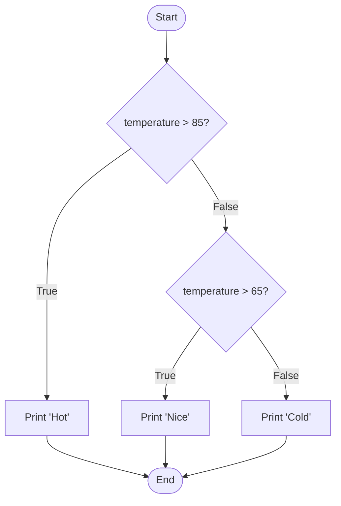
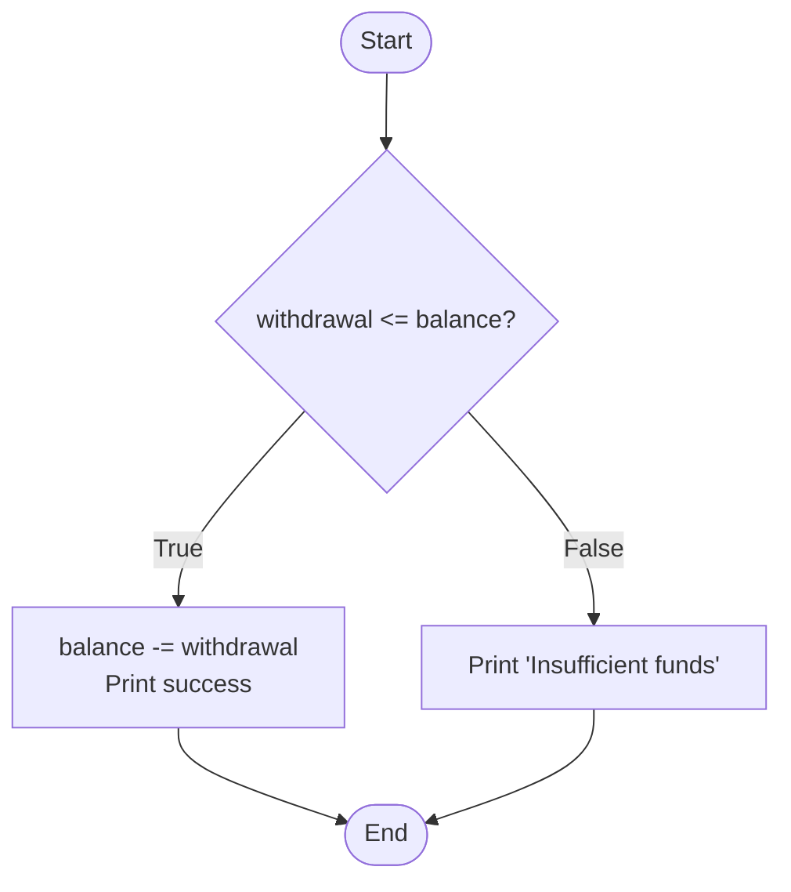

## `if`, `elif`, `else` (Branching)

Conditionals let your program choose one path out of many. The `if/elif/else` structure is the primary way to implement branching logic in Python - deciding what code to execute based on conditions.

```python
temperature = 75

if temperature > 85:
    print("Hot")
elif temperature > 65:
    print("Nice")
else:
    print("Cold")
```

Key ideas:
- Conditions are checked **top-to-bottom**
- Only the **first matching branch** runs
- `else` is optional and catches "everything else"
- Each branch is a block defined by indentation

Here's how the decision flow works visually:



---

## The Basic `if` Statement

The simplest conditional has just one branch:

```python
age = 20

if age >= 18:
    print("You can vote")
    print("You are an adult")
# If condition is False, nothing happens
```

The block under `if` executes only when the condition is `True`. If the condition is `False`, Python skips the entire block.

### `if-else`: Two-Way Decision

When you want to do one thing if true, another if false:

```python
balance = 100
withdrawal = 150

if withdrawal <= balance:
    balance -= withdrawal
    print(f"Withdrew ${withdrawal}")
else:
    print("Insufficient funds")
```

The `else` block runs when the `if` condition is `False`. You never need a condition after `else` - it catches everything that didn't match.



---

## `elif`: Multiple Conditions

When you have more than two possibilities, use `elif` (short for "else if"):

```python
score = 85

if score >= 90:
    grade = "A"
elif score >= 80:
    grade = "B"
elif score >= 70:
    grade = "C"
elif score >= 60:
    grade = "D"
else:
    grade = "F"

print(f"Grade: {grade}")
```

**Important**: Only the first matching branch runs. Once a condition matches, Python skips all remaining `elif` and `else` blocks:

```python
x = 15

# Only prints "Greater than 10" even though x > 5 is also True
if x > 10:
    print("Greater than 10")
elif x > 5:
    print("Greater than 5")   # Never reaches here
elif x > 0:
    print("Positive")         # Never reaches here
```

### Order Matters

Because only the first match runs, the order of conditions matters:

```python
# Wrong order - will never reach "Small"
if x > 0:
    print("Positive")  # Catches everything positive
elif x > 100:
    print("Large")     # Never reached if x > 0 is checked first
elif x > 10:
    print("Medium")    # Never reached
elif x > 0:
    print("Small")     # Never reached

# Correct order - check most specific first
if x > 100:
    print("Large")
elif x > 10:
    print("Medium")
elif x > 0:
    print("Small")
else:
    print("Non-positive")
```

---

## Nested Conditionals (And How to Avoid Them)

You *can* nest `if` statements inside each other:

```python
age = 20
has_ticket = True

if age >= 18:
    if has_ticket:
        print("Enter")
    else:
        print("Need a ticket")
else:
    print("Too young")
```

But deep nesting gets hard to read and maintain:

```python
# Hard to follow - 4 levels deep
if condition1:
    if condition2:
        if condition3:
            if condition4:
                do_something()
            else:
                handle_case_4()
        else:
            handle_case_3()
    else:
        handle_case_2()
else:
    handle_case_1()
```

### Flattening with `and`

Often you can combine conditions with `and` to avoid nesting:

```python
# Nested
if age >= 18:
    if has_ticket:
        print("Enter")

# Flattened with 'and'
if age >= 18 and has_ticket:
    print("Enter")
```

### Guard Clauses (Return Early)

In functions, guard clauses reduce nesting by handling "bad cases" first and returning early:

```python
# Deeply nested
def enter_event(age, has_ticket):
    if age >= 18:
        if has_ticket:
            return "Enter"
        else:
            return "Need a ticket"
    else:
        return "Too young"

# Guard clauses - much cleaner
def enter_event(age, has_ticket):
    if age < 18:
        return "Too young"
    if not has_ticket:
        return "Need a ticket"
    return "Enter"
```

This pattern is common in professional code:
1. Validate inputs early
2. Return early for error cases
3. Keep the "happy path" (normal case) at the bottom, unindented

---

## Conditional Expressions (Ternary Operator)

When you need a simple choice inside an expression, Python has a conditional expression:

```python
age = 17
label = "adult" if age >= 18 else "minor"
print(label)  # "minor"

# Equivalent to:
if age >= 18:
    label = "adult"
else:
    label = "minor"
```

### When to Use Ternary

Use conditional expressions when:
- The choice is simple (just selecting between two values)
- It improves readability

```python
# Good - simple and clear
status = "active" if user.is_logged_in else "inactive"
max_value = a if a > b else b
display_name = name if name else "Anonymous"
```

Avoid when it becomes confusing:

```python
# Bad - too complex for one line
result = value1 if condition1 else value2 if condition2 else value3 if condition3 else value4

# Better - use if/elif/else
if condition1:
    result = value1
elif condition2:
    result = value2
elif condition3:
    result = value3
else:
    result = value4
```

---

## Pattern: Input Validation

Many programs need to validate user input before proceeding:

```python
text = input("Enter your age: ")

if not text.isdigit():
    print("Please enter digits only.")
else:
    age = int(text)
    if age < 0:
        print("Age cannot be negative.")
    elif age > 150:
        print("Age seems unrealistic.")
    else:
        print(f"Age accepted: {age}")
```

For multiple validations, consider guard clauses:

```python
def validate_age(text):
    if not text.isdigit():
        return "Please enter digits only."

    age = int(text)

    if age < 0:
        return "Age cannot be negative."
    if age > 150:
        return "Age seems unrealistic."

    return f"Valid age: {age}"
```

---

## Using `match/case` (Python 3.10+)

If you have many `elif` branches based on a single value, Python's structural pattern matching can be cleaner:

```python
command = "start"

match command:
    case "start":
        print("Starting...")
    case "stop":
        print("Stopping...")
    case "pause":
        print("Pausing...")
    case _:
        print("Unknown command")
```

The `_` is a wildcard that matches anything (like `else`).

### Pattern Matching with Guards

You can add conditions to patterns:

```python
def describe_number(n):
    match n:
        case 0:
            return "zero"
        case n if n < 0:
            return "negative"
        case n if n % 2 == 0:
            return "positive even"
        case _:
            return "positive odd"
```

Note: `match/case` is more powerful than simple value matching - it can destructure data structures. But for CS101, simple value matching is the main use case.

---

## Common Patterns

### Checking Multiple Conditions

```python
# Check if value is in a set of options
fruit = "apple"

# Using 'or' (works but verbose)
if fruit == "apple" or fruit == "banana" or fruit == "cherry":
    print("Valid fruit")

# Better: use 'in' with a collection
if fruit in ("apple", "banana", "cherry"):
    print("Valid fruit")

# Or with a list/set
valid_fruits = {"apple", "banana", "cherry"}
if fruit in valid_fruits:
    print("Valid fruit")
```

### Assigning Based on Condition

```python
# Multiple if-else to assign
if score >= 90:
    grade = "A"
elif score >= 80:
    grade = "B"
# ... etc

# Dictionary lookup (when appropriate)
grade_thresholds = {90: "A", 80: "B", 70: "C", 60: "D"}
for threshold, grade in sorted(grade_thresholds.items(), reverse=True):
    if score >= threshold:
        break
else:
    grade = "F"
```

---

## Key Takeaways

- `if/elif/else` lets programs choose between different code paths
- Conditions are checked top-to-bottom; only the first match runs
- `else` catches everything that didn't match earlier conditions
- Avoid deep nesting - use `and` to combine conditions or guard clauses to return early
- Conditional expressions (`x if cond else y`) are useful for simple inline choices
- Order matters: check more specific conditions before general ones
- Use `in` to check membership in a collection instead of multiple `or` comparisons
- `match/case` (Python 3.10+) is cleaner for matching against many specific values
