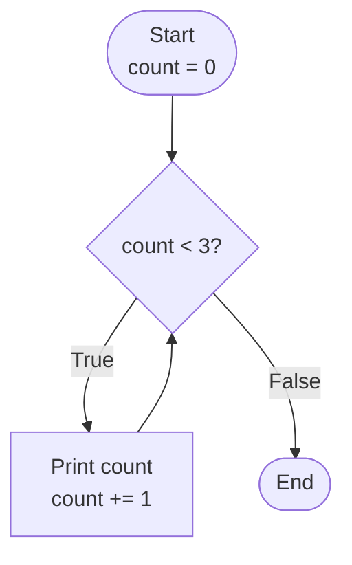
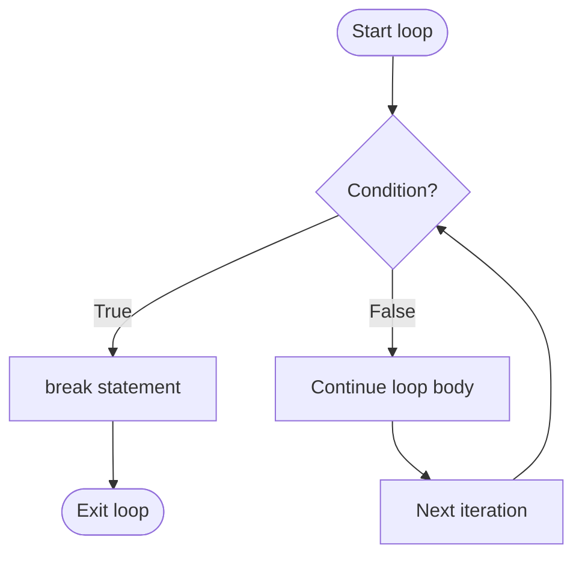

## `while` Loops (Repeat Until Something Changes)

`while` loops repeat as long as a condition stays `True`. They're ideal when you don't know in advance how many iterations you need - you keep going "until something happens."

```python
count = 0
while count < 3:
    print(count)
    count += 1
# Output: 0, 1, 2
```

The `while` loop:
1. Evaluates the condition
2. If `True`, executes the body
3. Returns to step 1
4. If `False`, exits and continues with the next statement



---

## When to Use `while` vs `for`

| Use `for` when... | Use `while` when... |
|-------------------|---------------------|
| Iterating over a collection | Number of iterations unknown |
| Fixed number of repetitions | Waiting for a condition to change |
| Processing each item | User input validation |
| Using `range()` | Sentinel-controlled loops |

```python
# Use for: known iterations
for i in range(10):
    print(i)

# Use while: unknown iterations
user_input = ""
while user_input != "quit":
    user_input = input("Command: ")
```

---

## Avoiding Infinite Loops

Every `while` loop needs a clear way to stop. A common mistake is forgetting to update the variables used in the condition:

```python
# Bug: count never changes → infinite loop!
count = 0
while count < 3:
    print(count)
    # Missing: count += 1
# This runs forever, printing 0 repeatedly

# Fixed: update the variable
count = 0
while count < 3:
    print(count)
    count += 1  # Now the loop will eventually end
```

### Checklist for `while` Loops

Before running a `while` loop, verify:
1. **Initialization**: Are variables initialized correctly before the loop?
2. **Condition**: Does the condition eventually become `False`?
3. **Update**: Is there code that changes the variables in the condition?

```python
# Good pattern: all three elements visible
n = 10           # 1. Initialization
while n > 0:     # 2. Condition
    print(n)
    n -= 1       # 3. Update
```

---

## Sentinel Loops (Keep Going Until "Quit")

A **sentinel value** is a special value that signals the loop should end. This pattern is one of the most common "real program" structures.

```python
while True:
    command = input("Enter command (or 'quit'): ").strip().lower()
    if command == "quit":
        break
    print(f"Running: {command}")

print("Goodbye!")
```

The `while True` creates an intentionally infinite loop that's exited with `break`. This is clean and explicit about the exit condition.

### Multiple Exit Conditions

```python
while True:
    user_input = input("Enter a number (or 'quit'): ")

    if user_input.lower() == "quit":
        print("Exiting...")
        break

    if not user_input.isdigit():
        print("Invalid input, try again")
        continue  # Skip to next iteration

    number = int(user_input)
    print(f"You entered: {number}")
```

---

## Input Validation Loops

Instead of rejecting invalid input once, you can keep asking until valid:

```python
# Keep asking until we get a valid integer
while True:
    text = input("Enter an integer: ").strip()
    if text.lstrip('-').isdigit():  # Allow negative numbers
        number = int(text)
        break
    print("Invalid input. Please enter digits only.")

print(f"You entered: {number}")
```

### Validation with Range Checking

```python
while True:
    text = input("Enter a number between 1 and 10: ")

    if not text.isdigit():
        print("Please enter a valid number.")
        continue

    number = int(text)

    if 1 <= number <= 10:
        break

    print("Number must be between 1 and 10.")

print(f"Valid number: {number}")
```

### Factored into a Function

```python
def get_integer_in_range(prompt, min_val, max_val):
    """Keep asking until user enters a valid integer in range."""
    while True:
        text = input(prompt)
        if text.lstrip('-').isdigit():
            num = int(text)
            if min_val <= num <= max_val:
                return num
        print(f"Please enter a number between {min_val} and {max_val}.")

age = get_integer_in_range("Enter your age (0-120): ", 0, 120)
```

---

## `break` and `continue`

### `break` - Exit Immediately

`break` exits the **innermost** loop immediately:

```python
# Find first even number
numbers = [1, 3, 5, 4, 7, 8]
for n in numbers:
    if n % 2 == 0:
        print(f"Found even: {n}")
        break
# Output: Found even: 4

# break exits only the inner loop
for i in range(3):
    for j in range(3):
        if j == 1:
            break  # Only exits the inner loop
        print(f"({i},{j})")
# Output: (0,0), (1,0), (2,0)
```



### `continue` - Skip to Next Iteration

`continue` skips the rest of the current iteration and moves to the next:

```python
# Print only odd numbers
for n in range(10):
    if n % 2 == 0:
        continue  # Skip even numbers
    print(n)
# Output: 1, 3, 5, 7, 9

# Skip invalid data
data = ["10", "abc", "20", "", "30"]
total = 0
for item in data:
    if not item.isdigit():
        continue  # Skip non-numeric items
    total += int(item)
print(total)  # 60
```

### When to Use Each

- **`break`**: You found what you're looking for, or an error condition means you should stop
- **`continue`**: This iteration is invalid/uninteresting, but you want to keep checking others

---

## Loop `else` (Runs Only If No `break`)

Python loops can have an `else` clause that runs only if the loop completes normally (without hitting `break`):

```python
# Search for an odd number
numbers = [2, 4, 6, 8]

for n in numbers:
    if n % 2 == 1:
        print(f"Found odd: {n}")
        break
else:
    print("No odd numbers found")

# Output: "No odd numbers found" (else runs because no break)
```

This is most useful for search loops:

```python
def find_divisor(n):
    """Find smallest divisor > 1, or return None if prime."""
    for i in range(2, int(n**0.5) + 1):
        if n % i == 0:
            return i  # Found a divisor
    else:
        return None  # No divisor found - number is prime

print(find_divisor(15))  # 3
print(find_divisor(17))  # None (prime)
```

The `else` clause can be confusing at first. Think of it as "no break" rather than "if condition was false."

---

## Common `while` Loop Patterns

### Countdown

```python
count = 5
while count > 0:
    print(count)
    count -= 1
print("Blast off!")
```

### Accumulator

```python
total = 0
while True:
    text = input("Enter number (or 'done'): ")
    if text == "done":
        break
    total += int(text)
print(f"Total: {total}")
```

### Finding a Value

```python
import random
target = random.randint(1, 100)
guess = 0

while guess != target:
    guess = int(input("Guess: "))
    if guess < target:
        print("Higher!")
    elif guess > target:
        print("Lower!")

print("Correct!")
```

---

## Key Takeaways

- `while` loops repeat as long as the condition is `True`
- Use `while` when you don't know how many iterations in advance
- Always ensure the loop can eventually terminate (update the condition variables)
- `while True: ... break` is a common pattern for sentinel loops
- `break` exits the loop immediately; `continue` skips to the next iteration
- Loop `else` runs only if the loop completes without `break`
- For input validation, loop until valid input is received
- Be careful to avoid infinite loops - always verify the exit condition
