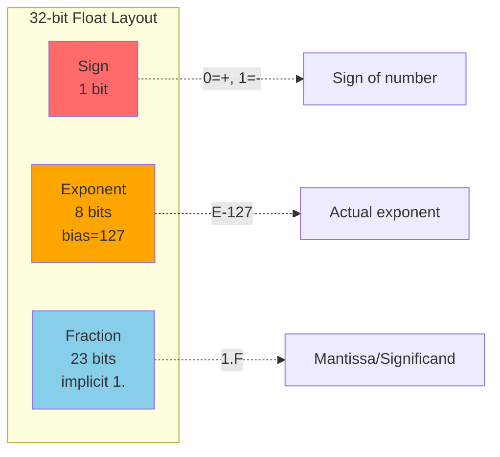

# Floating Point and IEEE-754

Computers need to represent not just integers, but real numbers with fractional parts—values like 3.14159, 0.001, or 6.022×10²³. The dominant standard for this is **IEEE-754**, which defines how floating-point numbers are encoded in binary. Understanding this representation explains why floating-point arithmetic sometimes produces surprising results.

## Why Floating Point Is Different

Integers have a simple, exact representation: each bit position has a fixed power-of-two weight, and every integer in the representable range has a unique, exact bit pattern.

Real numbers are fundamentally different:
- There are infinitely many real numbers between any two integers
- Most real numbers cannot be represented exactly in a finite number of bits
- We need to represent both very large (10³⁰⁰) and very small (10⁻³⁰⁰) values

Floating-point representation is inherently **approximate**. It trades exact representation for a huge dynamic range.

## Scientific Notation: The Conceptual Foundation

IEEE-754 is essentially binary scientific notation. Recall decimal scientific notation:

```
6.022 × 10²³
  ↑       ↑
mantissa  exponent
```

The key insight: by adjusting the exponent, we can represent both huge and tiny numbers using a fixed number of significant digits.

In binary:
```
1.01101 × 2⁵
   ↑       ↑
mantissa  exponent (binary)
```

## IEEE-754 Single Precision (32-bit)

A 32-bit float divides its bits into three fields:

```
| S |  Exponent (8 bits)  |  Fraction (23 bits)  |
| 1 |     8 bits          |       23 bits        |
```



**Sign (S)**: 1 bit
- 0 = positive
- 1 = negative

**Exponent (E)**: 8 bits
- Stored with a **bias** of 127
- Actual exponent = stored value - 127
- Range: -126 to +127 (with 0 and 255 reserved for special values)

**Fraction (F)**: 23 bits
- Represents the fractional part after an implicit leading 1
- For "normal" numbers, the value has an implicit "1." before the fraction

### The Formula for Normal Numbers

For most values (called "normalized" numbers):

$$\text{Value} = (-1)^S \times 1.F \times 2^{(E-127)}$$

Where:
- $S$ = sign bit
- $F$ = fraction (23 bits representing the fractional part)
- $E$ = stored exponent (8 bits)

The "1." is **implicit**—it's not stored but assumed to exist. This is called the "hidden bit" and gives us an extra bit of precision for free.

### Example: Representing 1.0

$$1.0 = 1.0 \times 2^0$$

- Sign = 0 (positive)
- Exponent = 0, stored as $0 + 127 = 127 = 01111111_2$
- Fraction = $.000...0$ (23 zeros—no fractional part)

Bit pattern: `0 01111111 00000000000000000000000`

Hex: `0x3F800000`

### Example: Representing -6.25

$$6.25_{10} = 6 + 0.25 = 110.01_2$$

Normalize: $1.1001 \times 2^2$

- Sign = 1 (negative)
- Exponent = 2, stored as $2 + 127 = 129 = 10000001_2$
- Fraction = $10010000000000000000000_2$ (the $.1001$ part, padded)

Bit pattern: `1 10000001 10010000000000000000000`

Hex: `0xC0C80000`

### Example: Representing 0.1 (Important!)

$$0.1_{10} = 0.0\overline{0011}_2 = 0.0001100110011001100...$$

This is a **repeating binary fraction** that cannot be represented exactly!

The closest 32-bit float to 0.1 is approximately:

$$0.100000001490116119384765625$$

This is why `0.1 + 0.2 != 0.3` in floating-point arithmetic.

## IEEE-754 Double Precision (64-bit)

Double precision uses 64 bits for more range and precision:

```
| S |  Exponent (11 bits)  |  Fraction (52 bits)  |
| 1 |      11 bits         |        52 bits       |
```

- Exponent bias: 1023
- Range: approximately ±10^308
- Precision: about 15-16 decimal digits

Most programming languages use double precision by default for floating-point (`double` in C/Java, `float` in Python).

## Special Values

IEEE-754 reserves certain bit patterns for special values:

### Zero

Exponent = 0, Fraction = 0

There are two zeros: +0 and -0 (sign bit differs). They compare as equal but can produce different results in certain operations (e.g., 1/(+0) = +∞, 1/(-0) = -∞).

### Infinity

Exponent = all ones (255 for float, 2047 for double), Fraction = 0

- +∞: Sign = 0, Exponent = 11111111, Fraction = 0
- -∞: Sign = 1, Exponent = 11111111, Fraction = 0

Infinity results from overflow or division by zero.

### NaN (Not a Number)

Exponent = all ones, Fraction ≠ 0

NaN represents undefined or unrepresentable values:
- 0/0
- ∞ - ∞
- √(-1)

**Key property**: NaN is not equal to anything, including itself:
```c
float x = 0.0 / 0.0;  // NaN
x == x;               // false!
```

To test for NaN, use `isnan(x)` or `x != x`.

### Denormalized (Subnormal) Numbers

Exponent = 0, Fraction ≠ 0

These represent very small numbers near zero, without the implicit leading 1. They provide "gradual underflow"—values smoothly approach zero rather than jumping to it.

## Floating-Point Precision Issues

### Rounding Errors

Most decimal fractions don't have exact binary representations:
```python
>>> 0.1 + 0.2
0.30000000000000004
```

This isn't a bug—it's inherent to binary floating-point.

### Catastrophic Cancellation

Subtracting nearly equal values can lose precision dramatically:
```
1.000000001 - 1.000000000 = 0.000000001
```
If both values only have 7 significant digits of precision, the result might only have 1 significant digit.

### Accumulation of Errors

Repeated operations accumulate rounding errors:
```python
total = 0.0
for i in range(1000000):
    total += 0.1
# total ≈ 100000.00000133288, not exactly 100000
```

### Comparison Pitfalls

Never use `==` for floating-point comparison:
```c
// WRONG
if (x == 0.1) { ... }

// BETTER
if (fabs(x - 0.1) < epsilon) { ... }
```

Choose epsilon based on expected precision and magnitude.

## Floating-Point Arithmetic Properties

### What You Lose

Floating-point arithmetic is NOT:
- **Associative**: (a + b) + c ≠ a + (b + c) in general
- **Distributive**: a × (b + c) ≠ (a × b) + (a × c) in general

```python
>>> (0.1 + 0.2) + 0.3
0.6000000000000001
>>> 0.1 + (0.2 + 0.3)
0.6
```

### What You Keep

- **Commutative**: a + b = b + a, a × b = b × a
- Defined results for special cases (infinity, NaN)
- Consistent behavior across IEEE-754 compliant systems

## Practical Guidelines

### When to Use Floating Point

- Scientific calculations
- Graphics and game physics
- Signal processing
- Machine learning
- Any computation where approximate answers are acceptable

### When NOT to Use Floating Point

- **Money**: Use fixed-point decimal or integer cents
- **Exact comparisons**: Use integers or rational arithmetic
- **Cryptography**: Usually requires exact bit manipulation

### Best Practices

1. **Use double, not float**, unless memory is critical
2. **Never compare floats with ==**
3. **Be aware of magnitude differences** (adding 10^10 + 1 might lose the 1)
4. **Consider alternative algorithms** for numerically sensitive code
5. **Test edge cases**: 0, -0, ∞, -∞, NaN, very large, very small

## Viewing Float Bits

In C, you can examine the bit pattern:
```c
float f = 1.0f;
uint32_t bits;
memcpy(&bits, &f, sizeof(bits));
printf("0x%08X\n", bits);  // 0x3F800000
```

Online tools like "Float Exposed" let you visualize the components.

## Key Takeaways

- IEEE-754 represents floats as **sign + exponent + fraction** with an implicit leading 1.
- Single precision: 32 bits (1 + 8 + 23), bias 127
- Double precision: 64 bits (1 + 11 + 52), bias 1023
- Most decimal fractions **cannot be represented exactly** in binary floating-point.
- Special values: ±0, ±∞, NaN (with special comparison rules)
- **Never use == for float comparison**; use an epsilon tolerance.
- Floating-point is **not associative**—order of operations matters.
- Use **integers or decimal types for money**, not floating-point.
- Floating-point is a trade-off: huge range and speed, but inherent approximation.

