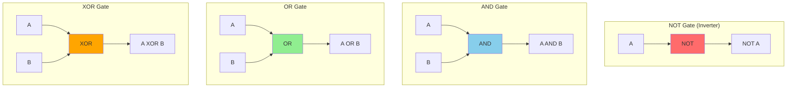

# Truth Tables and Basic Logic Gates

Digital circuits operate on binary values—0s and 1s—using operations defined by Boolean logic. A **logic gate** is the physical implementation of a Boolean function: it accepts one or more binary inputs and produces a binary output according to a specific rule. Understanding truth tables and basic gates is essential for everything from reading circuit diagrams to understanding how processors compute.

## Boolean Values and Variables

In Boolean logic, there are exactly two values:
- **0** (also called FALSE, LOW, or OFF)
- **1** (also called TRUE, HIGH, or ON)

A Boolean variable represents one bit of information. When we combine multiple variables with Boolean operations, we create Boolean expressions that describe digital circuits.

The connection to hardware is direct: 0 typically corresponds to a low voltage (near ground), and 1 corresponds to a high voltage (near the supply voltage). Every wire in a digital circuit carries a Boolean value.

## Truth Tables: The Complete Specification

A **truth table** exhaustively lists the output for every possible combination of inputs. For a function with N inputs, the truth table has 2^N rows, because each input can be either 0 or 1.

For example, with 2 inputs there are 4 combinations (00, 01, 10, 11). With 3 inputs there are 8 combinations. With 4 inputs there are 16 combinations.

Truth tables are the definitive specification of a Boolean function. Two expressions are equivalent if and only if they produce identical truth tables. When debugging a circuit, comparing its actual output to the expected truth table reveals errors.

## The NOT Gate (Inverter)

The simplest gate is NOT, also called an inverter. It has one input and one output, and it flips the value:

| A | NOT A |
|---|-------|
| 0 |   1   |
| 1 |   0   |

**Notation**: NOT A is written as Ā, A', or ¬A in various contexts. In programming, it's often `!A` or `~A`.

**Symbol**: An inverter is drawn as a triangle with a small circle (bubble) at the output. The bubble indicates inversion.

**Use cases**: Inverters are used to complement signals, create feedback loops, and convert between active-high and active-low logic.

## Basic Gate Summary

Here are the fundamental logic gates visualized:

## The AND Gate

AND outputs 1 only when ALL inputs are 1. For two inputs:

| A | B | A AND B |
|---|---|---------|
| 0 | 0 |    0    |
| 0 | 1 |    0    |
| 1 | 0 |    0    |
| 1 | 1 |    1    |

**Notation**: A AND B is written as $A \cdot B$, $A \land B$, or simply $AB$. In programming: `A && B` or `A & B`.

**Boolean expression**: $Y = A \cdot B$

**Intuition**: AND is like a series circuit—both switches must be closed for current to flow. It answers "Are ALL conditions true?"

**Three-input AND**: With three inputs, all three must be 1 for output to be 1. The truth table has 8 rows, and only the row (1,1,1) produces output 1.

## The OR Gate

OR outputs 1 when AT LEAST ONE input is 1:

| A | B | A OR B |
|---|---|--------|
| 0 | 0 |   0    |
| 0 | 1 |   1    |
| 1 | 0 |   1    |
| 1 | 1 |   1    |

**Notation**: A OR B is written as $A + B$ or $A \lor B$. In programming: `A || B` or `A | B`.

**Boolean expression**: $Y = A + B$

**Intuition**: OR is like a parallel circuit—if either switch is closed, current flows. It answers "Is ANY condition true?"

**Important**: Boolean OR is inclusive—$(1 \lor 1) = 1$, not 2. There's no "addition" happening; it's purely logical.

## The XOR Gate (Exclusive OR)

XOR outputs 1 when the inputs are DIFFERENT:

| A | B | A XOR B |
|---|---|---------|
| 0 | 0 |    0    |
| 0 | 1 |    1    |
| 1 | 0 |    1    |
| 1 | 1 |    0    |

**Notation**: A XOR B is written as $A \oplus B$. In programming: `A ^ B`.

**Boolean expression**: $Y = A \oplus B$

**Symbol**: XOR looks like OR with an extra curved line at the back.

**Intuition**: XOR answers "Are the inputs different?" or "Is exactly one input true?"

**Key applications**:
- **Parity checking**: XOR of all bits gives 1 if there's an odd number of 1s
- **Addition**: The sum bit of binary addition is A XOR B
- **Toggling**: XORing with 1 flips a bit; XORing with 0 preserves it
- **Encryption**: XOR is reversible—XOR twice with the same key returns original data

## NAND and NOR: The Universal Gates

NAND is AND followed by NOT. NOR is OR followed by NOT.

### NAND (NOT AND)

| A | B | A NAND B |
|---|---|----------|
| 0 | 0 |    1     |
| 0 | 1 |    1     |
| 1 | 0 |    1     |
| 1 | 1 |    0     |

NAND outputs 0 only when all inputs are 1.

### NOR (NOT OR)

| A | B | A NOR B |
|---|---|---------|
| 0 | 0 |    1    |
| 0 | 1 |    0    |
| 1 | 0 |    0    |
| 1 | 1 |    0    |

NOR outputs 1 only when all inputs are 0.

### Why "Universal"?

NAND and NOR are called **universal gates** because any Boolean function can be built using only NANDs or only NORs. This is significant for hardware manufacturing—a chip fabrication process might be optimized for one gate type.

Here's how to build other gates from NAND only:
- **NOT A** = A NAND A
- **A AND B** = (A NAND B) NAND (A NAND B)
- **A OR B** = (A NAND A) NAND (B NAND B)

The same constructions exist for NOR.

## XNOR (Equivalence Gate)

XNOR is XOR followed by NOT—it outputs 1 when inputs are the SAME:

| A | B | A XNOR B |
|---|---|----------|
| 0 | 0 |    1     |
| 0 | 1 |    0     |
| 1 | 0 |    0     |
| 1 | 1 |    1     |

XNOR is used in comparators to check if two bits are equal.

## Multi-Input Gates

AND, OR, NAND, NOR, and XOR can all be extended to more than two inputs:

- **3-input AND**: Output is 1 only if A=1 AND B=1 AND C=1
- **3-input OR**: Output is 1 if A=1 OR B=1 OR C=1
- **3-input XOR**: Output is 1 if an odd number of inputs are 1

Multi-input gates are implemented either as a single wide gate or as a tree of two-input gates. For example, 4-input AND can be two 2-input ANDs feeding a third 2-input AND.

## Constructing Truth Tables

When analyzing a circuit or expression, build the truth table systematically:

1. List all input combinations (use binary counting: 00, 01, 10, 11)
2. Evaluate intermediate signals in order
3. Compute the final output

**Example**: For F = (A AND B) OR (NOT A)

| A | B | A AND B | NOT A | F |
|---|---|---------|-------|---|
| 0 | 0 |    0    |   1   | 1 |
| 0 | 1 |    0    |   1   | 1 |
| 1 | 0 |    0    |   0   | 0 |
| 1 | 1 |    1    |   0   | 1 |

## Reading Gate-Level Diagrams

Circuit diagrams show gates connected by wires. To analyze them:

1. Identify all inputs (usually on the left)
2. Trace signals through each gate
3. Note intermediate values at each gate output
4. Determine the final output

For complex circuits, work left to right, computing each gate's output before moving to gates that depend on it.

## Timing and Propagation Delay

Real gates don't switch instantaneously. **Propagation delay** is the time for an output to change after an input changes. Longer chains of gates mean longer total delay.

Critical paths—the longest gate chains—determine how fast a circuit can operate. This is why simplifying expressions (reducing gate count and depth) improves performance.

## Key Takeaways

- Truth tables define Boolean functions completely—2^N rows for N inputs.
- **AND** outputs 1 only when all inputs are 1; **OR** outputs 1 when any input is 1.
- **XOR** outputs 1 when inputs differ—essential for arithmetic and parity.
- **NOT** inverts a signal; NAND = NOT(AND); NOR = NOT(OR).
- **NAND and NOR are universal**—any function can be built from just one type.
- Multi-input gates extend naturally: AND of many inputs, OR of many inputs.
- Truth tables are the go-to tool for verifying circuit correctness.
- Gate diagrams are read left-to-right; propagation delay accumulates through gate chains.

