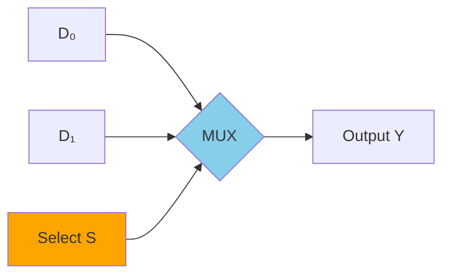
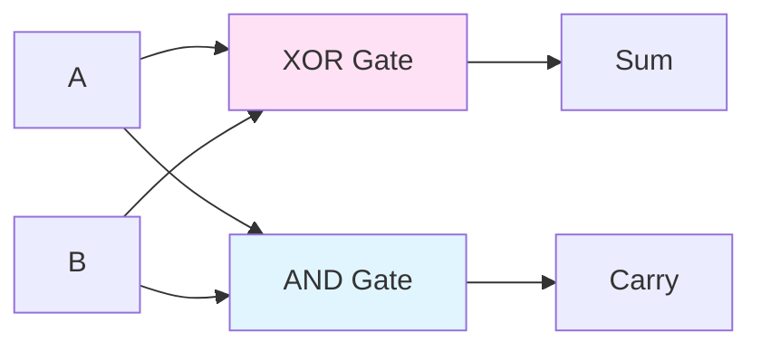
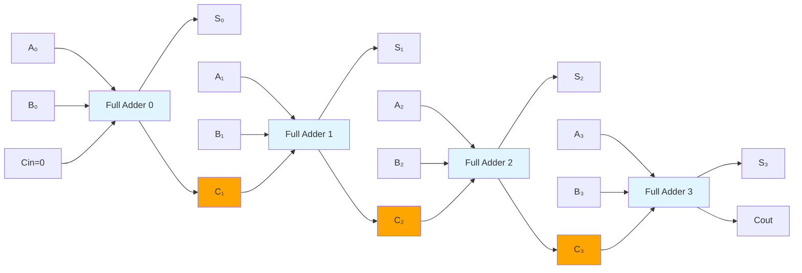

# Common Circuit Building Blocks

Digital systems aren't built gate-by-gate from scratch. Instead, designers use standardized building blocks—reusable combinational circuits that perform common operations. Understanding these blocks is essential for reading CPU datapaths, understanding how data moves through processors, and appreciating how Boolean logic becomes computing machinery.

## Why Building Blocks?

Just as programmers use functions and libraries rather than writing everything from scratch, hardware designers use standardized components:
- **Abstraction**: Hide internal complexity, expose a clean interface
- **Reuse**: Tested, optimized designs can be used repeatedly
- **Modularity**: Complex systems decompose into understandable parts
- **Design efficiency**: Focus on high-level architecture, not gate-level details

These building blocks appear everywhere in computer organization: in ALUs, register files, memory systems, and control units.

## Multiplexers (MUX)

A **multiplexer** selects one of several inputs and routes it to the output. Think of it as a programmable switch controlled by selector bits.

### 2-to-1 Multiplexer

The simplest MUX has 2 data inputs (D₀, D₁), 1 select input (S), and 1 output (Y):

```
When S=0: Y = D₀
When S=1: Y = D₁
```



**Boolean expression**:

$$Y = (\overline{S} \cdot D_0) + (S \cdot D_1)$$

**Truth table**:

| S | D₀ | D₁ | Y |
|---|----|----|---|
| 0 | 0  | X  | 0 |
| 0 | 1  | X  | 1 |
| 1 | X  | 0  | 0 |
| 1 | X  | 1  | 1 |

### 4-to-1 Multiplexer

With 2 select bits (S₁, S₀), you can choose among 4 inputs:

```
S₁S₀ = 00: Y = D₀
S₁S₀ = 01: Y = D₁
S₁S₀ = 10: Y = D₂
S₁S₀ = 11: Y = D₃
```

**Boolean expression**:
```
Y = (S₁'S₀'·D₀) + (S₁'S₀·D₁) + (S₁S₀'·D₂) + (S₁S₀·D₃)
```

### General Pattern

For 2^N inputs, you need N select bits. An 8-to-1 MUX has 3 select bits; a 16-to-1 MUX has 4.

### MUX Applications

**In CPUs**:
- Selecting which register's value goes to the ALU
- Choosing between ALU result and memory data
- Selecting instruction fields for different instruction formats
- Implementing conditional moves

**Data routing**: MUXes are the "switches" of digital circuits, directing data flow based on control signals.

**Function implementation**: Any Boolean function can be implemented with a MUX by connecting the function's truth table outputs to the data inputs.

## Demultiplexers (DEMUX)

A **demultiplexer** is the inverse of a MUX: it takes one input and routes it to one of several outputs based on select bits.

### 1-to-4 Demultiplexer

With 2 select bits, one input is routed to one of 4 outputs:

```
S₁S₀ = 00: Y₀ = D, Y₁=Y₂=Y₃=0
S₁S₀ = 01: Y₁ = D, Y₀=Y₂=Y₃=0
S₁S₀ = 10: Y₂ = D, Y₀=Y₁=Y₃=0
S₁S₀ = 11: Y₃ = D, Y₀=Y₁=Y₂=0
```

**Applications**: Routing data to one of several destinations, such as writing to one of several registers.

## Decoders

A **decoder** converts an N-bit binary input into 2^N outputs, where exactly one output is active (one-hot encoding).

### 2-to-4 Decoder

Input: 2 bits (A₁, A₀)
Output: 4 lines (Y₀, Y₁, Y₂, Y₃)

```
A₁A₀ = 00: Y₀=1, Y₁=Y₂=Y₃=0
A₁A₀ = 01: Y₁=1, Y₀=Y₂=Y₃=0
A₁A₀ = 10: Y₂=1, Y₀=Y₁=Y₃=0
A₁A₀ = 11: Y₃=1, Y₀=Y₁=Y₂=0
```

**Boolean expressions**:
```
Y₀ = A₁'A₀'
Y₁ = A₁'A₀
Y₂ = A₁A₀'
Y₃ = A₁A₀
```

### 3-to-8 Decoder

Input: 3 bits
Output: 8 lines (one for each input combination)

This is often called a "1-of-8" decoder.

### Decoder with Enable

Many decoders have an **enable** input (E). When E=0, all outputs are 0 regardless of the input. When E=1, the decoder operates normally.

Enable inputs allow cascading smaller decoders into larger ones.

### Decoder Applications

**Register selection**: A 3-to-8 decoder can select one of 8 registers for writing.

**Memory addressing**: Address bits go through decoders to select memory rows/columns.

**Instruction decoding**: Opcode bits are decoded to determine which operation to perform.

**Minterm generation**: A decoder output Y_i is exactly the minterm m_i. Combining decoder outputs with OR gates implements any SOP function.

## Encoders

An **encoder** is the inverse of a decoder: it converts a one-hot input (one of 2^N lines active) into an N-bit binary output.

### 4-to-2 Encoder

Input: 4 lines (D₀, D₁, D₂, D₃) — exactly one should be 1
Output: 2 bits (A₁, A₀)

```
D₀=1: A₁A₀ = 00
D₁=1: A₁A₀ = 01
D₂=1: A₁A₀ = 10
D₃=1: A₁A₀ = 11
```

### Priority Encoder

A **priority encoder** handles cases where multiple inputs might be active simultaneously. It outputs the index of the highest-priority (usually highest-numbered) active input.

**8-to-3 priority encoder**:
- If D₇=1, output 111 regardless of other inputs
- If D₇=0 and D₆=1, output 110
- And so on...

Priority encoders are used in interrupt handling to identify the highest-priority pending interrupt.

## Half Adder

The **half adder** adds two 1-bit inputs and produces a sum and carry:

```
Inputs: A, B
Outputs: Sum, Carry
```

| A | B | Sum | Carry |
|---|---|-----|-------|
| 0 | 0 |  0  |   0   |
| 0 | 1 |  1  |   0   |
| 1 | 0 |  1  |   0   |
| 1 | 1 |  0  |   1   |



**Boolean expressions**:

$$\text{Sum} = A \oplus B$$
$$\text{Carry} = A \cdot B$$

The half adder is called "half" because it doesn't handle a carry-in from a previous stage.

## Full Adder

The **full adder** adds three 1-bit inputs (A, B, and carry-in Cin) and produces a sum and carry-out:

| A | B | Cin | Sum | Cout |
|---|---|-----|-----|------|
| 0 | 0 |  0  |  0  |  0   |
| 0 | 0 |  1  |  1  |  0   |
| 0 | 1 |  0  |  1  |  0   |
| 0 | 1 |  1  |  0  |  1   |
| 1 | 0 |  0  |  1  |  0   |
| 1 | 0 |  1  |  0  |  1   |
| 1 | 1 |  0  |  0  |  1   |
| 1 | 1 |  1  |  1  |  1   |

**Boolean expressions**:

$$\text{Sum} = A \oplus B \oplus C_{in}$$

$$C_{out} = (A \cdot B) + ((A \oplus B) \cdot C_{in})$$

Alternatively (majority function):

$$C_{out} = (A \cdot B) + (A \cdot C_{in}) + (B \cdot C_{in})$$

This is the **majority function**—$C_{out}$ is 1 when at least 2 of the 3 inputs are 1.

## Ripple Carry Adder

To add multi-bit numbers, chain full adders together. The carry-out of each stage connects to the carry-in of the next.

**4-bit ripple carry adder**:
```
FA₀: A₀, B₀, Cin=0  → S₀, C₁
FA₁: A₁, B₁, C₁     → S₁, C₂
FA₂: A₂, B₂, C₂     → S₂, C₃
FA₃: A₃, B₃, C₃     → S₃, Cout
```



**Limitation**: The carry must "ripple" through all stages. For an N-bit adder, the worst-case delay is proportional to N. This motivates faster adder designs like carry-lookahead adders.

## Comparators

A **comparator** determines the relationship between two values: equal, greater than, or less than.

### 1-Bit Comparator

For single bits A and B:
```
A = B: Output 1 when A XNOR B (both same)
A > B: Output 1 when A AND (NOT B)
A < B: Output 1 when (NOT A) AND B
```

### Multi-Bit Comparator

For multi-bit comparison, compare bit-by-bit starting from the most significant bit:
1. If MSBs differ, the larger MSB wins
2. If MSBs equal, check the next bit
3. Continue until a difference is found or all bits are equal

Comparators are used in branch instructions (BEQ, BLT, etc.) and sorting hardware.

## Arithmetic Logic Unit (ALU) Overview

The **ALU** combines multiple operations (add, subtract, AND, OR, etc.) into a single unit. A function select input chooses which operation to perform.

Conceptually, an ALU:
1. Computes all possible operations in parallel
2. Uses a MUX to select which result goes to the output

**Typical ALU operations**:
- Arithmetic: ADD, SUB, increment, decrement
- Logic: AND, OR, XOR, NOT
- Comparison: Set flags (zero, negative, overflow, carry)

The ALU is the computational heart of the CPU, appearing in every instruction execution.

## Building Larger Systems

These blocks compose hierarchically:
- Full adders chain into ripple carry adders
- Adders combine with MUXes and logic into ALUs
- ALUs connect with registers via MUXes and decoders
- All controlled by decoded instruction signals

Understanding these building blocks is the bridge between Boolean algebra (Topic 4) and computer architecture (Topics 5-7).

## Key Takeaways

- **Multiplexers (MUX)** select one of many inputs based on selector bits—the data "switches" of digital circuits.
- **Demultiplexers (DEMUX)** route one input to one of many outputs.
- **Decoders** convert N-bit input to 2^N one-hot outputs; used for register/memory selection.
- **Encoders** convert one-hot input back to binary; **priority encoders** handle multiple active inputs.
- **Half adders** compute Sum = A XOR B, Carry = A AND B for two bits.
- **Full adders** handle carry-in: Sum = A XOR B XOR Cin, Cout = majority(A, B, Cin).
- **Ripple carry adders** chain full adders; simple but slow due to carry propagation.
- **Comparators** determine equal/greater/less relationships between values.
- **ALUs** combine arithmetic and logic operations, selected by function codes.
- These building blocks are the vocabulary connecting Boolean logic to CPU architecture.

