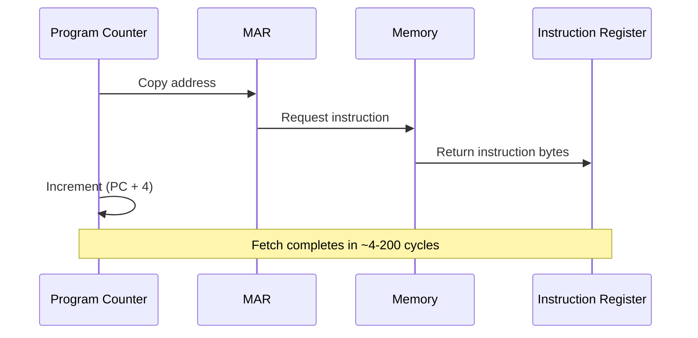

# The Instruction Cycle (Fetch → Decode → Execute)

Every instruction a CPU executes follows a fundamental pattern: fetch the instruction from memory, decode it to understand what to do, execute the operation, and store the results. This **instruction cycle** (also called the fetch-decode-execute cycle) is the heartbeat of any processor. Understanding it reveals how software becomes hardware behavior.

## The Conceptual Model

At its simplest, the instruction cycle has three main phases:

1. **Fetch**: Get the next instruction from memory
2. **Decode**: Figure out what the instruction means
3. **Execute**: Perform the operation

Real processors may subdivide these phases further (5-stage pipelines are common), but the conceptual model captures the essential flow.


The cycle repeats endlessly: after completing one instruction, the CPU immediately fetches the next.

## Key Registers in the Instruction Cycle

Several special-purpose registers coordinate the instruction cycle:

### Program Counter (PC)

The **Program Counter** (also called Instruction Pointer or IP on x86) holds the memory address of the next instruction to fetch. After each fetch, the PC is typically incremented to point to the following instruction.

The PC is the CPU's "bookmark"—it tracks where we are in the program.

### Instruction Register (IR)

The **Instruction Register** holds the currently executing instruction after it's been fetched from memory. The control unit reads the IR to determine what operation to perform.

### Memory Address Register (MAR)

The **MAR** holds the address of the memory location being accessed. When fetching an instruction, MAR gets the value from PC. When loading/storing data, MAR gets the computed address.

### Memory Data Register (MDR)

The **MDR** (also called Memory Buffer Register or MBR) holds data being transferred to or from memory. On a read, MDR receives data from memory. On a write, MDR holds the data to be written.

### Status/Flags Register

The **flags register** contains condition codes set by arithmetic operations:
- **Zero Flag (ZF)**: Result was zero
- **Sign Flag (SF)**: Result was negative (MSB = 1)
- **Carry Flag (CF)**: Unsigned overflow/borrow occurred
- **Overflow Flag (OF)**: Signed overflow occurred

Conditional branches test these flags to decide whether to jump.

## Phase 1: Fetch

The fetch phase retrieves the next instruction from memory:

```
1. MAR ← PC           // Copy PC to Memory Address Register
2. IR ← Memory[MAR]   // Read instruction from memory into IR
3. PC ← PC + size     // Increment PC past this instruction
```



### Step-by-Step Fetch

1. **Copy PC to MAR**: The address in the Program Counter is placed on the address bus via the MAR.

2. **Memory Read**: The memory system returns the bytes at that address. For a 32-bit instruction, 4 bytes are read. This data travels on the data bus.

3. **Store in IR**: The fetched bytes are stored in the Instruction Register, where they'll be decoded.

4. **Update PC**: The Program Counter is incremented by the instruction size. For fixed-length instructions (like MIPS), this is always the same. For variable-length instructions (like x86), the size may depend on the instruction itself.

### Timing Considerations

Fetching from memory is relatively slow—potentially dozens of CPU cycles for main memory. This is why instruction caches exist: the L1 instruction cache keeps recently-used instructions close to the CPU, reducing fetch latency dramatically.

## Phase 2: Decode

The decode phase interprets the instruction bits to determine:
- What operation to perform (opcode)
- What operands to use (registers, memory addresses, immediate values)
- What control signals to generate

### Instruction Format

Instructions are encoded as bit fields. A typical format might include:

```
| Opcode | Dest Reg | Src Reg 1 | Src Reg 2 / Immediate |
```

**Example** (hypothetical 32-bit instruction):
- Bits 31-26: Opcode (6 bits, 64 possible operations)
- Bits 25-21: Destination register (5 bits, 32 registers)
- Bits 20-16: Source register 1
- Bits 15-0: Source register 2 or 16-bit immediate value

### Control Unit Operation

The control unit examines the opcode and generates control signals that configure the datapath:
- Which registers to read
- What ALU operation to perform
- Whether to read/write memory
- Whether to branch

There are two main control unit design approaches:

**Hardwired control**: Logic gates directly generate signals from the opcode. Fast but inflexible.

**Microprogrammed control**: The opcode indexes into a microcode ROM containing sequences of control signals. More flexible, easier to design, but potentially slower.

### Register File Access

During decode (or early execute), the CPU reads source registers. The register file is a small, fast memory with two read ports (to read two operands simultaneously) and one write port.

For an instruction like `ADD R3, R1, R2`:
- Read port 1 delivers R1's value
- Read port 2 delivers R2's value
- After execution, the write port stores the result into R3

## Phase 3: Execute

The execute phase performs the actual operation. What happens depends on the instruction type:

### Arithmetic/Logic Instructions

For ALU operations (ADD, SUB, AND, OR, etc.):
1. Operand values flow to ALU inputs
2. Control signals select the operation
3. ALU computes the result
4. Flags are updated based on the result
5. Result is written back to the destination register

**Example**: `ADD R3, R1, R2`
```
ALU_input_A ← R1
ALU_input_B ← R2
ALU_operation ← ADD
R3 ← ALU_output
Update flags (Z, S, C, O)
```

### Load Instructions

For memory reads (LOAD, LW, etc.):
1. Compute the effective address (base register + offset)
2. Place address in MAR
3. Read from memory into MDR
4. Transfer MDR to destination register

**Example**: `LOAD R1, [R2 + 100]`
```
MAR ← R2 + 100        // Compute effective address
MDR ← Memory[MAR]     // Read from memory
R1 ← MDR              // Store in destination register
```

### Store Instructions

For memory writes (STORE, SW, etc.):
1. Compute the effective address
2. Place address in MAR
3. Place data in MDR
4. Write MDR to memory

**Example**: `STORE R1, [R2 + 100]`
```
MAR ← R2 + 100        // Compute effective address
MDR ← R1              // Get data from source register
Memory[MAR] ← MDR     // Write to memory
```

### Branch Instructions

For control flow changes (JMP, BEQ, BNE, etc.):
1. For conditional branches, test the relevant flag(s)
2. If condition is true (or unconditional), update PC to target address
3. If condition is false, PC continues normally (already incremented)

**Example**: `BEQ target` (branch if equal, i.e., if zero flag is set)
```
If ZF == 1:
    PC ← target_address
// Else PC was already incremented in fetch
```

## Write-Back Phase

Many descriptions separate a **write-back** phase where results are stored in registers. For ALU instructions, this is when the computed result goes into the destination register. For loads, this is when the data from memory is stored in a register.

## The Complete Cycle

Putting it all together for `ADD R3, R1, R2`:

```
FETCH:
1. MAR ← PC
2. IR ← Memory[MAR]
3. PC ← PC + 4

DECODE:
4. Control unit reads opcode (ADD)
5. Read R1 → Operand A
6. Read R2 → Operand B

EXECUTE:
7. ALU performs A + B
8. Update flags

WRITE-BACK:
9. R3 ← ALU result
```

Here's a complete flowchart showing the execution of an ADD instruction:

```mermaid
flowchart TD
    Start([Start: PC points to ADD instruction]) --> Fetch

    Fetch[FETCH<br/>MAR ← PC<br/>IR ← Memory[MAR]<br/>PC ← PC + 4] --> Decode

    Decode[DECODE<br/>Opcode = ADD<br/>Read register fields<br/>Dest=R3, Src1=R1, Src2=R2] --> ReadRegs

    ReadRegs[Read R1 and R2<br/>from register file] --> Execute

    Execute[EXECUTE<br/>ALU: R1 + R2<br/>Update flags Z,S,C,O] --> WriteBack

    WriteBack[WRITE-BACK<br/>R3 ← ALU result] --> Next

    Next([Repeat for next instruction])

    style Fetch fill:#e1f5ff
    style Decode fill:#fff4e1
    style Execute fill:#ffe1f5
    style WriteBack fill:#e1ffe1
```

Then the cycle repeats for the next instruction.

## Control Flow and Hazards

### Sequential Execution

In the simplest model, the CPU executes one complete instruction cycle before starting the next. The PC increases sequentially unless a branch changes it.

### Branches Disrupt the Flow

Branches are special because they can change the PC in non-sequential ways:
- **Unconditional jumps**: Always change PC to target
- **Conditional branches**: Change PC only if condition is met
- **Function calls**: Save return address, jump to function
- **Returns**: Restore PC from saved return address

### Control Hazards (Preview)

In pipelined CPUs (where multiple instructions overlap), branches create **control hazards**: the CPU may not know the next instruction until the branch resolves. Solutions include:
- **Stalling**: Wait until branch is resolved
- **Branch prediction**: Guess which way the branch goes
- **Delayed branches**: Execute instruction after branch regardless

These topics are explored more in advanced architecture courses.

## Multi-Cycle vs. Single-Cycle Implementations

### Single-Cycle

In a single-cycle CPU, each instruction completes in one clock cycle. The clock must be slow enough to accommodate the slowest instruction (typically loads, which access memory). Simple but inefficient—fast instructions waste time.

### Multi-Cycle

In a multi-cycle CPU, each phase takes one cycle. Fast instructions take fewer cycles; slow instructions take more. The clock can be faster because each phase does less work. Control is more complex because state must be tracked across cycles.

### Pipelining

Pipelining overlaps the phases of multiple instructions. While one instruction executes, the next one decodes, and the one after fetches. This dramatically increases throughput while maintaining the conceptual fetch-decode-execute model.

## Key Takeaways

- The instruction cycle (fetch-decode-execute) is the fundamental rhythm of CPU operation.
- **PC** tracks the next instruction; **IR** holds the current instruction.
- **MAR** and **MDR** mediate memory access for both instructions and data.
- **Fetch** gets the instruction from memory and updates PC.
- **Decode** interprets the instruction and generates control signals.
- **Execute** performs the operation (ALU, memory access, or branch).
- **Write-back** stores results in registers or memory.
- **Flags** record condition codes; branches test them.
- Branches change PC non-sequentially, creating control flow.
- Real CPUs use pipelining to overlap multiple instruction cycles for performance.

