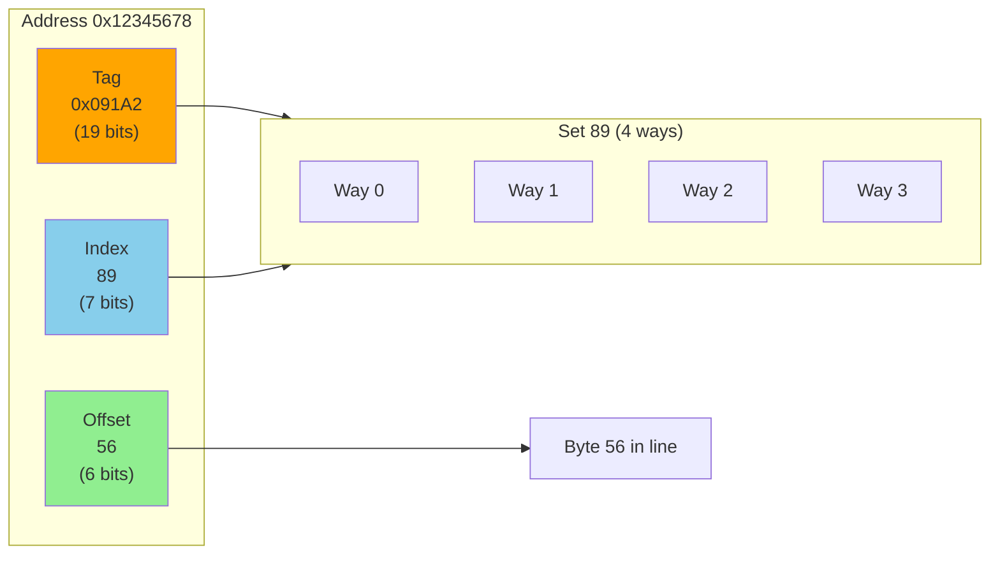

# Cache Mapping and Miss Types

A cache must answer a fundamental question: given a memory address, where should that data be stored in the cache? The answer to this question—the **mapping strategy**—profoundly affects cache performance. Different mapping strategies trade off between hardware complexity, lookup speed, and the ability to avoid conflicts. Understanding these tradeoffs, along with the different types of cache misses, is essential for understanding why caches behave the way they do.

## The Address Mapping Problem

Main memory is much larger than the cache. A system might have 16 GB of RAM but only 8 MB of L3 cache—a ratio of 2000:1. Since every memory address must map to some cache location, multiple memory addresses will inevitably map to the same cache location.

The mapping strategy determines:
- Where a given memory block can be placed in the cache
- How to find a block when looking it up
- What happens when two blocks want the same cache location

## Address Decomposition

For any cache mapping strategy, the memory address is divided into fields:

```
|-------- Tag --------|--- Index ---|-- Offset --|
```

- **Offset**: Which byte within the cache line (determined by line size). For a 64-byte line, the offset is 6 bits ($2^6 = 64$).
- **Index**: Which cache location(s) to check (depends on mapping strategy)
- **Tag**: Remaining bits, used to verify which specific block is stored

The total address bits = tag bits + index bits + offset bits.

For a cache with $C$ lines and block size $B$ bytes:
- **Offset bits**: $\log_2(B)$
- **Index bits**: $\log_2(C)$ for direct-mapped, $\log_2(S)$ for set-associative (where $S$ is the number of sets)
- **Tag bits**: Remaining address bits

## Direct-Mapped Cache

In a **direct-mapped cache**, each memory block maps to exactly one cache location. The index portion of the address determines which cache line the block can occupy.

```mermaid
graph LR
    subgraph Address["Memory Address"]
        Tag[Tag<br/>19 bits]
        Index[Index<br/>7 bits]
        Offset[Offset<br/>6 bits]
    end

    subgraph Cache["Direct-Mapped Cache (128 lines)"]
        Line0[Line 0: Valid | Tag | Data 64B]
        Line1[Line 1: Valid | Tag | Data 64B]
        LineDots[...]
        Line127[Line 127: Valid | Tag | Data 64B]
    end

    Index -->|Select Line| Line0
    Index -->|Select Line| Line1
    Tag -->|Compare| Line0
    Tag -->|Compare| Line1
    Offset -->|Select Byte| Line0

    style Tag fill:#ffa500
    style Index fill:#87ceeb
    style Offset fill:#90ee90
```

### How It Works

For a cache with 256 lines ($2^8$), the index is 8 bits. Memory addresses are assigned to cache lines based on their index bits:

```
Address 0x000 → Line 0
Address 0x100 → Line 0 (same index, different tag)
Address 0x200 → Line 0 (same index, different tag)
Address 0x001 → Line 1
Address 0x002 → Line 2
...
```

Multiple addresses map to the same line—they differ only in the tag. When the CPU accesses an address:
1. Extract the index → go to that cache line
2. Compare the stored tag with the address's tag
3. If tags match and valid bit is set → hit
4. If tags don't match or not valid → miss

### Advantages

- **Simple hardware**: Only one location to check, one comparator needed
- **Fast lookup**: No search required; index directly selects the line
- **Low power**: Minimal circuitry active during lookup

### Disadvantages

- **Conflict misses**: If two frequently-used addresses map to the same line, they continuously evict each other. This is called "thrashing."

### Conflict Miss Example

Consider a loop that alternates between two arrays:
```c
for (int i = 0; i < N; i++) {
    sum += a[i] + b[i];
}
```

If `a[i]` and `b[i]` happen to map to the same cache line (due to their addresses having the same index bits), every access is a miss. The access pattern is:
1. Access `a[0]` → miss, load into line X
2. Access `b[0]` → miss (maps to line X), evict `a[0]`, load `b[0]`
3. Access `a[1]` → miss (maps to line X), evict `b[0]`, load `a[1]`
4. ...and so on

This pathological case can devastate performance, turning a loop that should have excellent spatial locality into a stream of misses.

## Set-Associative Cache

A **set-associative cache** divides the cache into sets, each containing multiple lines (called "ways"). A memory block can be placed in any line within its designated set.

### N-Way Set Associative

In an N-way set-associative cache:
- The cache has $S$ sets
- Each set has $N$ lines ($N$ "ways")
- Total cache lines = $S \times N$
- A memory block maps to one set but can occupy any of the $N$ ways

```mermaid
graph TB
    subgraph Address["Memory Address"]
        Tag2[Tag]
        Index2[Index]
        Offset2[Offset]
    end

    subgraph Cache["4-Way Set-Associative Cache"]
        subgraph Set0["Set 0"]
            Way0_0[Way 0<br/>V|Tag|Data]
            Way0_1[Way 1<br/>V|Tag|Data]
            Way0_2[Way 2<br/>V|Tag|Data]
            Way0_3[Way 3<br/>V|Tag|Data]
        end
        subgraph Set1["Set 1"]
            Way1_0[Way 0<br/>V|Tag|Data]
            Way1_1[Way 1<br/>V|Tag|Data]
            Way1_2[Way 2<br/>V|Tag|Data]
            Way1_3[Way 3<br/>V|Tag|Data]
        end
    end

    Index2 -->|Select Set| Set0
    Index2 -->|Select Set| Set1
    Tag2 -->|Compare All Ways| Way0_0
    Tag2 -->|Compare All Ways| Way0_1

    style Tag2 fill:#ffa500
    style Index2 fill:#87ceeb
    style Offset2 fill:#90ee90
    style Set0 fill:#e1f5ff
    style Set1 fill:#e1f5ff
```

Common configurations:
- **2-way**: Each set has 2 lines
- **4-way**: Each set has 4 lines
- **8-way**: Each set has 8 lines

### How It Works

1. Extract the index → identifies the set
2. Check all N ways in that set in parallel
3. Compare each way's tag with the address's tag
4. If any way matches and is valid → hit
5. If no match → miss; choose a victim within the set to evict

### Advantages

- **Reduced conflicts**: With N ways, N different blocks with the same index can coexist
- **Better hit rate**: The conflict miss example above would work fine with 2-way associativity—both `a[i]` and `b[i]` fit in the same set

### Disadvantages

- **More hardware**: Need N comparators (one per way), N-way multiplexer
- **Slightly slower**: Parallel comparison adds some latency
- **Replacement decision**: Must choose which way to evict on a miss

### Trade-off

Increasing associativity reduces conflict misses but adds hardware cost and latency. Diminishing returns set in—going from direct-mapped to 2-way dramatically reduces conflicts, but going from 8-way to 16-way provides minimal benefit for most workloads.

## Fully Associative Cache

In a **fully associative cache**, any memory block can be placed in any cache line. There are no index bits—the entire address (minus offset) is the tag.

### How It Works

1. Extract the tag from the address
2. Compare against all cache lines simultaneously
3. If any line matches → hit
4. If no match → miss; choose any line to evict

### Advantages

- **Minimal conflict misses**: The only conflicts occur when the entire cache is full
- **Optimal placement**: Any eviction policy can be implemented

### Disadvantages

- **Expensive hardware**: Need a comparator for every cache line
- **Slow lookup**: Even with parallelism, searching many entries is slow
- **High power**: All comparators active on every access

### Use Cases

Fully associative caches are practical only for very small caches:
- **TLBs** (Translation Lookaside Buffers): Small (32-128 entries) caches for page table entries
- **Victim caches**: Small buffers that hold recently evicted lines
- **Specialized buffers**: Write buffers, prefetch buffers

## Mapping Comparison

| Aspect | Direct-Mapped | Set-Associative | Fully Associative |
|--------|---------------|-----------------|-------------------|
| Placement | One location | N locations (N ways) | Any location |
| Lookup | Compare 1 tag | Compare N tags | Compare all tags |
| Hardware | Simplest | Moderate | Most complex |
| Conflict misses | Most | Moderate | Fewest |
| Use case | Large L2/L3 | Common choice | TLBs, small caches |

## Types of Cache Misses

Cache misses are categorized by cause. Understanding miss types helps diagnose performance problems and guide optimization.

### Compulsory Misses (Cold Misses)

A **compulsory miss** occurs on the first access to a block. The data has never been in the cache, so a miss is unavoidable.

- Happens during program startup and when accessing new data
- Cannot be eliminated (you must load data at least once)
- Can be reduced by prefetching (speculatively loading data before it's needed)

### Capacity Misses

A **capacity miss** occurs when the cache is too small to hold all the data the program is actively using (its "working set"). Even with perfect (fully associative) mapping, the cache would still miss.

- Happens when working set exceeds cache size
- Solution: Use a larger cache, or restructure code to work on smaller data subsets (blocking/tiling)

Example: Processing a large array that doesn't fit in cache. No matter how data is mapped, some data must be evicted to make room for other data.

### Conflict Misses (Collision Misses)

A **conflict miss** occurs when multiple blocks compete for the same cache location(s), even though the cache has unused space elsewhere. This is specific to direct-mapped and set-associative caches.

- Would not occur in a fully associative cache of the same size
- Solution: Increase associativity, or restructure data to avoid conflicting addresses

Example: The `a[i]`/`b[i]` alternation problem described earlier—both arrays map to the same cache set despite plenty of unused cache space.

### The Three C's Model

The "Three C's" (Compulsory, Capacity, Conflict) provide a framework for analyzing cache behavior:

- **Compulsory**: Irreducible baseline—every block must be fetched at least once
- **Capacity**: Would occur even with infinite associativity; cache is simply too small
- **Conflict**: Would be eliminated by infinite associativity; caused by limited mapping flexibility

Some analyses add a fourth C:
- **Coherence misses**: In multiprocessor systems, misses caused by another processor invalidating a cache line

## Replacement Policies

When a cache miss occurs and the target set (or entire cache for fully associative) is full, the cache must evict a line. The **replacement policy** determines which line to evict.

### Least Recently Used (LRU)

**LRU** evicts the line that was accessed longest ago. The idea is that recently used data is likely to be used again (temporal locality).

- Optimal for many access patterns
- Expensive to implement exactly (requires tracking access order)
- Approximations (pseudo-LRU) are common in hardware

### First In, First Out (FIFO)

**FIFO** evicts the line that was loaded longest ago, regardless of recent access.

- Simpler than LRU (just need load order)
- Ignores temporal locality—may evict frequently used data
- Susceptible to anomalies (Bélády's anomaly)

### Random

**Random** replacement selects a victim randomly.

- Simplest to implement
- Surprisingly competitive with LRU for many workloads
- Avoids worst-case patterns that can trap LRU

### Not Recently Used (NRU)

**NRU** (or "clock" algorithm) maintains a "recently used" bit for each line. Evict a line with the bit cleared; clear bits over time.

- Good approximation of LRU
- Very hardware-efficient
- Common in practice

## Worked Example: Address Decomposition

Consider a cache with:
- 32 KB total size
- 64-byte lines
- 4-way set associative
- 32-bit addresses

Calculate the address field sizes:

1. **Offset bits**: $\log_2(64) = 6$ bits
2. **Number of lines**: $\frac{32 \text{ KB}}{64 \text{ B}} = \frac{32768}{64} = 512$ lines
3. **Number of sets**: $\frac{512 \text{ lines}}{4 \text{ ways}} = 128$ sets
4. **Index bits**: $\log_2(128) = 7$ bits
5. **Tag bits**: $32 - 7 - 6 = 19$ bits

Address `0x12345678`:
- Binary: `0001 0010 0011 0100 0101 0110 0111 1000`
- **Tag** (bits 31-13): `0x091A2` (19 bits)
- **Index** (bits 12-6): `0x59 = 89` (7 bits)
- **Offset** (bits 5-0): `0x38 = 56` (6 bits)



This address maps to set 89, and the tag `0x091A2` is compared against the 4 ways in that set.

## Key Takeaways

- **Direct-mapped caches** map each block to one location: simple but prone to conflict misses.
- **Set-associative caches** allow N locations per set: balance between complexity and conflict reduction.
- **Fully associative caches** allow any location: minimal conflicts but expensive hardware.
- **Compulsory misses**: First access to a block; unavoidable.
- **Capacity misses**: Working set exceeds cache size; need larger cache or data restructuring.
- **Conflict misses**: Limited mapping causes evictions despite available space; increase associativity.
- **Address decomposition**: Tag identifies the block, index selects the set, offset selects bytes within the line.
- **Replacement policies** (LRU, FIFO, random) determine which line is evicted on a miss.
- Increasing associativity reduces conflict misses but adds hardware cost and latency.

