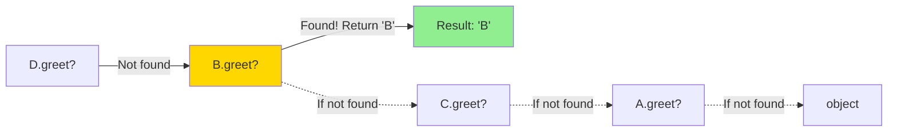
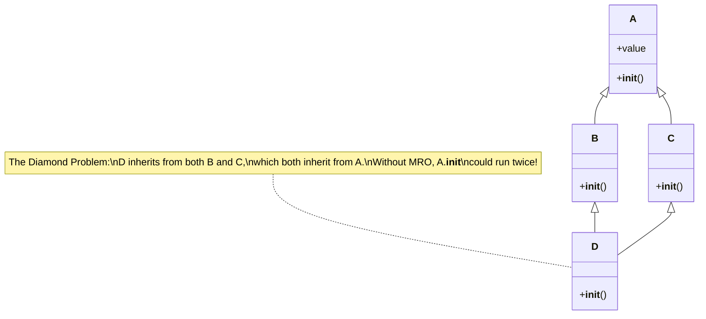

## Multiple Inheritance and MRO

Python supports inheriting from multiple parent classes. This is powerful but requires understanding the Method Resolution Order (MRO) to avoid confusion.

---

## Basic Multiple Inheritance

A class can inherit from multiple parents:

```python
class Flyer:
    def fly(self):
        return "Flying through the air"

class Swimmer:
    def swim(self):
        return "Swimming through water"

class Duck(Flyer, Swimmer):  # Multiple parents
    def quack(self):
        return "Quack!"

donald = Duck()
print(donald.fly())    # From Flyer
print(donald.swim())   # From Swimmer
print(donald.quack())  # From Duck
```

---

## Method Resolution Order (MRO)

When multiple parents have the same method, Python uses the MRO to decide which one to call:

```python
class A:
    def greet(self):
        return "A"

class B(A):
    def greet(self):
        return "B"

class C(A):
    def greet(self):
        return "C"

class D(B, C):
    pass  # Which greet() is used?

d = D()
print(d.greet())  # "B" - first parent in MRO after D

# View the MRO
print(D.__mro__)
# (<class 'D'>, <class 'B'>, <class 'C'>, <class 'A'>, <class 'object'>)
```

Python searches in MRO order: D → B → C → A → object.

### MRO Search Path Visualization



The MRO ensures a consistent, predictable method lookup using the **C3 linearization algorithm**. This guarantees that:
- Subclasses are checked before superclasses
- Parent order is preserved (B before C in this example)
- Each class appears only once in the MRO

---

## The Diamond Problem

Multiple inheritance can create a "diamond" when two parents share a common ancestor:



```python
class A:
    def __init__(self):
        print("A.__init__")
        self.value = "A"

class B(A):
    def __init__(self):
        print("B.__init__")
        super().__init__()
        self.value = "B"

class C(A):
    def __init__(self):
        print("C.__init__")
        super().__init__()
        self.value = "C"

class D(B, C):
    def __init__(self):
        print("D.__init__")
        super().__init__()

d = D()
# Output:
# D.__init__
# B.__init__
# C.__init__
# A.__init__

# Without super(), A.__init__ might run twice!
# With super() and MRO, each __init__ runs exactly once
```

---

## How `super()` Works with MRO

`super()` doesn't just call the parent—it calls the next class in the MRO:

```python
class A:
    def process(self):
        print("A.process")

class B(A):
    def process(self):
        print("B.process")
        super().process()  # Calls C, not A!

class C(A):
    def process(self):
        print("C.process")
        super().process()  # Calls A

class D(B, C):
    def process(self):
        print("D.process")
        super().process()

d = D()
d.process()
# D.process
# B.process
# C.process  <-- super() in B called C, not A!
# A.process
```

---

## Mixins: A Safe Pattern

Mixins are small, focused classes designed to be combined. They add behavior without introducing the diamond problem:

```python
class JSONMixin:
    """Adds JSON serialization to any class."""
    def to_json(self):
        import json
        return json.dumps(self.__dict__)

class LoggingMixin:
    """Adds logging capability to any class."""
    def log(self, message):
        print(f"[{self.__class__.__name__}] {message}")

class TimestampMixin:
    """Adds timestamp tracking."""
    def __init__(self, *args, **kwargs):
        super().__init__(*args, **kwargs)
        from datetime import datetime
        self.created_at = datetime.now()

class User(JSONMixin, LoggingMixin, TimestampMixin):
    def __init__(self, name, email):
        super().__init__()  # Calls TimestampMixin
        self.name = name
        self.email = email

user = User("Alice", "alice@example.com")
print(user.to_json())  # From JSONMixin
user.log("Created")    # From LoggingMixin
print(user.created_at) # From TimestampMixin
```

---

## Mixin Design Guidelines

1. **Mixins should not have `__init__` (usually)**
```python
# Good mixin - no __init__
class SerializerMixin:
    def serialize(self):
        return str(self.__dict__)

# If __init__ is needed, use super() properly
class CacheMixin:
    def __init__(self, *args, **kwargs):
        super().__init__(*args, **kwargs)  # Forward all args
        self._cache = {}
```

2. **Mixins should be independent**
```python
# Each mixin works on its own
class ComparisonMixin:
    def __eq__(self, other):
        return self.__dict__ == other.__dict__

class HashMixin:
    def __hash__(self):
        return hash(tuple(sorted(self.__dict__.items())))
```

3. **Use clear naming**
```python
# Name ends with 'Mixin' to signal intent
class ValidatorMixin:
    pass

class PersistenceMixin:
    pass
```

---

## Order Matters

The order of parent classes affects the MRO:

```python
class A:
    def greet(self):
        return "A"

class B:
    def greet(self):
        return "B"

class C1(A, B):
    pass

class C2(B, A):
    pass

print(C1().greet())  # "A" - A comes first
print(C2().greet())  # "B" - B comes first
```

Convention: Put the most specific class first.

---

## When to Use Multiple Inheritance

### Good Uses:
- **Mixins:** Adding optional, orthogonal functionality
- **Interface combination:** Combining multiple protocols
- **Framework requirements:** When frameworks expect it

### Avoid When:
- Classes have conflicting behaviors
- It creates confusing hierarchies
- Composition would be simpler

```python
# PREFER composition over complex inheritance
class Car:
    def __init__(self):
        self.engine = Engine()     # Has-a engine
        self.radio = Radio()       # Has-a radio
        self.gps = GPSSystem()     # Has-a GPS

# INSTEAD OF
class Car(Engine, Radio, GPSSystem):  # Confused inheritance
    pass
```

---

## Viewing and Understanding MRO

```python
class A: pass
class B(A): pass
class C(A): pass
class D(B, C): pass

# Multiple ways to view MRO
print(D.__mro__)           # Tuple of classes
print(D.mro())             # List of classes

# Use help() for detailed view
help(D)
```

---

## Key Takeaways

- Python supports multiple inheritance: `class Child(Parent1, Parent2)`
- MRO determines method lookup order
- `super()` follows the MRO, not just direct parents
- Mixins are small, focused classes for safe multiple inheritance
- Order of parent classes matters
- When in doubt, prefer composition over multiple inheritance
