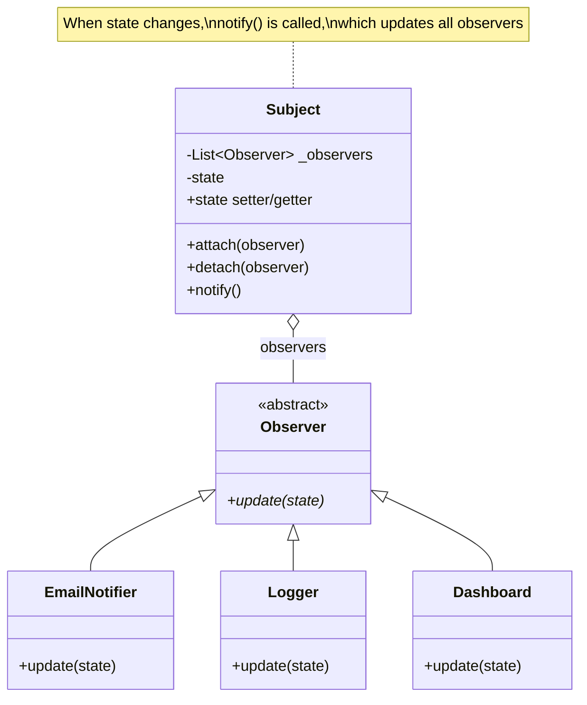
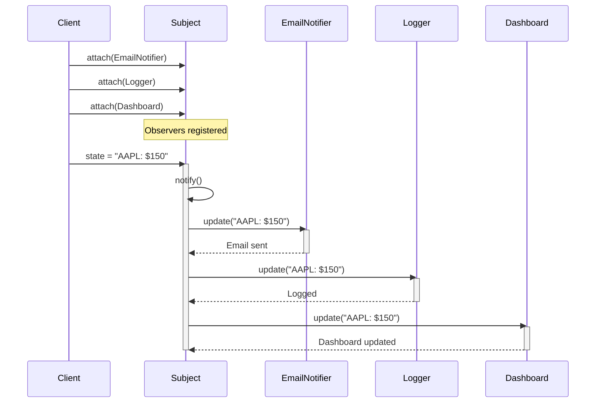

## The Observer Pattern

**Problem:** Multiple objects need to react when another object's state changes. You don't want tight coupling between the object being watched and those reacting.

**Solution:** Define a subscription mechanism where observers register for updates and get notified automatically.

---

## Classic Observer Implementation

```python
class Subject:
    """The object being observed."""

    def __init__(self):
        self._observers = []
        self._state = None

    def attach(self, observer):
        """Register an observer."""
        if observer not in self._observers:
            self._observers.append(observer)

    def detach(self, observer):
        """Unregister an observer."""
        self._observers.remove(observer)

    def notify(self):
        """Notify all observers of state change."""
        for observer in self._observers:
            observer.update(self._state)

    @property
    def state(self):
        return self._state

    @state.setter
    def state(self, value):
        self._state = value
        self.notify()  # Automatically notify on change

class Observer:
    """Base class for observers."""

    def update(self, state):
        raise NotImplementedError
```

### Observer Pattern Class Diagram



---

## Concrete Observers

```python
class EmailNotifier(Observer):
    def update(self, state):
        print(f"Sending email: State changed to {state}")

class Logger(Observer):
    def update(self, state):
        print(f"[LOG] State changed to {state}")

class Dashboard(Observer):
    def update(self, state):
        print(f"Dashboard updated: {state}")

class SlackNotifier(Observer):
    def update(self, state):
        print(f"Slack message: State is now {state}")

# Usage
stock = Subject()
stock.attach(EmailNotifier())
stock.attach(Logger())
stock.attach(Dashboard())

stock.state = "AAPL: $150"
# Output:
# Sending email: State changed to AAPL: $150
# [LOG] State changed to AAPL: $150
# Dashboard updated: AAPL: $150
```

### Observer Pattern Sequence Diagram



---

## Observer with Topics/Events

More flexible: observers subscribe to specific events:

```python
class EventManager:
    def __init__(self):
        self._listeners = {}

    def subscribe(self, event_type, listener):
        if event_type not in self._listeners:
            self._listeners[event_type] = []
        self._listeners[event_type].append(listener)

    def unsubscribe(self, event_type, listener):
        if event_type in self._listeners:
            self._listeners[event_type].remove(listener)

    def notify(self, event_type, data=None):
        if event_type in self._listeners:
            for listener in self._listeners[event_type]:
                listener(data)

class UserService:
    def __init__(self):
        self.events = EventManager()

    def create_user(self, username, email):
        user = {'username': username, 'email': email}
        # User created...
        self.events.notify('user_created', user)
        return user

    def delete_user(self, user_id):
        # User deleted...
        self.events.notify('user_deleted', user_id)

# Usage
service = UserService()

# Subscribe to specific events
service.events.subscribe('user_created',
    lambda user: print(f"Welcome email sent to {user['email']}"))
service.events.subscribe('user_created',
    lambda user: print(f"Analytics: New user {user['username']}"))
service.events.subscribe('user_deleted',
    lambda id: print(f"Cleanup for user {id}"))

service.create_user('alice', 'alice@example.com')
# Welcome email sent to alice@example.com
# Analytics: New user alice
```

---

## Python's Built-in: Callbacks

For simple cases, callbacks are more Pythonic:

```python
class Button:
    def __init__(self):
        self._on_click = []

    def add_click_handler(self, handler):
        self._on_click.append(handler)

    def click(self):
        for handler in self._on_click:
            handler()

button = Button()
button.add_click_handler(lambda: print("Clicked!"))
button.add_click_handler(lambda: print("Logging click..."))
button.click()
# Clicked!
# Logging click...
```

---

## Real-World Example: Stock Price Monitor

```python
class StockTicker:
    def __init__(self, symbol):
        self.symbol = symbol
        self._price = 0
        self._observers = []

    def add_observer(self, observer):
        self._observers.append(observer)

    def remove_observer(self, observer):
        self._observers.remove(observer)

    @property
    def price(self):
        return self._price

    @price.setter
    def price(self, value):
        old_price = self._price
        self._price = value
        self._notify_observers(old_price, value)

    def _notify_observers(self, old_price, new_price):
        for observer in self._observers:
            observer.on_price_change(self.symbol, old_price, new_price)

class PriceAlert:
    def __init__(self, threshold, direction='above'):
        self.threshold = threshold
        self.direction = direction

    def on_price_change(self, symbol, old_price, new_price):
        if self.direction == 'above' and new_price > self.threshold:
            print(f"ALERT: {symbol} is above ${self.threshold}!")
        elif self.direction == 'below' and new_price < self.threshold:
            print(f"ALERT: {symbol} is below ${self.threshold}!")

class TradeExecutor:
    def on_price_change(self, symbol, old_price, new_price):
        change = ((new_price - old_price) / old_price) * 100 if old_price else 0
        if abs(change) > 5:
            print(f"Large move in {symbol}: {change:.1f}% - checking trades...")

# Usage
apple = StockTicker('AAPL')
apple.add_observer(PriceAlert(150, 'above'))
apple.add_observer(PriceAlert(140, 'below'))
apple.add_observer(TradeExecutor())

apple.price = 145  # No alerts
apple.price = 155  # ALERT: AAPL is above $150!
apple.price = 135  # ALERT: AAPL is below $140! + Large move alert
```

---

## Django Signals (Observer Pattern)

Django uses signals, which is the Observer pattern:

```python
from django.db.models.signals import post_save
from django.dispatch import receiver
from django.contrib.auth.models import User

@receiver(post_save, sender=User)
def create_user_profile(sender, instance, created, **kwargs):
    if created:
        Profile.objects.create(user=instance)

@receiver(post_save, sender=User)
def send_welcome_email(sender, instance, created, **kwargs):
    if created:
        send_email(instance.email, "Welcome!")
```

---

## When to Use Observer

**Good use cases:**
- Event-driven systems
- UI components reacting to data changes
- Notification systems
- Plugin architectures
- Logging and monitoring

**Avoid when:**
- Only one object needs notification (just call it directly)
- Updates must happen in specific order
- Complex dependencies between observers

---

## Key Takeaways

- Observer pattern decouples subjects from observers
- Observers register for notifications and get called on changes
- Event systems allow subscribing to specific event types
- Python callbacks are simpler for basic cases
- Django signals are the Observer pattern in action
- Use for event-driven, loosely-coupled systems
