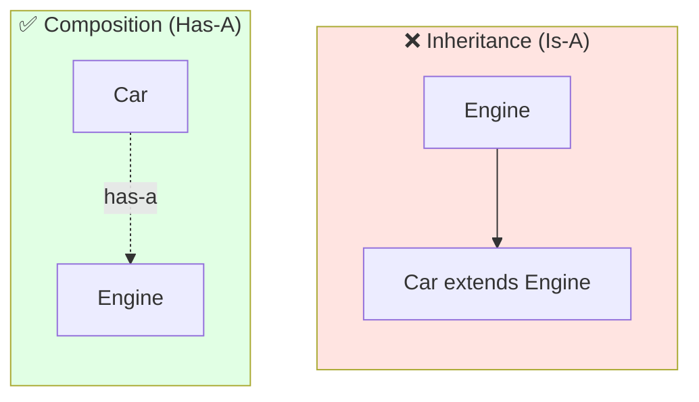
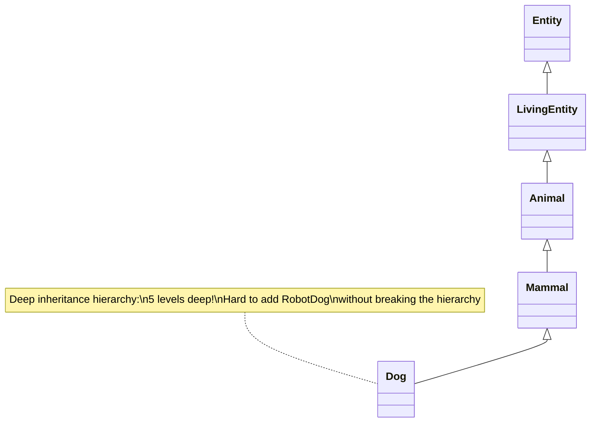
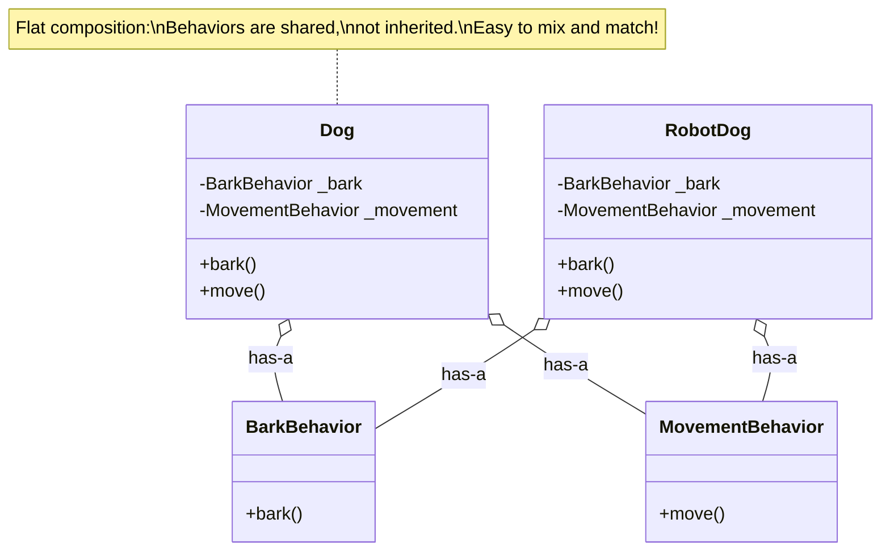

## Composition Over Inheritance

Inheritance is a powerful tool, but it's often overused. Composition—building objects from other objects—frequently leads to more flexible, maintainable designs.

---

## Inheritance: The "Is-A" Relationship

Inheritance models "is-a" relationships:

```python
class Animal:
    def eat(self):
        print("Eating...")

class Dog(Animal):
    def bark(self):
        print("Woof!")

# A Dog IS an Animal
dog = Dog()
dog.eat()   # Inherited
dog.bark()  # Dog-specific
```

---

## Composition: The "Has-A" Relationship

Composition models "has-a" relationships:

```python
class Engine:
    def start(self):
        print("Engine starting...")

class Car:
    def __init__(self, engine: Engine):
        self._engine = engine  # Car HAS an Engine

    def start(self):
        self._engine.start()
        print("Car ready to drive")

car = Car(Engine())
car.start()
```

### Inheritance vs Composition Visualization



**Inheritance** (Is-A): Car **is an** Engine - Doesn't make sense!

**Composition** (Has-A): Car **has an** Engine - Makes perfect sense!

---

## Why Prefer Composition?

### 1. Flexibility at Runtime

Inheritance is fixed at class definition. Composition can change at runtime:

```python
class Logger:
    def log(self, message: str) -> None:
        print(message)

class FileLogger:
    def __init__(self, path: str):
        self.path = path

    def log(self, message: str) -> None:
        with open(self.path, 'a') as f:
            f.write(message + '\n')

class Application:
    def __init__(self, logger):
        self._logger = logger

    def do_something(self):
        self._logger.log("Doing something")

# Can switch logger at runtime
app = Application(Logger())
app.do_something()  # Prints to console

app = Application(FileLogger("app.log"))
app.do_something()  # Writes to file
```

### 2. Avoids Deep Hierarchies

Inheritance chains get complicated:

```python
# Problematic deep hierarchy
class Entity: ...
class LivingEntity(Entity): ...
class Animal(LivingEntity): ...
class Mammal(Animal): ...
class Dog(Mammal): ...

# What if you need a RobotDog that has Dog behavior but isn't living?
```



Composition keeps things flat:

```python
class BarkBehavior:
    def bark(self):
        print("Woof!")

class MovementBehavior:
    def move(self):
        print("Moving...")

class Dog:
    def __init__(self):
        self._bark = BarkBehavior()
        self._movement = MovementBehavior()

    def bark(self):
        self._bark.bark()

    def move(self):
        self._movement.move()

class RobotDog:
    def __init__(self):
        self._bark = BarkBehavior()  # Same behavior!
        self._movement = MovementBehavior()

    def bark(self):
        self._bark.bark()

    def move(self):
        self._movement.move()
```



### 3. Easier Testing

Composed objects can use test doubles:

```python
class PaymentGateway:
    def charge(self, amount: int) -> bool:
        # Real network call
        return True

class PaymentService:
    def __init__(self, gateway: PaymentGateway):
        self._gateway = gateway

    def process_payment(self, amount: int) -> bool:
        if amount <= 0:
            return False
        return self._gateway.charge(amount)

# In tests - use a fake
class FakeGateway:
    def __init__(self, should_succeed: bool = True):
        self.should_succeed = should_succeed
        self.charged_amounts = []

    def charge(self, amount: int) -> bool:
        self.charged_amounts.append(amount)
        return self.should_succeed

def test_payment_service():
    fake = FakeGateway()
    service = PaymentService(fake)
    service.process_payment(100)
    assert fake.charged_amounts == [100]
```

---

## When Inheritance Is Still Right

Inheritance isn't always wrong. Use it when:

### 1. True "Is-A" Relationship

```python
class Shape(ABC):
    @abstractmethod
    def area(self) -> float: ...

class Circle(Shape):
    def __init__(self, radius: float):
        self.radius = radius

    def area(self) -> float:
        return 3.14159 * self.radius ** 2

# A Circle truly IS a Shape
```

### 2. Sharing Implementation

ABCs can share code:

```python
class DataExporter(ABC):
    def export(self, data, filename):
        validated = self.validate(data)
        formatted = self.format(validated)
        self._write(filename, formatted)

    def validate(self, data):  # Shared
        if not data:
            raise ValueError("Empty data")
        return data

    def _write(self, filename, content):  # Shared
        with open(filename, 'w') as f:
            f.write(content)

    @abstractmethod
    def format(self, data) -> str:  # Subclasses implement
        ...
```

### 3. Framework Requirements

Some frameworks require inheritance:

```python
# Django requires model inheritance
from django.db import models

class Product(models.Model):
    name = models.CharField(max_length=100)
    price = models.DecimalField(max_digits=10, decimal_places=2)
```

---

## The Decision Process

```
Do you need to reuse code?
├── Yes
│   ├── Is it truly an "is-a" relationship?
│   │   ├── Yes → Consider inheritance
│   │   └── No → Use composition
│   └── Do implementations vary independently?
│       ├── Yes → Use composition
│       └── No → Inheritance might be OK
└── No
    └── Keep them separate
```

---

## Refactoring from Inheritance to Composition

Before (inheritance):

```python
class EmailNotifier:
    def notify(self, user, message):
        self._send_email(user.email, message)

    def _send_email(self, to, message):
        print(f"Email to {to}: {message}")

class SMSNotifier(EmailNotifier):  # Awkward!
    def notify(self, user, message):
        self._send_sms(user.phone, message)

    def _send_sms(self, to, message):
        print(f"SMS to {to}: {message}")
```

After (composition):

```python
class EmailSender:
    def send(self, to: str, message: str):
        print(f"Email to {to}: {message}")

class SMSSender:
    def send(self, to: str, message: str):
        print(f"SMS to {to}: {message}")

class Notifier:
    def __init__(self, sender, get_contact):
        self._sender = sender
        self._get_contact = get_contact

    def notify(self, user, message):
        contact = self._get_contact(user)
        self._sender.send(contact, message)

# Create specific notifiers
email_notifier = Notifier(EmailSender(), lambda u: u.email)
sms_notifier = Notifier(SMSSender(), lambda u: u.phone)
```

---

## Key Takeaways

- Inheritance models "is-a"; composition models "has-a"
- Composition provides runtime flexibility
- Composition avoids deep, brittle hierarchies
- Composition makes testing easier
- Use inheritance for true hierarchies and shared implementation
- When in doubt, prefer composition
