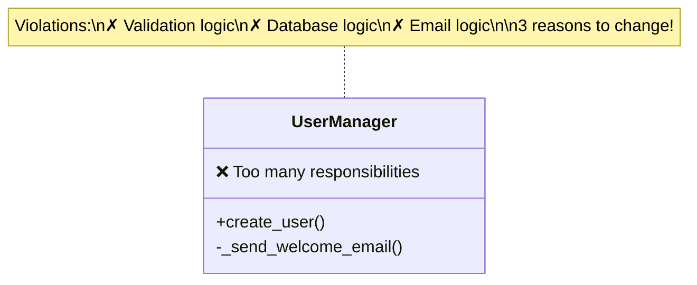
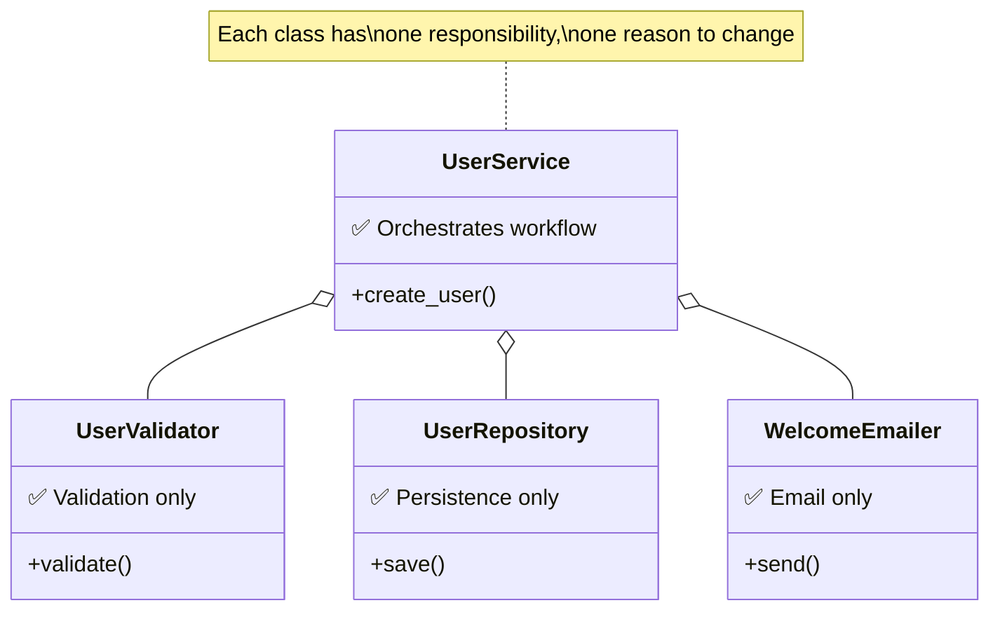
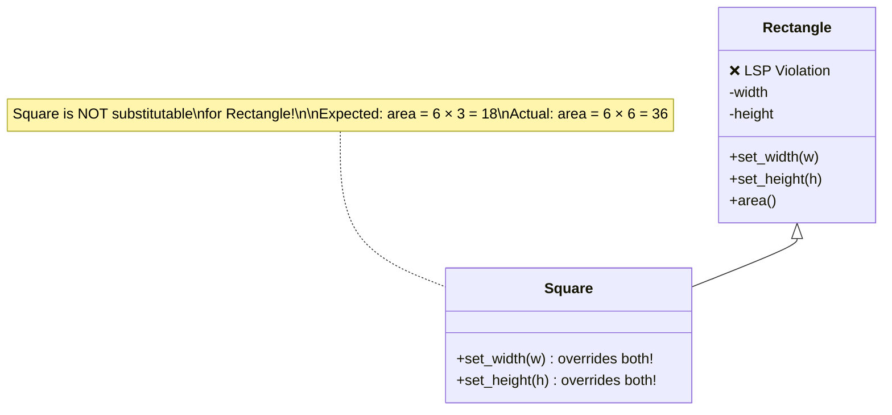
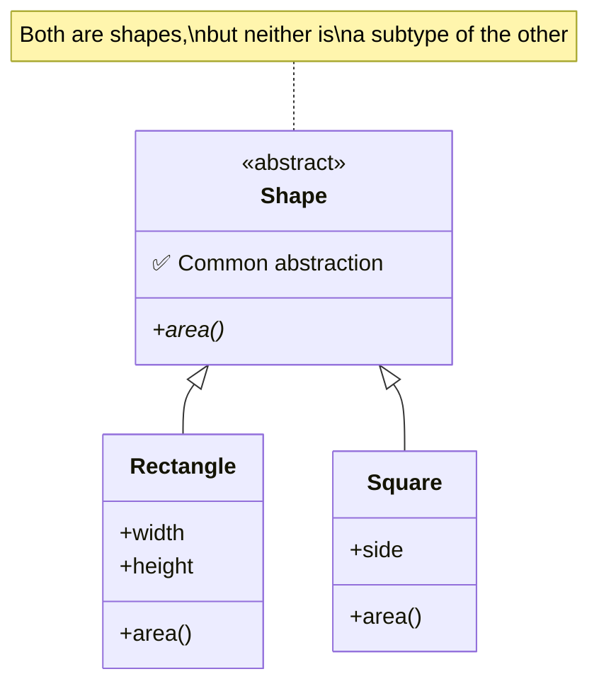

## SOLID Principles

SOLID is an acronym for five design principles that help create maintainable, flexible code. They're guidelines for spotting and fixing design problems, not rigid rules to follow blindly.

---

## S: Single Responsibility Principle

**A class should have only one reason to change.**

### Bad: Multiple Responsibilities

```python
class UserManager:
    def create_user(self, name: str, email: str) -> User:
        # Validation logic
        if '@' not in email:
            raise ValueError("Invalid email")

        # Database logic
        user = User(name, email)
        db.save(user)

        # Email logic
        self._send_welcome_email(user)

        return user

    def _send_welcome_email(self, user: User):
        # Email sending logic
        pass
```

This class changes if validation rules change, database schema changes, OR email logic changes.



### Good: Separated Responsibilities

```python
class UserValidator:
    def validate(self, name: str, email: str) -> None:
        if '@' not in email:
            raise ValueError("Invalid email")

class UserRepository:
    def save(self, user: User) -> None:
        db.save(user)

class WelcomeEmailer:
    def send(self, user: User) -> None:
        # Send welcome email
        pass

class UserService:
    def __init__(self, validator, repository, emailer):
        self._validator = validator
        self._repository = repository
        self._emailer = emailer

    def create_user(self, name: str, email: str) -> User:
        self._validator.validate(name, email)
        user = User(name, email)
        self._repository.save(user)
        self._emailer.send(user)
        return user
```



---

## O: Open/Closed Principle

**Classes should be open for extension but closed for modification.**

### Bad: Modifying Existing Code

```python
class DiscountCalculator:
    def calculate(self, order, discount_type: str) -> float:
        if discount_type == "percentage":
            return order.total * 0.1
        elif discount_type == "fixed":
            return 10.0
        elif discount_type == "seasonal":  # Added later - modifies class
            return order.total * 0.15
        # Every new discount requires modifying this class
```

### Good: Extend Without Modifying

```python
from abc import ABC, abstractmethod

class DiscountStrategy(ABC):
    @abstractmethod
    def calculate(self, order) -> float: ...

class PercentageDiscount(DiscountStrategy):
    def __init__(self, percent: float):
        self.percent = percent

    def calculate(self, order) -> float:
        return order.total * self.percent

class FixedDiscount(DiscountStrategy):
    def __init__(self, amount: float):
        self.amount = amount

    def calculate(self, order) -> float:
        return min(self.amount, order.total)

class SeasonalDiscount(DiscountStrategy):  # New - no modification needed
    def calculate(self, order) -> float:
        return order.total * 0.15

class DiscountCalculator:
    def calculate(self, order, strategy: DiscountStrategy) -> float:
        return strategy.calculate(order)
```

---

## L: Liskov Substitution Principle

**Subclasses must be substitutable for their base classes.**

If code works with a parent class, it must work with any child class without knowing the difference.

### Bad: Broken Substitution

```python
class Rectangle:
    def __init__(self, width: float, height: float):
        self._width = width
        self._height = height

    def set_width(self, width: float):
        self._width = width

    def set_height(self, height: float):
        self._height = height

    def area(self) -> float:
        return self._width * self._height

class Square(Rectangle):
    def set_width(self, width: float):
        self._width = width
        self._height = width  # Must keep square!

    def set_height(self, height: float):
        self._width = height
        self._height = height

# This breaks!
def double_width(rect: Rectangle):
    rect.set_width(rect._width * 2)
    return rect.area()

rect = Rectangle(3, 4)
print(double_width(rect))  # 24 (6 * 4)

square = Square(3, 3)
print(double_width(square))  # 36, not 18! (6 * 6, not 6 * 3)
```



The mathematical relationship: a square **is-a** special rectangle, doesn't translate to code inheritance!

$$\text{Expected: } A = w \times h = 6 \times 3 = 18$$
$$\text{Actual: } A = w \times h = 6 \times 6 = 36$$

### Good: Proper Hierarchy

```python
from abc import ABC, abstractmethod

class Shape(ABC):
    @abstractmethod
    def area(self) -> float: ...

class Rectangle(Shape):
    def __init__(self, width: float, height: float):
        self.width = width
        self.height = height

    def area(self) -> float:
        return self.width * self.height

class Square(Shape):
    def __init__(self, side: float):
        self.side = side

    def area(self) -> float:
        return self.side ** 2
```



---

## I: Interface Segregation Principle

**Clients shouldn't depend on methods they don't use.**

### Bad: Fat Interface

```python
class Worker(ABC):
    @abstractmethod
    def work(self): ...

    @abstractmethod
    def eat(self): ...

    @abstractmethod
    def sleep(self): ...

class Robot(Worker):
    def work(self):
        print("Working...")

    def eat(self):
        pass  # Robots don't eat!

    def sleep(self):
        pass  # Robots don't sleep!
```

### Good: Segregated Interfaces

```python
class Workable(Protocol):
    def work(self) -> None: ...

class Eatable(Protocol):
    def eat(self) -> None: ...

class Sleepable(Protocol):
    def sleep(self) -> None: ...

class Human:
    def work(self) -> None:
        print("Working...")

    def eat(self) -> None:
        print("Eating...")

    def sleep(self) -> None:
        print("Sleeping...")

class Robot:
    def work(self) -> None:
        print("Working...")

def assign_work(worker: Workable) -> None:
    worker.work()

assign_work(Human())  # OK
assign_work(Robot())  # OK - only needs work()
```

---

## D: Dependency Inversion Principle

**High-level modules shouldn't depend on low-level modules. Both should depend on abstractions.**

### Bad: Direct Dependency

```python
class MySQLDatabase:
    def query(self, sql: str):
        # MySQL-specific code
        pass

class UserRepository:
    def __init__(self):
        self.db = MySQLDatabase()  # Tightly coupled!

    def find_user(self, id: int):
        return self.db.query(f"SELECT * FROM users WHERE id = {id}")
```

### Good: Depend on Abstraction

```python
class Database(Protocol):
    def query(self, sql: str) -> Any: ...

class MySQLDatabase:
    def query(self, sql: str) -> Any:
        # MySQL implementation
        pass

class PostgresDatabase:
    def query(self, sql: str) -> Any:
        # Postgres implementation
        pass

class UserRepository:
    def __init__(self, db: Database):  # Depends on abstraction
        self.db = db

    def find_user(self, id: int):
        return self.db.query(f"SELECT * FROM users WHERE id = {id}")

# Can use any database
repo = UserRepository(MySQLDatabase())
repo = UserRepository(PostgresDatabase())
```

---

## Applying SOLID Pragmatically

SOLID principles help you **recognize problems**, not follow rigidly:

| Symptom | Possible SOLID Violation |
|---------|-------------------------|
| Class does too much | Single Responsibility |
| Adding features requires modifying stable code | Open/Closed |
| Subclass breaks parent's behavior | Liskov Substitution |
| Implementing unused methods | Interface Segregation |
| Hard to test or swap implementations | Dependency Inversion |

---

## Key Takeaways

- **SRP:** One reason to change per class
- **OCP:** Extend behavior without modifying code
- **LSP:** Subclasses must work wherever parent works
- **ISP:** Small, focused interfaces
- **DIP:** Depend on abstractions, not concretions
- Use SOLID as a diagnostic tool, not a checklist
- Apply principles when you feel design pressure
