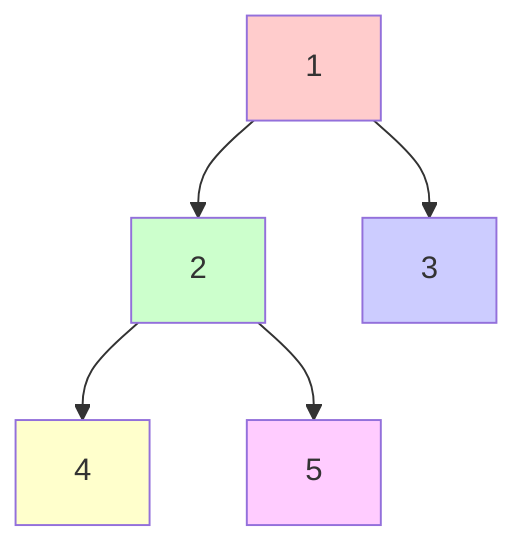
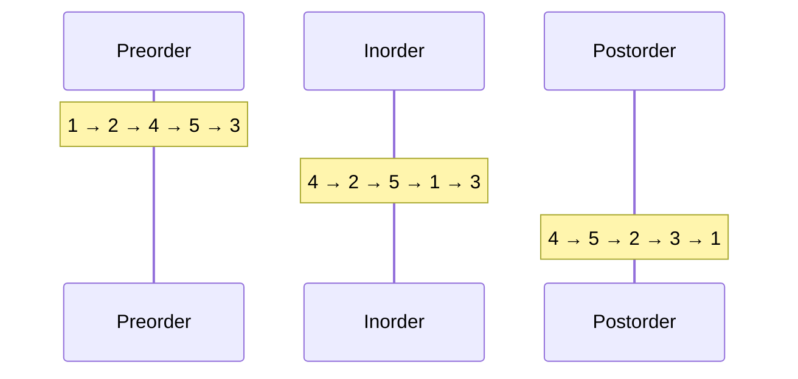

# Tree Traversals

Tree traversal is the process of visiting every node in a tree exactly once. Different traversal orders serve different purposes and produce different output sequences.

## Depth-First Traversals

Three classic orderings based on when the root is visited:

### Preorder: Root → Left → Right
Visit root first, then recursively traverse left subtree, then right subtree.

```python
def preorder(node):
    if node:
        print(node.val)           # Process root
        preorder(node.left)       # Traverse left
        preorder(node.right)      # Traverse right

def preorder_iterative(root):
    if not root:
        return []
    result = []
    stack = [root]
    while stack:
        node = stack.pop()
        result.append(node.val)
        if node.right:            # Right first (LIFO)
            stack.append(node.right)
        if node.left:
            stack.append(node.left)
    return result
```

**Use cases**: Create a copy of tree, serialize tree, prefix expression

### Inorder: Left → Root → Right
Recursively traverse left subtree, visit root, then traverse right subtree.

```python
def inorder(node):
    if node:
        inorder(node.left)        # Traverse left
        print(node.val)           # Process root
        inorder(node.right)       # Traverse right

def inorder_iterative(root):
    result = []
    stack = []
    current = root
    while current or stack:
        while current:            # Go left as far as possible
            stack.append(current)
            current = current.left
        current = stack.pop()
        result.append(current.val)
        current = current.right   # Visit right subtree
    return result
```

**Key property**: For BST, inorder gives nodes in sorted order!

### Postorder: Left → Right → Root
Recursively traverse left, then right, then visit root.

```python
def postorder(node):
    if node:
        postorder(node.left)      # Traverse left
        postorder(node.right)     # Traverse right
        print(node.val)           # Process root

def postorder_iterative(root):
    if not root:
        return []
    result = []
    stack = [root]
    while stack:
        node = stack.pop()
        result.append(node.val)
        if node.left:
            stack.append(node.left)
        if node.right:
            stack.append(node.right)
    return result[::-1]           # Reverse the result
```

**Use cases**: Delete tree (children before parent), postfix expression, calculate directory size

## Visualization

Let's visualize all three traversal orders on the same tree:



**Traversal results:**
- **Preorder**: 1, 2, 4, 5, 3 (visit root first)
- **Inorder**: 4, 2, 5, 1, 3 (left → root → right)
- **Postorder**: 4, 5, 2, 3, 1 (visit root last)



## Breadth-First Traversal (Level Order)

Visit nodes level by level, left to right:

```python
from collections import deque

def level_order(root):
    if not root:
        return []
    result = []
    queue = deque([root])
    while queue:
        node = queue.popleft()
        result.append(node.val)
        if node.left:
            queue.append(node.left)
        if node.right:
            queue.append(node.right)
    return result

# With level separation
def level_order_by_level(root):
    if not root:
        return []
    result = []
    queue = deque([root])
    while queue:
        level = []
        level_size = len(queue)
        for _ in range(level_size):
            node = queue.popleft()
            level.append(node.val)
            if node.left:
                queue.append(node.left)
            if node.right:
                queue.append(node.right)
        result.append(level)
    return result
```

**Use cases**: Find minimum depth, connect nodes at same level, serialize level-by-level

## Morris Traversal (O(1) Space)

Traverse without recursion or stack using threaded binary trees:

```python
def morris_inorder(root):
    result = []
    current = root
    while current:
        if not current.left:
            result.append(current.val)
            current = current.right
        else:
            # Find inorder predecessor
            predecessor = current.left
            while predecessor.right and predecessor.right != current:
                predecessor = predecessor.right

            if not predecessor.right:
                # Make current the right child of predecessor
                predecessor.right = current
                current = current.left
            else:
                # Revert the change
                predecessor.right = None
                result.append(current.val)
                current = current.right
    return result
```

## Choosing a Traversal

| Purpose | Traversal |
|---------|-----------|
| BST in sorted order | Inorder |
| Copy/clone tree | Preorder |
| Delete tree | Postorder |
| Shortest path (unweighted) | Level order |
| Expression evaluation | Depends on notation |
| Serialize tree | Any consistent order |

## Time and Space Complexity

| Traversal | Time | Space (recursive) | Space (iterative) |
|-----------|------|-------------------|-------------------|
| Preorder | $O(n)$ | $O(h)$ | $O(h)$ |
| Inorder | $O(n)$ | $O(h)$ | $O(h)$ |
| Postorder | $O(n)$ | $O(h)$ | $O(h)$ |
| Level order | $O(n)$ | N/A | $O(w)$ |
| Morris | $O(n)$ | N/A | $O(1)$ |

Where $h$ = height, $w$ = max width, $n$ = number of nodes.

**Analysis**: Each node is visited exactly once, giving $O(n)$ time. Space complexity for recursive traversals is $O(h)$ due to the call stack, where:
- Best case (balanced tree): $h = O(\log n)$
- Worst case (skewed tree): $h = O(n)$

Level-order traversal uses a queue that can hold up to $O(w)$ nodes, where $w$ is the maximum width of the tree (at most $\lceil n/2 \rceil$ for a complete binary tree).

## Reconstructing Trees

Given traversal outputs, can you reconstruct the tree?

- **Preorder + Inorder**: Yes, unique tree
- **Postorder + Inorder**: Yes, unique tree
- **Preorder + Postorder**: Only for full binary trees
- **Inorder alone**: No (multiple possible trees)
