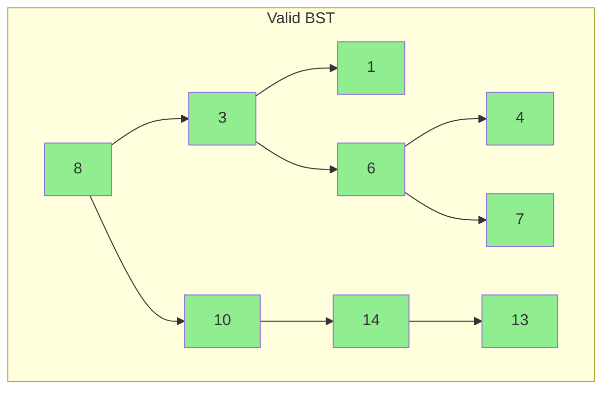
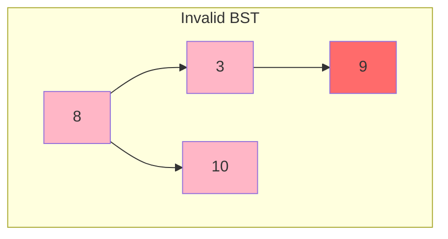
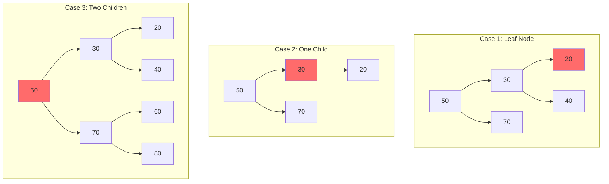

# Binary Search Trees

Binary Search Trees (BSTs) are a fundamental data structure that combines the flexibility of linked structures with the efficiency of binary search. Understanding BSTs is essential for any programmer, as they form the basis for many more advanced data structures.

## What is a Binary Search Tree?

A Binary Search Tree is a binary tree with a crucial ordering property: for every node, all values in its left subtree are smaller than the node's value, and all values in its right subtree are larger. This property enables efficient searching, insertion, and deletion operations.

```python
class BSTNode:
    def __init__(self, value):
        self.value = value
        self.left = None
        self.right = None
```

The BST property must hold for the **entire subtree**, not just immediate children. This is a common source of confusion:





**Invalid**: Node 9 is in the left subtree of 8, but 9 > 8 violates the BST property!

## Searching in a BST

The BST property enables binary search: at each node, we can eliminate half the remaining nodes by comparing our target with the current node's value.

```python
def search(root, target):
    """Search for a value in a BST. Returns the node if found, None otherwise."""
    if root is None or root.value == target:
        return root

    if target < root.value:
        return search(root.left, target)
    else:
        return search(root.right, target)

def search_iterative(root, target):
    """Iterative version - often preferred to avoid stack overflow."""
    current = root
    while current is not None:
        if target == current.value:
            return current
        elif target < current.value:
            current = current.left
        else:
            current = current.right
    return None
```

**Time Complexity**: $O(h)$ where $h$ is the height of the tree.
- Best case (balanced): $O(\log n)$
- Worst case (skewed): $O(n)$

The search eliminates half the search space at each step in a balanced tree:

$$T(n) = T(n/2) + O(1) = O(\log n)$$

However, in a skewed tree, we examine all nodes:

$$T(n) = T(n-1) + O(1) = O(n)$$

## Insertion in a BST

To insert a new value, we search for where it should go (using the same logic as search), then create a new node at that position.

```python
def insert(root, value):
    """Insert a value into a BST. Returns the root of the modified tree."""
    if root is None:
        return BSTNode(value)

    if value < root.value:
        root.left = insert(root.left, value)
    elif value > root.value:
        root.right = insert(root.right, value)
    # If value == root.value, we typically don't insert duplicates

    return root

def insert_iterative(root, value):
    """Iterative insertion."""
    new_node = BSTNode(value)

    if root is None:
        return new_node

    current = root
    while True:
        if value < current.value:
            if current.left is None:
                current.left = new_node
                break
            current = current.left
        else:
            if current.right is None:
                current.right = new_node
                break
            current = current.right

    return root
```

**Time Complexity**: $O(h)$ - same as search

## Deletion in a BST

Deletion is the most complex BST operation because we must maintain the BST property after removing a node. There are three cases:

### Case 1: Node has no children (leaf node)
Simply remove the node.

### Case 2: Node has one child
Replace the node with its child.

### Case 3: Node has two children
Find the node's **in-order successor** (smallest value in right subtree) or **in-order predecessor** (largest value in left subtree), copy that value to the node being deleted, then delete the successor/predecessor.

```python
def find_min(node):
    """Find the minimum value node in a subtree."""
    current = node
    while current.left is not None:
        current = current.left
    return current

def delete(root, value):
    """Delete a value from a BST. Returns the root of the modified tree."""
    if root is None:
        return root

    # Find the node to delete
    if value < root.value:
        root.left = delete(root.left, value)
    elif value > root.value:
        root.right = delete(root.right, value)
    else:
        # Found the node to delete

        # Case 1 & 2: Node has 0 or 1 child
        if root.left is None:
            return root.right
        elif root.right is None:
            return root.left

        # Case 3: Node has two children
        # Find in-order successor (minimum in right subtree)
        successor = find_min(root.right)
        root.value = successor.value
        root.right = delete(root.right, successor.value)

    return root
```

**Time Complexity**: $O(h)$ - we may need to traverse to a leaf

### Deletion Cases Visualization



**Case 1**: Delete node 20 - simply remove it
**Case 2**: Delete node 30 - replace with child 20
**Case 3**: Delete node 50 - replace with in-order successor 60

## Building a BST

The order of insertion affects the tree's shape:

```python
# Inserting [4, 2, 6, 1, 3, 5, 7] creates a balanced tree:
#        4
#       / \
#      2   6
#     / \ / \
#    1  3 5  7

# Inserting [1, 2, 3, 4, 5, 6, 7] creates a skewed tree:
#    1
#     \
#      2
#       \
#        3
#         \
#         ...
```

To build a balanced BST from sorted data:

```python
def sorted_array_to_bst(arr):
    """Convert a sorted array to a balanced BST."""
    if not arr:
        return None

    mid = len(arr) // 2
    root = BSTNode(arr[mid])
    root.left = sorted_array_to_bst(arr[:mid])
    root.right = sorted_array_to_bst(arr[mid + 1:])

    return root
```

## Validating a BST

A common interview problem is verifying whether a binary tree satisfies the BST property:

```python
def is_valid_bst(root, min_val=float('-inf'), max_val=float('inf')):
    """Check if a binary tree is a valid BST."""
    if root is None:
        return True

    if root.value <= min_val or root.value >= max_val:
        return False

    return (is_valid_bst(root.left, min_val, root.value) and
            is_valid_bst(root.right, root.value, max_val))
```

**Common mistake**: Only checking immediate children instead of the entire subtree constraints.

## In-Order Traversal Property

The in-order traversal of a BST visits nodes in sorted order. This property is useful for:
- Printing elements in sorted order
- Finding the kth smallest/largest element
- Validating BST property

```python
def inorder_traversal(root, result=None):
    """Returns elements in sorted order."""
    if result is None:
        result = []
    if root:
        inorder_traversal(root.left, result)
        result.append(root.value)
        inorder_traversal(root.right, result)
    return result
```

## Summary

Binary Search Trees provide efficient O(log n) operations when balanced, but can degrade to O(n) when skewed. Key operations include search, insert, and delete (with three cases). The in-order traversal visits nodes in sorted order. Understanding BSTs prepares you for balanced tree variants like AVL and Red-Black trees that guarantee O(log n) operations.
