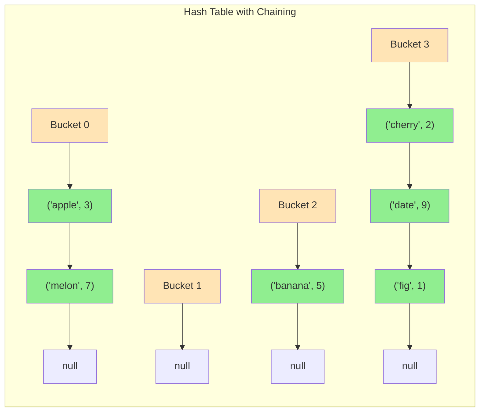

# Collision Resolution: Chaining

Collisions occur when two different keys hash to the same bucket index. **Chaining** (also called separate chaining) is the most common collision resolution strategy, where each bucket stores a collection of all entries that hash to that index.

## How Chaining Works

Instead of storing a single value at each bucket, we store a linked list (or other collection) of all key-value pairs that hash to that index:



**Visualization**: Each bucket (orange) points to a chain of entries (green). Colliding keys share the same bucket but are stored in a linked list.

## Implementation

```python
class HashTableChaining:
    def __init__(self, size=10):
        self.size = size
        self.buckets = [[] for _ in range(size)]  # List of lists
        self.count = 0

    def _hash(self, key):
        return hash(key) % self.size

    def put(self, key, value):
        index = self._hash(key)
        bucket = self.buckets[index]

        # Check if key already exists
        for i, (k, v) in enumerate(bucket):
            if k == key:
                bucket[i] = (key, value)  # Update existing
                return

        # Key not found - add new entry
        bucket.append((key, value))
        self.count += 1

    def get(self, key):
        index = self._hash(key)
        bucket = self.buckets[index]

        for k, v in bucket:
            if k == key:
                return v

        raise KeyError(key)

    def remove(self, key):
        index = self._hash(key)
        bucket = self.buckets[index]

        for i, (k, v) in enumerate(bucket):
            if k == key:
                del bucket[i]
                self.count -= 1
                return

        raise KeyError(key)

    def __contains__(self, key):
        try:
            self.get(key)
            return True
        except KeyError:
            return False
```

## Chain Data Structures

While linked lists are traditional, other structures work:

### Linked List
- Simple implementation
- Good for small chains
- O(n) search within chain

### Dynamic Array
- Better cache locality
- Python lists are dynamic arrays
- Same O(n) search but faster in practice

### Binary Search Tree
- O(log n) search within chain
- Java 8+ HashMap uses this for large buckets
- Worth it when chains get long

```python
# Using BST for chains (simplified)
class TreeNode:
    def __init__(self, key, value):
        self.key = key
        self.value = value
        self.left = None
        self.right = None

class HashTableWithTreeChains:
    def __init__(self, size=10):
        self.size = size
        self.buckets = [None] * size  # Each bucket is a BST root

    def _hash(self, key):
        return hash(key) % self.size

    def put(self, key, value):
        index = self._hash(key)
        self.buckets[index] = self._insert_tree(self.buckets[index], key, value)

    def _insert_tree(self, node, key, value):
        if node is None:
            return TreeNode(key, value)
        if key < node.key:
            node.left = self._insert_tree(node.left, key, value)
        elif key > node.key:
            node.right = self._insert_tree(node.right, key, value)
        else:
            node.value = value  # Update existing
        return node
```

## Load Factor and Performance

The **load factor** ($\lambda$) is the average number of entries per bucket:

$$\lambda = \frac{n}{m}$$

where $n$ = number of entries, $m$ = number of buckets

With chaining:
- Average chain length = $\lambda$
- Average search time = $O(1 + \lambda)$
- If $\lambda$ is constant, operations are $O(1)$

**Rule of thumb**: Resize when $\lambda > 0.75$

**Analysis**: With uniform hashing, the expected number of elements in each bucket is $\lambda$. Searching requires:
1. $O(1)$ to compute hash and find bucket
2. $O(\lambda)$ to search the chain

Total: $O(1 + \lambda) = O(1)$ when $\lambda$ is kept constant through resizing

```python
class HashTableWithResize:
    def __init__(self, initial_size=10, max_load=0.75):
        self.size = initial_size
        self.max_load = max_load
        self.buckets = [[] for _ in range(self.size)]
        self.count = 0

    def _load_factor(self):
        return self.count / self.size

    def _resize(self):
        old_buckets = self.buckets
        self.size *= 2
        self.buckets = [[] for _ in range(self.size)]
        self.count = 0

        for bucket in old_buckets:
            for key, value in bucket:
                self.put(key, value)

    def put(self, key, value):
        if self._load_factor() > self.max_load:
            self._resize()

        index = hash(key) % self.size
        bucket = self.buckets[index]

        for i, (k, v) in enumerate(bucket):
            if k == key:
                bucket[i] = (key, value)
                return

        bucket.append((key, value))
        self.count += 1
```

## Time Complexity Analysis

Assuming uniform hashing (keys distributed evenly):

| Operation | Average | Worst Case |
|-----------|---------|------------|
| Insert    | $O(1)$    | $O(n)$       |
| Search    | $O(1 + \lambda)$| $O(n)$       |
| Delete    | $O(1 + \lambda)$| $O(n)$       |
| Resize    | $O(n)$    | $O(n)$       |

**Worst case**: All $n$ keys hash to the same bucket (degenerate case) - the hash table becomes a linked list.

**Average case**: With good hash function and $\lambda \leq 1$, operations are effectively $O(1)$.

## Space Analysis

Space = $O(m + n)$ where:
- $m$ = number of buckets
- $n$ = number of entries

Each entry requires:
- Key storage
- Value storage
- Pointer to next element (for linked list)

Total overhead: $O(m)$ for bucket array + $O(n)$ for entries and pointers

## Advantages of Chaining

1. **Simple implementation**: Easy to understand and code
2. **No clustering**: Performance doesn't degrade with high load
3. **Supports more entries than buckets**: λ can exceed 1
4. **Easy deletion**: Just remove from linked list
5. **Known worst case**: O(n) for degenerate cases

## Disadvantages of Chaining

1. **Extra memory**: Pointers for linked list nodes
2. **Cache unfriendly**: Linked list nodes scattered in memory
3. **Worst case still O(n)**: If hash function is poor or adversarial input

## Practical Tips

```python
# 1. Choose initial size wisely
# Too small: Many resizes needed
# Too large: Wasted memory
table = HashTableChaining(size=expected_entries // 0.75)

# 2. Handle None values explicitly
def get_with_default(self, key, default=None):
    try:
        return self.get(key)
    except KeyError:
        return default

# 3. Iterate efficiently
def items(self):
    for bucket in self.buckets:
        for key, value in bucket:
            yield key, value
```

## Summary

Chaining handles collisions by storing all entries with the same hash in a collection (typically a linked list). Performance depends on load factor - keep λ ≤ 0.75 by resizing. Chaining is simple, flexible, and handles high loads gracefully. It's the collision resolution strategy used by many language implementations including Python's dict (with optimizations).
