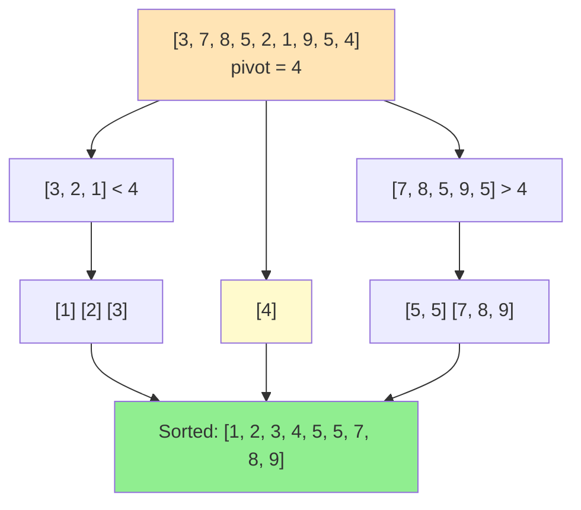

# Quick Sort

Quick sort is the most widely used sorting algorithm in practice. It's a divide-and-conquer algorithm with excellent average-case performance, though its worst-case is O(n²). Understanding quicksort and its optimizations is essential.

## The Algorithm

1. **Choose a pivot** element
2. **Partition**: Rearrange so elements < pivot are left, elements > pivot are right
3. **Recurse**: Sort left and right partitions



**Key idea**: Partition divides array into two parts around pivot, then recursively sort each part

## Basic Implementation

```python
def quicksort(arr):
    """Basic quicksort."""
    if len(arr) <= 1:
        return arr

    pivot = arr[len(arr) // 2]
    left = [x for x in arr if x < pivot]
    middle = [x for x in arr if x == pivot]
    right = [x for x in arr if x > pivot]

    return quicksort(left) + middle + quicksort(right)
```

This version is clean but not in-place. Here's the in-place version:

## In-Place Quicksort

### Lomuto Partition

```python
def quicksort_lomuto(arr, low=0, high=None):
    """In-place quicksort with Lomuto partition."""
    if high is None:
        high = len(arr) - 1

    if low < high:
        pivot_idx = partition_lomuto(arr, low, high)
        quicksort_lomuto(arr, low, pivot_idx - 1)
        quicksort_lomuto(arr, pivot_idx + 1, high)

def partition_lomuto(arr, low, high):
    """Lomuto partition scheme."""
    pivot = arr[high]  # Use last element as pivot
    i = low - 1  # Index of smaller element

    for j in range(low, high):
        if arr[j] <= pivot:
            i += 1
            arr[i], arr[j] = arr[j], arr[i]

    arr[i + 1], arr[high] = arr[high], arr[i + 1]
    return i + 1
```

### Hoare Partition

More efficient (fewer swaps) but more complex:

```python
def quicksort_hoare(arr, low=0, high=None):
    """In-place quicksort with Hoare partition."""
    if high is None:
        high = len(arr) - 1

    if low < high:
        pivot_idx = partition_hoare(arr, low, high)
        quicksort_hoare(arr, low, pivot_idx)
        quicksort_hoare(arr, pivot_idx + 1, high)

def partition_hoare(arr, low, high):
    """Hoare partition scheme."""
    pivot = arr[(low + high) // 2]
    i = low - 1
    j = high + 1

    while True:
        i += 1
        while arr[i] < pivot:
            i += 1

        j -= 1
        while arr[j] > pivot:
            j -= 1

        if i >= j:
            return j

        arr[i], arr[j] = arr[j], arr[i]
```

## Partition Visualization

```
Lomuto partition with pivot = 4:
[3, 7, 8, 5, 2, 1, 9, 5, 4]
                         ^pivot

i = -1
j = 0: arr[0]=3 <= 4, i=0, swap arr[0],arr[0] → [3, 7, 8, 5, 2, 1, 9, 5, 4]
j = 1: arr[1]=7 > 4, no swap
j = 2: arr[2]=8 > 4, no swap
j = 3: arr[3]=5 > 4, no swap
j = 4: arr[4]=2 <= 4, i=1, swap arr[1],arr[4] → [3, 2, 8, 5, 7, 1, 9, 5, 4]
j = 5: arr[5]=1 <= 4, i=2, swap arr[2],arr[5] → [3, 2, 1, 5, 7, 8, 9, 5, 4]
j = 6,7: no swaps

Final: swap arr[3] with pivot → [3, 2, 1, 4, 7, 8, 9, 5, 5]
                                        ^pivot at correct position
```

## Complexity Analysis

**Best/Average Case**: $O(n \log n)$

When pivot divides array roughly in half:

$$T(n) = 2T(n/2) + O(n) = O(n \log n)$$

**Worst Case**: $O(n^2)$

When pivot is always minimum/maximum (e.g., sorted array with first element as pivot):

$$T(n) = T(n-1) + O(n) = O(n) + O(n-1) + \ldots + O(1) = \sum_{i=1}^{n} O(i) = O(n^2)$$

**Average Case Analysis**:

Expected partition splits are balanced enough to achieve $O(n \log n)$ even with random pivots:

$$E[T(n)] = O(n \log n)$$

**Space Complexity**:
- Best/Average: $O(\log n)$ (recursion stack for balanced partitions)
- Worst: $O(n)$ (skewed partitions create deep recursion)

## Pivot Selection

Poor pivot choice causes worst-case behavior:

### 1. First/Last Element (Bad for sorted data)
```python
pivot = arr[low]  # O(n²) for sorted arrays!
```

This creates worst-case $O(n^2)$ behavior on already-sorted input.

### 2. Random Pivot
```python
import random
def random_pivot(arr, low, high):
    rand_idx = random.randint(low, high)
    arr[rand_idx], arr[high] = arr[high], arr[rand_idx]
    return partition_lomuto(arr, low, high)
```

### 3. Median of Three
```python
def median_of_three(arr, low, high):
    mid = (low + high) // 2
    # Sort low, mid, high positions
    if arr[low] > arr[mid]:
        arr[low], arr[mid] = arr[mid], arr[low]
    if arr[low] > arr[high]:
        arr[low], arr[high] = arr[high], arr[low]
    if arr[mid] > arr[high]:
        arr[mid], arr[high] = arr[high], arr[mid]
    # Use mid as pivot
    arr[mid], arr[high - 1] = arr[high - 1], arr[mid]
    return partition_lomuto(arr, low, high - 1)
```

## Handling Duplicates: 3-Way Partition

When many duplicates exist, standard quicksort is slow. 3-way partition helps:

```python
def quicksort_3way(arr, low=0, high=None):
    """Dutch National Flag partition for many duplicates."""
    if high is None:
        high = len(arr) - 1

    if low >= high:
        return

    # 3-way partition
    lt, gt = low, high
    pivot = arr[low]
    i = low

    while i <= gt:
        if arr[i] < pivot:
            arr[lt], arr[i] = arr[i], arr[lt]
            lt += 1
            i += 1
        elif arr[i] > pivot:
            arr[gt], arr[i] = arr[i], arr[gt]
            gt -= 1
        else:
            i += 1

    # arr[low..lt-1] < pivot = arr[lt..gt] < arr[gt+1..high]
    quicksort_3way(arr, low, lt - 1)
    quicksort_3way(arr, gt + 1, high)
```

## Optimizations

### 1. Insertion Sort for Small Subarrays

```python
def quicksort_optimized(arr, low, high):
    if high - low < 10:
        insertion_sort(arr, low, high)
        return

    # ... regular quicksort
```

### 2. Tail Recursion Elimination

```python
def quicksort_tail(arr, low, high):
    while low < high:
        pivot_idx = partition_lomuto(arr, low, high)

        # Recurse on smaller partition, iterate on larger
        if pivot_idx - low < high - pivot_idx:
            quicksort_tail(arr, low, pivot_idx - 1)
            low = pivot_idx + 1
        else:
            quicksort_tail(arr, pivot_idx + 1, high)
            high = pivot_idx - 1
```

## Quickselect: Find Kth Element

Quicksort's partition can find the kth smallest element in $O(n)$ average time:

**Time Complexity**: Average $O(n)$, worst $O(n^2)$

The expected recurrence is:
$$T(n) = T(n/2) + O(n) = O(n)$$

```python
def quickselect(arr, k):
    """Find kth smallest element (0-indexed)."""
    def select(low, high):
        if low == high:
            return arr[low]

        pivot_idx = partition_lomuto(arr, low, high)

        if k == pivot_idx:
            return arr[k]
        elif k < pivot_idx:
            return select(low, pivot_idx - 1)
        else:
            return select(pivot_idx + 1, high)

    return select(0, len(arr) - 1)
```

## Summary

Quicksort is the practical choice for general-purpose sorting due to excellent cache performance and low overhead. Use median-of-three pivot selection, switch to insertion sort for small subarrays, and consider 3-way partition for data with many duplicates. Despite O(n²) worst case, randomized quicksort has O(n log n) expected time.
