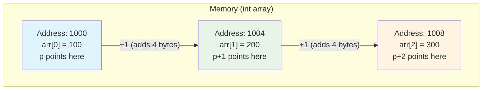

# Pointer Arithmetic

Pointer arithmetic is one of C's most powerful features, enabling efficient traversal of arrays and memory regions. Unlike regular arithmetic, pointer arithmetic takes into account the size of the pointed-to type.

## Basic Pointer Arithmetic

When you add 1 to a pointer, it moves forward by the size of one element:

```c
int arr[5] = {10, 20, 30, 40, 50};
int *ptr = arr;  // Points to first element

printf("%d\n", *ptr);        // 10
printf("%d\n", *(ptr + 1));  // 20
printf("%d\n", *(ptr + 2));  // 30
```

The key insight: `ptr + 1` doesn't add 1 byte—it adds `sizeof(int)` bytes (typically 4).

## How It Works

```c
int arr[3] = {100, 200, 300};
int *p = arr;

// If arr starts at address 1000 and int is 4 bytes:
printf("%p\n", p);       // 1000 (address of arr[0])
printf("%p\n", p + 1);   // 1004 (address of arr[1])
printf("%p\n", p + 2);   // 1008 (address of arr[2])
```

For different types:

```c
char *cp;   // cp + 1 advances by 1 byte
int *ip;    // ip + 1 advances by 4 bytes (typically)
double *dp; // dp + 1 advances by 8 bytes
```

### Pointer Arithmetic Formula

When you perform pointer arithmetic, the actual byte offset is calculated as:

$$\text{New Address} = \text{Current Address} + (n \times \text{sizeof(type)})$$

For example, if `p` is an `int*` at address 1000:
- `p + 1` = $1000 + (1 \times 4) = 1004$
- `p + 3` = $1000 + (3 \times 4) = 1012$

### Memory Layout Visualization



## Valid Pointer Operations

**Addition/Subtraction with integers:**
```c
int arr[10];
int *ptr = &arr[5];

int *next = ptr + 1;    // Points to arr[6]
int *prev = ptr - 1;    // Points to arr[4]
ptr += 3;               // Now points to arr[8]
ptr -= 2;               // Now points to arr[6]
```

**Subtraction of two pointers:**
```c
int arr[10];
int *start = &arr[0];
int *end = &arr[7];

ptrdiff_t diff = end - start;  // 7 (number of elements between)
```

This gives the number of elements, not bytes. The formula is:

$$\text{diff} = \frac{\text{end address} - \text{start address}}{\text{sizeof(type)}}$$

For example: $\frac{1028 - 1000}{4} = \frac{28}{4} = 7$ elements

**Comparison of pointers:**
```c
int arr[10];
int *p1 = &arr[2];
int *p2 = &arr[5];

if (p1 < p2) {
    printf("p1 comes before p2\n");  // True
}
```

## Invalid Pointer Operations

```c
int *p1, *p2;

// INVALID: Cannot add two pointers
int *bad = p1 + p2;           // ERROR

// INVALID: Cannot multiply or divide pointers
int *bad2 = p1 * 2;           // ERROR
int *bad3 = p1 / 2;           // ERROR

// INVALID: Comparing pointers to different arrays
int arr1[5], arr2[5];
int *pa = arr1;
int *pb = arr2;
if (pa < pb) { }              // Undefined behavior!
```

## Arrays and Pointers

Arrays and pointers are closely related. The array name decays to a pointer to its first element:

```c
int arr[5] = {1, 2, 3, 4, 5};
int *ptr = arr;  // Equivalent to: int *ptr = &arr[0];

// These are equivalent:
arr[2]       // Array indexing
*(arr + 2)   // Pointer arithmetic
ptr[2]       // Pointer with subscript
*(ptr + 2)   // Pointer arithmetic

// Even this works (though confusing):
2[arr]       // Same as arr[2]!
```

### Array Indexing is Syntactic Sugar

The expression `arr[i]` is actually defined as `*(arr + i)`. This means:

$$\text{arr}[i] \equiv *(\text{arr} + i)$$

Since addition is commutative, `i[arr]` also works (but don't use it)!

## Iterating with Pointers

Pointer iteration can be more efficient than index-based iteration:

```c
int arr[5] = {10, 20, 30, 40, 50};

// Index-based iteration
for (int i = 0; i < 5; i++) {
    printf("%d ", arr[i]);
}

// Pointer-based iteration
for (int *p = arr; p < arr + 5; p++) {
    printf("%d ", *p);
}

// Using pointer to end
int *end = arr + 5;  // One past the last element
for (int *p = arr; p != end; p++) {
    printf("%d ", *p);
}
```

## String Traversal

Strings (null-terminated character arrays) are commonly traversed with pointers:

```c
char str[] = "Hello";

// Count characters
int count = 0;
for (char *p = str; *p != '\0'; p++) {
    count++;
}
printf("Length: %d\n", count);  // 5

// Find a character
char *findChar(char *str, char target) {
    for (char *p = str; *p != '\0'; p++) {
        if (*p == target) {
            return p;  // Return pointer to found character
        }
    }
    return NULL;  // Not found
}
```

## Pointer Arithmetic Patterns

**Swap adjacent elements:**
```c
void swapAdjacent(int *ptr) {
    int temp = *ptr;
    *ptr = *(ptr + 1);
    *(ptr + 1) = temp;
}
```

**Find maximum:**
```c
int* findMax(int *arr, int size) {
    int *maxPtr = arr;
    for (int *p = arr + 1; p < arr + size; p++) {
        if (*p > *maxPtr) {
            maxPtr = p;
        }
    }
    return maxPtr;
}
```

**Reverse array in-place:**
```c
void reverse(int *arr, int size) {
    int *left = arr;
    int *right = arr + size - 1;

    while (left < right) {
        int temp = *left;
        *left = *right;
        *right = temp;
        left++;
        right--;
    }
}
```

## Common Pitfalls

**Going out of bounds:**
```c
int arr[5];
int *p = arr + 10;  // Valid pointer, but...
*p = 100;           // Undefined behavior! Beyond array
```

**Incrementing the wrong thing:**
```c
int x = 5;
int *p = &x;

*p++;    // Increments p, returns old *p (confusing!)
(*p)++;  // Increments *p (the value x points to)
++*p;    // Also increments *p
```

**Off-by-one in bounds:**
```c
int arr[5];
int *end = arr + 5;  // OK: points one past last element

// Valid: compare to end
for (int *p = arr; p < end; p++) { }

// INVALID: dereference end
*end = 100;  // Undefined behavior!
```

## Key Takeaways

- `ptr + n` advances by `n * sizeof(*ptr)` bytes
- `ptr1 - ptr2` gives the number of elements between them
- Array names decay to pointers to their first element
- `arr[i]` is equivalent to `*(arr + i)`
- Pointer arithmetic only makes sense within arrays
- Don't dereference pointers beyond array bounds
- The "one past the end" pointer is valid for comparison but not dereferencing

Pointer arithmetic is essential for understanding how C handles arrays and strings efficiently. Next, we'll explore pointers and functions.
