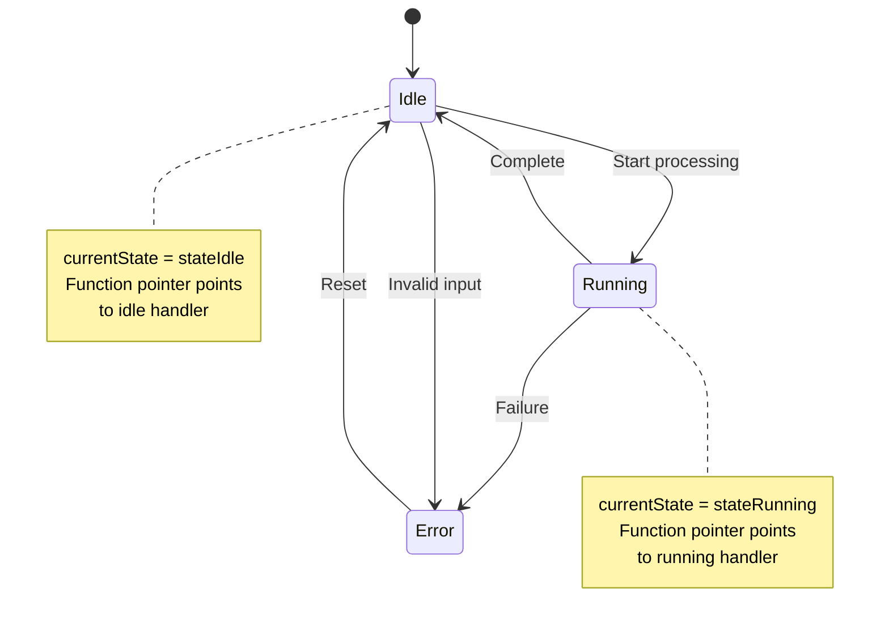

# Function Pointers

Function pointers store addresses of functions, enabling dynamic function calls, callbacks, and polymorphism-like behavior. They're essential for event handling, sorting algorithms, and plugin architectures.

## Functions Have Addresses

Just like data, functions exist in memory and have addresses:

```c
#include <stdio.h>

int add(int a, int b) {
    return a + b;
}

int main() {
    printf("Address of add: %p\n", (void*)add);
    printf("Address of main: %p\n", (void*)main);
    return 0;
}
```

## Declaring Function Pointers

Function pointer syntax mirrors the function signature:

```c
// Function: int add(int, int)
// Pointer:  int (*funcPtr)(int, int)

int add(int a, int b) { return a + b; }
int subtract(int a, int b) { return a - b; }

int main() {
    // Declare function pointer
    int (*operation)(int, int);

    // Assign function address
    operation = add;          // or: operation = &add;

    // Call through pointer
    int result = operation(5, 3);  // or: (*operation)(5, 3)
    printf("%d\n", result);        // 8

    // Point to different function
    operation = subtract;
    result = operation(5, 3);
    printf("%d\n", result);        // 2

    return 0;
}
```

## Syntax Breakdown

```c
return_type (*pointer_name)(parameter_types)
```

Examples:
```c
void (*voidFunc)(void);           // No params, no return
int (*intFunc)(int);              // Takes int, returns int
double (*mathFunc)(double, double); // Takes 2 doubles, returns double
char *(*strFunc)(const char *);   // Takes string, returns string
```

**Important**: The parentheses around `*pointer_name` are required:
```c
int *func(int);      // Function returning int* (NOT a function pointer)
int (*func)(int);    // Pointer to function returning int
```

## Using typedef for Clarity

Function pointer syntax is verbose. `typedef` simplifies it:

```c
// Define a type for "pointer to int(int,int) function"
typedef int (*BinaryOp)(int, int);

int add(int a, int b) { return a + b; }
int multiply(int a, int b) { return a * b; }

int main() {
    BinaryOp op1 = add;
    BinaryOp op2 = multiply;

    printf("%d\n", op1(3, 4));  // 7
    printf("%d\n", op2(3, 4));  // 12

    return 0;
}
```

## Function Pointers as Parameters (Callbacks)

Pass functions to other functions for customizable behavior:

```c
void forEach(int arr[], int size, void (*callback)(int)) {
    for (int i = 0; i < size; i++) {
        callback(arr[i]);
    }
}

void printElement(int x) {
    printf("%d ", x);
}

void printSquare(int x) {
    printf("%d ", x * x);
}

int main() {
    int nums[] = {1, 2, 3, 4, 5};

    printf("Elements: ");
    forEach(nums, 5, printElement);  // 1 2 3 4 5

    printf("\nSquares: ");
    forEach(nums, 5, printSquare);   // 1 4 9 16 25

    return 0;
}
```

## Sorting with Function Pointers

The standard `qsort` uses function pointers for custom comparison:

```c
#include <stdlib.h>

int compareAscending(const void *a, const void *b) {
    return *(int*)a - *(int*)b;
}

int compareDescending(const void *a, const void *b) {
    return *(int*)b - *(int*)a;
}

int main() {
    int nums[] = {5, 2, 8, 1, 9};
    int size = 5;

    qsort(nums, size, sizeof(int), compareAscending);
    // nums is now: 1, 2, 5, 8, 9

    qsort(nums, size, sizeof(int), compareDescending);
    // nums is now: 9, 8, 5, 2, 1

    return 0;
}
```

## Arrays of Function Pointers

Create dispatch tables for menu-driven or state-machine programs:

```c
typedef void (*MenuAction)(void);

void newGame()  { printf("Starting new game\n"); }
void loadGame() { printf("Loading game\n"); }
void options()  { printf("Opening options\n"); }
void quit()     { printf("Goodbye!\n"); }

int main() {
    MenuAction actions[] = {newGame, loadGame, options, quit};
    int choice;

    printf("1. New Game\n2. Load Game\n3. Options\n4. Quit\n");
    printf("Choice: ");
    scanf("%d", &choice);

    if (choice >= 1 && choice <= 4) {
        actions[choice - 1]();  // Call selected function
    }

    return 0;
}
```

## State Machines

Function pointers elegantly implement state machines:

```c
typedef void (*State)(void);

State currentState;

void stateIdle(void);
void stateRunning(void);
void stateError(void);

void stateIdle(void) {
    printf("IDLE: Waiting for input...\n");
    currentState = stateRunning;  // Transition
}

void stateRunning(void) {
    printf("RUNNING: Processing...\n");
    currentState = stateIdle;  // Transition back
}

void stateError(void) {
    printf("ERROR: Something went wrong!\n");
}

int main() {
    currentState = stateIdle;

    for (int i = 0; i < 5; i++) {
        currentState();  // Execute current state
    }

    return 0;
}
```

### State Machine Diagram



Each state is a function. The `currentState` function pointer determines which state function executes. State transitions are simply pointer reassignments.

## Returning Function Pointers

Functions can return function pointers:

```c
typedef int (*MathOp)(int, int);

int add(int a, int b) { return a + b; }
int subtract(int a, int b) { return a - b; }
int multiply(int a, int b) { return a * b; }

MathOp getOperation(char op) {
    switch (op) {
        case '+': return add;
        case '-': return subtract;
        case '*': return multiply;
        default:  return NULL;
    }
}

int main() {
    MathOp op = getOperation('+');
    if (op) {
        printf("5 + 3 = %d\n", op(5, 3));  // 8
    }
    return 0;
}
```

## Generic Programming with void*

Combine function pointers with `void*` for generic functions:

```c
void swap(void *a, void *b, size_t size) {
    char temp[size];
    memcpy(temp, a, size);
    memcpy(a, b, size);
    memcpy(b, temp, size);
}

int main() {
    int x = 5, y = 10;
    swap(&x, &y, sizeof(int));  // x=10, y=5

    double a = 1.5, b = 2.5;
    swap(&a, &b, sizeof(double));  // a=2.5, b=1.5

    return 0;
}
```

## Key Takeaways

- Function pointers store addresses of functions
- Syntax: `return_type (*name)(param_types)`
- Use `typedef` to simplify function pointer declarations
- Callbacks pass behavior as parameters
- `qsort` and other standard functions use function pointer callbacks
- Arrays of function pointers create dispatch tables
- Function pointers enable flexible, extensible designs

Function pointers bring flexibility to C that approaches what higher-level languages offer through lambdas or first-class functions. They're essential for writing modular, reusable code.
