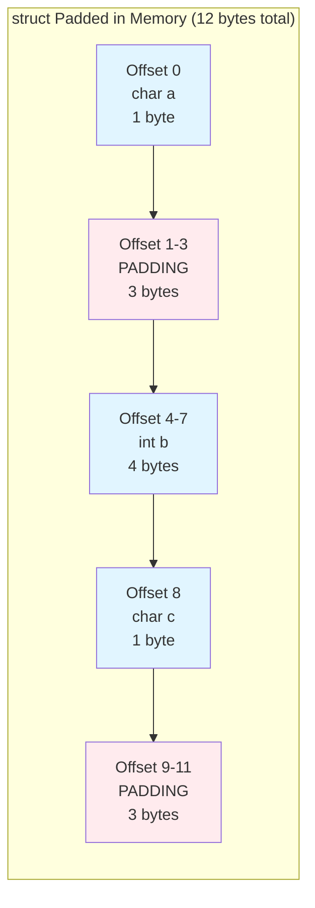
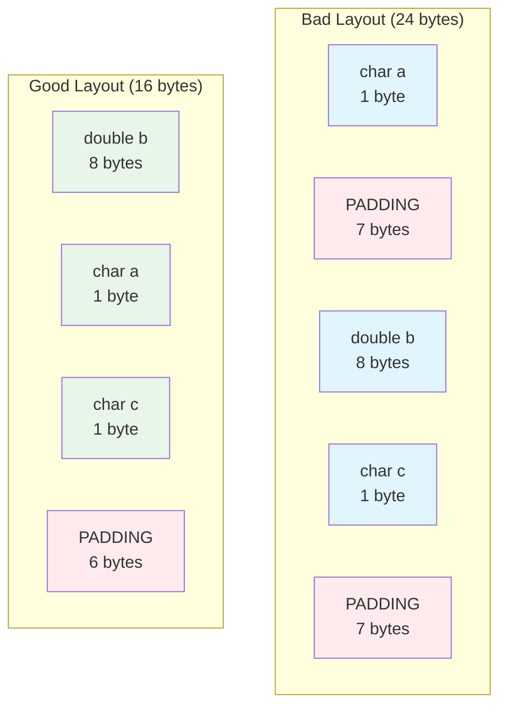

# Structure Memory Layout and Padding

Understanding how structures are arranged in memory is crucial for writing efficient code, interfacing with hardware, and working with binary file formats. Compilers add padding for alignment, which affects structure size.

## Memory Alignment

Modern CPUs access memory most efficiently when data is aligned to addresses that are multiples of the data size:

- `char`: any address (1-byte aligned)
- `short`: even addresses (2-byte aligned)
- `int`: addresses divisible by 4 (4-byte aligned)
- `double`: addresses divisible by 8 (8-byte aligned)
- Pointers: 4-byte (32-bit) or 8-byte (64-bit) aligned

Misaligned access is either slow (multiple memory accesses) or illegal (crashes on some architectures).

### Alignment Requirements

For a type of size $n$ bytes, the alignment requirement is typically $n$ bytes. An address $a$ is properly aligned for a type if:

$$a \bmod n = 0$$

For example, an `int` (4 bytes) at address 1000 is aligned because $1000 \bmod 4 = 0$, but address 1002 is not aligned because $1002 \bmod 4 = 2$.

## Structure Padding

The compiler adds padding bytes to ensure proper alignment:

```c
struct Padded {
    char a;      // 1 byte
    // 3 bytes padding
    int b;       // 4 bytes
    char c;      // 1 byte
    // 3 bytes padding (to align structure size)
};

printf("Size: %zu\n", sizeof(struct Padded));  // 12, not 6!
```

### Memory Layout with Padding



Total size: $1 + 3 + 4 + 1 + 3 = 12$ bytes (not $1 + 4 + 1 = 6$)

## Visualizing Padding

```c
struct Example {
    char a;     // offset 0, size 1
    // padding 1-3
    int b;      // offset 4, size 4
    char c;     // offset 8, size 1
    // padding 9-15
    double d;   // offset 16, size 8
};  // Total: 24 bytes
```

Without padding, it would be 1+4+1+8 = 14 bytes.

## Member Order Matters

Reordering members can reduce padding:

```c
// Wasteful order
struct Bad {
    char a;      // 1 + 7 padding
    double b;    // 8
    char c;      // 1 + 7 padding
};  // Size: 24 bytes

// Efficient order
struct Good {
    double b;    // 8
    char a;      // 1
    char c;      // 1 + 6 padding
};  // Size: 16 bytes
```

**Rule of thumb**: Order members from largest to smallest.

### Comparison of Memory Layouts



Memory savings: $24 - 16 = 8$ bytes (33% reduction) just by reordering!

## The sizeof Operator

`sizeof` returns the actual size including padding:

```c
struct Demo {
    char c;
    int i;
    char d;
};

printf("char: %zu\n", sizeof(char));          // 1
printf("int: %zu\n", sizeof(int));            // 4
printf("struct: %zu\n", sizeof(struct Demo)); // 12 (not 6!)
```

## offsetof Macro

Find the offset of a member within a structure:

```c
#include <stddef.h>

struct Sample {
    char a;
    int b;
    char c;
};

printf("Offset of a: %zu\n", offsetof(struct Sample, a));  // 0
printf("Offset of b: %zu\n", offsetof(struct Sample, b));  // 4
printf("Offset of c: %zu\n", offsetof(struct Sample, c));  // 8
```

## Packing Structures

Sometimes you need to eliminate padding (e.g., for binary file formats):

### GCC/Clang

```c
struct __attribute__((packed)) Packed {
    char a;
    int b;
    char c;
};
// Size: 6 bytes (no padding)
```

### Using #pragma

```c
#pragma pack(push, 1)
struct Packed {
    char a;
    int b;
    char c;
};
#pragma pack(pop)
```

**Warning**: Packed structures may cause slower access or crashes on some architectures.

## Structure Size Rules

1. Each member is placed at an offset that's a multiple of its alignment
2. The structure's total size is a multiple of its largest member's alignment
3. Arrays of structures are contiguous, so padding is added at the end

```c
struct EndPadding {
    int a;       // 4 bytes
    char b;      // 1 byte
    // 3 bytes end padding (total must be multiple of 4)
};  // Size: 8 bytes
```

## Bit Fields

Pack multiple values into fewer bytes:

```c
struct Flags {
    unsigned int isActive : 1;    // 1 bit
    unsigned int priority : 3;    // 3 bits (0-7)
    unsigned int category : 4;    // 4 bits (0-15)
};  // Size: 4 bytes (one int)
```

Access bit fields like normal members:

```c
struct Flags f;
f.isActive = 1;
f.priority = 5;
f.category = 12;
```

## Practical Example: Network Packet

```c
// Network protocols often require specific layouts
struct __attribute__((packed)) IPHeader {
    uint8_t  version_ihl;
    uint8_t  tos;
    uint16_t total_length;
    uint16_t identification;
    uint16_t flags_fragment;
    uint8_t  ttl;
    uint8_t  protocol;
    uint16_t checksum;
    uint32_t src_addr;
    uint32_t dst_addr;
};  // Exactly 20 bytes, no padding
```

## Comparing with memcmp

Padding bytes contain garbage, so `memcmp` may fail:

```c
struct Point {
    char type;
    // padding
    int x;
    int y;
};

struct Point p1 = {'A', 10, 20};
struct Point p2 = {'A', 10, 20};

// May return non-zero due to different padding garbage!
if (memcmp(&p1, &p2, sizeof(struct Point)) == 0) {
    printf("Equal\n");
}
```

**Solution**: Compare members individually or initialize with memset:

```c
struct Point p1;
memset(&p1, 0, sizeof(p1));  // Zero all bytes including padding
p1.type = 'A';
p1.x = 10;
p1.y = 20;
```

## Key Takeaways

- Compilers add padding for alignment efficiency
- Structure size may exceed the sum of member sizes
- Order members largest to smallest to minimize padding
- `offsetof` reveals member positions
- Packed structures eliminate padding but may hurt performance
- Bit fields pack multiple values into fewer bytes
- Padding bytes contain garbage—beware when using memcmp
- Understanding layout is essential for binary I/O and hardware interfaces

Structure memory layout knowledge is advanced but crucial for systems programming and optimization.
