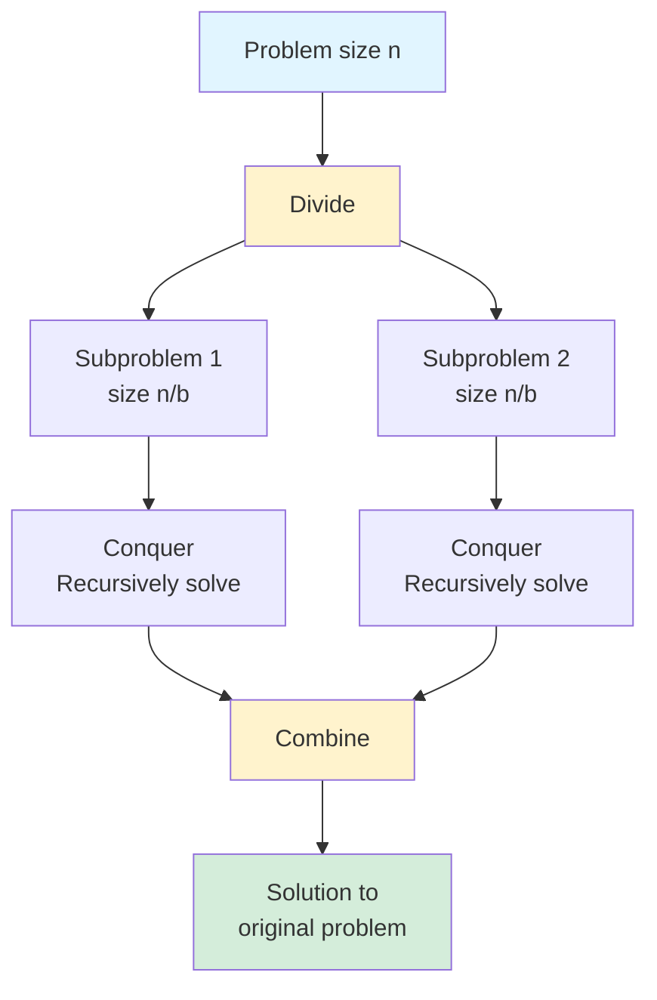
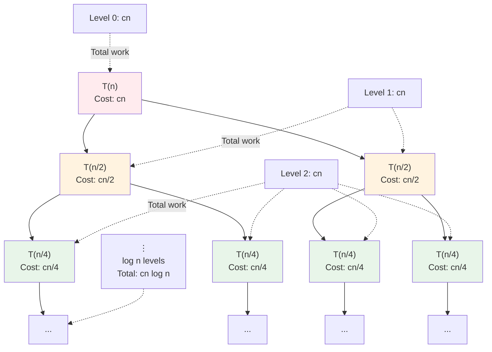

# The Divide and Conquer Paradigm

Divide and conquer is one of the most powerful and elegant algorithmic paradigms in computer science. The strategy is beautifully simple: break a large problem into smaller subproblems, solve them recursively, and combine the results. This recursive decomposition often yields algorithms whose efficiency seems almost magical—merge sort's O(n log n) time complexity emerges naturally from halving the problem at each level and doing linear work to merge.

The paradigm's power comes from exploiting problem structure. When a problem's solution can be constructed from solutions to smaller instances of the same problem, divide and conquer transforms exponential brute force into polynomial elegance. The key insight is that dividing typically reduces problem size geometrically (by factors of 2 or more), while combining typically requires only polynomial work. The mathematical magic of logarithms turns geometric reduction into efficient algorithms.

Understanding divide and conquer means understanding recursion deeply—not just the mechanics of recursive calls, but the conceptual leap of trusting that recursive calls on smaller inputs will return correct results. Once you internalize this trust, designing divide and conquer algorithms becomes a matter of identifying how to split problems, ensuring base cases are correct, and finding efficient combination methods.

## The Three Steps

1. **Divide**: Split the problem into smaller subproblems
2. **Conquer**: Solve subproblems recursively (base case for small inputs)
3. **Combine**: Merge subproblem solutions into final solution



## Classic Example: Merge Sort

```python
def merge_sort(arr):
    # Base case
    if len(arr) <= 1:
        return arr

    # Divide
    mid = len(arr) // 2
    left = arr[:mid]
    right = arr[mid:]

    # Conquer
    left_sorted = merge_sort(left)
    right_sorted = merge_sort(right)

    # Combine
    return merge(left_sorted, right_sorted)
```

**Divide**: Split array into two halves
**Conquer**: Recursively sort each half
**Combine**: Merge sorted halves

## Analyzing Divide and Conquer

### Recurrence Relations

The running time follows a recurrence:

$$T(n) = aT(n/b) + f(n)$$

Where:
- $a$ = number of subproblems
- $n/b$ = size of each subproblem
- $f(n)$ = cost of divide and combine steps

### Recursion Tree for Merge Sort



Each level does $cn$ work, with $\log_2 n$ levels total, giving $T(n) = \Theta(n \log n)$.

### Master Theorem Application

**Merge Sort**: $T(n) = 2T(n/2) + \Theta(n)$
- $a = 2, b = 2, f(n) = n$
- $n^{\log_b a} = n^{\log_2 2} = n$
- $f(n) = \Theta(n^{\log_b a})$ → Case 2
- **$T(n) = \Theta(n \log n)$**

**Binary Search**: $T(n) = T(n/2) + \Theta(1)$
- $a = 1, b = 2, f(n) = 1$
- $n^{\log_b a} = n^{\log_2 1} = n^0 = 1$
- $f(n) = \Theta(1)$ → Case 2
- **$T(n) = \Theta(\log n)$**

## Maximum Subarray Problem

**Problem**: Find contiguous subarray with maximum sum.

### Divide and Conquer Approach

```python
def max_subarray(arr, low, high):
    if low == high:
        return arr[low]

    mid = (low + high) // 2

    # Maximum in left half
    left_max = max_subarray(arr, low, mid)

    # Maximum in right half
    right_max = max_subarray(arr, mid + 1, high)

    # Maximum crossing the midpoint
    cross_max = max_crossing_subarray(arr, low, mid, high)

    return max(left_max, right_max, cross_max)

def max_crossing_subarray(arr, low, mid, high):
    # Find max sum extending left from mid
    left_sum = float('-inf')
    total = 0
    for i in range(mid, low - 1, -1):
        total += arr[i]
        left_sum = max(left_sum, total)

    # Find max sum extending right from mid+1
    right_sum = float('-inf')
    total = 0
    for i in range(mid + 1, high + 1):
        total += arr[i]
        right_sum = max(right_sum, total)

    return left_sum + right_sum
```

**Recurrence**: $T(n) = 2T(n/2) + \Theta(n) \Rightarrow T(n) = \Theta(n \log n)$

Note: Kadane's algorithm solves this in $O(n)$, but the D&C approach illustrates the paradigm.

## Closest Pair of Points

**Problem**: Given n points, find two with minimum distance.

### Brute Force: O(n²)

Compare all pairs.

### Divide and Conquer: O(n log n)

```python
def closest_pair(points):
    # Sort by x-coordinate
    points_x = sorted(points, key=lambda p: p[0])
    points_y = sorted(points, key=lambda p: p[1])

    return closest_pair_recursive(points_x, points_y)

def closest_pair_recursive(px, py):
    n = len(px)

    # Base case: use brute force
    if n <= 3:
        return brute_force_closest(px)

    # Divide
    mid = n // 2
    mid_point = px[mid]

    # Split points
    left_x = px[:mid]
    right_x = px[mid:]

    # Create sorted-by-y lists for each half
    left_y = [p for p in py if p[0] <= mid_point[0]]
    right_y = [p for p in py if p[0] > mid_point[0]]

    # Conquer
    d_left = closest_pair_recursive(left_x, left_y)
    d_right = closest_pair_recursive(right_x, right_y)

    d = min(d_left, d_right)

    # Combine: check strip around midline
    strip = [p for p in py if abs(p[0] - mid_point[0]) < d]
    d_strip = strip_closest(strip, d)

    return min(d, d_strip)
```

**Key insight**: Strip check is $O(n)$ because each point needs only compare with a constant number of neighbors.

**Recurrence**: $T(n) = 2T(n/2) + \Theta(n) \Rightarrow T(n) = \Theta(n \log n)$

## Matrix Multiplication

### Standard Algorithm: O(n³)

```python
def matrix_multiply(A, B):
    n = len(A)
    C = [[0] * n for _ in range(n)]
    for i in range(n):
        for j in range(n):
            for k in range(n):
                C[i][j] += A[i][k] * B[k][j]
    return C
```

### Strassen's Algorithm: $O(n^{2.807})$

Reduces 8 multiplications to 7 using clever combinations.

**Recurrence**: $T(n) = 7T(n/2) + \Theta(n^2)$

By Master Theorem: $n^{\log_b a} = n^{\log_2 7} \approx n^{2.807}$ dominates $n^2$

Therefore: $T(n) = \Theta(n^{\log_2 7}) \approx \Theta(n^{2.807})$

## When to Use Divide and Conquer

**Good candidates**:
- Problem has natural substructure
- Subproblems are independent (no overlap)
- Combining is efficient
- Subproblems are balanced

**Poor candidates**:
- Overlapping subproblems → use dynamic programming
- Sequential dependencies
- Combine step is expensive

## Design Tips

1. **Find the right subproblems**: Often half-size, sometimes thirds
2. **Ensure balanced division**: Unbalanced gives worse complexity
3. **Choose good base cases**: Don't recurse too deep
4. **Optimize the combine step**: Often the bottleneck
5. **Consider hybrid approaches**: Switch to simpler algorithm for small inputs

```python
def hybrid_sort(arr, threshold=32):
    if len(arr) <= threshold:
        return insertion_sort(arr)
    # ... merge sort logic
```
