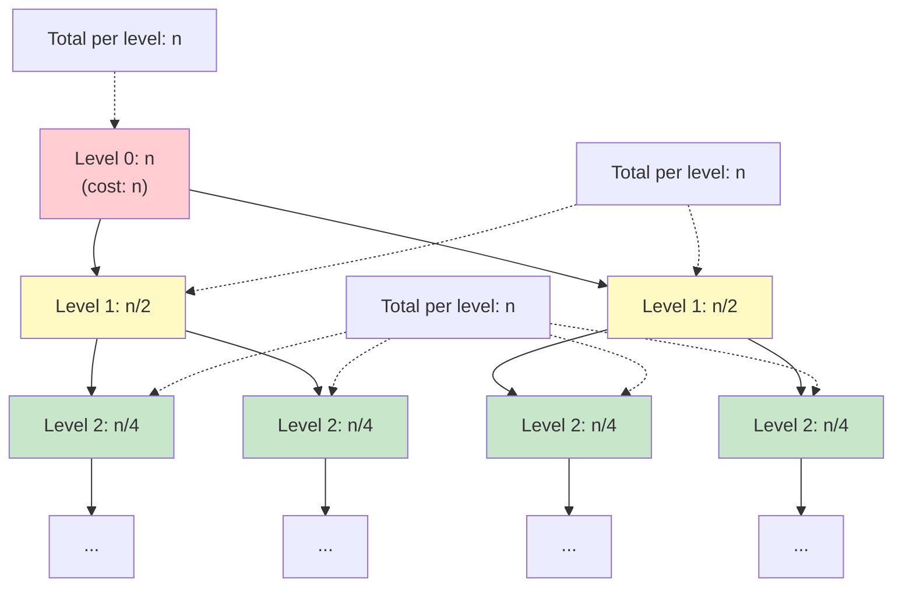
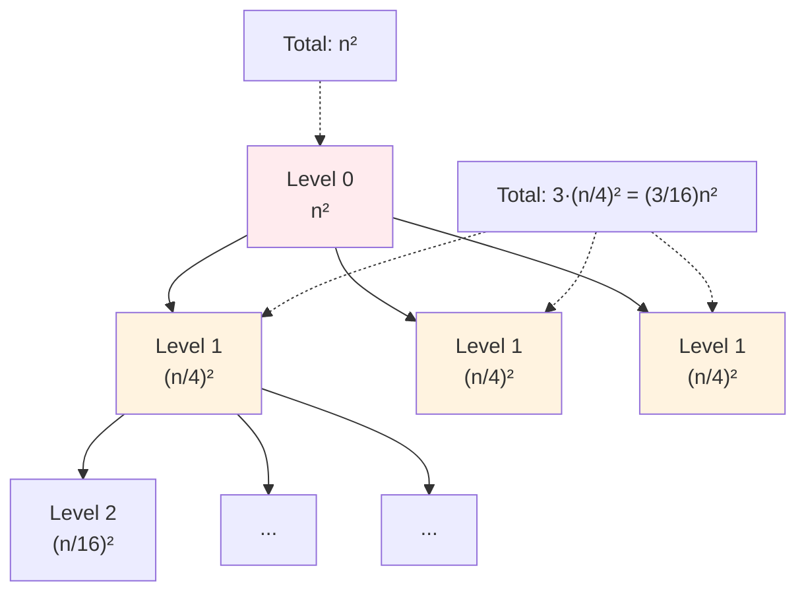

# Recurrence Relations for Algorithm Analysis

When analyzing recursive algorithms, running time depends on running time for smaller inputs—a mathematical relationship called a recurrence relation. The recurrence T(n) = 2T(n/2) + O(n) says: "to solve a size-n problem, solve two size-n/2 problems and do O(n) additional work." Solving such recurrences—finding closed-form expressions for T(n)—reveals the algorithm's complexity class.

Recurrences capture the mathematical essence of divide and conquer. The terms in a recurrence correspond directly to algorithm structure: the number of recursive calls, how much the problem shrinks, and the work done outside recursion. Changing any of these components changes the recurrence and potentially the complexity class. Reducing eight recursive matrix multiplications to seven (Strassen's insight) changes O(n³) to O(n^2.807)—the recurrence captures why.

Multiple techniques exist for solving recurrences: substitution (guess and verify by induction), recursion trees (visualize work distribution), and the Master Theorem (formulaic solution for standard forms). Each technique illuminates different aspects of the recurrence. Recursion trees provide visual intuition about where work concentrates. The Master Theorem provides quick answers for common patterns. Substitution provides rigorous proofs when needed.

## Setting Up Recurrences

Analyze the algorithm structure:
1. **Base case**: Time for trivial inputs
2. **Recursive case**: Time for subproblems + overhead

### Example: Merge Sort

```python
def merge_sort(arr):
    if len(arr) <= 1:           # Base case: O(1)
        return arr
    mid = len(arr) // 2
    left = merge_sort(arr[:mid])    # T(n/2)
    right = merge_sort(arr[mid:])   # T(n/2)
    return merge(left, right)       # O(n)
```

**Recurrence**: $T(n) = 2T(n/2) + O(n)$, $T(1) = O(1)$

## Solution Methods

### Substitution Method

Guess solution, prove by induction.

**Example**: $T(n) = 2T(n/2) + n$

**Guess**: $T(n) = O(n \log n)$

**Prove**: Assume $T(k) \leq c \cdot k \cdot \log k$ for $k < n$.

$$\begin{align*}
T(n) &= 2T(n/2) + n \\
     &\leq 2 \cdot c \cdot (n/2) \cdot \log(n/2) + n \\
     &= c \cdot n \cdot \log(n/2) + n \\
     &= c \cdot n \cdot \log n - c \cdot n \cdot \log 2 + n \\
     &= c \cdot n \cdot \log n - c \cdot n + n \\
     &\leq c \cdot n \cdot \log n \quad \text{[for } c \geq 1\text{]}
\end{align*}$$

### Recursion Tree Method

Visualize the recursive calls as a tree.

**Example**: $T(n) = 2T(n/2) + n$



Height: $\log_2 n$ levels, each doing $n$ work.

Total work: $n \times \log n = O(n \log n)$

**Example**: $T(n) = 3T(n/4) + n^2$



Geometric series with ratio $r = 3/16 < 1$:

$$T(n) = n^2 \sum_{i=0}^{\log_4 n} \left(\frac{3}{16}\right)^i = n^2 \cdot \frac{1 - (3/16)^{\log_4 n + 1}}{1 - 3/16} = \Theta(n^2)$$

Total dominated by root: $O(n^2)$

### Master Theorem

For T(n) = aT(n/b) + f(n):

**Case 1**: If f(n) = O(n^(log_b(a) - ε)) for some ε > 0:
T(n) = Θ(n^(log_b(a)))

**Case 2**: If f(n) = Θ(n^(log_b(a)) · log^k(n)):
T(n) = Θ(n^(log_b(a)) · log^(k+1)(n))

**Case 3**: If f(n) = Ω(n^(log_b(a) + ε)) and af(n/b) ≤ cf(n) for c < 1:
T(n) = Θ(f(n))

## Common Recurrences

| Recurrence | Solution | Example |
|------------|----------|---------|
| T(n) = T(n-1) + 1 | O(n) | Linear scan |
| T(n) = T(n-1) + n | O(n²) | Selection sort |
| T(n) = T(n/2) + 1 | O(log n) | Binary search |
| T(n) = T(n/2) + n | O(n) | Weighted search |
| T(n) = 2T(n/2) + 1 | O(n) | Tree traversal |
| T(n) = 2T(n/2) + n | O(n log n) | Merge sort |
| T(n) = 2T(n-1) + 1 | O(2ⁿ) | Towers of Hanoi |
| T(n) = T(n-1) + T(n-2) | O(φⁿ) | Naive Fibonacci |

## Non-Standard Recurrences

### Unequal Subproblems

**Quick sort worst case**: T(n) = T(n-1) + O(n)

By telescoping:
T(n) = T(n-1) + n
     = T(n-2) + (n-1) + n
     = T(1) + 2 + 3 + ... + n
     = O(n²)

### Variable Number of Subproblems

**Karatsuba multiplication**: T(n) = 3T(n/2) + O(n)

Master theorem: a = 3, b = 2, f(n) = n
n^(log_2(3)) ≈ n^1.585

Since n = O(n^(1.585 - ε)), Case 1 applies.
T(n) = O(n^(log_2(3))) ≈ O(n^1.585)

### Floor/Ceiling Issues

T(n) = T(⌊n/2⌋) + T(⌈n/2⌉) + O(n)

Floors and ceilings don't affect asymptotic bounds.
Same as T(n) = 2T(n/2) + O(n) = O(n log n)

## Change of Variables

For T(n) = T(√n) + 1:

Let n = 2^m, so √n = 2^(m/2)
T(2^m) = T(2^(m/2)) + 1

Let S(m) = T(2^m)
S(m) = S(m/2) + 1 = O(log m)

Since m = log n:
T(n) = O(log log n)

## Amortized Recurrences

Some operations have varying costs but good amortized bounds.

**Dynamic array doubling**:
```python
def append(arr, item):
    if len(arr) == capacity:
        resize(2 * capacity)  # O(n) occasionally
    arr.append(item)          # O(1) usually
```

Total cost for n appends: O(n)
Amortized: O(1) per operation

## Solving Tips

1. **Identify the pattern**: Linear, divide-and-conquer, branching
2. **Try Master Theorem first**: Works for most divide-and-conquer
3. **Use recursion tree for intuition**: Visualize work distribution
4. **Verify with substitution**: Rigorous proof when needed
5. **Check base cases**: They can affect lower-order terms
